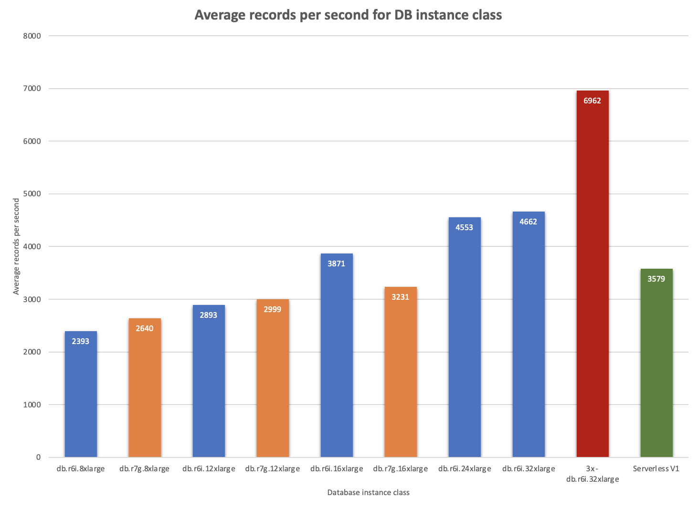
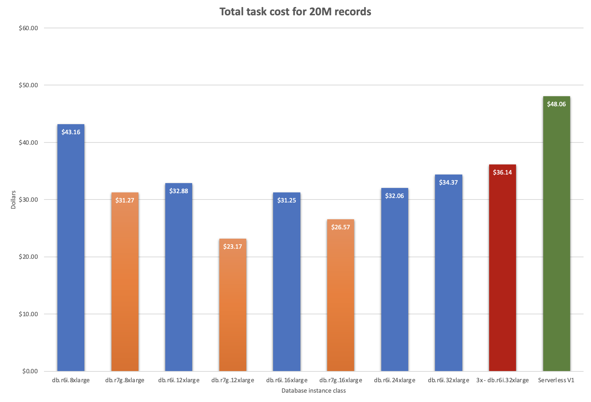
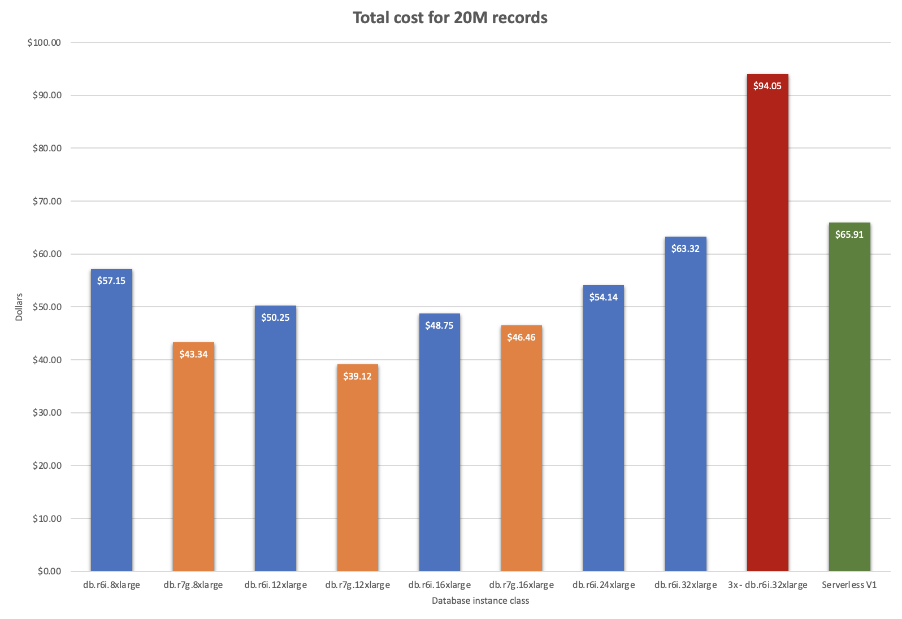

# Results of provisioned database comparative testing
2023 Oct 19

The purpose of this series of test executions is to understand the performance characteristics of various Amazon Web Services (AWS) Aurora provisioned database instance classes[^1] and AWS Elastic Container (ECS) task runtime platforms[^2] when loading data with Senzing.  In particular to compare the difference in both speed and cost of Intel and Graviton 3 processors across database instance class types and runtime platforms. Full results of all Senzing AWS performance testing can be found in the Senzing AWS performance testing GitHub repository[^3].

## The Methodology

To test different platforms we need to hold constant as many variables as possible. We used the same CloudFormation Template[^4] (CFT) across all of our test executions.  There are only a few changes to the CFT necessary to switch between Intel and Graviton Databases and runtime platforms. We used Senzing version 3.8.0 for our tests.

### The data

We chose to process 20 million records as part of our test.  The same 20 million records were used for each test.  This test set is the same set we use to test new versions of Senzing to validate performance across new releases.  Using the same set of data gives us reasonably predictable results across the different database instance classes and runtime platforms.

### Senzing loader configuration

To guarantee that records are available for Senzing loader tasks to process, we pre-loaded a Simple Queue Service[^5] (SQS) queue with the 20 million records.  Early on we discovered that large database class types would scale to out pace our sending of records to the SQS queue. This led us to redesign the test to load the SQS queue prior to executing the test. In our normal performance testing, we start 8 loader tasks on stack creation.  When we redesigned the test we changed the CFT to start the stack with 0 loaders tasks. We then manually start the 8 loader tasks once the SQS was fully loaded with 20 million records.  The AWS application auto scaling policy was set for the loader tasks as 30% of the average CPU usage. In previous testing we found that if the CPU is above 30%, then there is usually database availability that other loader tasks could utilize. In the CFT, the loader policy looks like this[^6]:

```
...
      PolicyType: TargetTrackingScaling
      TargetTrackingScalingPolicyConfiguration:
        PredefinedMetricSpecification:
          PredefinedMetricType: ECSServiceAverageCPUUtilization
        ScaleInCooldown: 1200
        ScaleOutCooldown: 300
        TargetValue: 30
    Type: AWS::ApplicationAutoScaling::ScalingPolicy
```

This application auto scaling policy works for our test data set, however other data sets may need addition tuning or more advanced policies.  For the purposes of this test, it is important to have a standard auto scaling policy to see the differences across instance classes and runtime platforms.  In other words, your mileage may vary so please consider tuning this to best fit how your data performs.

Note: the redoer auto scaling policy is identical to the loader auto scaling policy.

### Database configuration

The database is configured as a single cluster with a single instance.  This is all we need for our performance test, however it is not a suggested best practice in general.  It's highly recommended that a database administrator and AWS best practice documentation is consulted for individual needs[^7].  Naturally, loading data with Senzing is an IO intensive operation.  To improve the price performance of loading, the database cluster is set to be IO optimized[^8].

```
...
    StorageType: aurora-iopt1
...
Type: AWS::RDS::DBCluster
```

This is invariant across all our test.  Similarly, we define a couple of other important database parameters in addition to using the Aurora PostgreSQL 14 database engine.

```
...
    Family: aurora-postgresql14
    Parameters:
      enable_seqscan: 0
      pglogical.synchronous_commit: 0
...
Type: AWS::RDS::DBParameterGroup
```

The database instance class was set in the DBInstance.  This is the one place that changed across run.  The example below demonstrates using an Intel based instance with the best possible performance.

```
...
    DBInstanceClass: db.r6i.32xlarge
Type: AWS::RDS::DBInstance
```

Our test executions included the following database instance classes[^9]:

| Instance class | vCPU | Memory (GiB) | Max. bandwidth (Mbps) of local storage | Network performance (Gbps) |
| :------------- | ---: | -----------: | -------------------------------------: | -------------------------: |
| db.r7g <td colspan="4">– memory-optimized instance classes powered by AWS Graviton3 processors</td>
| db.r7g.16xlarge | 64 | 512 | 20,000 | 30 |
| db.r7g.12xlarge | 48 | 384 | 15,000 | 22.5 |
| db.r7g.8xlarge | 32 | 256 | 10,000 | 15 |
| db.r6i <td colspan="4">– memory-optimized instance classes</td>
| db.r6i.32xlarge	| 128 | 1,024 |	40,000 | 50 |
| db.r6i.24xlarge	| 96 | 768	| 30,000 | 37.5 |
| db.r6i.16xlarge	| 64 | 512	| 20,000 | 25 |
| db.r6i.12xlarge	| 48 | 384	| 15,000 | 18.75 |
| db.r6i.8xlarge	| 32 | 256	| 10,000 | 12.5 |

## The Comparison

#### Average records per second for each database instance class



The `r6i` database instances are represented by the blue bars.  The `r7g` database instances are represented by the orange bars.  There are two comparison test run on the right side of the diagram.  The red bar is 3 clusters of `db.r6i.32xlarge` instances and represents the largest system tested.  The green bar represents a standard serverless V1 3 cluster run with 2-192 ACU allowed for scaling. Each successive size of database instance class increases performance within the same instance class.  So, as the class size increase within the Intel class, performance increase about 20% per class size until the largest class size and then we see a more modest performance increase.  Across database instance classes, Graviton 3 seems to perform better than Intel until the largest Graviton class size available and then it performs about 20% less than the same sized Intel instance class.  We found this a bit curious, so we re-ran the 16xlarge tests for each class and were able to repeat the results.

#### Peak records per second for each database instance class


We see similar results for peak records per second.

#### Total time to process 20 million records for each database instance class


Unsurprisingly, the total time to process 20 million records decreases as the database instance class size increases.

#### Database cost of processing 20 million records for each database instance class


This is total database cost of processing 20 million records.  Database cost only!  This does not include the cost ECS tasks. It should also be noted that the Serverless V1 cost is an estimate, at best.

#### ECS Fargate task costs of processing 20 million records



Task cost contain the cost of both the loader tasks and the redoer tasks.

#### Total cost of processing 20 million records



Based on this, there appears to be a "sweet spot" that is a balance between performance and cost when using the `db.r6i.16xlarge` database instance class with the Intel runtime platform.

## Further work

As new instance classes and runtime platforms become available, we should re-run these tests and compare to these results.  Further work could be done to see if there are any advantages to using a hybrid set in which the database instance may be running on one architecture while the loaders are on another.  There could be cost savings and speed improvements by fine tuning these options. For example, using a Graviton 3 runtime platform for ECS tasks while using the `db.r6i.16xlarge` database instance class.  This combination may yield better results that any of the above.

Another area of experimentation that could be beneficial is the quantity of and auto scaling settings for the loader tasks. We predefined 8 loader tasks to start our tests.  If we knew, a priori, that we'd need, for example, 50 loaders based on the database instance class we were using, we could start with that number of tasks instead of scaling up to an appropriate number. Likewise, these tests used a fairly simple auto scaling policy.  It could be that a more sophisticated scale up policy might more efficiently load the database when many records are being processed.  Similarly, a more sophisticated scale down policy could come with some cost saving when processing is completed and loader tasks need to scale back.

Yet another area of experimentation to look into is the cost of added more records after the initial batch of 20 million are complete.  In general we know that adding a single new record could not even be measured against the gathered statistics.  Where would we start to see an impact for adding more records?  1K, 10k, 100k records?  Antidotally, We know in experiments of 100 million records that there is a point where the data becomes complicated and processing new records begins to slow.  That is the second 20M may take a bit longer than the first, but the last 20M takes longest of all.  Perhaps this is obvious as the database grows, the number of relationship grow, and entities wax and wane. The greater the need for processing power and time to do entity resolution.  Answering the question "How fast can you incrementally add N records to your database of 20M records?" would be an interesting area of performance analysis to look into.


[^1]: [AWS Database Instance Classes](https://docs.aws.amazon.com/AmazonRDS/latest/AuroraUserGuide/Concepts.DBInstanceClass.html)
[^2]: [AWS ECS Task Runtime Platforms](https://docs.aws.amazon.com/AmazonECS/latest/developerguide/task_definition_parameters.html#runtime-platform)
[^3]: Full results of Senzing testing can be in the [Senzing AWS performance testing repo, results directory](https://github.com/Senzing/aws-cloudformation-performance-testing/tree/main/results).
[^4]: [CloudFormation Templates](https://aws.amazon.com/cloudformation/resources/templates/)
[^5]: [Simple Queue Service](https://aws.amazon.com/sqs/)
[^6]: [AWS Application Autoscaling Policies](https://docs.aws.amazon.com/AWSCloudFormation/latest/UserGuide/aws-resource-applicationautoscaling-scalingpolicy.html)
[^7]: [Aurora Best Practices](https://docs.aws.amazon.com/AmazonRDS/latest/AuroraUserGuide/Aurora.BestPractices.html)
[^8]: [IO Optimized](https://press.aboutamazon.com/2023/5/aws-announces-amazon-aurora-i-o-optimized)
[^9]: [DB instance classes](https://docs.aws.amazon.com/AmazonRDS/latest/AuroraUserGuide/Concepts.DBInstanceClass.html#Concepts.DBInstanceClass.Summary)
[^10]: [Aurora pricing](https://aws.amazon.com/rds/aurora/pricing/)
[^11]: [AWS Fargate pricing](https://aws.amazon.com/fargate/pricing/)