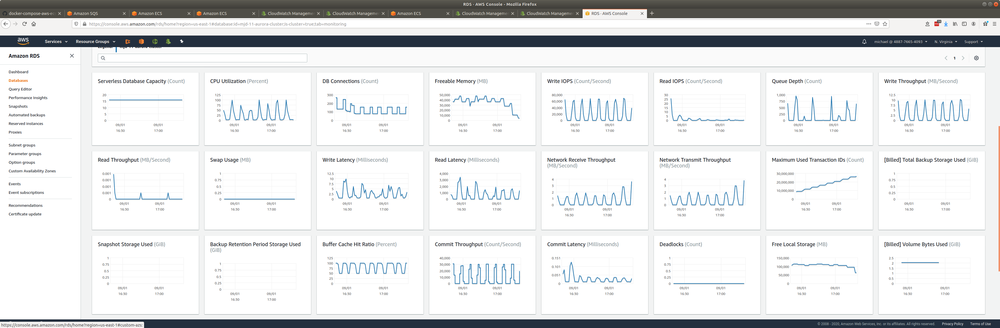
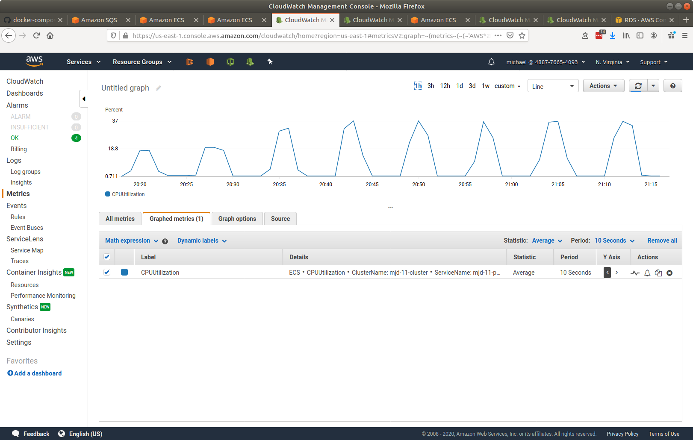
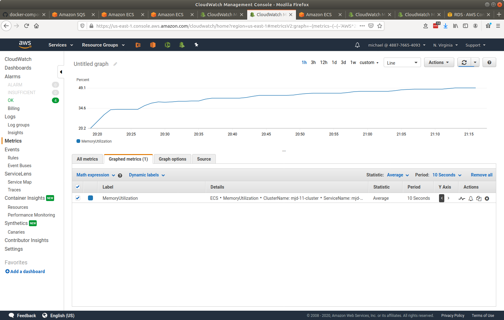
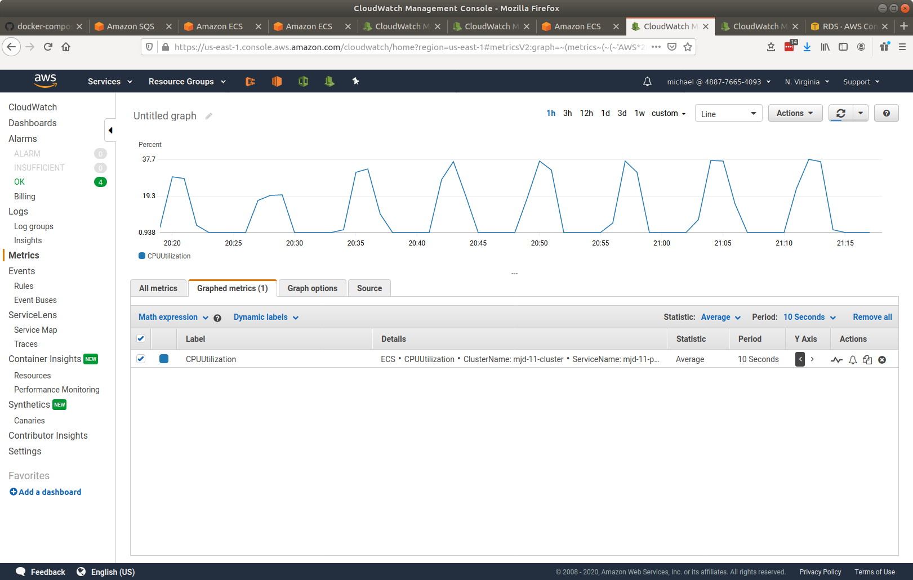
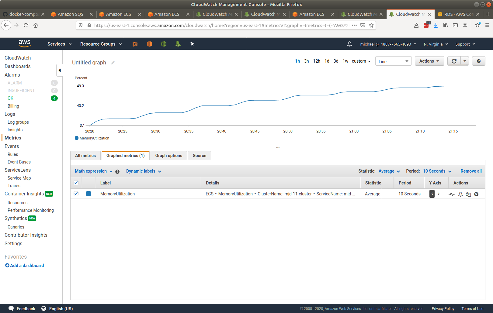

# senzing-test-results-20200901-multiple-stream-loader-services

## Contents

1. [Overview](#overview)
1. [System](#system)
1. [Results](#results)
    1. [Observations](#observations)
    1. [Final metrics](#final-metrics)
        1. [Database](#database)
        1. [Container-1](#container-1)
            1. [Container CPU Utilization 1](#container-cpu-utilization-1)
            1. [Container Memory Utilization 1](#container-memory-utilization-1)
        1. [Container-2](#container-2)
            1. [Container CPU Utilization 2](#container-cpu-utilization-2)
            1. [Container Memory Utilization 2](#container-memory-utilization-2)

## Overview

1. Performed: Sep 1, 2020
1. Senzing version: 2.1.0 pre-release
1. Instructions:
   [advanced](https://github.com/Senzing/docker-compose-aws-ecscli-demo/tree/master/docs/advanced)
    1. [Pinned version](https://github.com/Senzing/docker-compose-aws-ecscli-demo/tree/7bcb1f5319a53331abe1f1ea1909a35917c7c630/docs/advanced)

## System

1. Database
    1. Aurora PosgreSQL serverless
    1. Max ACU: 192
1. Stream-producer containers
    1. 2 separate services, each loading 5M records using `SENZING_RECORD_MIN` and `SENZING_RECORD_MAX`.
    1. **SENZING_INPUT_URL:** "https://public-read-access.s3.amazonaws.com/TestDataSets/test-dataset-100m.json.gz"
    1. **SENZING_THREADS_PER_PRINT:** 30
    1. ecs-params
        1. task_size:
            1. mem_limit: 8GB
            1. cpu_limit: 1024
1. Stream-loader containers
    1. 2 Services
    1. Scale: 45
    1. AutoScale threshold: TargetValue=30.0
    1. **SENZING_THREADS_PER_PROCESS:** 8
    1. ecs-params
        1. task_size:
            1. mem_limit: 8GB
            1. cpu_limit: 1024

## Results

### Observations

1. Oscillated, would not settle down.

### Final metrics

#### Database

#### Container 1

##### Container CPU Utilization 1

##### Container Memory Utilization 1

#### Container 2

##### Container CPU Utilization 2

##### Container Memory Utilization 2

