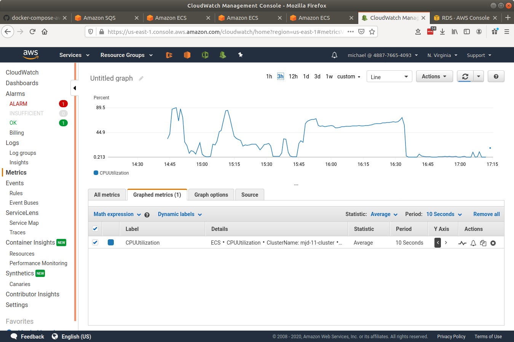
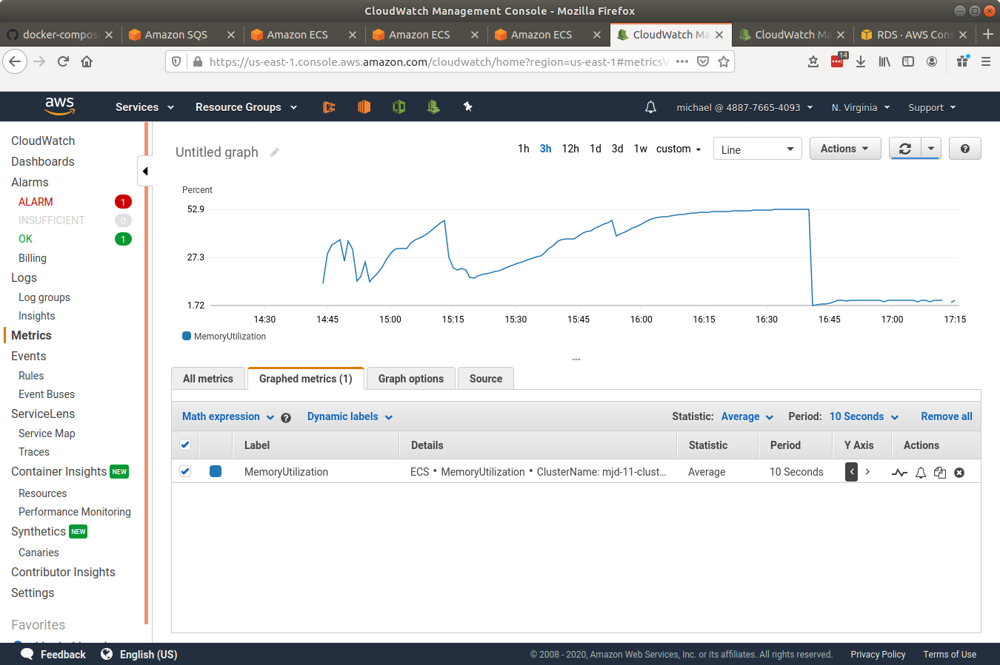
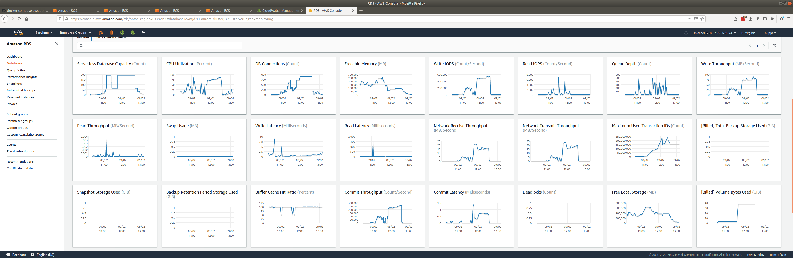
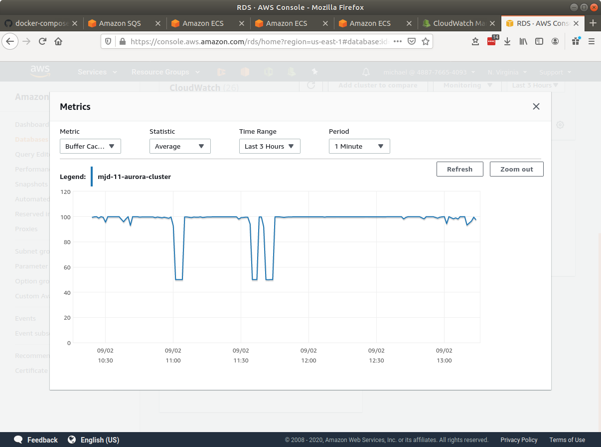
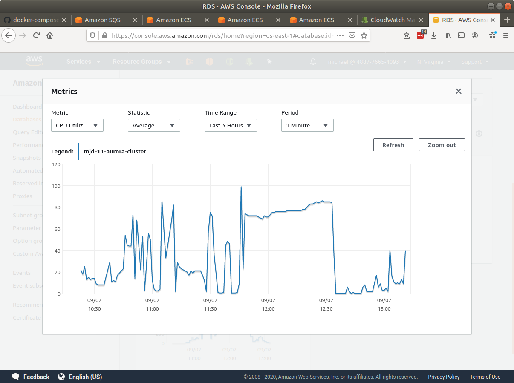
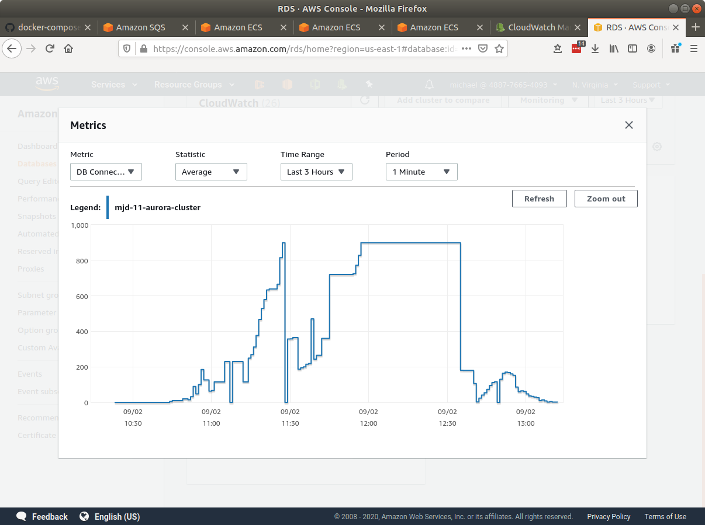
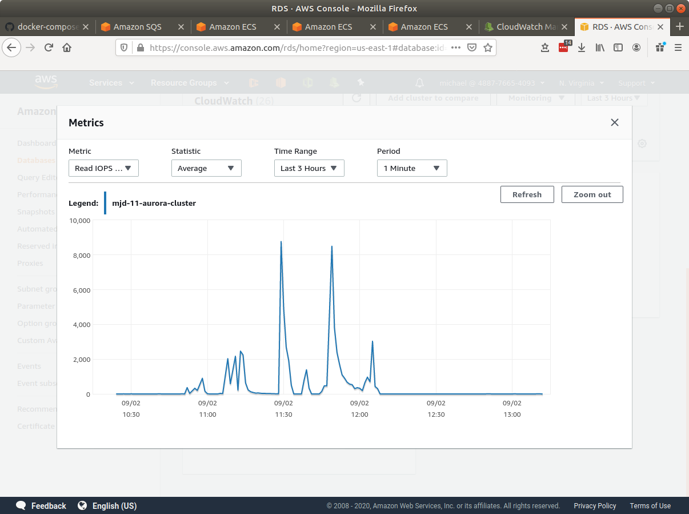
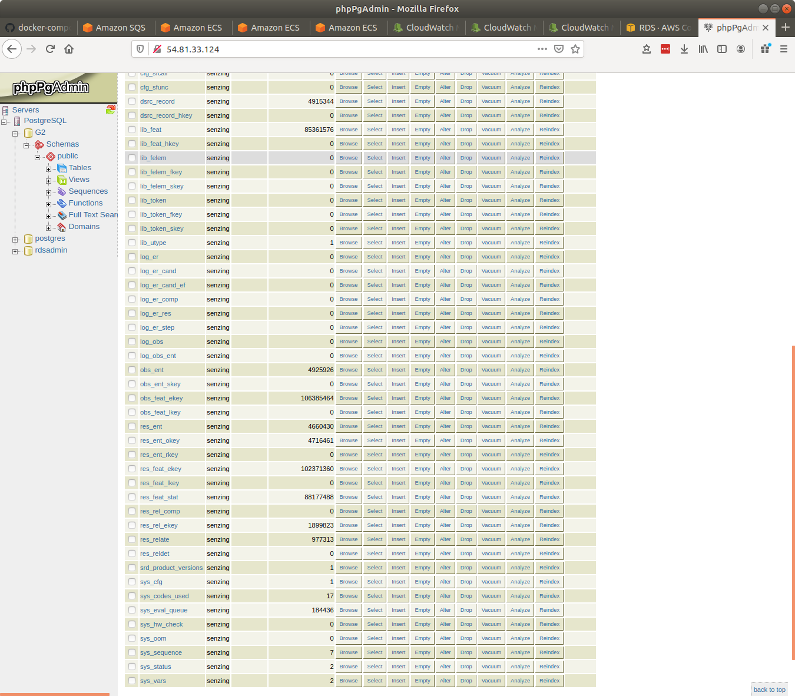
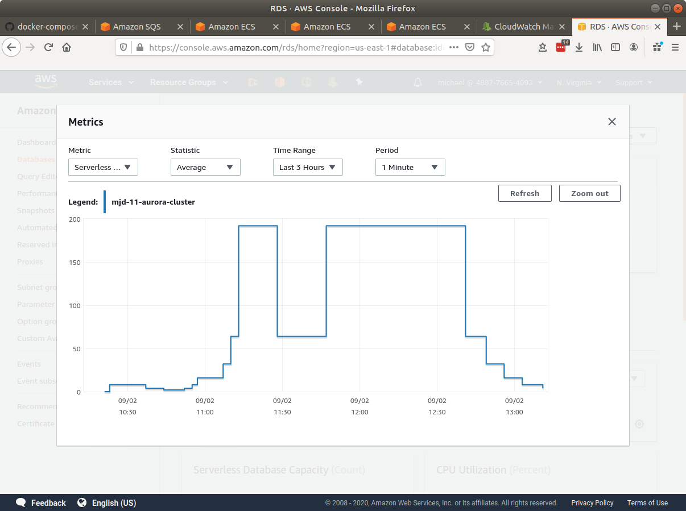
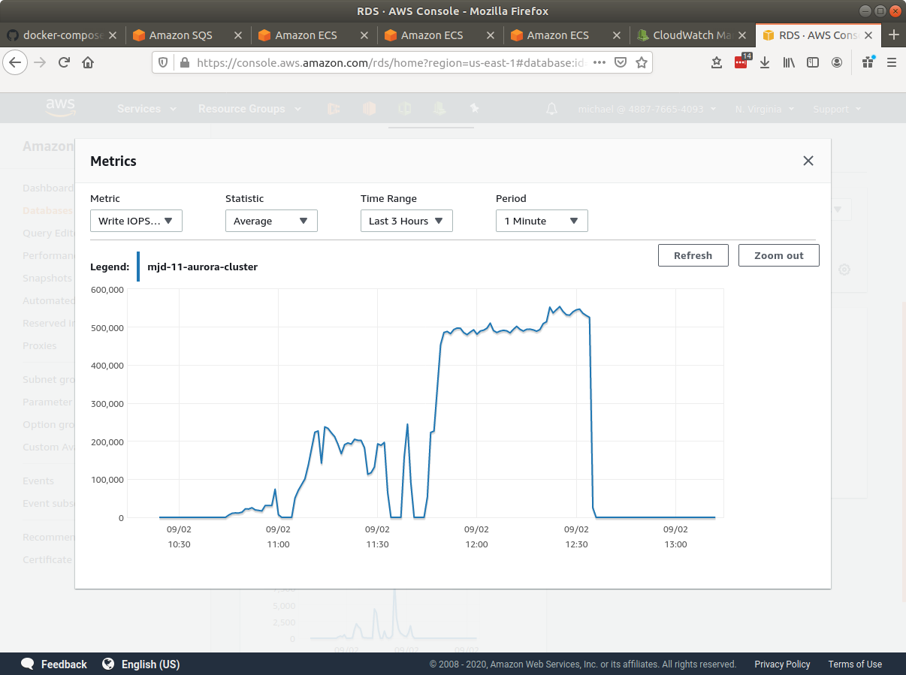

# senzing-test-results-20200902-single-stream-loader-service

## Contents

1. [Overview](#overview)
1. [System](#system)
1. [Results](#results)
    1. [Observations](#observations)
    1. [Final metrics](#final-metrics)
        1. [Container](#container)
            1. [AutoScale](#autoscale)
            1. [Container CPU Utilization](#container-cpu-utilization)
            1. [Container Memory Utilization](#container-memory-utilization)
        1. [Database](#database)
            1. [Commit Latency](#commit-latency)
            1. [Database CPU Utilization](#database-cpu-utilization)
            1. [DB Connections](#db-connections)
            1. [Read IOPS](#read-iops)
            1. [Row counts](#row-counts)
            1. [Serverless Database Capacity](#serverless-database-capacity)
            1. [Write IOPS](#write-iops)

## Overview

1. Performed: Sep 2, 2020
1. Senzing version: 2.1.0 pre-release
1. Instructions:
   [advanced](https://github.com/Senzing/docker-compose-aws-ecscli-demo/tree/master/docs/advanced)
    1. [Pinned version](https://github.com/Senzing/docker-compose-aws-ecscli-demo/tree/19eb8fab2c588e4b0f4062c3ccaa920592da14df/docs/advanced-100M)

## System

1. Database
    1. Aurora PosgreSQL serverless
    1. Max ACU: 192
1. Stream-producer containers
    1. 2 separate services, each loading 5M records using `SENZING_RECORD_MIN` and `SENZING_RECORD_MAX`.
    1. **SENZING_INPUT_URL:** "https://public-read-access.s3.amazonaws.com/TestDataSets/test-dataset-100m.json.gz"
    1. **SENZING_THREADS_PER_PRINT:** 30
    1. ecs-params
        1. task_size:
            1. mem_limit: 8GB
            1. cpu_limit: 1024
1. Stream-loader containers
    1. 1 Service
    1. Scale: 90
    1. AutoScale threshold: TargetValue=30.0
    1. **SENZING_THREADS_PER_PROCESS:** 8
    1. ecs-params
        1. task_size:
            1. mem_limit: 8GB
            1. cpu_limit: 1024

## Results

### Observations

1. Rough startup with scale up.
    1. Database scaled down to 64 after being at 192 for 25 minutes.
    1. Containers drop to 0 CPU when database scales
1. Inserts per second:
    1. Average: 925
    1. Peak: 1630   (17:02 - 17.07)
1. Database cost comparison:
    1. Serverless: 24 hours of 192 ACUs is $0.06/ACU-hour * 192 ACUs * 24 hours = $276
    1. Server: 24 hours of `db.r5.16xlarge` is $9.29/hour * 24 hours = $222
1. Seemingly lost records.
1. On database scale down, the following is seen in some, not all, senzing-loader logs:

    ```console
    2020-09-02 15:34:21.098 [sql:140718487455488:[17::MASTER:LOADER:]] ERR: Exception: SSL connection has been closed unexpectedly   SSL connection has been closed unexpectedly
    2020-09-02 15:34:21.098 [sql:140718487455488:[17::MASTER:LOADER:]] ERR: Statement: Statement: query = select obs_ent_id from OBS_ENT where ent_src_key=$1 and etype_id=$2 and dsrc_id=$3
    2020-09-02 15:34:21.098 [sql:140718487455488:[17::MASTER:LOADER:]] ERR: Bind Values: 'CEE6623B41EC65ABC1885881294F11EA4AE4A929',1,1
    ```

    ```console
    2020-09-02 15:13:06.652 [sql:139675756099328:[11::MASTER:ER:281207]] ERR: Exception: SSL connection has been closed unexpectedly SSL connection has been closed unexpectedly
    2020-09-02 15:13:06.652 [sql:139675756099328:[11::MASTER:ER:281207]] ERR: Statement: Statement: query = INSERT INTO RES_FEAT_STAT(LENS_ID,ECLASS_ID,LIB_FEAT_ID,NUM_RES_ENT,NUM_RES_ENT_OOM) VALUES ($1,$2,$3,$4,$5)
    2020-09-02 15:13:06.652 [sql:139675756099328:[11::MASTER:ER:281207]] ERR: Bind Values: 1,1,4935049,1,1
    ```

    ```console
    2020-09-02 15:13:06.652 [sql:139675739051776:[17::MASTER:LOADER:]] ERR: Exception: SSL connection has been closed unexpectedly SSL connection has been closed unexpectedly
    2020-09-02 15:13:06.652 [sql:139675739051776:[17::MASTER:LOADER:]] ERR: Statement: Statement: query = INSERT INTO OBS_FEAT_EKEY(OBS_ENT_ID,LIB_FEAT_ID,FTYPE_ID,UTYPE_CODE,USED_FROM_DT,USED_THRU_DT,SYS_LSTUPD_DT) VALUES ($1,$2,$3,$4,$5,$6,$7)
    2020-09-02 15:13:06.652 [sql:139675739051776:[17::MASTER:LOADER:]] ERR: Bind Values: 298126,4853501,19,,NULL,NULL,2020-09-02 15:12:56.015
    ```

    There seems to be 8 instances of the error at database scaleup/scaledown time.
    Which makes sense, given 8 threads.
    After that, the stream-loader does seem to continue to process records.

1. Weird error seen 100ms before "ERR: Exception: SSL connection has been closed unexpectedly".
   Just seen once.

    ```console
    2020-09-01T16:10:40.216-04:00   ERROR:  portal "" does not exist
    2020-09-01T16:10:40.216-04:00   message type 0x5a arrived from server while idle
    2020-09-01T16:10:40.216-04:00   ERROR: portal "" does not exist
    2020-09-01T16:10:40.287-04:00   ERROR: portal "" does not exist
    ```

1. Logs:
    1. [stream-loader log with 3 database scale events](data/stream-loader-log.csv)
       ([1](data/stream-loader-log.csv#L34),
       [2](data/stream-loader-log.csv#L64),
       [3](data/stream-loader-log.csv#L100))

1. Next round:
    1. Change `ScaleInCooldown` to 5 minutes to account for database scaling up and dropping connections.
    1. Check for dropped input records.


### Final metrics

#### Container

##### AutoScale

| tasks | set desired | steady state |
|------:|------------:|-------------:|
|     1 |       10:43 |        10:44 |
|     2 |       10:47 |        10:49 |
|     3 |       10:49 |        10:50 |
|     9 |       10:51 |        10:52 |
|    23 |       10:53 |        10:55 |
|    41 |       11:12 |              |
|    51 |       11:13 |              |
|    61 |       11:14 |              |
|    62 |       11:15 |              |
|    90 |       11:17 |        11:21 |
|    86 |       11:35 |        11:35 |
|    82 |       11:36 |        11:36 |
|    78 |       11:37 |        11:37 |
|    75 |       11:38 |        11:38 |
|    72 |       11:39 |        11:39 |
|    90 |       11:52 |        11:54 |
|    31 |       12:57 |              |
|    26 |       13:00 |              |
|    20 |       13:01 |              |
|    16 |       13:02 |              |
|    15 |       13:03 |              |
|    14 |       13:04 |              |
|    11 |       13:05 |              |
|     4 |       13:06 |        13:07 |
|     2 |       13:08 |        13:09 |
|     1 |       13:10 |        13:10 |

##### Container CPU Utilization



##### Container Memory Utilization



#### Database



##### Commit Latency



##### Database CPU Utilization



##### DB Connections



##### Read IOPS



##### Row counts



##### Serverless Database Capacity



##### Write IOPS


