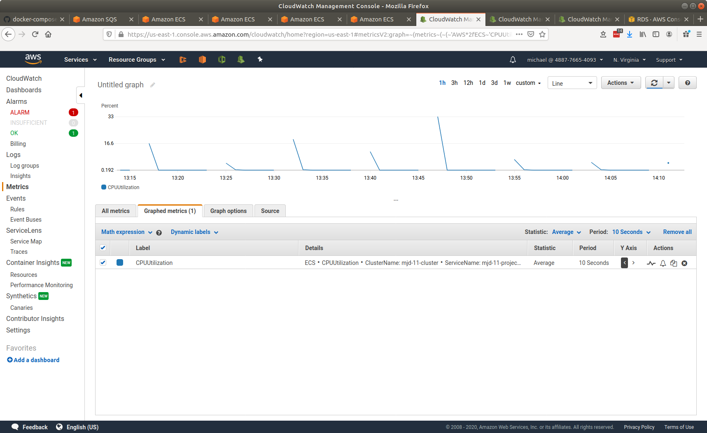
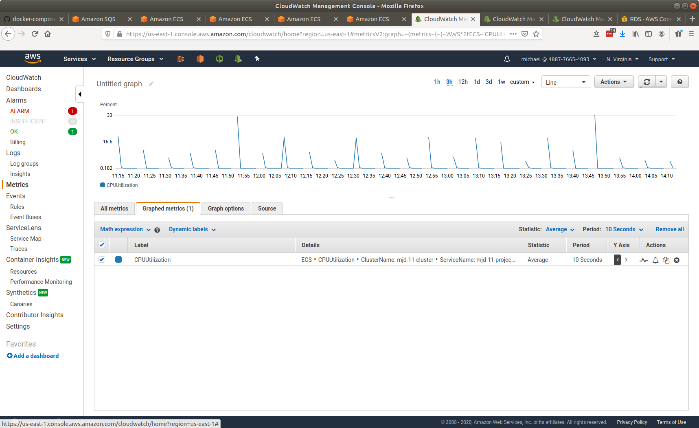
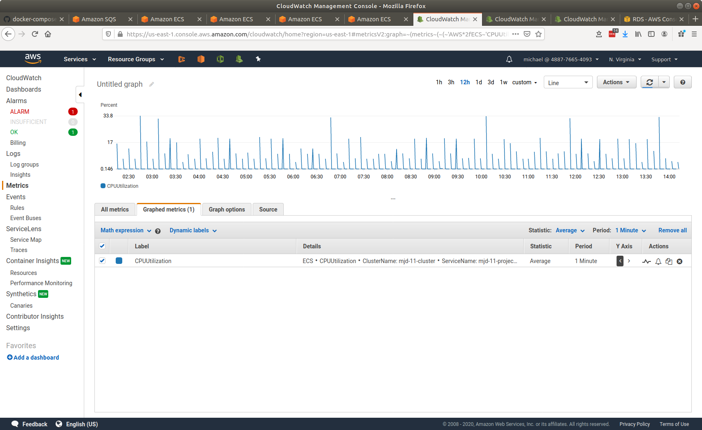
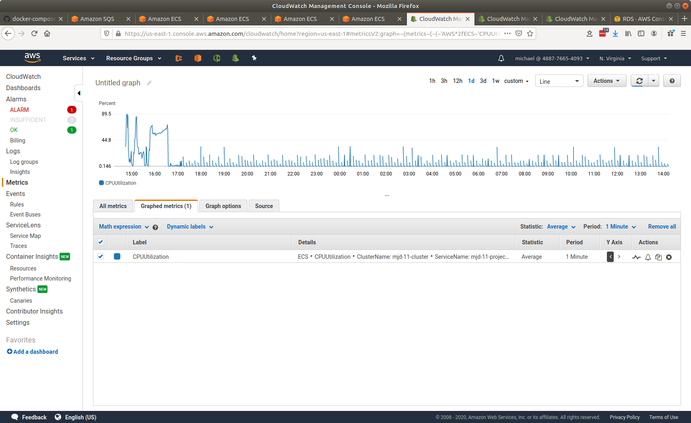
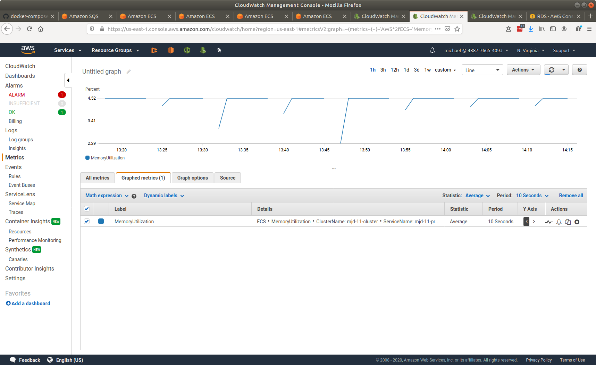
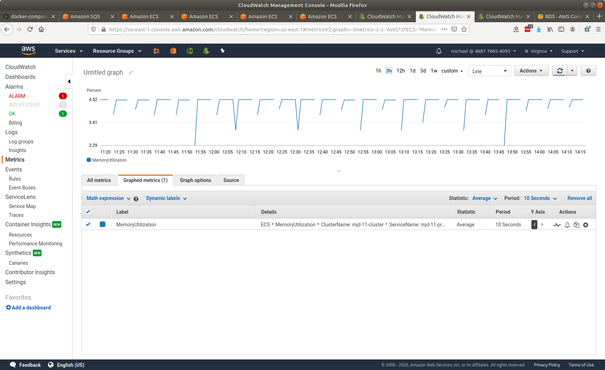
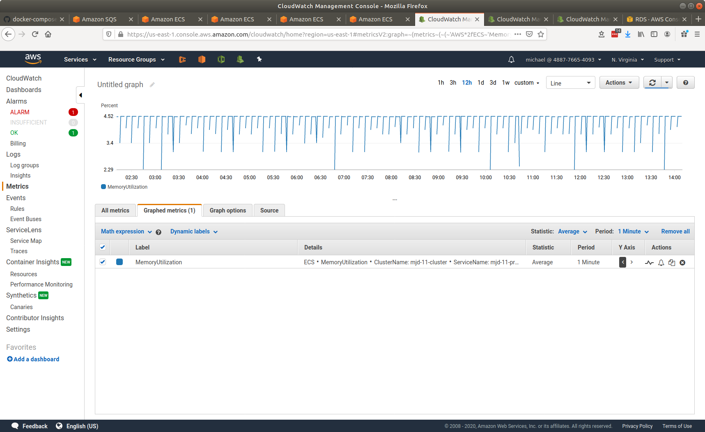
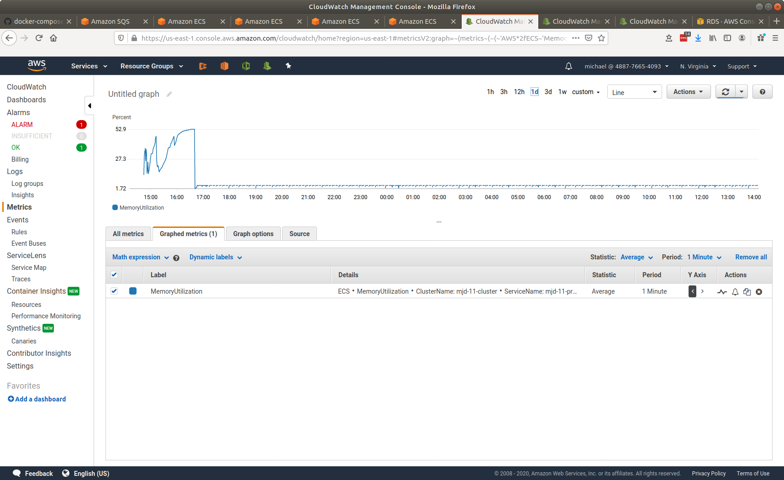
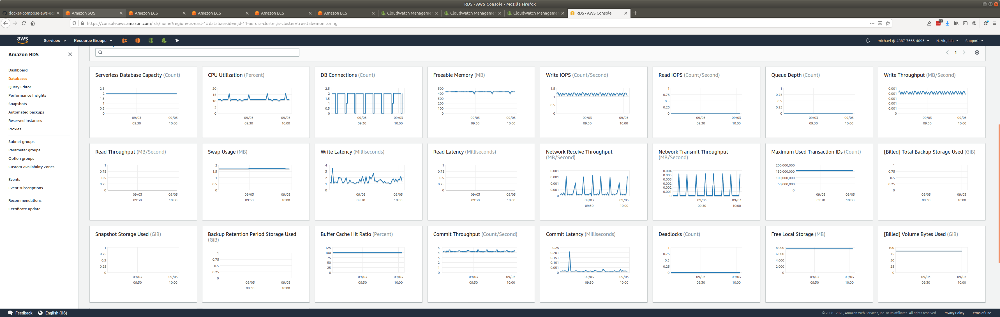

# senzing-test-results-20200903-inactivity

## Contents

1. [Overview](#overview)
1. [System](#system)
1. [Results](#results)
    1. [Observations](#observations)
    1. [Final metrics](#final-metrics)
        1. [Container](#container)
            1. [AutoScale](#autoscale)
            1. [Container CPU Utilization](#container-cpu-utilization)
            1. [Container Memory Utilization](#container-memory-utilization)
        1. [Database](#database)
            1. [Commit Latency](#commit-latency)
            1. [Database CPU Utilization](#database-cpu-utilization)
            1. [DB Connections](#db-connections)
            1. [Read IOPS](#read-iops)
            1. [Row counts](#row-counts)
            1. [Serverless Database Capacity](#serverless-database-capacity)
            1. [Write IOPS](#write-iops)

## Overview

1. Performed: Sep 3, 2020
1. Senzing version: 2.1.0 pre-release
1. Instructions:
   [advanced](https://github.com/senzing-garage/docker-compose-aws-ecscli-demo/tree/master/docs/advanced)
    1. [Pinned version](https://github.com/senzing-garage/docker-compose-aws-ecscli-demo/tree/19eb8fab2c588e4b0f4062c3ccaa920592da14df/docs/advanced-100M)

## System

1. Database
    1. Aurora PosgreSQL serverless
    1. Max ACU: 192
1. Stream-producer containers
    1. 2 separate services, each loading 5M records using `SENZING_RECORD_MIN` and `SENZING_RECORD_MAX`.
    1. **SENZING_INPUT_URL:** "https://public-read-access.s3.amazonaws.com/TestDataSets/test-dataset-100m.json.gz"
    1. **SENZING_THREADS_PER_PRINT:** 30
    1. ecs-params
        1. task_size:
            1. mem_limit: 8GB
            1. cpu_limit: 1024
1. Stream-loader containers
    1. 1 Service
    1. Scale: 90
    1. AutoScale threshold: TargetValue=30.0
    1. **SENZING_THREADS_PER_PROCESS:** 8
    1. ecs-params
        1. task_size:
            1. mem_limit: 8GB
            1. cpu_limit: 1024

## Results

### Observations

1. Works as anticipated.
   Every 8 minutes a new stream-loader checks the SQS queue.

### Final metrics

#### Container

##### AutoScale

1. Every 8 minutes a new stream-loader container reaches steady state.
1. The container connects to the SQS queue, finds it empty, sleeps 5 minutes, and exits
1. After 3 minutes, ECS autoscales a new stream-loader container.

##### Container CPU Utilization - 1 hour

##### Container CPU Utilization - 3 hours

##### Container CPU Utilization - 12 hours

##### Container CPU Utilization - 24 hours

##### Container Memory Utilization - 1 hour

##### Container Memory Utilization - 3 hours

##### Container Memory Utilization - 12 hours

##### Container Memory Utilization - 24 hours

#### Database

