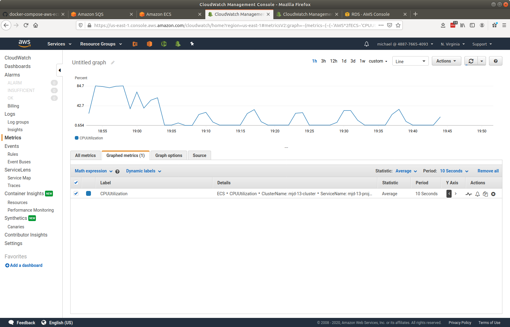
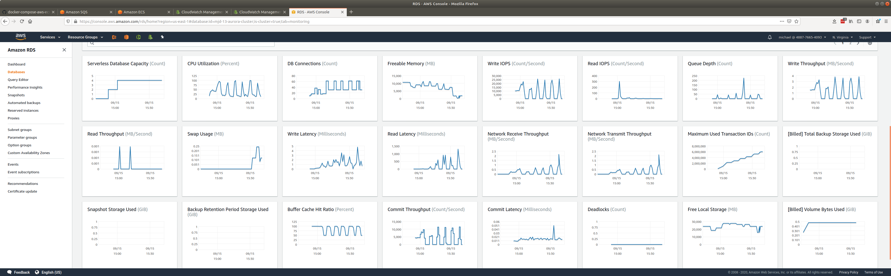

# senzing-test-results-20200915-death-spiral

## Contents

1. [Overview](#overview)
1. [System](#system)
1. [Results](#results)
    1. [Observations](#observations)
    1. [Final metrics](#final-metrics)
        1. [Container](#container)
            1. [AutoScale](#autoscale)
            1. [Container CPU Utilization](#container-cpu-utilization)
            1. [Container Memory Utilization](#container-memory-utilization)
        1. [Database](#database)

## Overview

1. Performed: Sep 15, 2020
1. Senzing version: 2.1.0
1. Instructions:
   [advanced](https://github.com/Senzing/docker-compose-aws-ecscli-demo/tree/master/docs/advanced)
    1. [Pinned version](https://github.com/Senzing/docker-compose-aws-ecscli-demo/tree/1c9887b417df9fbfe9fc1541d6f8c29304b48e0e/docs/advanced)

## System

1. Database
    1. Aurora PosgreSQL Serverless
    1. Max ACU: 192
1. Stream-producer containers
    1. 2 separate services, each loading 5M records using `SENZING_RECORD_MIN` and `SENZING_RECORD_MAX`.
    1. **SENZING_INPUT_URL:** "https://public-read-access.s3.amazonaws.com/TestDataSets/test-dataset-100m.json.gz"
    1. **SENZING_THREADS_PER_PRINT:** 30
    1. ecs-params
        1. task_size:
            1. mem_limit: 8GB
            1. cpu_limit: 1024
1. Stream-loader containers
    1. 1 Service
    1. Scale: 90
    1. AutoScale threshold: TargetValue=30.0
    1. **SENZING_THREADS_PER_PROCESS:** 8
    1. ecs-params
        1. task_size:
            1. mem_limit: 8GB
            1. cpu_limit: 1024
    1. `ScaleInCooldown=300`
    1. `ScaleOutCooldown=300`

## Results

### Observations

1. Oscillation "death-spiral".
    1. Stream-loaders oscillated.
    2. Database never got above 4 ACUs.
1. Inserts per second:
    1. Average:
    1. Peak:
1. Next round:

### Final metrics

#### Container

##### AutoScale

##### Container CPU Utilization

##### Container Memory Utilization

#### Database

