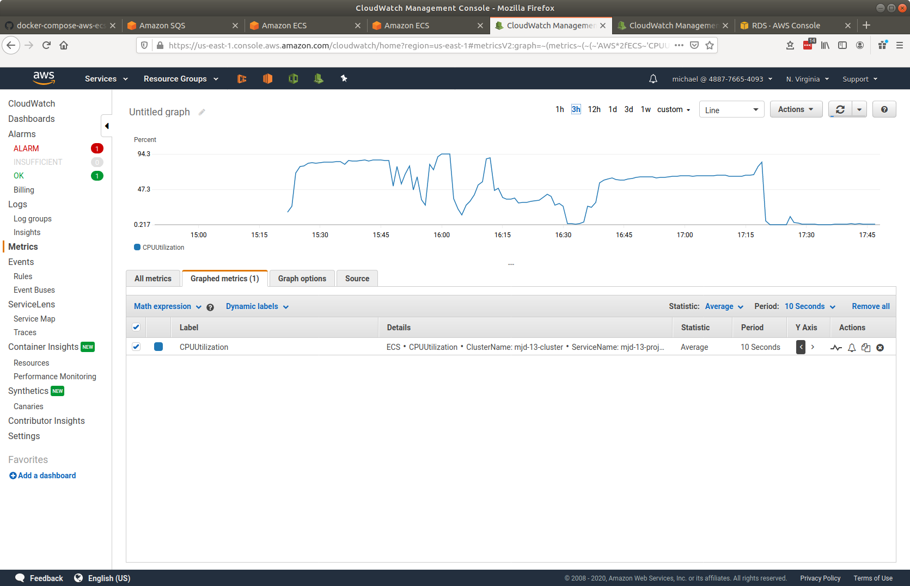
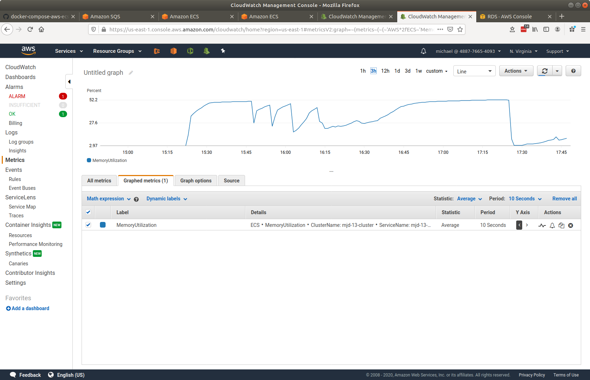
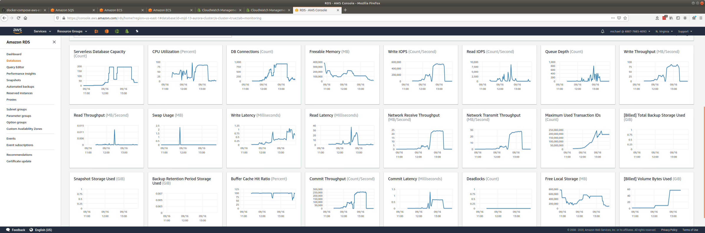
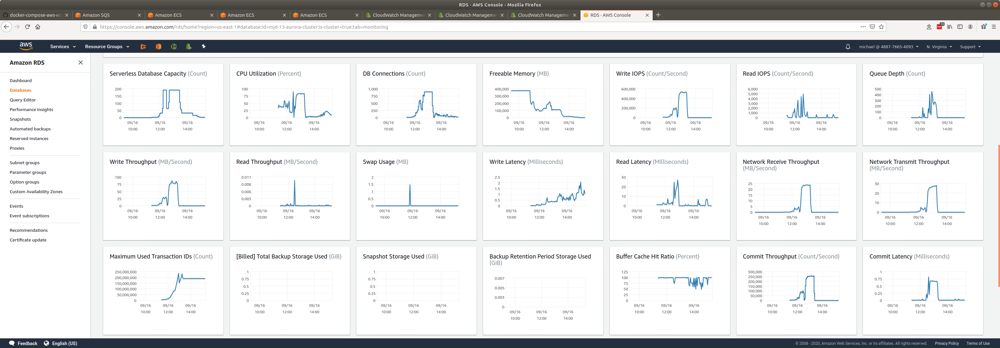

# senzing-test-results-20200916-longer-scalein-scaleout

## Contents

1. [Overview](#overview)
1. [System](#system)
1. [Results](#results)
    1. [Observations](#observations)
    1. [Final metrics](#final-metrics)
        1. [Container](#container)
            1. [AutoScale](#autoscale)
            1. [Container CPU Utilization](#container-cpu-utilization)
            1. [Container Memory Utilization](#container-memory-utilization)
        1. [Database](#database)
           1. [Last hour](#last-hour)
           1. [Last 6 hours](#last-6-hours)
           1. [DSRC_RECORD](#dsrc_record)

## Overview

1. Performed: Sep 16, 2020
1. Senzing version: 2.1.0
1. Instructions:
   [advanced](https://github.com/senzing-garage/docker-compose-aws-ecscli-demo/tree/master/docs/advanced)
    1. [Pinned version](https://github.com/senzing-garage/docker-compose-aws-ecscli-demo/tree/418024fa209ba0f5c165e769d709edb28fd8ac65/docs/advanced)

## System

1. Database
    1. Aurora PosgreSQL Serverless
    1. Max ACU: 192
1. Stream-producer containers
    1. 2 separate services, each loading 5M records using `SENZING_RECORD_MIN` and `SENZING_RECORD_MAX`.
    1. **SENZING_INPUT_URL:** "https://public-read-access.s3.amazonaws.com/TestDataSets/test-dataset-100m.json.gz"
    1. **SENZING_THREADS_PER_PRINT:** 30
    1. ecs-params
        1. task_size:
            1. mem_limit: 8GB
            1. cpu_limit: 1024
1. Stream-loader containers
    1. 1 Service
    1. Scale: 90
    1. AutoScale threshold: TargetValue=30.0
    1. **SENZING_THREADS_PER_PROCESS:** 8
    1. ecs-params
        1. task_size:
            1. mem_limit: 8GB
            1. cpu_limit: 1024
    1. `ScaleInCooldown=600`
    1. `ScaleOutCooldown=600`
1. Redoer was not deployed

## Results

### Observations

1. Seemed to work well.
    1. Database got to 192 ACUs for extended period of time.
    1. Database had one major dip.
1. Stream-producer
    1. Made a mistake and added the first 5M records twice.
        1. Total in SQS Queue:  10M records
        1. Total in DSRC_RECORD: 5M
        1. No issues seen in processing records twice.
        1. However, this may have influenced how fast records were inserted into DSRC_RECORD.
1. Inserts per second:
    1. Peak: 1629/second
    1. Database scale from 2 to 192 ACUs: 0.8 hours
    1. Average at 192 ACUs: 1580/second
    1. Average over entire run: 726/second
    1. Time to load 10M: 1.9 hours
    1. Database scale from 192 to 2 ACUs: 1.5 hours
    1. See [dsrc_record.csv](data/dsrc_record.csv)
1. Next round:
    1. Use 10M unique records
    1. Use same configuration to see if results are repeatable
    1. Add Redoer

### Final metrics

#### Container

##### AutoScale

##### Container CPU Utilization

##### Container Memory Utilization

#### Database

##### Last hour

##### Last 6 hours

##### DSRC_RECORD

1.[dsrc_record.csv](data/dsrc_record.csv)
