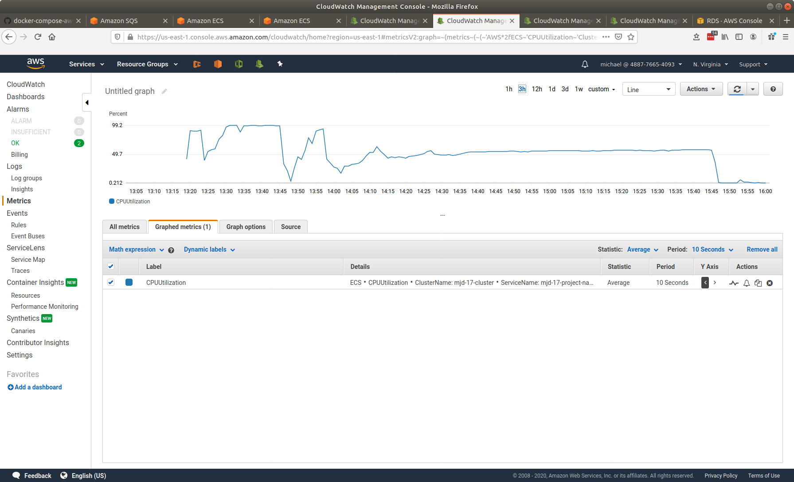
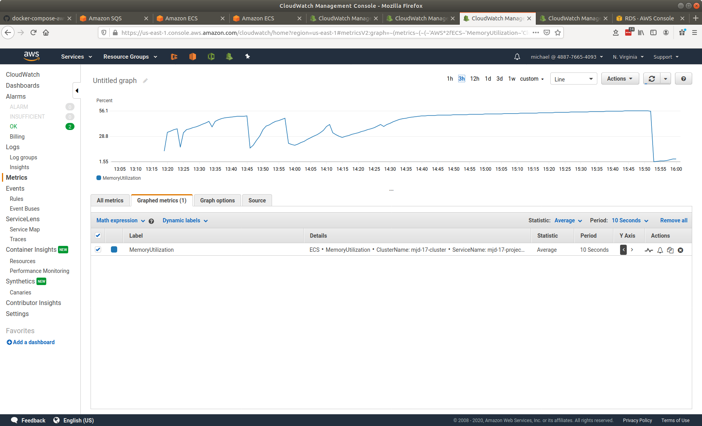
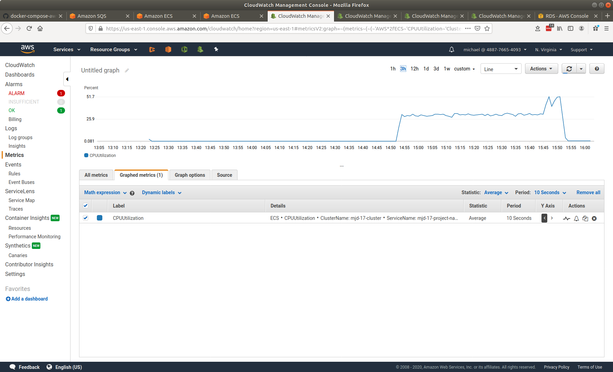
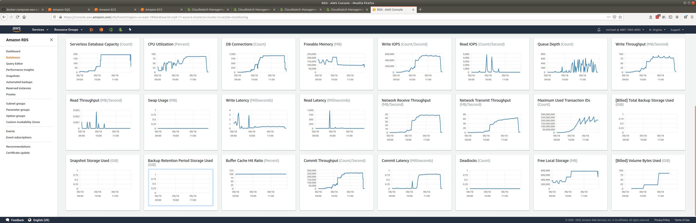

# senzing-test-results-20200918-10M-delayed-redoer

## Contents

1. [Overview](#overview)
1. [System](#system)
1. [Results](#results)
    1. [Observations](#observations)
    1. [Final metrics](#final-metrics)
        1. [Container](#container)
            1. [AutoScale](#autoscale)
            1. [Container CPU Utilization](#container-cpu-utilization)
            1. [Container Memory Utilization](#container-memory-utilization)
        1. [Database](#database)
           1. [Last hour](#last-hour)
           1. [DSRC_RECORD](#dsrc_record)

## Overview

1. Performed: Sep 18, 2020
1. Senzing version: 2.1.0
1. Instructions:
   [advanced](https://github.com/senzing-garage/docker-compose-aws-ecscli-demo/tree/master/docs/advanced)
    1. [Pinned version](https://github.com/senzing-garage/docker-compose-aws-ecscli-demo/tree/5b5930f388c823e9cee22fb6bb604c2f2d33f190/docs/advanced)

## System

1. Database
    1. Aurora PosgreSQL Serverless
    1. Max ACU: 192
1. Stream-producer containers
    1. 2 separate services, each loading 5M records using `SENZING_RECORD_MIN` and `SENZING_RECORD_MAX`.
    1. **SENZING_INPUT_URL:** "https://public-read-access.s3.amazonaws.com/TestDataSets/test-dataset-100m.json.gz"
    1. **SENZING_THREADS_PER_PRINT:** 30
    1. ecs-params
        1. task_size:
            1. mem_limit: 8GB
            1. cpu_limit: 1024
1. Stream-loader containers
    1. 1 Service
    1. Scale: 90
    1. AutoScale threshold: TargetValue=30.0
    1. **SENZING_THREADS_PER_PROCESS:** 8
    1. ecs-params
        1. task_size:
            1. mem_limit: 8GB
            1. cpu_limit: 1024
    1. `ScaleInCooldown=600`
    1. `ScaleOutCooldown=600`
1. Redoer deployed with 90 minute delay

## Results

### Observations

1. Pretty smooth start and pretty good ride
1. Inserts per second:
    1. Peak: 1761/second
    1. Database scale from 2 to 192 ACUs: 1.2 hours
    1. Average at 192 ACUs: 1712/second
    1. Average over entire run: 1126/second
    1. Time to load 10M: 2.5 hours
    1. Database scale from 192 to 32 ACUs: 0.2 hours
        1. Didn't go below 32 ACUs
    1. Records in dead-letter queue: 0
    1. See [dsrc_record.csv](data/dsrc_record.csv)
1. Next round:
    1. Do not sleep redoer
    1. ScaleOutCooldown at 5 minutes (not 10)
    1. SQS Visibility time out 5 minutes (not 30 seconds)
    1. Document connection failures

### Final metrics

#### Container

##### AutoScale

##### Container CPU Utilization

##### Container Memory Utilization

##### Redoer CPU Utilization

#### Database

##### Last hour

##### DSRC_RECORD

1.[dsrc_record.csv](data/dsrc_record.csv)
