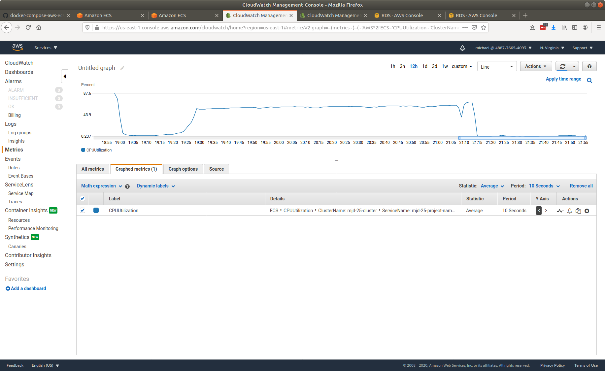
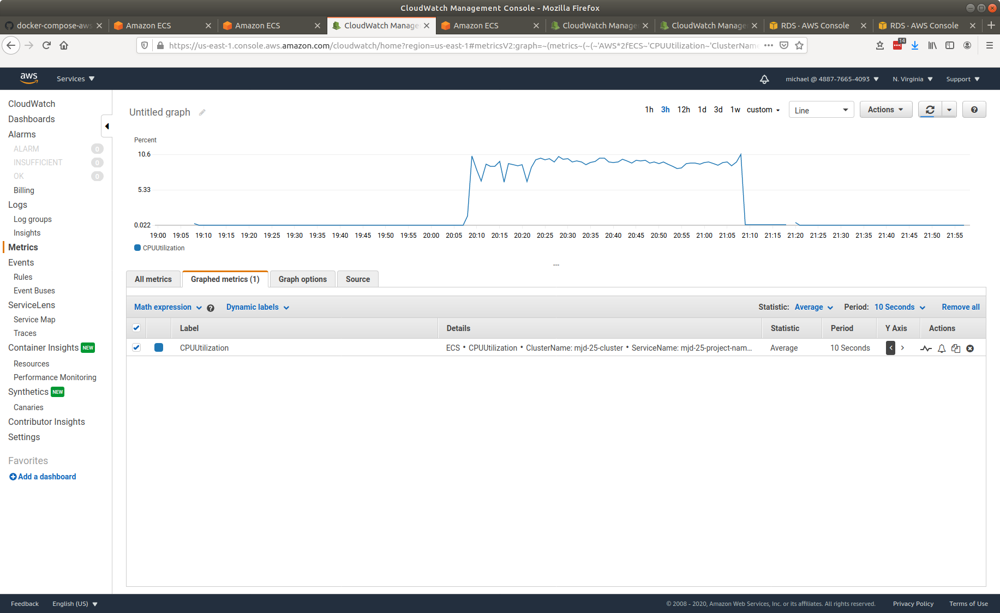
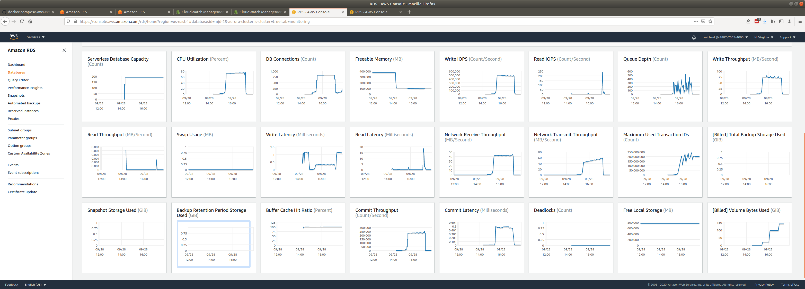

# senzing-test-results-20200927-10M-75-stream-loaders

## Contents

1. [Overview](#overview)
1. [System](#system)
1. [Results](#results)
    1. [Observations](#observations)
    1. [Final metrics](#final-metrics)
        1. [Container](#container)
            1. [Stream-loader CPU Utilization](#stream-loader-cpu-utilization)
            1. [Redoer CPU Utilization](#redoer-cpu-utilization)
        1. [Database](#database)
           1. [Metrics](#metrics)
           1. [DSRC_RECORD](#dsrc_record)
        1. [Logs](#logs)

## Overview

1. Performed: Sep 28, 2020
1. Senzing version: 2.1.0
1. Instructions:
   [advanced](https://github.com/Senzing/docker-compose-aws-ecscli-demo/tree/master/docs/advanced-10M)
    1. [Pinned version](https://github.com/Senzing/docker-compose-aws-ecscli-demo/tree/e8e4ae812d68a2d8f20db8590fb7525094dda65f/docs/advanced-10M)

## System

1. Database
    1. Aurora PosgreSQL Serverless
    1. Pinned ACU: 192
1. Stream-producer containers
    1. 2 separate services, each loading 5M records using `SENZING_RECORD_MIN` and `SENZING_RECORD_MAX`.
    1. **SENZING_INPUT_URL:** "https://public-read-access.s3.amazonaws.com/TestDataSets/test-dataset-100m.json.gz"
    1. **SENZING_THREADS_PER_PRINT:** 30
    1. ecs-params
        1. task_size:
            1. mem_limit: 8GB
            1. cpu_limit: 1024
1. Stream-loader containers
    1. 1 Service
    1. Scale: 75
    1. AutoScale threshold: TargetValue=30.0
    1. **SENZING_THREADS_PER_PROCESS:** 8
    1. ecs-params
        1. task_size:
            1. mem_limit: 8GB
            1. cpu_limit: 1024
    1. `ScaleInCooldown=300`
    1. `ScaleOutCooldown=300`

## Results

### Observations

1. Inserts per second:
    1. Peak: 1662/second
    1. Warm-up: 34 minutes
    1. Average after warm-up: 1536/second
    1. Average over entire run: 1190/second
    1. Time to load 10M: 2.3 hours
    1. Records in dead-letter queue: 0
    1. See [dsrc_record.csv](data/dsrc_record.csv)
1. Scale in:
    1. Stream-loaders scale from 60 to 1: x.x hours
    1. Database scale from 192 to 2 ACUs: x.x hours
1. Next round:
    1. ???

### Final metrics

#### Container

##### Stream-loader CPU Utilization

##### Redoer CPU Utilization

#### Database

##### Metrics

##### DSRC_RECORD

1.[dsrc_record.csv](data/dsrc_record.csv)

#### Logs

1. [stream-loader-log-01](data/stream-loader-log-xx.csv)
