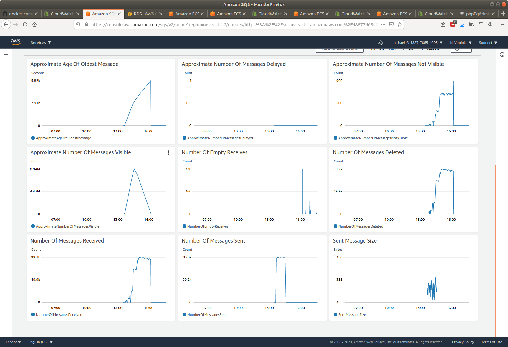
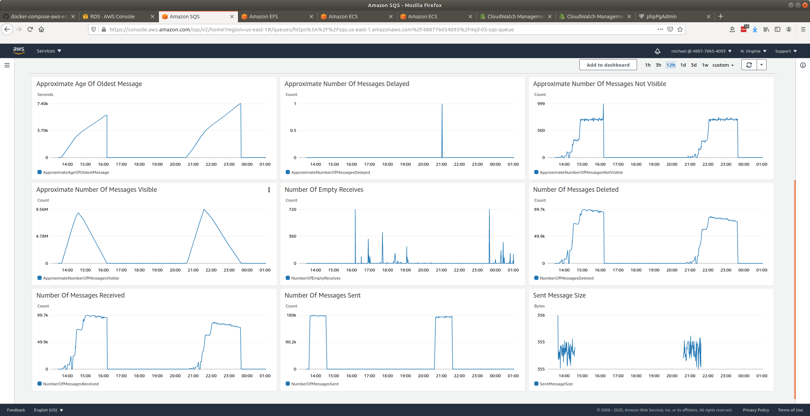
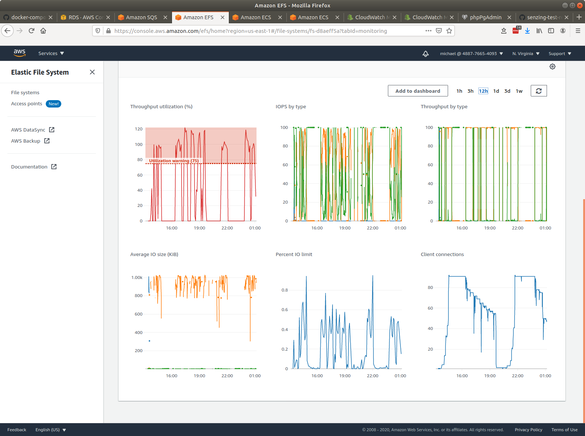
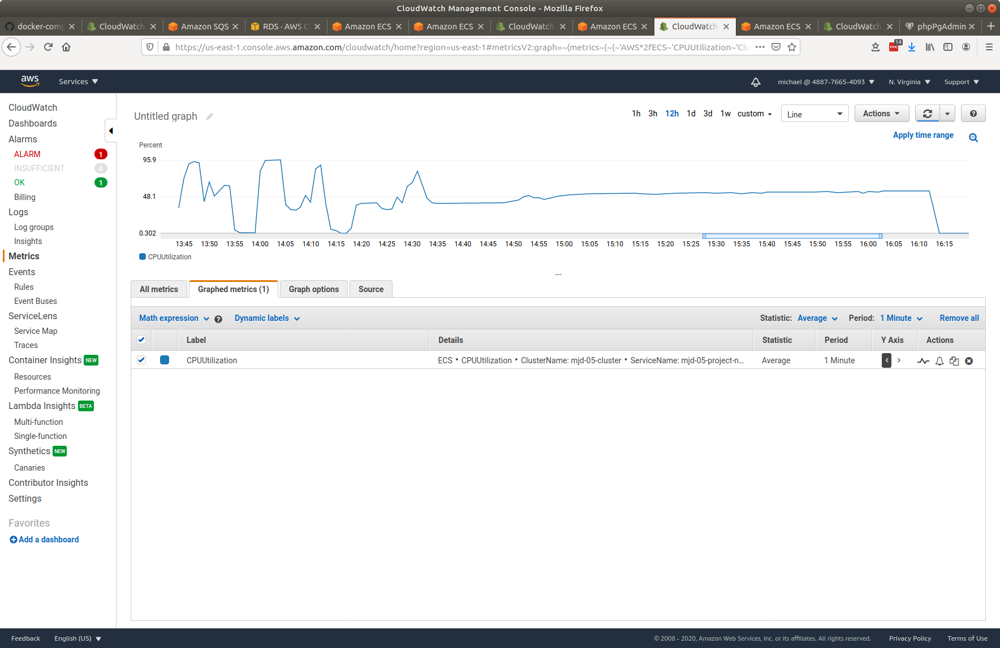
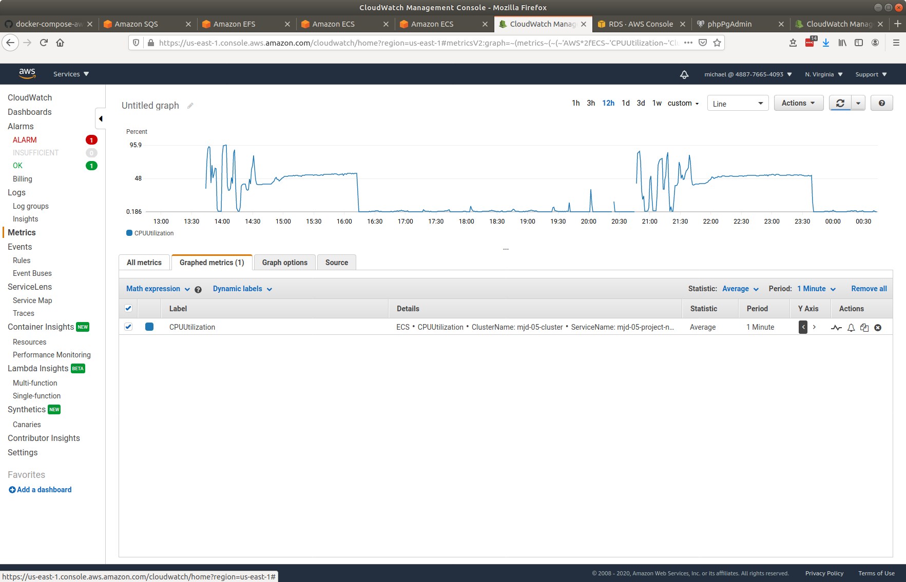
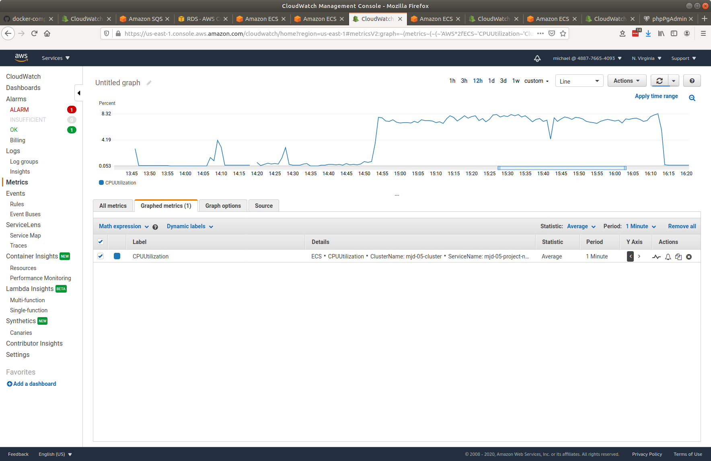
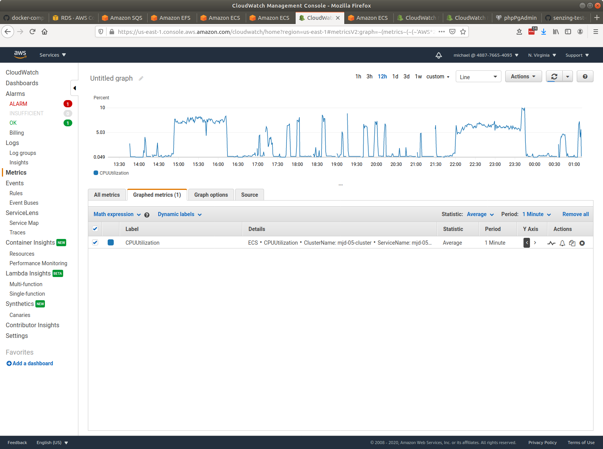
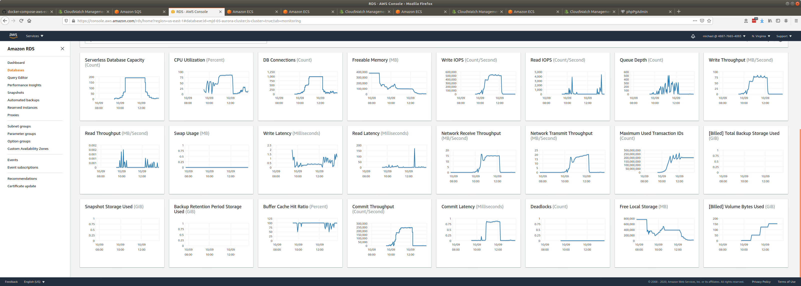
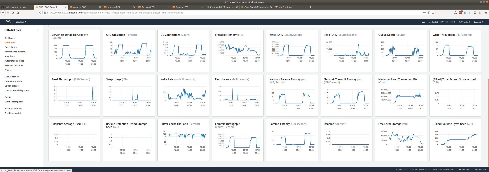

# senzing-test-results-20201009-10M-95-stream-loaders

## Contents

1. [Overview](#overview)
1. [System](#system)
1. [Results](#results)
    1. [Observations](#observations)
    1. [Final metrics](#final-metrics)
        1. [SQS](#sqs)
            1. [SQS Metrics](#sqs-metrics)
        1. [EFS](#efs)
            1. [EFS Metrics](#efs-metrics)
        1. [ECS](#ecs)
            1. [Stream-loader CPU Utilization](#stream-loader-cpu-utilization)
            1. [Redoer CPU Utilization](#redoer-cpu-utilization)
        1. [RDS](#rds)
            1. [Database Metrics](#database-metrics)
            1. [DSRC_RECORD](#dsrc_record)
        1. [Logs](#logs)
            1. [Redoer logs](#redoer-logs)

## Overview

1. Performed: Oct 09, 2020
1. Senzing version: 2.2.1
1. Instructions:
   [advanced](https://github.com/Senzing/docker-compose-aws-ecscli-demo/tree/master/docs/advanced)
    1. [Pinned version](https://github.com/Senzing/docker-compose-aws-ecscli-demo/tree/c44d5fb3178f306b4c40775a7e0cd9ced8e0fee9/docs/advanced)

## System

1. Database
    1. Aurora PosgreSQL Serverless
    1. ACU range: 2 - 192
1. Stream-producer containers
    1. 2 separate services, each loading 5M records using `SENZING_RECORD_MIN` and `SENZING_RECORD_MAX`.
    1. **SENZING_INPUT_URL:** "https://public-read-access.s3.amazonaws.com/TestDataSets/test-dataset-100m.json.gz"
    1. **SENZING_THREADS_PER_PRINT:** 30
    1. ecs-params
        1. task_size:
            1. mem_limit: 8GB
            1. cpu_limit: 1024
1. Stream-loader containers
    1. 1 Service
    1. Scale: 1 - 90
    1. AutoScale threshold: TargetValue=30.0
    1. **SENZING_THREADS_PER_PROCESS:** 8
    1. ecs-params
        1. task_size:
            1. mem_limit: 8GB
            1. cpu_limit: 1024
    1. `ScaleInCooldown=300`
    1. `ScaleOutCooldown=1200`

## Results

### Observations

1. Inserts per second:
    1. Peak: 1661/second
    1. Warm-up: 1.2 hours
    1. Average after warm-up: 1604/second
    1. Average over entire run: 1126/second
    1. Time to load 10M: 2.5 hours
    1. Records in dead-letter queue: 0
    1. See [dsrc_record.csv](data/dsrc_record.csv)
1. Scale in:
    1. Stream-loaders scale from 60 to 1: x.x hours
    1. Database scale from 192 to 2 ACUs: 1.8 hours

### Final metrics

#### SQS

##### SQS Metrics

#### EFS

##### EFS Metrics

#### ECS

##### Stream-loader CPU Utilization

##### Redoer CPU Utilization

#### RDS

##### Database Metrics

##### DSRC_RECORD

1. [dsrc_record.csv](data/dsrc_record.csv)
1. [dsrc_record-2.csv](data/dsrc_record-2.csv)

#### Logs

##### Redoer logs

1. [redoer-log-01](data/redoer-log-01.csv)
1. [redoer-log-02](data/redoer-log-02.csv)
1. [redoer-log-03](data/redoer-log-03.csv)
1. [redoer-log-04](data/redoer-log-04.csv)
1. [redoer-log-05](data/redoer-log-05.csv)
1. [redoer-log-06](data/redoer-log-06.csv)
1. [redoer-log-07](data/redoer-log-07.csv)
