# senzing-test-results-20201208-100M-400-192ACU-clustered-senzing-2.3.0

## Contents

1. [Overview](#overview)
1. [System](#system)
1. [Results](#results)
    1. [Observations](#observations)
    1. [Final metrics](#final-metrics)
        1. [SQS](#sqs)
            1. [SQS Metrics](#sqs-metrics)
        1. [EFS](#efs)
            1. [EFS Metrics](#efs-metrics)
        1. [ECS](#ecs)
            1. [Stream-loader CPU Utilization](#stream-loader-cpu-utilization)
            1. [Redoer CPU Utilization](#redoer-cpu-utilization)
        1. [RDS](#rds)
            1. [Database Metrics](#database-metrics)
            1. [DSRC_RECORD](#dsrc_record)
        1. [Logs](#logs)

## Overview

1. Performed: Dec 08, 2020
1. Senzing version: 2.3.0
1. Instructions:
   [advanced](https://github.com/Senzing/docker-compose-aws-ecscli-demo/blob/issue-46.dockter.1/docs/advanced-cluster-100M/README.md)
    1. [Pinned version](https://github.com/Senzing/docker-compose-aws-ecscli-demo/blob/a83e3c49d771e053125423456e4c9fa89be94d8c/docs/advanced-cluster-100M/README.md)

## System

1. Database
    1. Aurora PosgreSQL Serverless
    1. ACU range: 2 - 192
1. Stream-producer containers
    1. 4 separate services, each loading 5M records using `SENZING_RECORD_MIN` and `SENZING_RECORD_MAX`.
    1. **SENZING_INPUT_URL:** "https://public-read-access.s3.amazonaws.com/TestDataSets/test-dataset-100m.json.gz"
    1. **SENZING_THREADS_PER_PRINT:** 30
    1. ecs-params
        1. task_size:
            1. mem_limit: 8GB
            1. cpu_limit: 1024
1. Stream-loader containers
    1. 1 Service
    1. Scale: 1 - 400
    1. AutoScale threshold: TargetValue=30.0
    1. **SENZING_THREADS_PER_PROCESS:** 8
    1. ecs-params
        1. task_size:
            1. mem_limit: 8GB
            1. cpu_limit: 1024
    1. `ScaleInCooldown=300`
    1. `ScaleOutCooldown=1200`

## Results

### Observations

1. Inserts per second:
    1. Peak: 2900/second
    1. Warm-up: 1.3 hours
    1. Average after warm-up: 1270/second
    1. Average last hour: 1002/second
    1. Average over entire run: 1208/second
    1. Time to load 20M: 23.0 hours
    1. Records in dead-letter queue: 0
    1. See [dsrc_record.csv](data/dsrc_record.csv)
1. Scale:
    1. System scaled to limit of 400 stream-loaders when it reached a stable system.

### Final metrics

#### SQS

##### SQS Metrics

###### SQS Metrics final

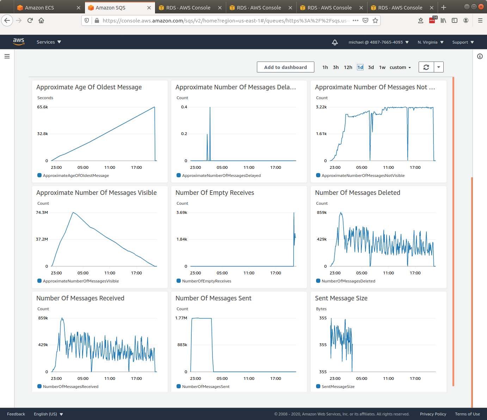

#### EFS

##### EFS Metrics

###### EFS Metrics final

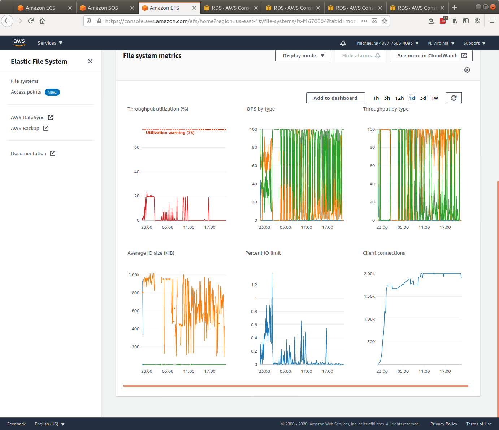

#### ECS

##### Stream-loader CPU Utilization

###### Stream-loader CPU Utilization final

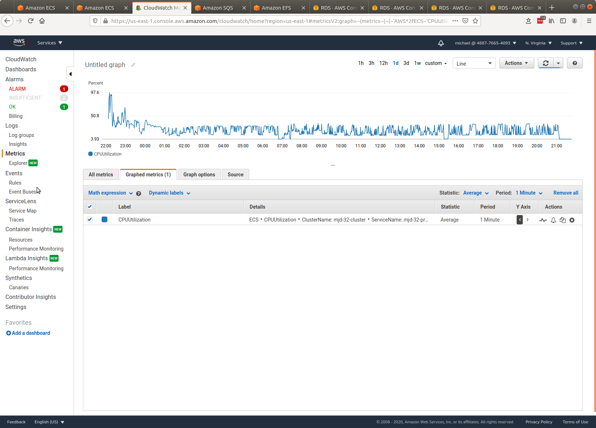

###### Stream-loader Memory Utilization final

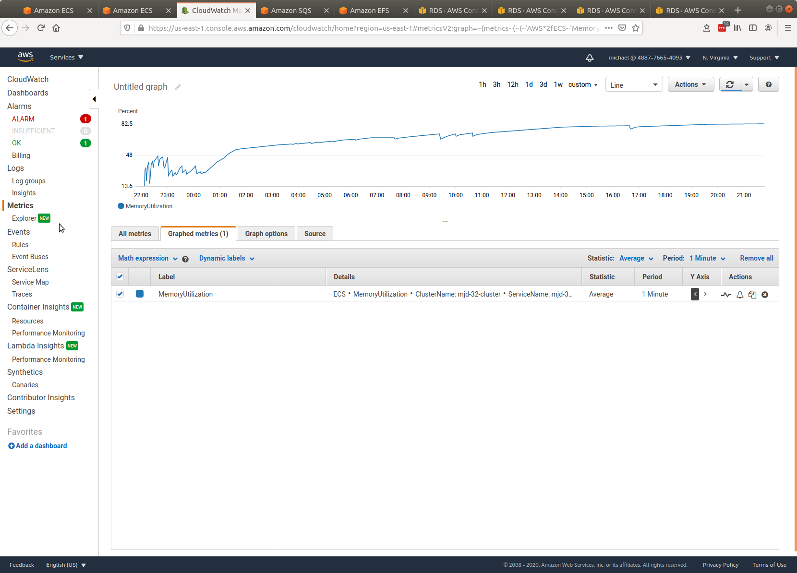

##### Redoer CPU Utilization

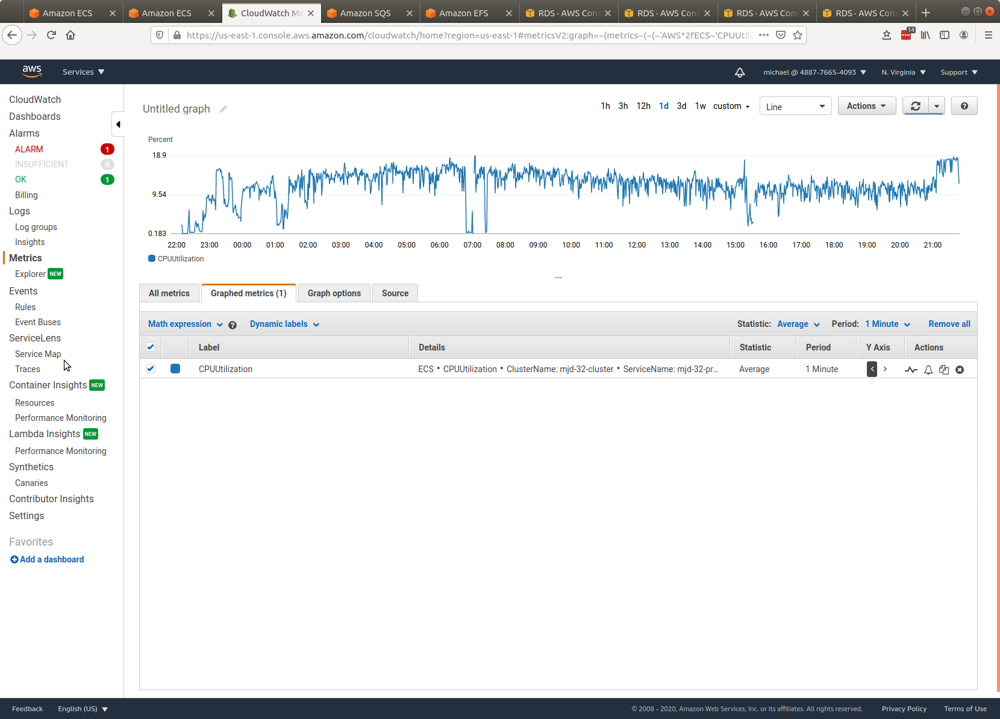

#### RDS

##### Database Metrics

###### Database Metrics final

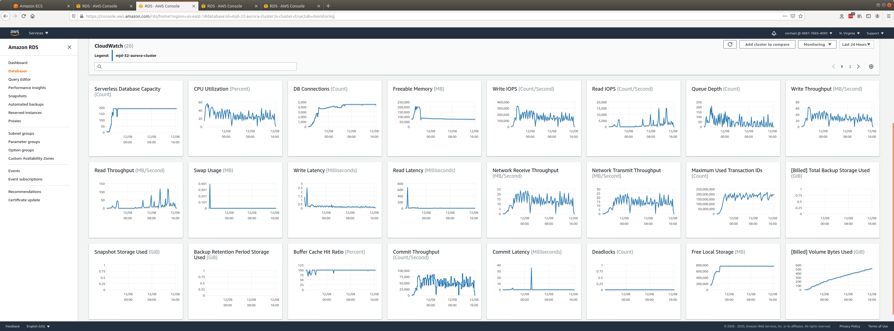

###### Database Metrics RES final

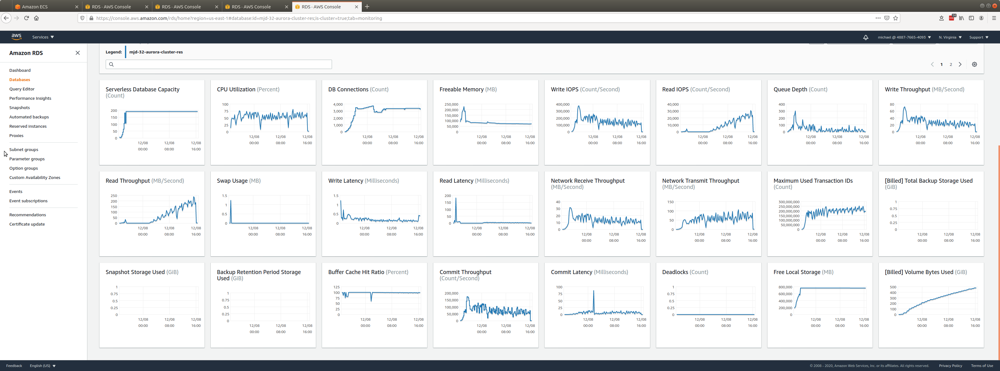

###### Database Metrics LIBFEAT final

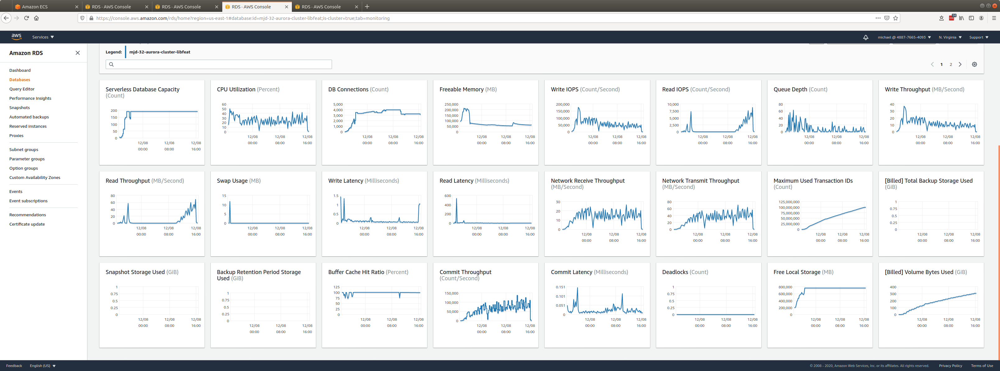

##### Database Scaling

###### Database Scaling

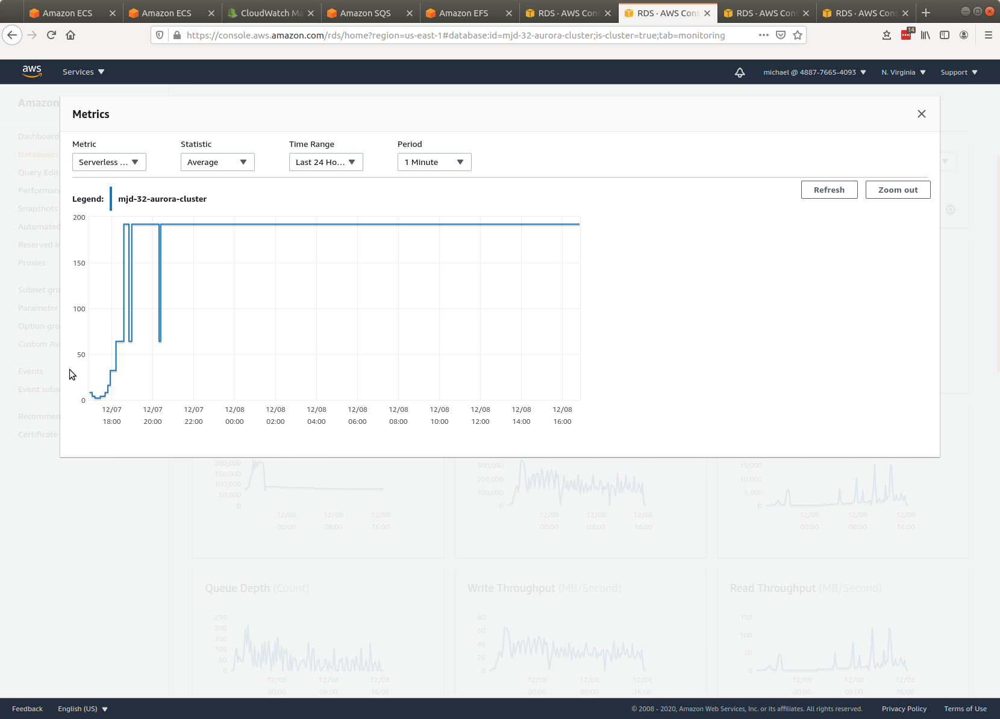

###### Database Scaling RES

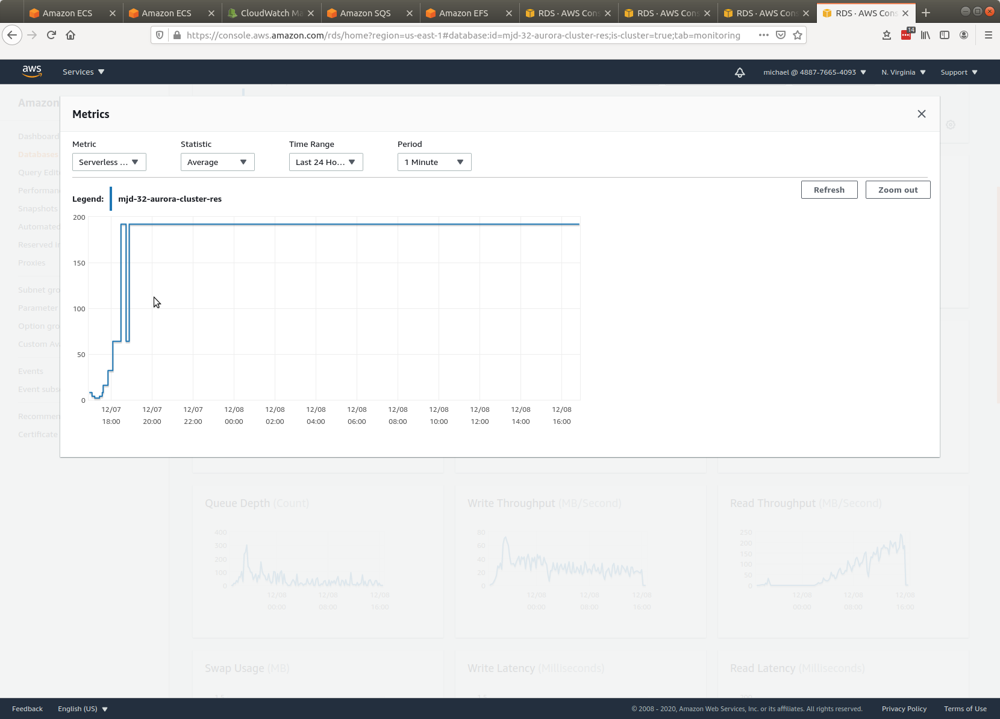

###### Database Scaling LIBFEAT

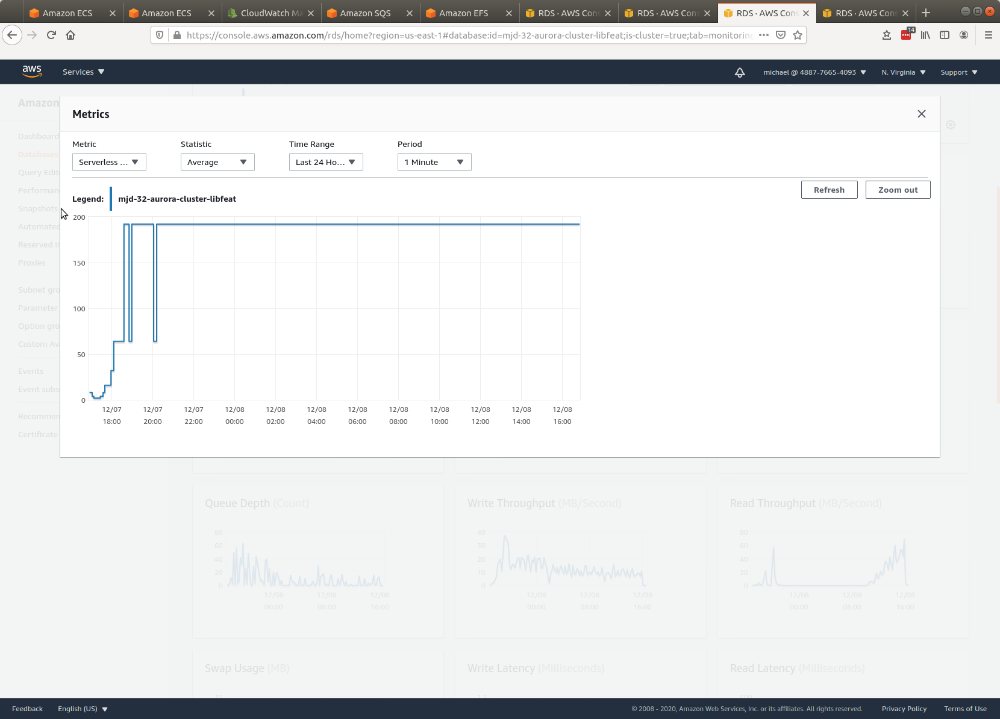

##### DSRC_RECORD

1. [dsrc_record.csv](data/dsrc_record.csv)

#### Logs
