# senzing-test-results-20220410-20M-200-192ACU-clustered-senzing-2.8.2

## Contents

1. [Overview](#overview)
1. [Caveats](#caveats)
1. [Results](#results)
    1. [Observations](#observations)
    1. [Final metrics](#final-metrics)
        1. [SQS](#sqs)
        1. [EFS](#efs)
        1. [ECS](#ecs)
        1. [RDS](#rds)
        1. [Logs](#logs)

## Overview

1. Performed: Apr 10, 2022
2. Senzing version: 3.0.0-22098
3. Instructions:
   [aws-cloudformation-ecs-staging-simple-100M](https://github.com/Senzing/aws-cloudformation-ecs/tree/main/cloudformation/aws-cloudformation-ecs-staging-simple-100M)
    1. [Cloudformation.yaml]()

## System

1. Database
    1. Aurora PosgreSQL Serverless
    1. ACU range: 2 - 192

## Results

### Observations

1. Inserts per second:
    1. Peak: 2281/second
    1. Warm-up: 1.25 hours
    1. Average after warm-up: 1658/second
    1. Average over entire run: 1333/second
    1. Time to load 20M: 4.2 hours
    2. Records in dead-letter queue: 0
    3. See [dsrc_record.csv](data/dsrc_record.csv)

Note:  This is using local senzing data.

### Final metrics

#### SQS

##### SQS Metrics input queue


##### SQS Metrics output queue

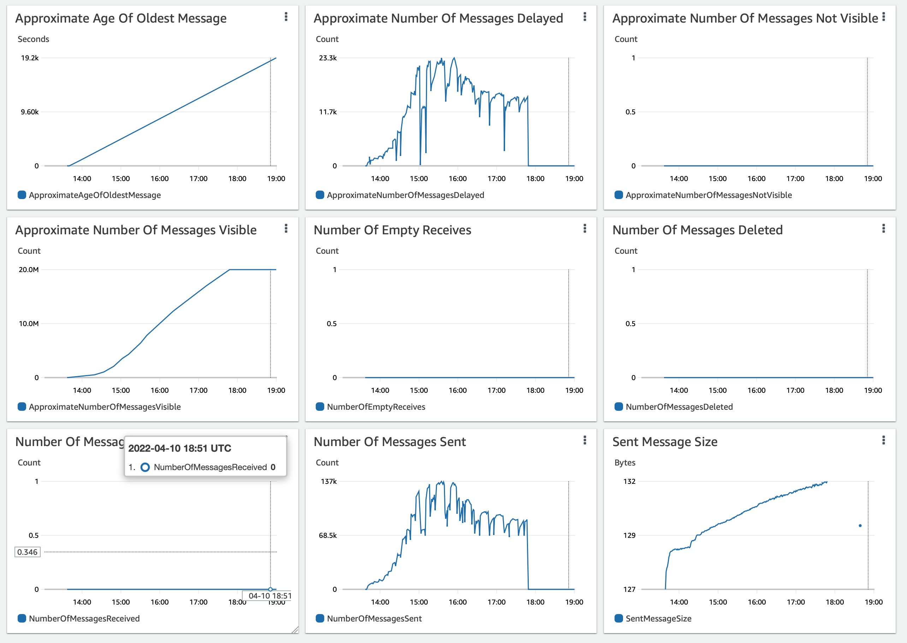

##### SQS Metrics redoer input queue

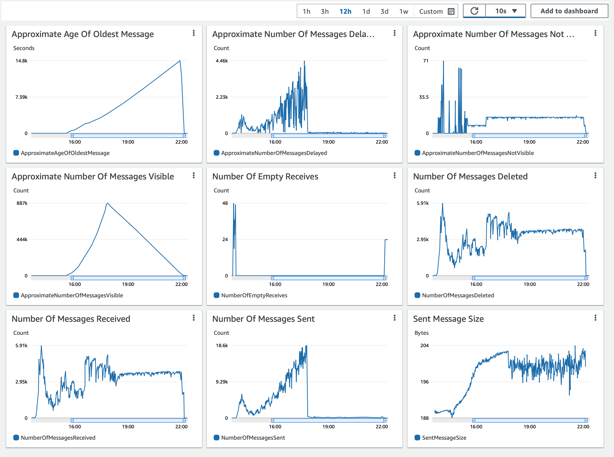

##### SQS Metrics redoer output queue

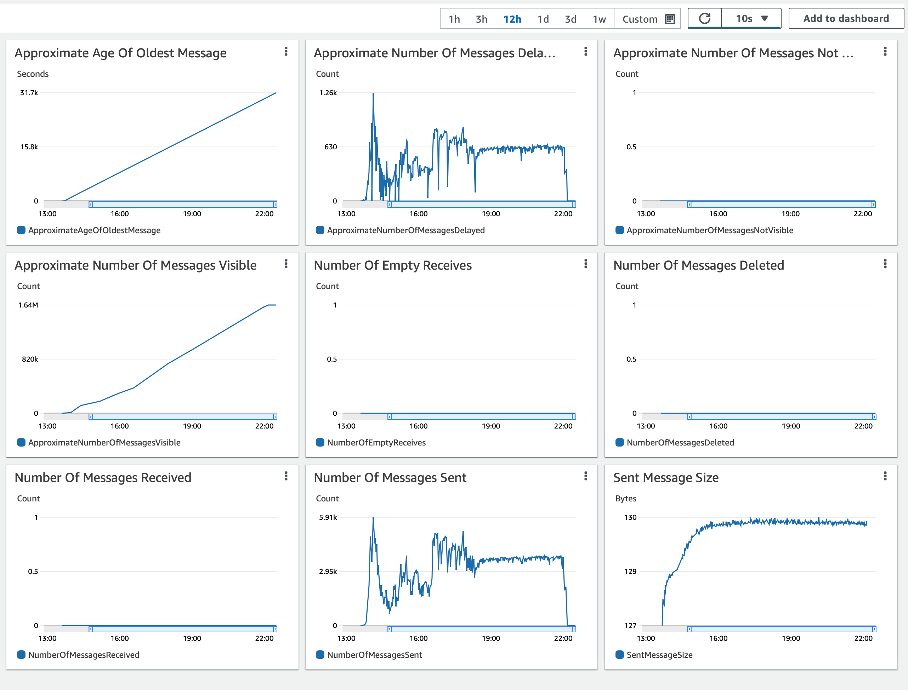

#### EFS

##### EFS Metrics

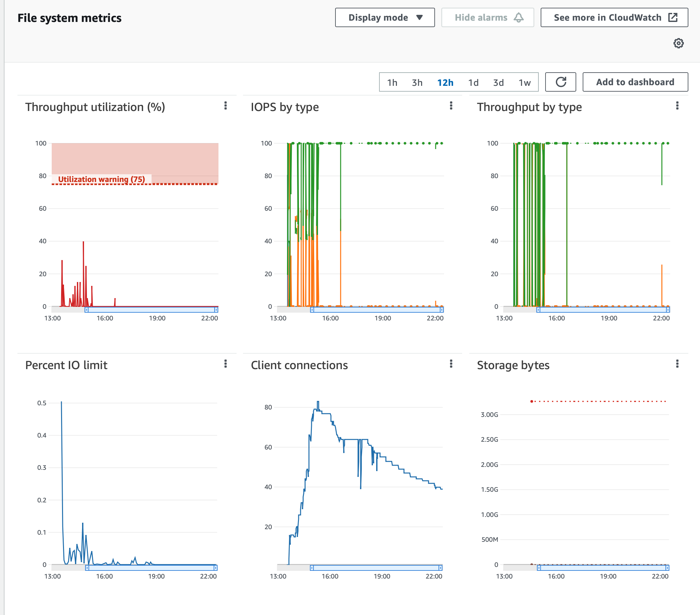

#### ECS

##### Stream-loader CPU Utilization

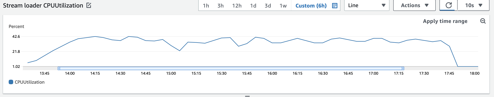

##### Stream-loader Memory Utilization

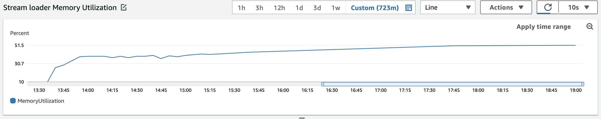

##### Redoer-producer CPU Utilization

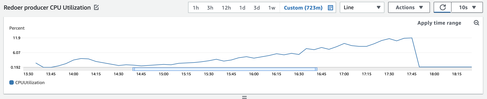

##### Redoer-producer Memory Utilization

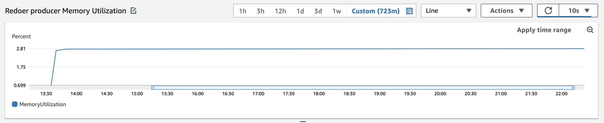

##### Redoer-loader CPU Utilization

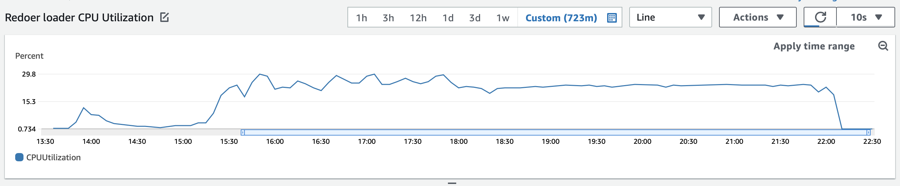

##### Redoer-loader Memory Utilization

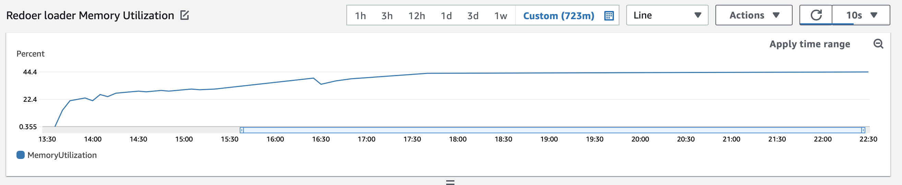

#### RDS

##### Database Metrics CORE final

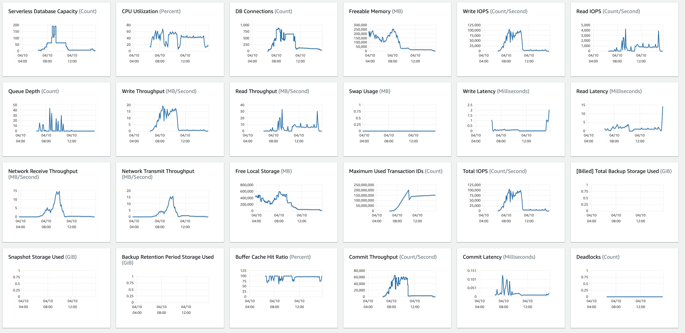

##### Database Metrics RES final


##### Database Metrics LIBFEAT final

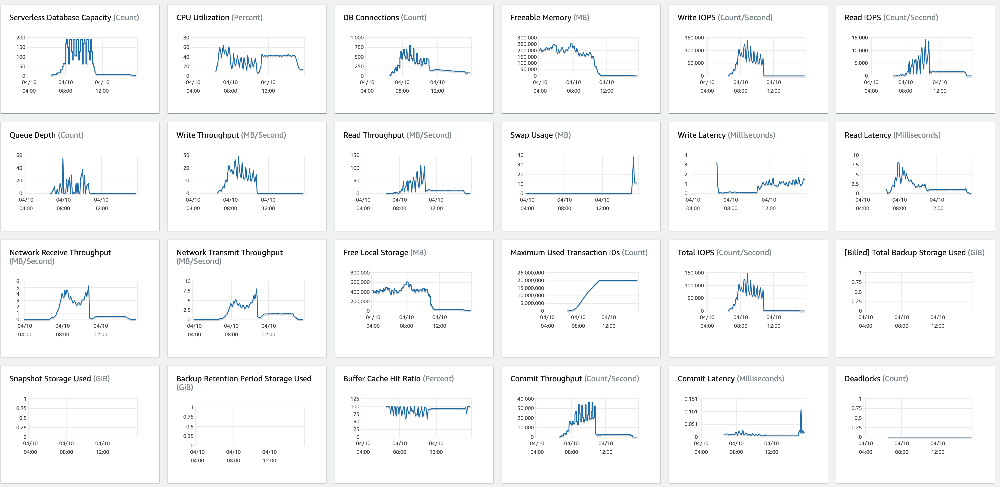

##### DSRC_RECORD

1. [dsrc_record.csv](data/dsrc_record.csv)

#### Logs

## Methods

### Database queries

1. :pencil2: On local workstation, set environment variables:

    ```console
    export SENZING_SSHD_HOST=00.00.00.00
    export SENZING_SSHD_USERNAME=root
    export SENZING_SSHD_PASSWORD=aaaaaaaaaaaaaaaa
    ```

1. On local workstation, ssh to `senzing/sshd` container`:

    ```console
    ssh ${SENZING_SSHD_USERNAME}@${SENZING_SSHD_HOST}
    ```

1. :pencil2: In `sshd` container, set environment variables:

    ```console

    export SENZING_DATABASE_HOST_CORE=mjd-100m-aurora-senzing-core-cluster.cluster-cn3qi42a3jus.us-east-1.rds.amazonaws.com
    export SENZING_DATABASE_PASSWORD=aaaaaaaaaaaaaaaa
    ```

1. In `sshd` container, connect to database:

    ```console
    psql -h ${SENZING_DATABASE_HOST_CORE} -p 5432 -U senzing -W -d G2
    ```

1. In `sshd` container, connect to database:

    ```console
    \copy (SELECT date_trunc('minute', first_seen_dt) as time, count(*) inserts_per_minute FROM dsrc_record GROUP BY time ORDER BY time desc) To '/tmp/test.csv' With CSV

    SELECT NOW(), COUNT(*) FROM DSRC_RECORD;
    SELECT NOW(), COUNT(*) FROM SYS_EVAL_QUEUE;
    ```

1. :pencil2: On local workstation, identify where file is to be downloaded:

    ```console
    export SENZING_DOWNLOAD_FILE=~/docktermj.git/senzing-test-results/aws/ecs/20211006-20M-200-192ACU-clustered-senzing-2.8.2-encrypted/data/dsrc_record.csv
    ```

1. On local workstation, download the SQL results:

    ```console
    scp ${SENZING_SSHD_USERNAME}@${SENZING_SSHD_HOST}:/tmp/test.csv ${SENZING_DOWNLOAD_FILE}
    ```
