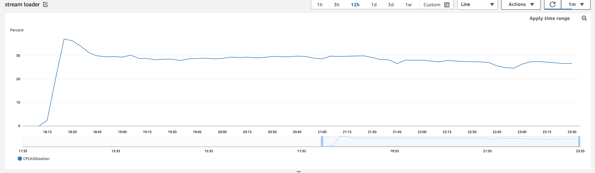
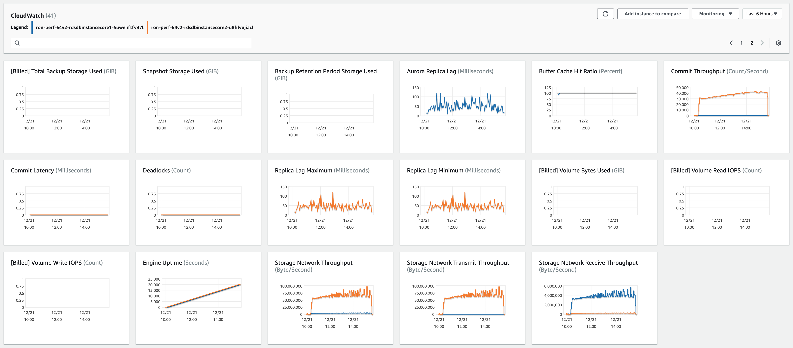

# senzing-test-results-20221221-20M-v2-128ACU-clustered-senzing-3.4.0

## Contents

1. [Overview](#overview)
1. [Caveats](#caveats)
1. [Results](#results)
    1. [Observations](#observations)
    1. [Final metrics](#final-metrics)
        1. [SQS](#sqs)
        1. [EFS](#efs)
        1. [ECS](#ecs)
        1. [RDS](#rds)
        1. [Logs](#logs)

## Overview

1. Performed: Dec 21, 2022
2. Senzing version: 3.4.0.22352
3. Instructions:
   [aws-cloudformation-ecs-staging-simple-100M](https://github.com/Senzing/aws-cloudformation-ecs/tree/main/cloudformation/aws-cloudformation-ecs-staging-simple-100M)
    1. [Cloudformation.yaml]()
4. Notable updates for this run:
    1. Due to restricted ACU, warm-up has been redefined to when we hit 70k/min

## System

1. Database
    1. Aurora PosgreSQL (14.5) Serverless v2
    1. ACU range: 64 - 64

## Results

### Observations

1. Inserts per second:
    1. Peak: 1216/second
    1. Warm-up: 0.37 hours
    1. Average after warm-up: 1059/second
    1. Average over entire run: 1042/second
    1. Time to load 20M: 5.32 hours
    1. Records in dead-letter queue: 0
    1. Total Billed read IOPS:    2,789,287 (none recorded for core)
    1. Total Billed write IOPS:  99,698,417 (none recorded for core)
    1. See [dsrc_record.csv](data/dsrc_record.csv)

- Max Stream-loader tasks: 17
- Max Redoer tasks: 3

### Final metrics

#### SQS

##### SQS Metrics input queue


##### SQS Metrics output queue

N/A.  Ran without `withinfo` enabled.


#### ECS

##### Stream-loader CPU Utilization



##### Stream-loader Memory Utilization


##### Redoer CPU Utilization


##### Redoer Memory Utilization


#### RDS

##### Database Metrics CORE final




##### Database Metrics LIBFEAT final


##### Database Metrics RES final


##### DSRC_RECORD

1. [dsrc_record.csv](data/dsrc_record.csv)

#### Logs

```
G2=> SELECT NOW(), COUNT(*) FROM DSRC_RECORD;
              now              |  count
-------------------------------+----------
 2022-12-21 23:50:37.490044+00 | 20000000
(1 row)

G2=> SELECT NOW(), COUNT(*) FROM OBS_ENT;
              now              |  count
-------------------------------+----------
 2022-12-21 23:50:50.698709+00 | 19999959
(1 row)

G2=> SELECT NOW(), COUNT(*) FROM RES_ENT;
              now              |  count
-------------------------------+----------
 2022-12-21 23:50:56.696681+00 | 17478416
(1 row)

G2=> SELECT NOW(), COUNT(*) FROM RES_ENT_OKEY;
              now              |  count
-------------------------------+----------
 2022-12-21 23:51:00.641712+00 | 19999959
(1 row)

G2=> SELECT NOW(), COUNT(*) FROM SYS_EVAL_QUEUE;
              now              | count
-------------------------------+-------
 2022-12-21 23:51:03.941669+00 |     0
(1 row)

G2=> SELECT NOW(), COUNT(*) FROM RES_RELATE;
              now              |  count
-------------------------------+---------
 2022-12-21 23:51:07.477251+00 | 9122751
(1 row)

G2=> select min(first_seen_dt) load_start, count(*) / (extract(EPOCH FROM (max(first_seen_dt)-min(first_seen_dt)))/60) erpm, count(*) total, max(first_seen_dt)-min(first_seen_dt) duration from dsrc_record;
       load_start        |          erpm          |  total   |  duration
-------------------------+------------------------+----------+------------
 2022-12-21 18:17:43.414 | 62744.1138178224655300 | 20000000 | 05:18:45.3
(1 row)

```

## Methods

### Database queries

1. :pencil2: On local workstation, set environment variables:

    ```console
    export SENZING_SSHD_HOST=00.00.00.00
    export SENZING_SSHD_USERNAME=root
    export SENZING_SSHD_PASSWORD=aaaaaaaaaaaaaaaa
    ```

1. On local workstation, ssh to `senzing/sshd` container`:

    ```console
    ssh ${SENZING_SSHD_USERNAME}@${SENZING_SSHD_HOST}
    ```

1. :pencil2: In `sshd` container, set environment variables:

    ```console

    export SENZING_DATABASE_HOST_CORE=mjd-100m-aurora-senzing-core-cluster.cluster-cn3qi42a3jus.us-east-1.rds.amazonaws.com
    export SENZING_DATABASE_PASSWORD=aaaaaaaaaaaaaaaa
    ```

1. In `sshd` container, connect to database:

    ```console
    psql -h ${SENZING_DATABASE_HOST_CORE} -p 5432 -U senzing -W -d G2
    ```

1. In `sshd` container, connect to database:

    ```console
    \copy (SELECT date_trunc('minute', first_seen_dt) as time, count(*) inserts_per_minute FROM dsrc_record GROUP BY time ORDER BY time desc) To '/tmp/test.csv' With CSV

    SELECT NOW(), COUNT(*) FROM DSRC_RECORD;
    SELECT NOW(), COUNT(*) FROM SYS_EVAL_QUEUE;
    ```

1. :pencil2: On local workstation, identify where file is to be downloaded:

    ```console
    export SENZING_DOWNLOAD_FILE=~/docktermj.git/senzing-test-results/aws/ecs/20211006-20M-200-192ACU-clustered-senzing-2.8.2-encrypted/data/dsrc_record.csv
    ```

1. On local workstation, download the SQL results:

    ```console
    scp ${SENZING_SSHD_USERNAME}@${SENZING_SSHD_HOST}:/tmp/test.csv ${SENZING_DOWNLOAD_FILE}
    ```
