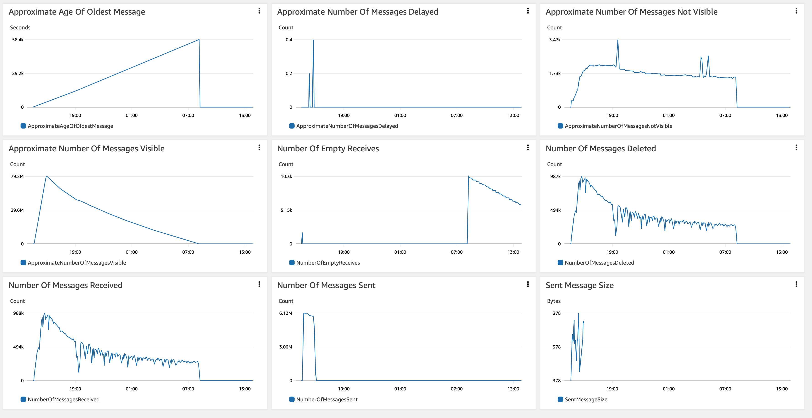
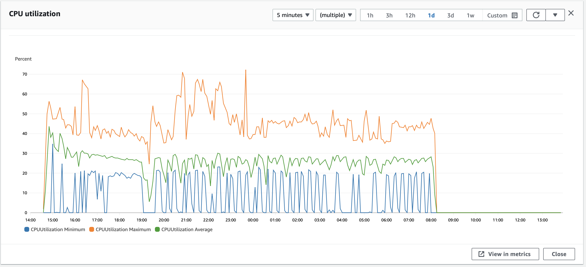
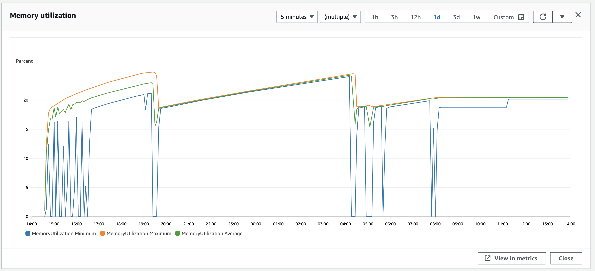
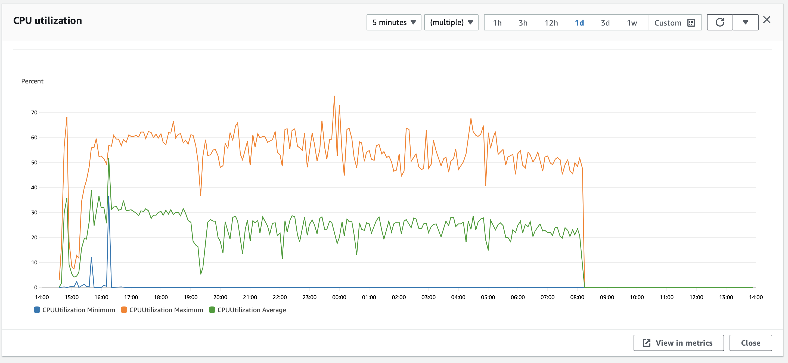
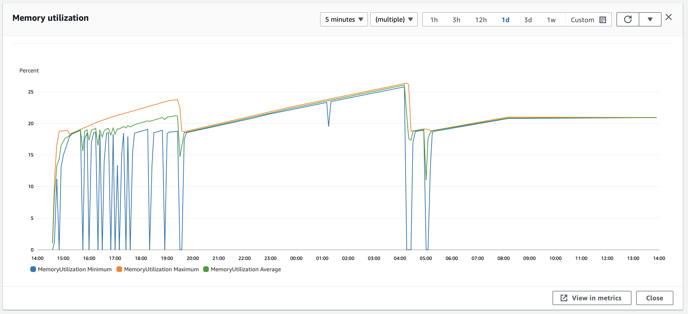
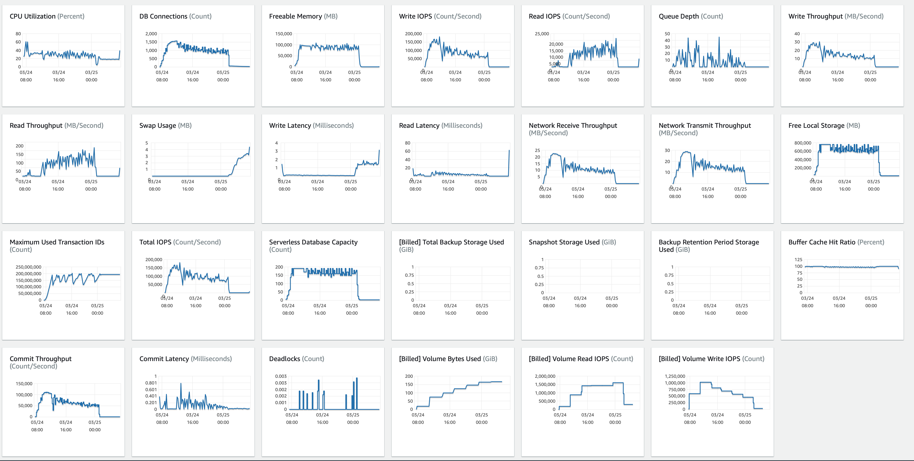
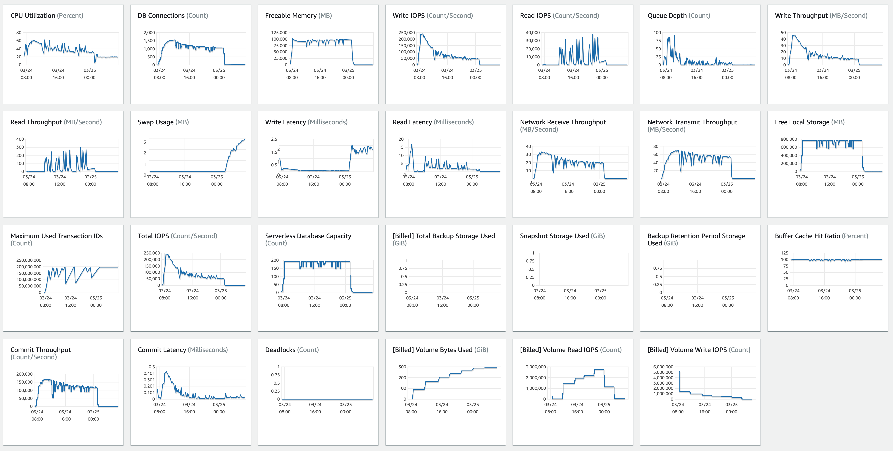
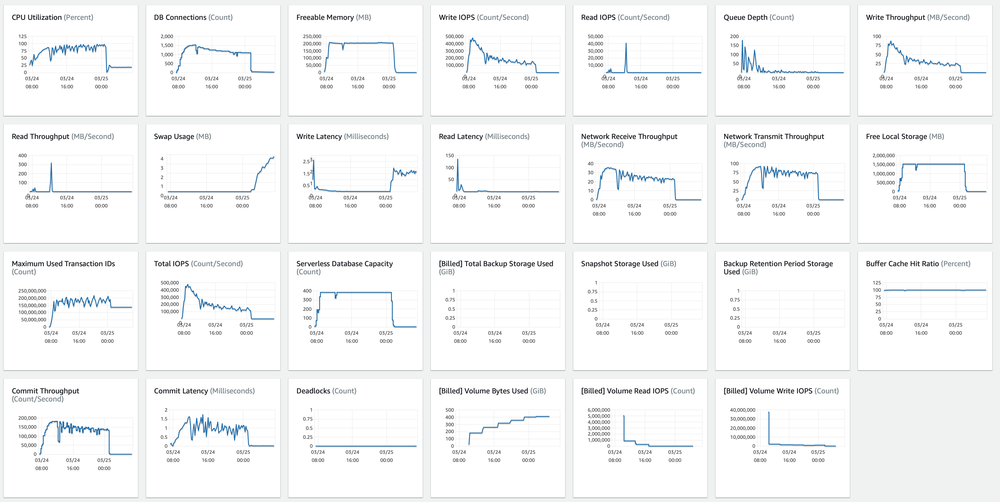

# senzing-test-results-20230324-100M-200-192ACU-clustered-senzing-3.5.0

## Contents

1. [Overview](#overview)
1. [Caveats](#caveats)
1. [Results](#results)
    1. [Observations](#observations)
    1. [Final metrics](#final-metrics)
        1. [SQS](#sqs)
        1. [EFS](#efs)
        1. [ECS](#ecs)
        1. [RDS](#rds)
        1. [Logs](#logs)

## Overview

1. Performed: Mar 24, 2023
2. Senzing version: 3.5.0.23081
3. Instructions:
   [aws-cloudformation-ecs-staging-simple-100M](https://github.com/Senzing/aws-cloudformation-ecs/tree/main/cloudformation/aws-cloudformation-ecs-staging-simple-100M)
    1. [Cloudformation.yaml]()
4. Changes:
    1. using SQS Consumer: https://github.com/brianmacy/sz_sqs_consumer
    1. Consumer updated, SENZING_PREFETCH = SENZING_THREADS_PER_PROCESS
    1. Core: Max ACU 192
    1. Libfeat: Max ACU 192
    1. Res: Max ACU 384
    1. using Simple redoer: https://github.com/brianmacy/sz_simple_redoer

## System

1. Database
    1. Aurora PosgreSQL Serverless
    1. ACU range: 2 - 192

## Results

### Observations

1. Inserts per second:
    1. Peak: 3329/second
    1. Warm-up: 0.45 hours
    1. Average after warm-up: 1437/second
    1. Average over entire run: 1425/second
    1. Time to load 90M: 17.53 hours
    1. Records in dead-letter queue: 0
    1. Total Billed read IOPS:   684,242,971
    1. Total Billed write IOPS:  634,318,816
    1. See [dsrc_record.csv](data/dsrc_record.csv)

Note:  This is using local senzing data.  Withinfo disabled.

- Max Stream-loader tasks: 54
- Max Redoer tasks: 17

### Infinite loop bug

- 3 instances found in the log
- 2 for loader, 1 for redoer
- [loader 1](data/loop-loader-2687788d42ad4c8fb4c204871dd0d59a.csv)
- [loader 2](data/loop-loader-f20a7df9a7394d8898b76a9f7a524874.csv)
- [redoer](data/loop-redoer-e1877ccfc8374b69a0b290b6103e03c2.csv)

### producer issue:  missing 80000001-90000000 producer

- producer/a8beda6df0794626ad425642c0d9abdc
```
    "record_max": 100000000,
    "record_min": 90000001,
```

- producer/3ea095d924554bde86f57abb95c11a75
```
    "record_max": 80000000,
    "record_min": 70000001,
```

- producer/2db62bc9e67d43a6a64bdb500e38f3aa

```
    "record_max": 70000000,
    "record_min": 60000001,
```

- producer/4fafd5d3fc9d48b9922a115c1d16b785
```
    "record_max": 60000000,
    "record_min": 50000001,
```

- producer/9b853c4f62cb4d29b84f027daa2b0c62
```
    "record_max": 50000000,
    "record_min": 40000001,
```

- producer/12b588db2bf84b749d54a252782f5a33
```
    "record_max": 40000000,
    "record_min": 30000001,
```

- producer/4ce48a35f1d54f299417acce318eb0f3
```
    "record_max": 30000000,
    "record_min": 20000001,
```

- producer/749100b89c1e4914a200e04d62daf5d2
```
    "record_max": 20000000,
    "record_min": 10000001,
```

- producer/57973804a01944f5a331dfc3be500889
```
    "record_max": 10000000,
    "record_min": 0,
```

### Final metrics

#### SQS

##### SQS Metrics input queue



##### SQS Metrics output queue

N/A.  Ran without `withinfo` enabled.


#### ECS

##### Sz SQS Consumer CPU Utilization



##### Sz SQS Consumer Memory Utilization



##### Sz Simple Redoer CPU Utilization



##### Sz Simple Redoer Memory Utilization



#### RDS

##### Database Metrics CORE final



##### Database Metrics LIBFEAT final



##### Database Metrics RES final



##### DSRC_RECORD

1. [dsrc_record.csv](data/dsrc_record.csv)

#### Logs

```
G2=> SELECT NOW(), COUNT(*) FROM DSRC_RECORD;
              now              |  count
-------------------------------+----------
 2023-03-25 14:19:28.430544+00 | 90000000
(1 row)

G2=> SELECT NOW(), COUNT(*) FROM OBS_ENT;
              now              |  count
-------------------------------+----------
 2023-03-25 14:22:29.650637+00 | 89999121
(1 row)

G2=> SELECT NOW(), COUNT(*) FROM RES_ENT;
              now              |  count
-------------------------------+----------
 2023-03-25 14:30:59.952414+00 | 57098294
(1 row)

G2=> SELECT NOW(), COUNT(*) FROM RES_ENT_OKEY;
              now              |  count
-------------------------------+----------
 2023-03-25 14:33:35.545917+00 | 89999121
(1 row)

G2=> SELECT NOW(), COUNT(*) FROM SYS_EVAL_QUEUE;
              now              | count
-------------------------------+-------
 2023-03-25 14:42:17.628288+00 |     0
(1 row)

G2=> SELECT NOW(), COUNT(*) FROM RES_RELATE;
             now              |  count
------------------------------+----------
 2023-03-25 14:42:23.03192+00 | 46871089
(1 row)

G2=> select min(first_seen_dt) load_start, count(*) / (extract(EPOCH FROM (max(first_seen_dt)-min(first_seen_dt)))/60) erpm, count(*) total, max(first_seen_dt)-min(first_seen_dt) duration, (count(*) / (extract(EPOCH FROM (max(first_seen_dt)-min(first_seen_dt)))/60))/60 as avg_erps from dsrc_record;
       load_start        |       erpm       |  total   |   duration   |     avg_erps
-------------------------+------------------+----------+--------------+------------------
 2023-03-24 14:39:57.949 | 85590.0890607672 | 90000000 | 17:31:31.417 | 1426.50148434612
(1 row)

```

## Methods

### Database queries

1. :pencil2: On local workstation, set environment variables:

    ```console
    export SENZING_SSHD_HOST=00.00.00.00
    export SENZING_SSHD_USERNAME=root
    export SENZING_SSHD_PASSWORD=aaaaaaaaaaaaaaaa
    ```

1. On local workstation, ssh to `senzing/sshd` container`:

    ```console
    ssh ${SENZING_SSHD_USERNAME}@${SENZING_SSHD_HOST}
    ```

1. :pencil2: In `sshd` container, set environment variables:

    ```console

    export SENZING_DATABASE_HOST_CORE=mjd-100m-aurora-senzing-core-cluster.cluster-cn3qi42a3jus.us-east-1.rds.amazonaws.com
    export SENZING_DATABASE_PASSWORD=aaaaaaaaaaaaaaaa
    ```

1. In `sshd` container, connect to database:

    ```console
    psql -h ${SENZING_DATABASE_HOST_CORE} -p 5432 -U senzing -W -d G2
    ```

1. In `sshd` container, connect to database:

    ```console
    \copy (SELECT date_trunc('minute', first_seen_dt) as time, count(*) inserts_per_minute FROM dsrc_record GROUP BY time ORDER BY time desc) To '/tmp/test.csv' With CSV

    SELECT NOW(), COUNT(*) FROM DSRC_RECORD;
    SELECT NOW(), COUNT(*) FROM SYS_EVAL_QUEUE;
    ```

1. :pencil2: On local workstation, identify where file is to be downloaded:

    ```console
    export SENZING_DOWNLOAD_FILE=~/docktermj.git/senzing-test-results/aws/ecs/20211006-20M-200-192ACU-clustered-senzing-2.8.2-encrypted/data/dsrc_record.csv
    ```

1. On local workstation, download the SQL results:

    ```console
    scp ${SENZING_SSHD_USERNAME}@${SENZING_SSHD_HOST}:/tmp/test.csv ${SENZING_DOWNLOAD_FILE}
    ```
