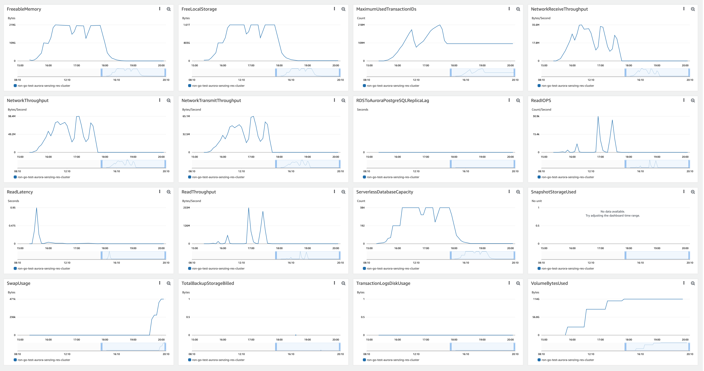

# senzing-test-results-20230614-20M-GO-clustered-senzing-3.6.0

## Contents

1. [Overview](#overview)
1. [Caveats](#caveats)
1. [Results](#results)
    1. [Observations](#observations)
    1. [Final metrics](#final-metrics)
        1. [SQS](#sqs)
        1. [EFS](#efs)
        1. [ECS](#ecs)
        1. [RDS](#rds)
        1. [Logs](#logs)

## Overview

1. Performed: Jun 14, 2023
2. Senzing version: 3.6.0.23160
3. [Methods](#methods)
4. Changes:
    1. using go-load: https://github.com/roncewind/load
    1. using go-move: https://github.com/roncewind/move
    1. using Simple redoer: https://github.com/brianmacy/sz_simple_redoer

## System

1. Database
    1. Aurora PosgreSQL Serverless
    1. ACU range: 2 - 192

## Results

### Observations

1. Inserts per second:
    1. Peak: 4231/second
    1. Warm-up: 0.35 hours
    1. Average after warm-up: 2802/second
    1. Average over entire run: 2488/second
    1. Time to load 20M: 2.22 hours
    1. Records in dead-letter queue: 0
    1. Total Volume read IOPS:   73,021,926
    1. Total Volume write IOPS:  94,894,153
    1. See [dsrc_record.csv](data/dsrc_record.csv)

Note:  This is using local senzing data.  Withinfo disabled.

- Max Stream-loader tasks: 54
- Max Redoer tasks: 9

### Final metrics

#### SQS

##### SQS Metrics input queue


##### SQS Metrics output queue

N/A.  Ran without `withinfo` enabled.


#### ECS

##### Sz SQS go-load CPU Utilization


##### Sz SQS Consumer Memory Utilization


##### Sz Simple Redoer CPU Utilization


##### Sz Simple Redoer Memory Utilization


#### RDS

##### Database Metrics CORE final


##### Database Metrics LIBFEAT final


##### Database Metrics RES final





##### DSRC_RECORD

1. [dsrc_record.csv](data/dsrc_record.csv)

#### Logs

```
G2=> SELECT NOW(), COUNT(*) FROM DSRC_RECORD;
              now              |  count
-------------------------------+----------
 2023-06-14 19:24:59.952421+00 | 19999999
(1 row)

G2=> SELECT NOW(), COUNT(*) FROM OBS_ENT;
              now              |  count
-------------------------------+----------
 2023-06-14 19:27:14.609019+00 | 19999958
(1 row)

G2=> SELECT NOW(), COUNT(*) FROM RES_ENT;
              now              |  count
-------------------------------+----------
 2023-06-14 19:29:02.052171+00 | 17472986
(1 row)

G2=> SELECT NOW(), COUNT(*) FROM RES_ENT_OKEY;
              now              |  count
-------------------------------+----------
 2023-06-14 19:29:55.363116+00 | 19999958
(1 row)

G2=> SELECT NOW(), COUNT(*) FROM SYS_EVAL_QUEUE;
              now              | count
-------------------------------+-------
 2023-06-14 19:30:45.237075+00 |     0
(1 row)

G2=> SELECT NOW(), COUNT(*) FROM RES_RELATE;
              now              |  count
-------------------------------+----------
 2023-06-14 19:30:55.653506+00 | 11467553
(1 row)

G2=> select min(first_seen_dt) load_start, count(*) / (extract(EPOCH FROM (max(first_seen_dt)-min(first_seen_dt)))/60) erpm, count(*) total, max(first_seen_dt)-min(first_seen_dt) duration, (count(*) / (extract(EPOCH FROM (max(first_seen_dt)-min(first_seen_dt)))/60))/60 as avg_erps from dsrc_record;
       load_start        |       erpm       |  total   |   duration   |     avg_erps
-------------------------+------------------+----------+--------------+------------------
 2023-06-14 15:30:59.547 | 151105.974906837 | 19999999 | 02:12:21.446 | 2518.43291511395
(1 row)
```

## Methods

### Database queries

1. :pencil2: On local workstation, set environment variables:

    ```console
    export SENZING_SSHD_HOST=00.00.00.00
    export SENZING_SSHD_USERNAME=root
    export SENZING_SSHD_PASSWORD=aaaaaaaaaaaaaaaa
    ```

1. On local workstation, ssh to `senzing/sshd` container`:

    ```console
    ssh ${SENZING_SSHD_USERNAME}@${SENZING_SSHD_HOST}
    ```

1. :pencil2: In `sshd` container, set environment variables:

    ```console

    export SENZING_DATABASE_HOST_CORE=mjd-100m-aurora-senzing-core-cluster.cluster-cn3qi42a3jus.us-east-1.rds.amazonaws.com
    export SENZING_DATABASE_PASSWORD=aaaaaaaaaaaaaaaa
    ```

1. In `sshd` container, connect to database:

    ```console
    psql -h ${SENZING_DATABASE_HOST_CORE} -p 5432 -U senzing -W -d G2
    ```

1. In `sshd` container, connect to database:

    ```console
    \copy (SELECT date_trunc('minute', first_seen_dt) as time, count(*) inserts_per_minute FROM dsrc_record GROUP BY time ORDER BY time desc) To '/tmp/test.csv' With CSV

    SELECT NOW(), COUNT(*) FROM DSRC_RECORD;
    SELECT NOW(), COUNT(*) FROM SYS_EVAL_QUEUE;
    ```

1. :pencil2: On local workstation, identify where file is to be downloaded:

    ```console
    export SENZING_DOWNLOAD_FILE=~/docktermj.git/senzing-test-results/aws/ecs/20211006-20M-200-192ACU-clustered-senzing-2.8.2-encrypted/data/dsrc_record.csv
    ```

1. On local workstation, download the SQL results:

    ```console
    scp ${SENZING_SSHD_USERNAME}@${SENZING_SSHD_HOST}:/tmp/test.csv ${SENZING_DOWNLOAD_FILE}
    ```
