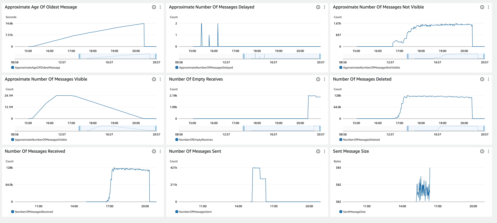
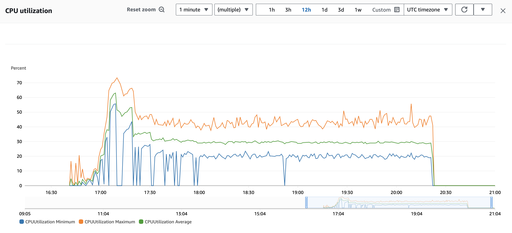
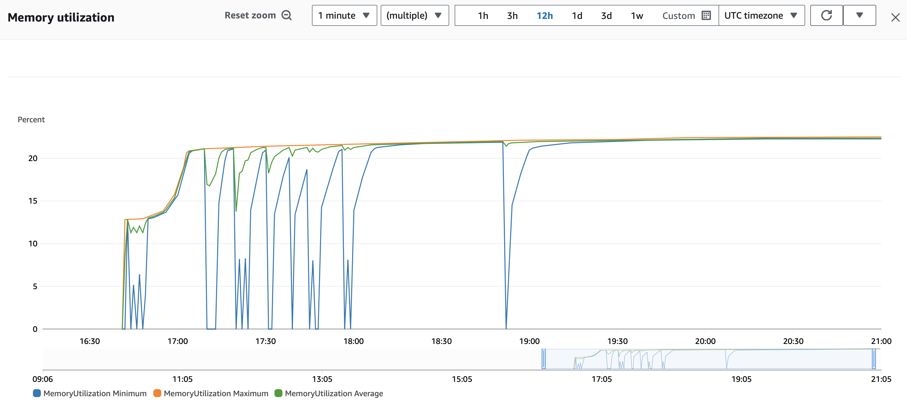
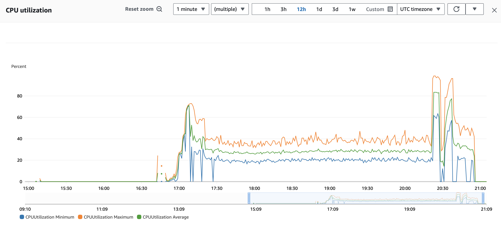
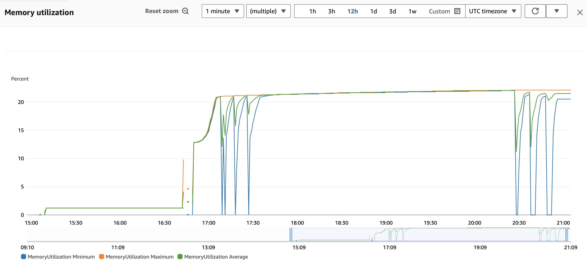
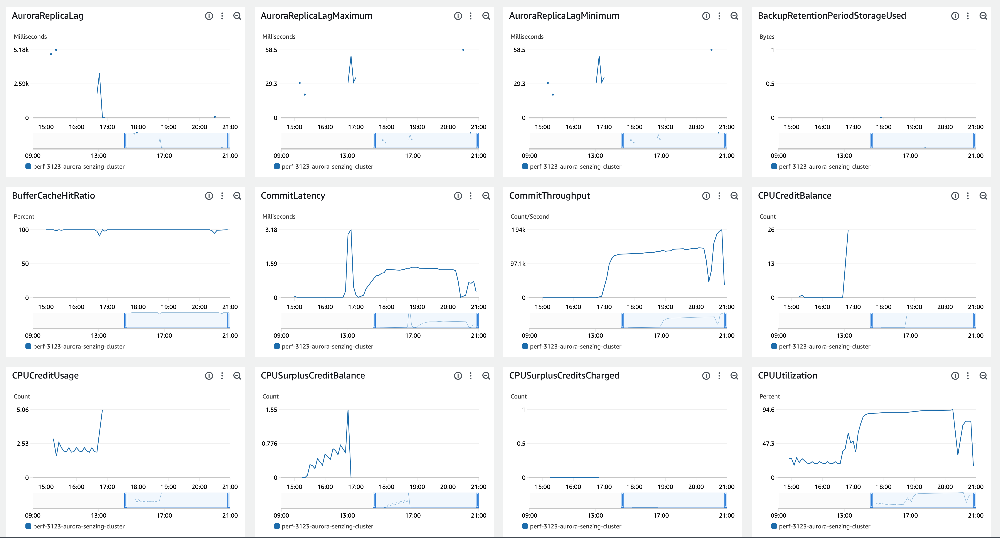
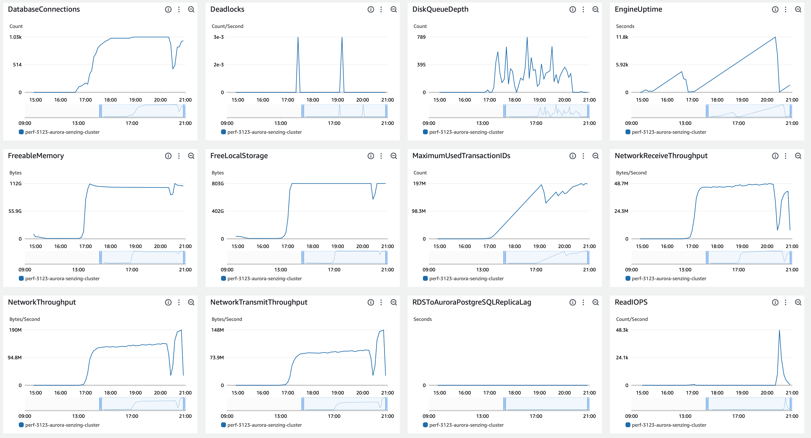
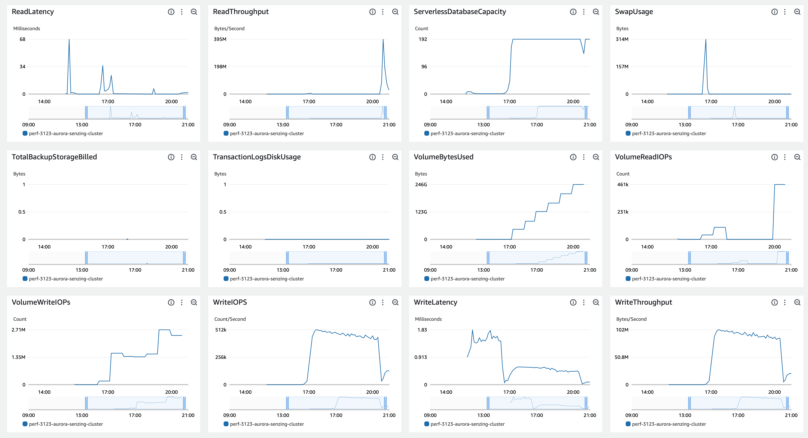
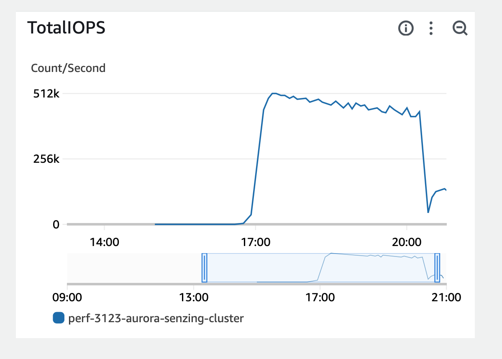

# senzing-test-results-20241120-25M-v1-2-192-single-senzing-3.12.3

## Contents

1. [Overview](#overview)
1. [Caveats](#caveats)
1. [Results](#results)
    1. [Observations](#observations)
    1. [Final metrics](#final-metrics)
        1. [SQS](#sqs)
        1. [EFS](#efs)
        1. [ECS](#ecs)
        1. [RDS](#rds)
        1. [Logs](#logs)

## Overview

1. Performed: Nov 20, 2024
2. Senzing version: 3.12.3.24323
3. Instructions:
   [aws-cloudformation-performance-testing](https://github.com/senzing-garage/aws-cloudformation-performance-testing)
    1. [cloudformation.yaml](https://github.com/senzing-garage/aws-cloudformation-performance-testing/blob/main/cloudformation.yaml)
4. Changes:
    1.

## System

1. Database
    1. Aurora PosgreSQL 13.14 Serverless V1
    1. ACU range: 2 - 192 (384 RES)
    1. Single database

## Results

### Observations

1. Inserts per second:
    1. Peak: 2015/second
    1. Warm-up: 29 mins
    1. Average after warm-up: 1749/second
    1. Average over entire run: 1582/second
    1. Time to load 25M: 3.67 hours
    1. Records in dead-letter queue: 0
    1. Volume read IOPS:       546,056
    1. Volume write IOPS:   96,234,006
    1. See [dsrc_record.csv](data/dsrc_record.csv)

Note:  Withinfo disabled.

- Max Consumer tasks: 40
- Max Redoer tasks: 40

### Final metrics

#### SQS

##### SQS Metrics input queue



##### SQS Metrics output queue

N/A.  Ran without `withinfo` enabled.


#### ECS

##### Sz SQS Consumer CPU Utilization



##### Sz SQS Consumer Memory Utilization



##### Sz Simple Redoer CPU Utilization



##### Sz Simple Redoer Memory Utilization



#### RDS

##### Database Metrics final






##### DSRC_RECORD

1. [dsrc_record.csv](data/dsrc_record.csv)

#### Logs

```
G2=> SELECT NOW(), COUNT(*) FROM DSRC_RECORD;
              now              |  count
-------------------------------+----------
 2024-11-20 21:01:19.331302+00 | 20928140
(1 row)

G2=> SELECT NOW(), COUNT(*) FROM OBS_ENT;
              now              |  count
-------------------------------+----------
 2024-11-20 21:01:41.730045+00 | 20409368
(1 row)

G2=> SELECT NOW(), COUNT(*) FROM RES_ENT;
              now              |  count
-------------------------------+----------
 2024-11-20 21:04:15.053681+00 | 17436818
(1 row)

G2=> SELECT NOW(), COUNT(*) FROM RES_ENT_OKEY;
              now              |  count
-------------------------------+----------
 2024-11-20 21:07:24.234557+00 | 20409368
(1 row)

G2=> SELECT NOW(), COUNT(*) FROM SYS_EVAL_QUEUE;
             now             | count
-----------------------------+-------
 2024-11-20 21:08:02.2465+00 |     0
(1 row)

G2=> SELECT NOW(), COUNT(*) FROM RES_RELATE;
              now              |  count
-------------------------------+----------
 2024-11-20 21:08:07.706307+00 | 10034238
(1 row)

G2=> select min(first_seen_dt) load_start, count(*) / (extract(EPOCH FROM (max(first_seen_dt)-min(first_seen_dt)))/60) erpm, count(*) total, max(first_seen_dt)-min(first_seen_dt) duration, (count(*) / (extract(EPOCH FROM (max(first_seen_dt)-min(first_seen_dt)))/60))/60 as avg_erps from dsrc_record;
       load_start        |       erpm        |  total   |   duration   |     avg_erps
-------------------------+-------------------+----------+--------------+-------------------
 2024-11-20 16:42:00.323 | 94931.70252210546 | 20928140 | 03:40:27.282 | 1582.195042035091
(1 row)

G2=> select dr.RECORD_ID,oe.OBS_ENT_ID,reo.RES_ENT_ID from DSRC_RECORD dr left outer join OBS_ENT oe ON dr.dsrc_id = oe.dsrc_id and dr.ent_src_key = oe.ent_src_key left outer join RES_ENT_OKEY reo ON oe.OBS_ENT_ID = reo.OBS_ENT_ID where reo.RES_ENT_ID is null;
 record_id | obs_ent_id | res_ent_id
-----------+------------+------------
(0 rows)

G2=> select dr.RECORD_ID,reo.OBS_ENT_ID,reo.RES_ENT_ID from RES_ENT_OKEY reo left outer join OBS_ENT oe ON oe.OBS_ENT_ID = reo.OBS_ENT_ID  left outer join DSRC_RECORD dr  ON dr.dsrc_id = oe.dsrc_id and dr.ent_src_key = oe.ent_src_key where dr.RECORD_ID is null;
 record_id | obs_ent_id | res_ent_id
-----------+------------+------------
(0 rows)
```

## Methods

### Database queries

1. :pencil2: On local workstation, set environment variables:

    ```console
    export SENZING_SSHD_HOST=00.00.00.00
    export SENZING_SSHD_USERNAME=root
    export SENZING_SSHD_PASSWORD=aaaaaaaaaaaaaaaa
    ```

1. On local workstation, ssh to `senzing/sshd` container`:

    ```console
    ssh ${SENZING_SSHD_USERNAME}@${SENZING_SSHD_HOST}
    ```

1. :pencil2: In `sshd` container, set environment variables:

    ```console

    export SENZING_DATABASE_HOST_CORE=mjd-100m-aurora-senzing-core-cluster.cluster-cn3qi42a3jus.us-east-1.rds.amazonaws.com
    export SENZING_DATABASE_PASSWORD=aaaaaaaaaaaaaaaa
    ```

1. In `sshd` container, connect to database:

    ```console
    psql -h ${SENZING_DATABASE_HOST_CORE} -p 5432 -U senzing -W -d G2
    ```

1. In `sshd` container, connect to database:

    ```console
    \copy (SELECT date_trunc('minute', first_seen_dt) as time, count(*) inserts_per_minute FROM dsrc_record GROUP BY time ORDER BY time desc) To '/tmp/test.csv' With CSV

    SELECT NOW(), COUNT(*) FROM DSRC_RECORD;
    SELECT NOW(), COUNT(*) FROM SYS_EVAL_QUEUE;
    ```

1. :pencil2: On local workstation, identify where file is to be downloaded:

    ```console
    export SENZING_DOWNLOAD_FILE=~/docktermj.git/senzing-test-results/aws/ecs/20211006-20M-200-192ACU-clustered-senzing-2.8.2-encrypted/data/dsrc_record.csv
    ```

1. On local workstation, download the SQL results:

    ```console
    scp ${SENZING_SSHD_USERNAME}@${SENZING_SSHD_HOST}:/tmp/test.csv ${SENZING_DOWNLOAD_FILE}
    ```
