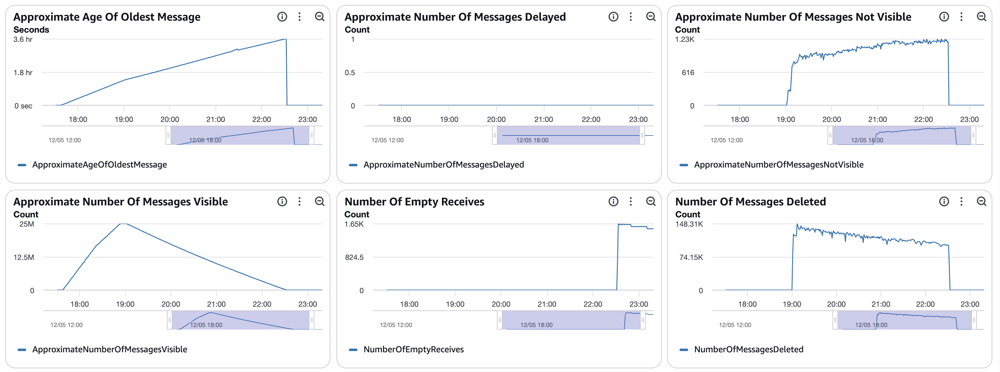
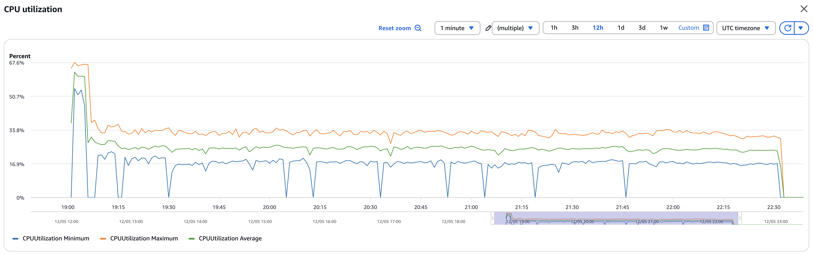
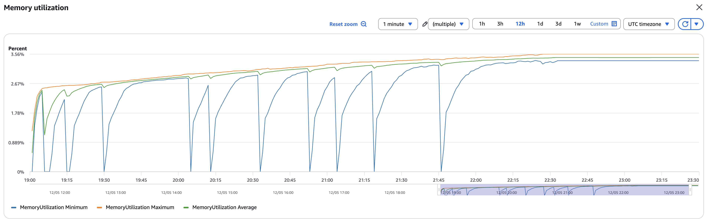
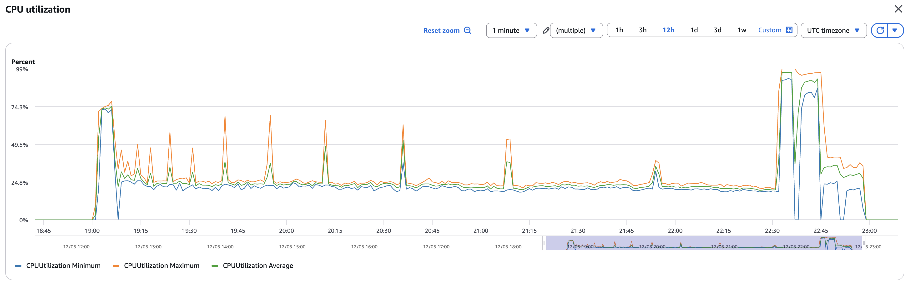
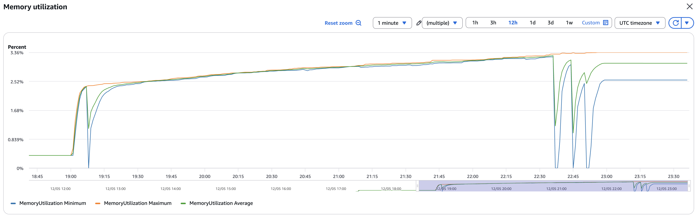
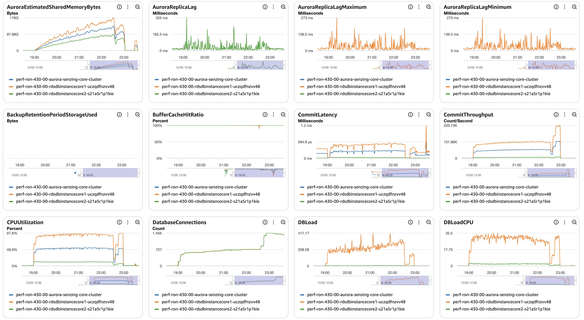
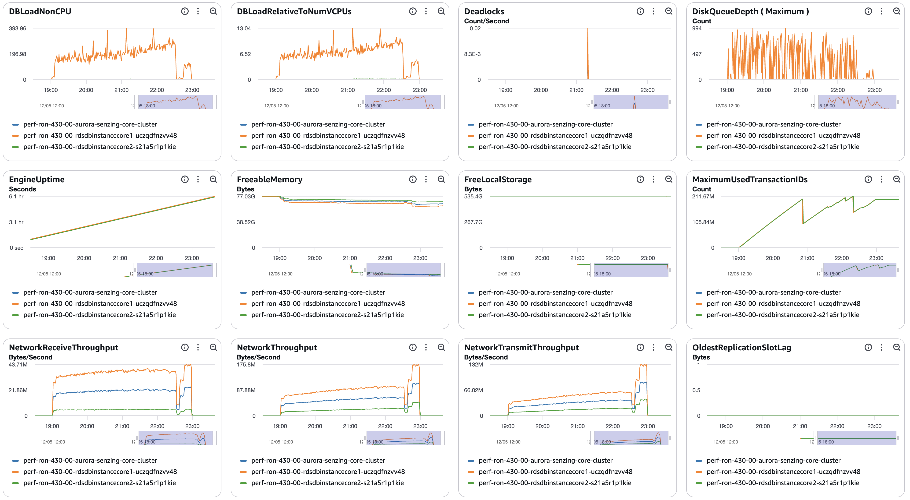
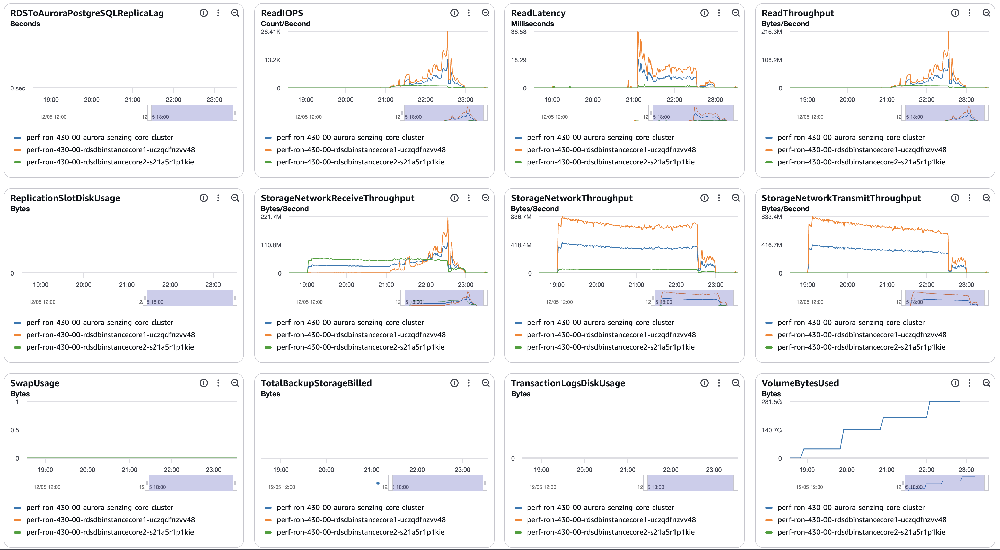

# senzing-test-results-20260512-25M-provisioned-r6i-8xlarge-single-senzing-4.3.0

## Contents

1. [Overview](#overview)
1. [Caveats](#caveats)
1. [Results](#results)
    1. [Observations](#observations)
    1. [Final metrics](#final-metrics)
        1. [SQS](#sqs)
        1. [EFS](#efs)
        1. [ECS](#ecs)
        1. [RDS](#rds)
        1. [Logs](#logs)

## Overview

1. Performed: May 12, 2026
2. Senzing version: 4.3.0.26126
3. Instructions:
   [aws-cloudformation-performance-testing](https://github.com/senzing-garage/aws-cloudformation-performance-testing)
    1. [cloudformationAuroraProvisionedSingleDB.yaml](./cloudformationAuroraProvisionedSingleDB.yaml)
4. Changes:
    1. Pre-load input queue by setting loader DesiredCount and MinCapacity to 0
    1. Postgres 17.5
    1. Using X86_64 (AMD64) as `CpuArchitecture` for consumer, redoer, and sshd
    1. enabled Aurora read-offload by enabling a read-only connection and database

## System

1. Database
    1. Aurora PosgreSQL Provisioned
    1. Single database
    1. Class: db.r6i.8xlarge
    1. IO Opt (StorageType: aurora-iopt1)
    1. sychronous commit, NOT turned off
    1. Auto scaling of loaders turned from 30% to 25% CPU
    1. Updated DB parameter group to enable some tracking:
    ```
    RdsDbParameterGroup:
    Properties:
      Description: !Sub '${AWS::StackName}-rds-db-parameter-group-description'
      Family: aurora-postgresql17
      Parameters:
        shared_preload_libraries: 'pg_stat_statements'
        track_io_timing: 1
        enable_seqscan: 0
        # pglogical.synchronous_commit: 0
    ```

## Results

### Observations

1. Inserts per second:
    1. Peak: 2471/second
    1. Warm-up: 0 mins
    1. Average after warm-up: n/a
    1. Average over entire run: 1973/second
    1. Time to load 25M: 3.52 hours
    1. Records in dead-letter queue: 0
    1. Volume read IOPS:        697,521
    1. Volume write IOPS:   119,463,075
    1. See [dsrc_record.csv](data/dsrc_record.csv)

1. Max tasks:

    - Max Consumer tasks: 30
    - Max Redoer tasks: 37

### Final metrics

#### SQS

##### SQS Metrics input queue



##### SQS Metrics output queue

N/A.  Ran without `withinfo` enabled.


#### ECS

##### Sz SQS Consumer CPU Utilization



##### Sz SQS Consumer Memory Utilization



##### Sz Simple Redoer CPU Utilization



##### Sz Simple Redoer Memory Utilization



#### RDS

##### Database Metrics CORE/LIBFEAT/RES final






##### DSRC_RECORD

1. [dsrc_record.csv](data/dsrc_record.csv)

#### Logs

```
G2=> SELECT NOW(), COUNT(*) FROM DSRC_RECORD;
              now              |  count
-------------------------------+----------
 2026-05-12 23:30:04.070774+00 | 25000000
(1 row)

G2=> SELECT NOW(), COUNT(*) FROM OBS_ENT;
              now              |  count
-------------------------------+----------
 2026-05-12 23:30:10.306906+00 | 24999937
(1 row)

G2=> SELECT NOW(), COUNT(*) FROM RES_ENT;
             now              |  count
------------------------------+----------
 2026-05-12 23:30:16.56108+00 | 21108625
(1 row)

G2=> SELECT NOW(), COUNT(*) FROM RES_ENT_OKEY;
              now              |  count
-------------------------------+----------
 2026-05-12 23:30:20.422407+00 | 24999937
(1 row)

G2=> SELECT NOW(), COUNT(*) FROM SYS_EVAL_QUEUE;
             now              | count
------------------------------+-------
 2026-05-12 23:30:25.31779+00 |     0
(1 row)

G2=> SELECT NOW(), COUNT(*) FROM RES_ENT WHERE ent_state != 0 ;
              now              | count
-------------------------------+-------
 2026-05-12 23:30:28.628824+00 |    38
(1 row)

G2=> SELECT NOW(), COUNT(*) FROM RES_RELATE;
              now              |  count
-------------------------------+----------
 2026-05-12 23:30:34.409061+00 | 11496480
(1 row)

G2=> select min(first_seen_dt) load_start, count(*) / (extract(EPOCH FROM (max(first_seen_dt)-min(first_seen_dt)))/60) erpm, count(*) total, max(first_seen_dt)-min(first_seen_dt) duration, (count(*) / (extract(EPOCH FROM (max(first_seen_dt)-min(first_seen_dt)))/60))/60 as avg_erps from dsrc_record;
       load_start        |          erpm           |  total   |   duration   |       avg_erps
-------------------------+-------------------------+----------+--------------+-----------------------
 2026-05-12 19:01:23.935 | 118398.4291843603252547 | 25000000 | 03:31:09.087 | 1973.3071530726720876
(1 row)

G2=> select dr.RECORD_ID,oe.OBS_ENT_ID,reo.RES_ENT_ID from DSRC_RECORD dr left outer join OBS_ENT oe ON dr.dsrc_id = oe.dsrc_id and dr.ent_src_key = oe.ent_src_key left outer join RES_ENT_OKEY reo ON oe.OBS_ENT_ID = reo.OBS_ENT_ID where reo.RES_ENT_ID is null;
 record_id | obs_ent_id | res_ent_id
-----------+------------+------------
(0 rows)

G2=> select dr.RECORD_ID,reo.OBS_ENT_ID,reo.RES_ENT_ID from RES_ENT_OKEY reo left outer join OBS_ENT oe ON oe.OBS_ENT_ID = reo.OBS_ENT_ID  left outer join DSRC_RECORD dr  ON dr.dsrc_id = oe.dsrc_id and dr.ent_src_key = oe.ent_src_key where dr.RECORD_ID is null;
 record_id | obs_ent_id | res_ent_id
-----------+------------+------------
(0 rows)
```

#### Errors

```
==============================================
Term                       |  instance count |
==============================================
(SENZ0086)                 |         0       |
(err|except)               |        18       |
(UNHANDLED DATABASE ERROR) |         2       |
(CORRUPTION_FOUND)         |         0       |
(RetryTimeout)             |         0       |
(FAILED)                   |         0       |
(INFINITE)                 |         0       |
(MISSING_RES_ENT_AND_OKEY) |         0       |
(still)                    |        37       |
(stolen)                   |         0       |
(cancel)                   |         0       |
(another command is already in progress) | 0 |
==============================================


UNHANDLED DATABASE ERRORs:
consumer:
2026-05-12 21:18:58.270 [szstatic:cd5a32420d239b8c] ERR: PQresultStatus returned [(7:0:ERROR:  deadlock detected; DETAIL:  Process 9549 waits for ShareLock on transaction 244956091; blocked by process 5290.; Process 5290 waits for ShareLock on transaction 244956522; blocked by process 9549.; HINT:  See server log for query details.; CONTEXT:  while updating tuple (433859,66) in relation "res_feat_ekey"; ;Process 9549 waits for ShareLock on transaction 244956091; blocked by process 5290.; Process 5290 waits for ShareLock on transaction 244956522; blocked by process 9549.40P01)] executing: UPDATE RES_FEAT_EKEY AS T SET SUPPRESSED=C.SUPPRESSED,USED_FROM_DT=C.USED_FROM_DT,USED_THRU_DT=C.USED_THRU_DT,OBS_ENT_CNT=C.OBS_ENT_CNT FROM (VALUES (CAST ($1 AS BIGINT),CAST ($2 AS BIGINT),$3,$4,CAST ($5 AS TIMESTAMP),CAST ($6 AS TIMESTAMP),CAST ($7 AS BIGINT)),(CAST ($8 AS BIGINT),CAST ($9 AS BIGINT),$10,$11,CAST ($12 AS TIMESTAMP),CAST ($13 AS TIMESTAMP),CAST ($14 AS BIGINT)),(CAST ($15 AS BIGINT),CAST ($16 AS BIGINT),$17,$18,CAST ($19 AS TIMESTAMP),CAST ($20 AS TIMESTAMP),CAST ($21 AS BIGINT))) AS C(RES_ENT_ID,LIB_FEAT_ID,UTYPE_CODE,SUPPRESSED,USED_FROM_DT,USED_THRU_DT,OBS_ENT_CNT) WHERE C.RES_ENT_ID=T.RES_ENT_ID AND C.LIB_FEAT_ID=T.LIB_FEAT_ID AND C.UTYPE_CODE=T.UTYPE_CODE
UNHANDLED DATABASE ERROR: ((7:ERROR:  deadlock detected; DETAIL:  Process 9549 waits for ShareLock on transaction 244956091; blocked by process 5290.; Process 5290 waits for ShareLock on transaction 244956522; blocked by process 9549.; HINT:  See server log for query details.; CONTEXT:  while updating tuple (433859,66) in relation "res_feat_ekey"; ;Process 9549 waits for ShareLock on transaction 244956091; blocked by process 5290.; Process 5290 waits for ShareLock on transaction 244956522; blocked by process 9549.40P01))

redoer:
2026-05-12 17:34:52.988 [szstatic:4e12f95284c3302d] ERR: PQresultStatus returned [(7:0:ERROR:  relation "sys_vars" does not exist; LINE 1: SELECT VAR_VALUE,SYS_LSTUPD_DT FROM SYS_VARS WHERE VAR_GROUP...;                                             ^; ;42P01)] executing: SELECT VAR_VALUE,SYS_LSTUPD_DT FROM SYS_VARS WHERE VAR_GROUP=$1 AND VAR_CODE=$2
UNHANDLED DATABASE ERROR: ((7:ERROR:  relation "sys_vars" does not exist; LINE 1: SELECT VAR_VALUE,SYS_LSTUPD_DT FROM SYS_VARS WHERE VAR_GROUP...;                                             ^; ;42P01))
2026-05-12 17:34:52.988 [sql:4e12f95284c3302d] CRIT: Exception: ERROR:  relation "sys_vars" does not exist; LINE 1: SELECT VAR_VALUE,SYS_LSTUPD_DT FROM SYS_VARS WHERE VAR_GROUP...;                                             ^; ;42P01
Statement: query = SELECT VAR_VALUE,SYS_LSTUPD_DT FROM SYS_VARS WHERE VAR_GROUP=$1 AND VAR_CODE=$2
Bind Values: 'VERSION','SCHEMA'
SQL Error: ERROR:  relation "sys_vars" does not exist; LINE 1: SELECT VAR_VALUE,SYS_LSTUPD_DT FROM SYS_VARS WHERE VAR_GROUP...;                                             ^; ;42P01 | Statement: Statement: query = SELECT VAR_VALUE,SYS_LSTUPD_DT FROM SYS_VARS WHERE VAR_GROUP=$1 AND VAR_CODE=$2
Bind Values: 'VERSION','SCHEMA'
SENZ1019|Datastore schema tables not found. [Critical Database Error '(7:ERROR:  relation "sys_vars" does not exist; LINE 1: SELECT VAR_VALUE,SYS_LSTUPD_DT FROM SYS_VARS WHERE VAR_GROUP...;                                             ^; ;42P01)']
Traceback (most recent call last):
  File "/app/sz_simple_redoer.py", line 107, in <module>
    g2 = factory.create_engine()
  File "/opt/senzing/er/sdk/python/senzing_core/szabstractfactory.py", line 57, in wrapped_check_destroyed
    return func(self, *args, **kwargs)
  File "/opt/senzing/er/sdk/python/senzing_core/szabstractfactory.py", line 68, in wrapped_method_lock
    return func(self, *args, **kwargs)
  File "/opt/senzing/er/sdk/python/senzing_core/szabstractfactory.py", line 204, in create_engine
    result._initialize(  # pylint: disable=protected-access
    ~~~~~~~~~~~~~~~~~~^^^^^^^^^^^^^^^^^^^^^^^^^^^^^^^^^^^^^
        instance_name=self._instance_name,
        ^^^^^^^^^^^^^^^^^^^^^^^^^^^^^^^^^^
    ...<2 lines>...
        verbose_logging=self._verbose_logging,
        ^^^^^^^^^^^^^^^^^^^^^^^^^^^^^^^^^^^^^^
    )
    ^
  File "/opt/senzing/er/sdk/python/senzing_core/_helpers.py", line 162, in wrapped_check_destroyed
    return func(self, *args, **kwargs)
  File "/opt/senzing/er/sdk/python/senzing_core/_helpers.py", line 120, in wrapped_func
    return typing_cast(_F, func_to_decorate(*args, **kwargs))
                           ~~~~~~~~~~~~~~~~^^^^^^^^^^^^^^^^^
  File "/opt/senzing/er/sdk/python/senzing_core/szengine.py", line 942, in _initialize
    self._check_result(result)
    ~~~~~~~~~~~~~~~~~~^^^^^^^^
  File "/opt/senzing/er/sdk/python/senzing_core/_helpers.py", line 287, in check_result_rc
    raise engine_exception(
    ...<3 lines>...
    )
senzing.szerror.SzConfigurationError: SENZ1019|Datastore schema tables not found. [Critical Database Error '(7:ERROR:  relation "sys_vars" does not exist; LINE 1: SELECT VAR_VALUE,SYS_LSTUPD_DT FROM SYS_VARS WHERE VAR_GROUP...;                                             ^; ;42P01)']
```

## Methods

### Database queries

1. :pencil2: On local workstation, set environment variables:

    ```console
    export SENZING_SSHD_HOST=00.00.00.00
    export SENZING_SSHD_USERNAME=root
    export SENZING_SSHD_PASSWORD=aaaaaaaaaaaaaaaa
    ```

1. On local workstation, ssh to `senzing/sshd` container`:

    ```console
    ssh ${SENZING_SSHD_USERNAME}@${SENZING_SSHD_HOST}
    ```

1. :pencil2: In `sshd` container, set environment variables:

    ```console

    export SENZING_DATABASE_HOST_CORE=mjd-100m-aurora-senzing-core-cluster.cluster-cn3qi42a3jus.us-east-1.rds.amazonaws.com
    export SENZING_DATABASE_PASSWORD=aaaaaaaaaaaaaaaa
    ```

1. In `sshd` container, connect to database:

    ```console
    psql -h ${SENZING_DATABASE_HOST_CORE} -p 5432 -U senzing -W -d G2
    ```

1. In `sshd` container, connect to database:

    ```console
    \copy (SELECT date_trunc('minute', first_seen_dt) as time, count(*) inserts_per_minute FROM dsrc_record GROUP BY time ORDER BY time desc) To '/tmp/test.csv' With CSV

    SELECT NOW(), COUNT(*) FROM DSRC_RECORD;
    SELECT NOW(), COUNT(*) FROM SYS_EVAL_QUEUE;
    ```

1. :pencil2: On local workstation, identify where file is to be downloaded:

    ```console
    export SENZING_DOWNLOAD_FILE=~/docktermj.git/senzing-test-results/aws/ecs/20211006-20M-200-192ACU-clustered-senzing-2.8.2-encrypted/data/dsrc_record.csv
    ```

1. On local workstation, download the SQL results:

    ```console
    scp ${SENZING_SSHD_USERNAME}@${SENZING_SSHD_HOST}:/tmp/test.csv ${SENZING_DOWNLOAD_FILE}
    ```
