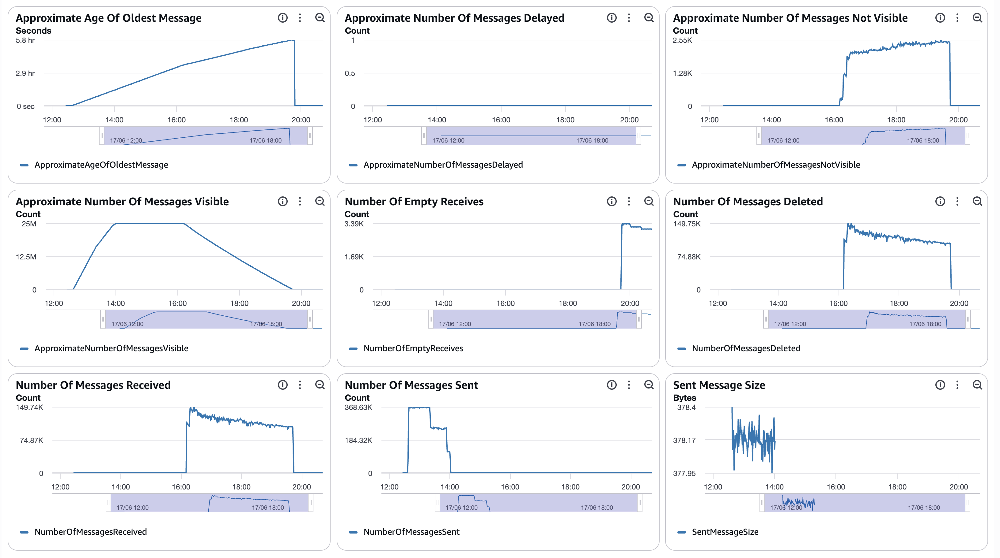
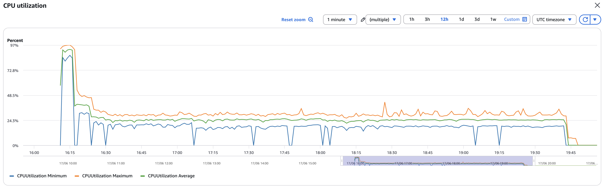
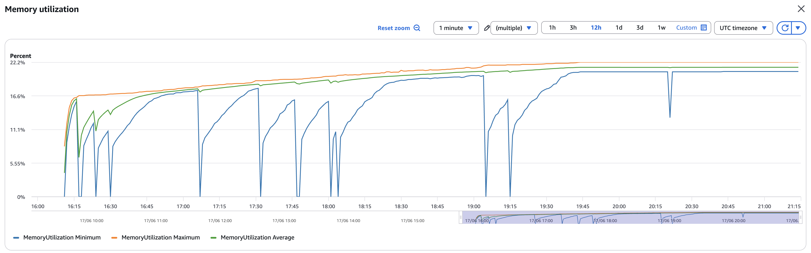
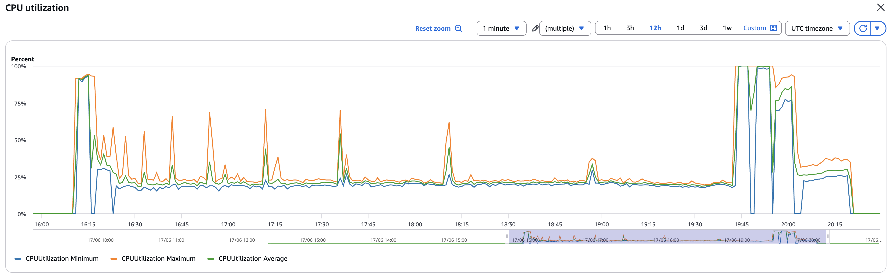
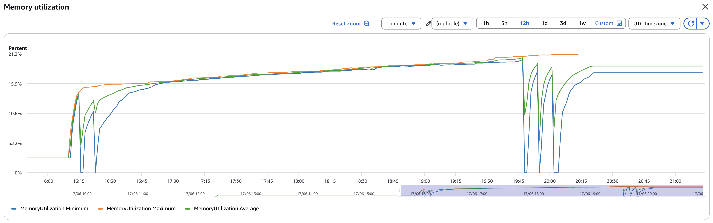
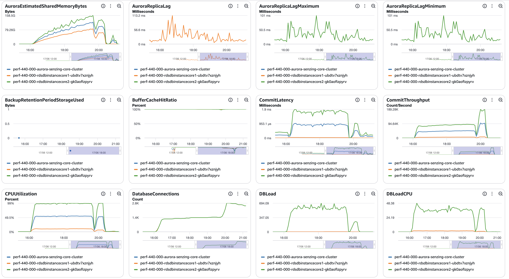
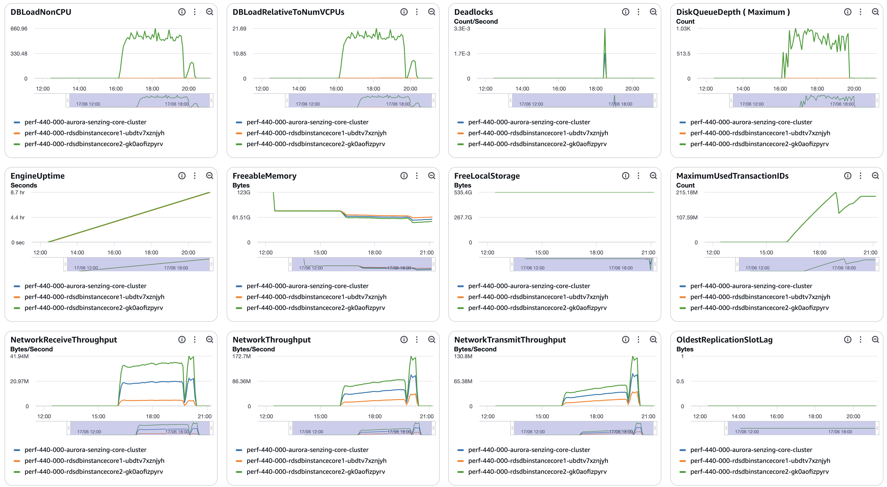
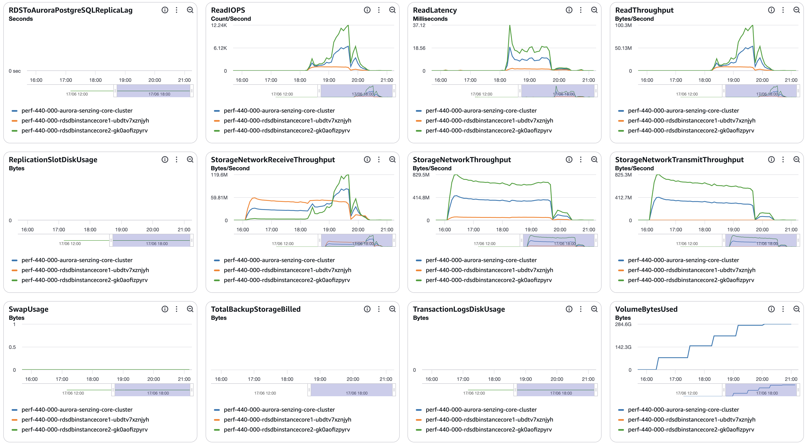
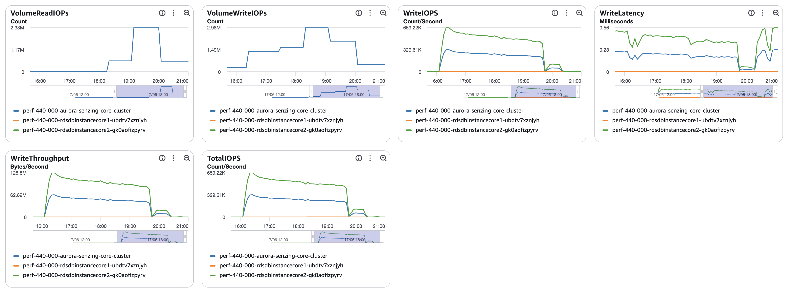

# senzing-test-results-20260617-25M-provisioned-r6i-8xlarge-single-senzing-4.4.0

## Contents

1. [Overview](#overview)
1. [Caveats](#caveats)
1. [Results](#results)
    1. [Observations](#observations)
    1. [Final metrics](#final-metrics)
        1. [SQS](#sqs)
        1. [EFS](#efs)
        1. [ECS](#ecs)
        1. [RDS](#rds)
        1. [Logs](#logs)

## Overview

1. Performed: Jun 17, 2026
2. Senzing version: 4.4.0.26167
3. Instructions:
   [aws-cloudformation-performance-testing](https://github.com/senzing-garage/aws-cloudformation-performance-testing)
    1. [cloudformationAuroraProvisionedSingleDB.yaml](./cloudformationAuroraProvisionedSingleDB.yaml)
4. Changes:
    1. Pre-load input queue by setting loader DesiredCount and MinCapacity to 0
    1. Postgres 17.5
    1. Using X86_64 (AMD64) as `CpuArchitecture` for consumer, redoer, and sshd
    1. enabled Aurora read-offload by enabling a read-only connection and database

## System

1. Database
    1. Aurora PosgreSQL Provisioned
    1. Single database
    1. Class: db.r6i.8xlarge
    1. IO Opt (StorageType: aurora-iopt1)
    1. sychronous commit, NOT turned off
    1. Auto scaling of loaders turned from 30% to 25% CPU
    1. Updated DB parameter group to enable some tracking:
    ```
    RdsDbParameterGroup:
    Properties:
      Description: !Sub '${AWS::StackName}-rds-db-parameter-group-description'
      Family: aurora-postgresql17
      Parameters:
        shared_preload_libraries: 'pg_stat_statements'
        track_io_timing: 1
        enable_seqscan: 0
        # pglogical.synchronous_commit: 0
    ```

## Results

### Observations

1. Inserts per second:
    1. Peak: 2496/second
    1. Warm-up: 0 mins
    1. Average after warm-up: n/a
    1. Average over entire run: 1960/second
    1. Time to load 25M: 3.53 hours
    1. Records in dead-letter queue: 15
    1. Volume read IOPS Writer:      581,747
    1. Volume read IOPS Reader:       87,959
    1. Volume write IOPS:        115,035,913
    1. See [dsrc_record.csv](data/dsrc_record.csv)

1. Max tasks:

    - Max Consumer tasks: 62
    - Max Redoer tasks: 68

### Final metrics

#### SQS

##### SQS Metrics input queue



##### SQS Metrics output queue

N/A.  Ran without `withinfo` enabled.


#### ECS

##### Sz SQS Consumer CPU Utilization



##### Sz SQS Consumer Memory Utilization



##### Sz Simple Redoer CPU Utilization



##### Sz Simple Redoer Memory Utilization



#### RDS

##### Database Metrics CORE/LIBFEAT/RES final







##### DSRC_RECORD

1. [dsrc_record.csv](data/dsrc_record.csv)

#### Logs

```
G2=> SELECT NOW(), COUNT(*) FROM DSRC_RECORD;
             now              |  count
------------------------------+----------
 2026-06-17 20:48:16.33015+00 | 25000000
(1 row)

G2=> SELECT NOW(), COUNT(*) FROM OBS_ENT;
              now              |  count
-------------------------------+----------
 2026-06-17 20:48:23.615451+00 | 24999937
(1 row)

G2=> SELECT NOW(), COUNT(*) FROM RES_ENT;
              now              |  count
-------------------------------+----------
 2026-06-17 20:48:29.141279+00 | 21109228
(1 row)

G2=> SELECT NOW(), COUNT(*) FROM RES_ENT_OKEY;
              now              |  count
-------------------------------+----------
 2026-06-17 20:48:33.029167+00 | 24999922
(1 row)

G2=> SELECT NOW(), COUNT(*) FROM SYS_EVAL_QUEUE;
              now              | count
-------------------------------+-------
 2026-06-17 20:48:36.673143+00 |     0
(1 row)

G2=> SELECT NOW(), COUNT(*) FROM RES_ENT WHERE ent_state != 0 ;
              now              | count
-------------------------------+-------
 2026-06-17 20:48:40.098264+00 |   115
(1 row)

G2=> SELECT NOW(), COUNT(*) FROM RES_RELATE;
              now              |  count
-------------------------------+----------
 2026-06-17 20:48:46.206219+00 | 11246004
(1 row)

G2=> select min(first_seen_dt) load_start, count(*) / (extract(EPOCH FROM (max(first_seen_dt)-min(first_seen_dt)))/60) erpm, count(*) total, max(first_seen_dt)-min(first_seen_dt) duration, (count(*) / (extract(EPOCH FROM (max(first_seen_dt)-min(first_seen_dt)))/60))/60 as avg_erps from dsrc_record;
       load_start        |          erpm           |  total   |   duration   |       avg_erps
-------------------------+-------------------------+----------+--------------+-----------------------
 2026-06-17 16:11:03.367 | 117619.0977658566030118 | 25000000 | 03:32:33.031 | 1960.3182960976100502
(1 row)

G2=> select dr.RECORD_ID,oe.OBS_ENT_ID,reo.RES_ENT_ID from DSRC_RECORD dr left outer join OBS_ENT oe ON dr.dsrc_id = oe.dsrc_id and dr.ent_src_key = oe.ent_src_key left outer join RES_ENT_OKEY reo ON oe.OBS_ENT_ID = reo.OBS_ENT_ID where reo.RES_ENT_ID is null;
 record_id | obs_ent_id | res_ent_id
-----------+------------+------------
 568884330 |   21667115 |
 489558478 |   21675672 |
 381068693 |   21691914 |
 338538894 |   21650207 |
 508217116 |   28000162 |
 344784005 |   21623653 |
 513773875 |   15996696 |
 472174994 |   21683695 |
 568001200 |   21632543 |
 48644210  |   21658731 |
 6626022   |   28008246 |
 514067088 |   21605834 |
 67147565  |   21614766 |
 531851216 |   15987787 |
 483812326 |   21641513 |
(15 rows)

G2=> select dr.RECORD_ID,reo.OBS_ENT_ID,reo.RES_ENT_ID from RES_ENT_OKEY reo left outer join OBS_ENT oe ON oe.OBS_ENT_ID = reo.OBS_ENT_ID  left outer join DSRC_RECORD dr  ON dr.dsrc_id = oe.dsrc_id and dr.ent_src_key = oe.ent_src_key where dr.RECORD_ID is null;
 record_id | obs_ent_id | res_ent_id
-----------+------------+------------
(0 rows)
```

#### Errors

```
==============================================
Term                       |  instance count |
==============================================
(SENZ0086)                 |         0       |
(error|except)             |      8694       |
(UNHANDLED DATABASE ERROR) |         0       |
(CORRUPTION_FOUND)         |         4       |
(RetryTimeout)             |        15       |
(FAILED)                   |         0       |
(INFINITE)                 |         0       |
(MISSING_RES_ENT_AND_OKEY) |         0       |
(still)                    |         0       |
(stolen)                   |         0       |
(cancel)                   |         0       |
(another command is already in progress) | 0 |
==============================================

On errors:

15/8694 errors line up with the 15 records above:

14/15 records in the list above came back with:  Sending to deadletter: TEST : <record_id>
record_id 6626022 only had the below

15/15 records in the list above came back with an error similar to:
SzRetryTimeoutExceededError (10): SENZ0010|Retry timeout exceeded resolved entity locklist [28008246] (WORK_RETRY_TIMEOUT=300s) [{"SOCIAL_HANDLE": "chancily3", "ADDR_STATE": "MN", "ADDR_POSTAL_CODE": "56601", "SSN_NUMBER": "023-04-5854", "NAME_FIRST": "JAMES", "PASSPORT_NUMBER": "XLCSNFAY", "GENDER": "N/A", "CC_ACCOUNT_NUMBER": "5405872069992610", "RECORD_ID": "6626022", "DSRC_ACTION": "A", "DRIVERS_LICENSE_NUMBER": "7U86811", "DRIVERS_LICENSE_STATE": "RI", "NAME_LAST": "JOHNSON", "ADDR_LINE1": "104 15Gth ST", "DATA_SOURCE": "TEST"}]

However, there are two slightly different errors here:

in this example, the record_id and obs_ent_id are both part of the error message:
SzRetryTimeoutExceededError (10): SENZ0010|Retry timeout exceeded resolved entity locklist [21667115] (WORK_RETRY_TIMEOUT=300s) [{"ADDR_STATE": "KS", "SSN_NUMBER": "256-17-3783", "NAME_FIRST": "AGNDRE", "PASSPORT_NUMBER": "TGFSBCG8", "GENDER": "M", "CC_ACCOUNT_NUMBER": "4037094342528", "RECORD_ID": "568884330", "DSRC_ACTION": "A", "ADDR_CITY": "Baldwin City", "DRIVERS_LICENSE_STATE": "PR", "PHONE_NUMBER": "620-543-7774", "NAME_LAST": "VANMETER", "ADDR_LINE1": "408 1000 ", "DATA_SOURCE": "TEST"}]

but in this example, the obs_ent_id is not part of the locklist for it's associated record_id:
SzRetryTimeoutExceededError (10): SENZ0010|Retry timeout exceeded resolved entity locklist [6555650,6780248,9590166,10556436,23616852] (WORK_RETRY_TIMEOUT=300s) [{"DATE_OF_BIRTH": "28/8/1978", "ADDR_STATE": "NC", "ADDR_POSTAL_CODE": "2707", "SSN_NUMBER": "870-62-2597", "NAME_FIRST": "SOPHIA", "GENDER": "F", "CC_ACCOUNT_NUMBER": "5409142755176023", "RECORD_ID": "489558478", "DSRC_ACTION": "A", "ADDR_CITY": "Greensboro", "DRIVERS_LICENSE_STATE": "PA", "PHONE_NUMBER": "910-286-7945", "NAME_LAST": "KIM", "ADDR_LINE1": "4384 lAma ST", "DATA_SOURCE": "TEST"}]

8673/8694 match (current transaction is aborted, commands ignored until end of transaction block)... of those:

1/8673 is this error:
2026-06-17 19:27:47.941 [szstatic:7fb2f0ff96c0] ERR: PQresultStatus returned [(7:0:ERROR:  current transaction is aborted, commands ignored until end of transaction block; ;25P02)] executing: UPDATE RES_FEAT_EKEY AS T SET SUPPRESSED = C.SUPPRESSED FROM (VALUES (CAST ($1 AS BIGINT),CAST ($2 AS BIGINT),$3,$4)) AS C(RES_ENT_ID,LIB_FEAT_ID,UTYPE_CODE,SUPPRESSED) WHERE C.RES_ENT_ID=T.RES_ENT_ID AND C.LIB_FEAT_ID=T.LIB_FEAT_ID AND C.UTYPE_CODE=T.UTYPE_CODE

380/8673 are this error:
2026-06-17 19:42:49.288 [szstatic:7fb2f0ff96c0] ERR: PQresultStatus returned [(7:0:ERROR:  current transaction is aborted, commands ignored until end of transaction block; ;25P02)] executing: DELETE FROM RES_FEAT_EKEY WHERE RES_ENT_ID=$1 AND ((LIB_FEAT_ID=$2 AND UTYPE_CODE=$3)OR(LIB_FEAT_ID=$4 AND UTYPE_CODE=$5)OR(LIB_FEAT_ID=$6 AND UTYPE_CODE=$7)OR(LIB_FEAT_ID=$8 AND UTYPE_CODE=$9)OR(LIB_FEAT_ID=$10 AND UTYPE_CODE=$11)OR(LIB_FEAT_ID=$12 AND UTYPE_CODE=$13)OR(LIB_FEAT_ID=$14 AND UTYPE_CODE=$15)OR(LIB_FEAT_ID=$16 AND UTYPE_CODE=$17)OR(LIB_FEAT_ID=$18 AND UTYPE_CODE=$19)OR(LIB_FEAT_ID=$20 AND UTYPE_CODE=$21)OR(LIB_FEAT_ID=$22 AND UTYPE_CODE=$23)OR(LIB_FEAT_ID=$24 AND UTYPE_CODE=$25)OR(LIB_FEAT_ID=$26 AND UTYPE_CODE=$27)OR(LIB_FEAT_ID=$28 AND UTYPE_CODE=$29)OR(LIB_FEAT_ID=$30 AND UTYPE_CODE=$31)OR(LIB_FEAT_ID=$32 AND UTYPE_CODE=$33)OR(LIB_FEAT_ID=$34 AND UTYPE_CODE=$35)OR(LIB_FEAT_ID=$36 AND UTYPE_CODE=$37)OR(LIB_FEAT_ID=$38 AND UTYPE_CODE=$39)OR(LIB_FEAT_ID=$40 AND UTYPE_CODE=$41)OR(LIB_FEAT_ID=$42 AND UTYPE_CODE=$43)OR(LIB_FEAT_ID=$44 AND UTYPE_CODE=$45)OR(LIB_FEAT_ID=$46 AND UTYPE_CODE=$47)OR(LIB_FEAT_ID=$48 AND UTYPE_CODE=$49)OR(LIB_FEAT_ID=$50 AND UTYPE_CODE=$51)OR(LIB_FEAT_ID=$52 AND UTYPE_CODE=$53)OR(LIB_FEAT_ID=$54 AND UTYPE_CODE=$55)OR(LIB_FEAT_ID=$56 AND UTYPE_CODE=$57)OR(LIB_FEAT_ID=$58 AND UTYPE_CODE=$59)OR(LIB_FEAT_ID=$60 AND UTYPE_CODE=$61)OR(LIB_FEAT_ID=$62 AND UTYPE_CODE=$63)OR(LIB_FEAT_ID=$64 AND UTYPE_CODE=$65)OR(LIB_FEAT_ID=$66 AND UTYPE_CODE=$67)OR(LIB_FEAT_ID=$68 AND UTYPE_CODE=$69)OR(LIB_FEAT_ID=$70 AND UTYPE_CODE=$71)OR(LIB_FEAT_ID=$72 AND UTYPE_CODE=$73)OR(LIB_FEAT_ID=$74 AND UTYPE_CODE=$75)OR(LIB_FEAT_ID=$76 AND UTYPE_CODE=$77)OR(LIB_FEAT_ID=$78 AND UTYPE_CODE=$79)OR(LIB_FEAT_ID=$80 AND UTYPE_CODE=$81)OR(LIB_FEAT_ID=$82 AND UTYPE_CODE=$83)OR(LIB_FEAT_ID=$84 AND UTYPE_CODE=$85)OR(LIB_FEAT_ID=$86 AND UTYPE_CODE=$87)OR(LIB_FEAT_ID=$88 AND UTYPE_CODE=$89)OR(LIB_FEAT_ID=$90 AND UTYPE_CODE=$91)OR(LIB_FEAT_ID=$92 AND UTYPE_CODE=$93))

8292/8694 are this error:
2026-06-17 19:47:08.716 [szstatic:7fb2f0ff96c0] ERR: PQresultStatus returned [(7:0:ERROR:  current transaction is aborted, commands ignored until end of transaction block; ;25P02)] executing: INSERT INTO RES_FEAT_EKEY(RES_ENT_ID,LIB_FEAT_ID,FTYPE_ID,UTYPE_CODE,SUPPRESSED,OBS_ENT_CNT) VALUES ($1,$2,$3,$4,$5,$6),($7,$8,$9,$10,$11,$12),($13,$14,$15,$16,$17,$18),($19,$20,$21,$22,$23,$24),($25,$26,$27,$28,$29,$30),($31,$32,$33,$34,$35,$36),($37,$38,$39,$40,$41,$42),($43,$44,$45,$46,$47,$48),($49,$50,$51,$52,$53,$54),($55,$56,$57,$58,$59,$60),($61,$62,$63,$64,$65,$66),($67,$68,$69,$70,$71,$72) ON CONFLICT DO NOTHING

1 error is a deadlock:
2026-06-17 18:32:43.680 [szstatic:7fb2f0ff96c0] ERR: PQresultStatus returned [(7:0:ERROR:  deadlock detected; DETAIL:  Process 13552 waits for ShareLock on transaction 186362135; blocked by process 11946.; Process 11946 waits for ShareLock on transaction 186367007; blocked by process 13552.; HINT:  See server log for query details.; CONTEXT:  while updating tuple (194652,161) in relation "res_feat_stat"; ;Process 13552 waits for ShareLock on transaction 186362135; blocked by process 11946.; Process 11946 waits for ShareLock on transaction 186367007; blocked by process 13552.40P01)] executing: UPDATE RES_FEAT_STAT AS T SET FTYPE_ID=C.FTYPE_ID,NUM_RES_ENT=C.NUM_RES_ENT_NEW,NUM_RES_ENT_OOM=C.NUM_RES_ENT_OOM_NEW FROM (VALUES (CAST ($1 AS BIGINT),CAST ($2 AS INT),CAST ($3 AS BIGINT),CAST ($4 AS BIGINT),CAST ($5 AS BIGINT),CAST ($6 AS BIGINT)),(CAST ($7 AS BIGINT),CAST ($8 AS INT),CAST ($9 AS BIGINT),CAST ($10 AS BIGINT),CAST ($11 AS BIGINT),CAST ($12 AS BIGINT)),(CAST ($13 AS BIGINT),CAST ($14 AS INT),CAST ($15 AS BIGINT),CAST ($16 AS BIGINT),CAST ($17 AS BIGINT),CAST ($18 AS BIGINT))) AS C(LIB_FEAT_ID,FTYPE_ID,NUM_RES_ENT_OLD,NUM_RES_ENT_OOM_OLD,NUM_RES_ENT_NEW,NUM_RES_ENT_OOM_NEW) WHERE C.LIB_FEAT_ID=T.LIB_FEAT_ID AND C.NUM_RES_ENT_OLD=T.NUM_RES_ENT AND C.NUM_RES_ENT_OOM_OLD=T.NUM_RES_ENT_OOM

the remaining 5 are just a problem with the redoer starting before the database is configured... one day I'll look at that.
```

## Methods

### Database queries

1. :pencil2: On local workstation, set environment variables:

    ```console
    export SENZING_SSHD_HOST=00.00.00.00
    export SENZING_SSHD_USERNAME=root
    export SENZING_SSHD_PASSWORD=aaaaaaaaaaaaaaaa
    ```

1. On local workstation, ssh to `senzing/sshd` container`:

    ```console
    ssh ${SENZING_SSHD_USERNAME}@${SENZING_SSHD_HOST}
    ```

1. :pencil2: In `sshd` container, set environment variables:

    ```console

    export SENZING_DATABASE_HOST_CORE=mjd-100m-aurora-senzing-core-cluster.cluster-cn3qi42a3jus.us-east-1.rds.amazonaws.com
    export SENZING_DATABASE_PASSWORD=aaaaaaaaaaaaaaaa
    ```

1. In `sshd` container, connect to database:

    ```console
    psql -h ${SENZING_DATABASE_HOST_CORE} -p 5432 -U senzing -W -d G2
    ```

1. In `sshd` container, connect to database:

    ```console
    \copy (SELECT date_trunc('minute', first_seen_dt) as time, count(*) inserts_per_minute FROM dsrc_record GROUP BY time ORDER BY time desc) To '/tmp/test.csv' With CSV

    SELECT NOW(), COUNT(*) FROM DSRC_RECORD;
    SELECT NOW(), COUNT(*) FROM SYS_EVAL_QUEUE;
    ```

1. :pencil2: On local workstation, identify where file is to be downloaded:

    ```console
    export SENZING_DOWNLOAD_FILE=~/docktermj.git/senzing-test-results/aws/ecs/20211006-20M-200-192ACU-clustered-senzing-2.8.2-encrypted/data/dsrc_record.csv
    ```

1. On local workstation, download the SQL results:

    ```console
    scp ${SENZING_SSHD_USERNAME}@${SENZING_SSHD_HOST}:/tmp/test.csv ${SENZING_DOWNLOAD_FILE}
    ```
