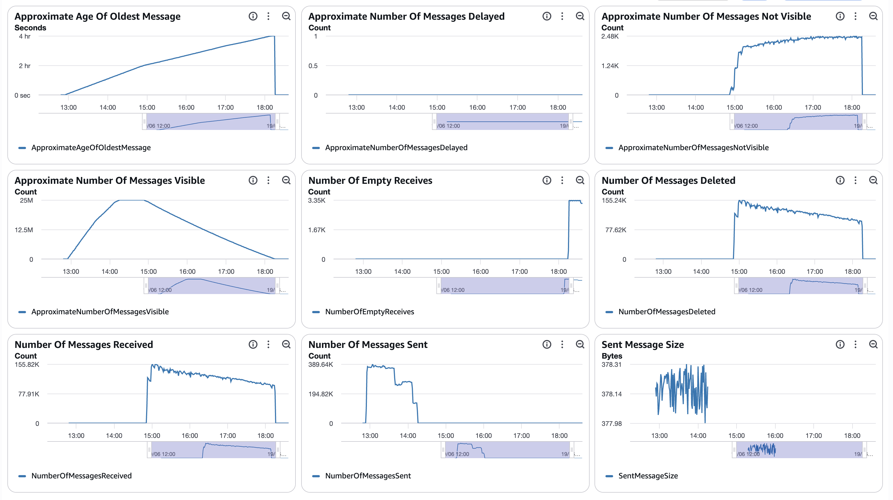
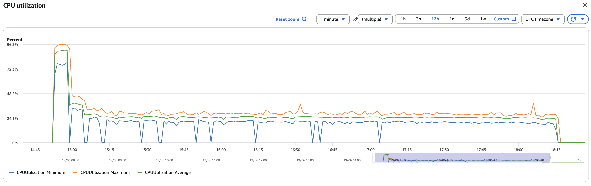
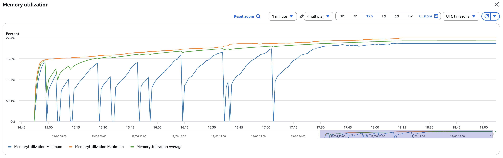
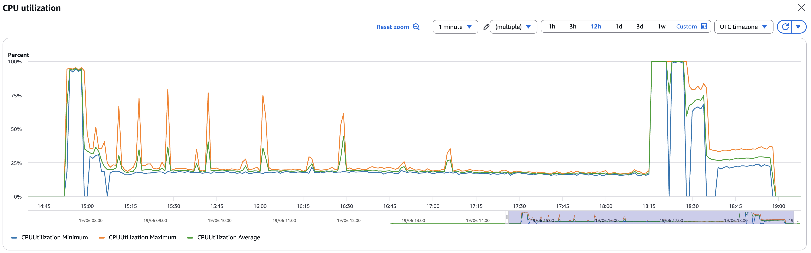
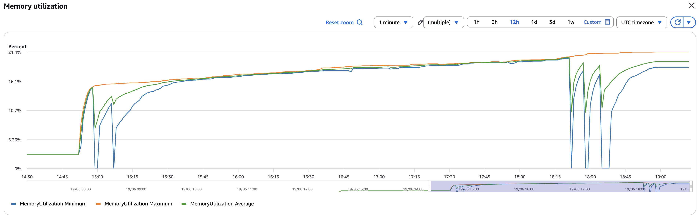
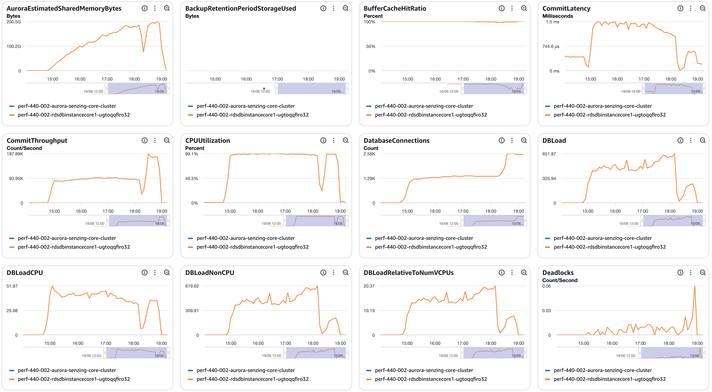
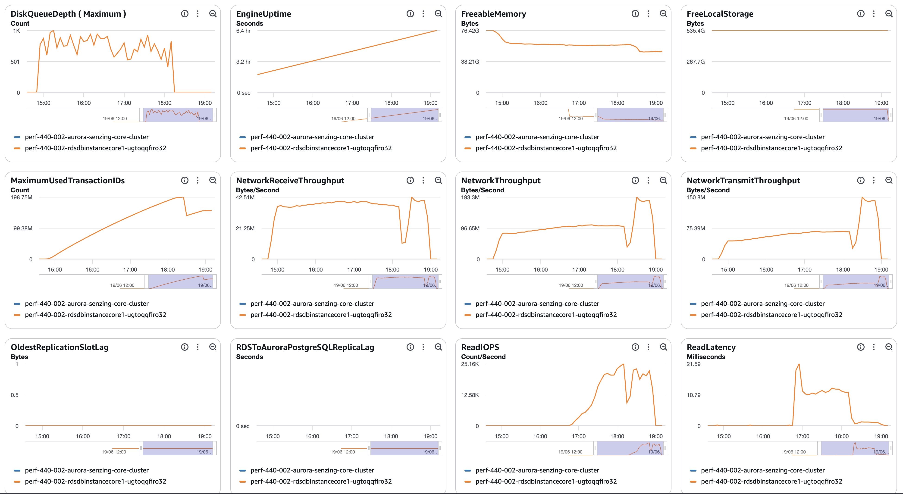
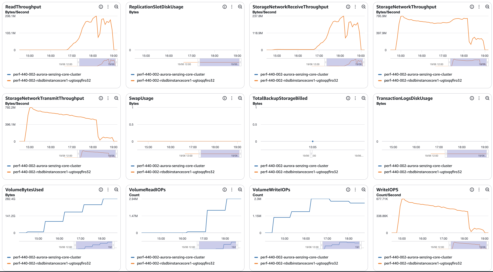
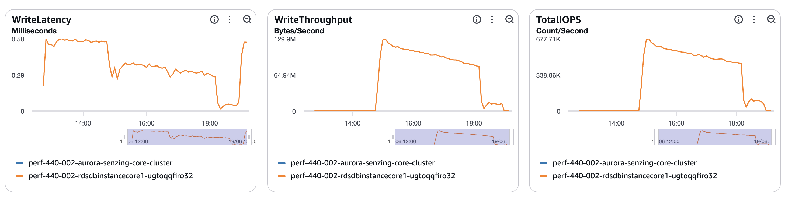

# senzing-test-results-20260619-25M-provisioned-r6i-8xlarge-single-senzing-4.4.0

## Contents

1. [Overview](#overview)
1. [Caveats](#caveats)
1. [Results](#results)
    1. [Observations](#observations)
    1. [Final metrics](#final-metrics)
        1. [SQS](#sqs)
        1. [EFS](#efs)
        1. [ECS](#ecs)
        1. [RDS](#rds)
        1. [Logs](#logs)

## Overview

1. Performed: Jun 19, 2026
2. Senzing version: 4.4.0.26167
3. Instructions:
   [aws-cloudformation-performance-testing](https://github.com/senzing-garage/aws-cloudformation-performance-testing)
    1. [cloudformationAuroraProvisionedSingleDB.yaml](./cloudformationAuroraProvisionedSingleDB.yaml)
4. Changes:
    1. Pre-load input queue by setting loader DesiredCount and MinCapacity to 0
    1. Postgres 17.5
    1. Using X86_64 (AMD64) as `CpuArchitecture` for consumer, redoer, and sshd
    1. enabled Aurora read-offload by enabling a read-only connection and database

## System

1. Database
    1. Aurora PosgreSQL Provisioned
    1. Single database
    1. Class: db.r6i.8xlarge
    1. IO Opt (StorageType: aurora-iopt1)
    1. sychronous commit, NOT turned off
    1. Auto scaling of loaders turned from 30% to 25% CPU
    1. Updated DB parameter group to enable some tracking:
    ```
    RdsDbParameterGroup:
    Properties:
      Description: !Sub '${AWS::StackName}-rds-db-parameter-group-description'
      Family: aurora-postgresql17
      Parameters:
        shared_preload_libraries: 'pg_stat_statements'
        track_io_timing: 1
        enable_seqscan: 0
        # pglogical.synchronous_commit: 0
    ```

## Results

### Observations

1. Inserts per second:
    1. Peak: 2594/second
    1. Average over entire run: 2042/second
    1. Time to load 25M: 3.38
    1. Records in dead-letter queue: 0
    1. Volume read IOPS Writer:      1,987,682
    1. Volume read IOPS Reader:       n/a
    1. Volume write IOPS:          110,278,324
    1. See [dsrc_record.csv](data/dsrc_record.csv)

1. Max tasks:

    - Max Consumer tasks: 61
    - Max Redoer tasks: 59

### Final metrics

#### SQS

##### SQS Metrics input queue



##### SQS Metrics output queue

N/A.  Ran without `withinfo` enabled.


#### ECS

##### Sz SQS Consumer CPU Utilization



##### Sz SQS Consumer Memory Utilization



##### Sz Simple Redoer CPU Utilization



##### Sz Simple Redoer Memory Utilization



#### RDS

##### Database Metrics CORE/LIBFEAT/RES final






##### Database IO / transaction deltas

Captured with the snapshot/diff harness (see
[performance-test runbook](../../docs/performance-test-runbook.md) §4 and
[`scripts/aurora-pg/`](../../scripts/aurora-pg/)).

> **Measurement window:** baseline was taken **mid-load** (~7.77M / 31% already
> loaded), so these deltas cover the **back ~69% of the run (~17.4M records)**,
> not the whole load. `wal_bytes` is blank because Aurora doesn't support
> `pg_stat_wal` (use `VolumeWriteIOPs` for write volume). The `snap_*` rows in
> the per-table deltas are the harness's own snapshot tables — negligible.
> Full output: [final-deltas.txt](data/final-deltas.txt).

```
=================== RUN WINDOW ===================
          baseline_at          |           final_at            |     elapsed
-------------------------------+-------------------------------+-----------------
 2026-06-19 15:47:03.379343+00 | 2026-06-19 19:48:50.217312+00 | 04:01:46.837969

=================== FACT REPORT HEADLINE (eviction-immune) ===================
 logical_block_reads | physical_block_reads | wal_bytes | xact_commit | tup_inserted | tup_updated | tup_deleted
---------------------+----------------------+-----------+-------------+--------------+-------------+-------------
         28141970513 |            119536926 |           |  1180172312 |   1024815812 |   127351039 |    34592897

=================== ALL SCALAR DELTAS ===================
        metric        |     delta
----------------------+----------------
 db.blk_read_time_ms  | 1205787148.294
 db.blks_hit          |    28022433587
 db.blks_read         |      119536926
 db.blk_write_time_ms |    2347202.954
 db.deadlocks         |            109
 db.temp_bytes        |    23110819840
 db.temp_files        |          18411
 db.tup_deleted       |       34592897
 db.tup_fetched       |     9672565491
 db.tup_inserted      |     1024815812
 db.tup_returned      |    10373874744
 db.tup_updated       |      127351039
 db.xact_commit       |     1180172312
 db.xact_rollback     |            115

=========== PER-STATEMENT DELTAS (top 25 by exec-time; EVICTION-LOSSY, top-N only) ===========
  calls   |   rows    | total_ms  | blks_read | blks_written | blks_dirtied | wal_bytes |                                      query
----------+-----------+-----------+-----------+--------------+--------------+-----------+----------------------------------------------------------------------------------
 21143547 | 253649450 | 343768930 |   1402350 |      4062690 |            0 |         0 | INSERT INTO RES_FEAT_EKEY(RES_ENT_ID,LIB_FEAT_ID,FTYPE_ID,UTYPE_CODE,SUPPRESSED,
 12232319 | 171252466 | 265722627 |      9947 |      6348113 |            0 |         0 | INSERT INTO LIB_FEAT(LIB_FEAT_ID,FTYPE_ID,FEAT_HASH,FEAT_DESC,FELEM_VALUES,ANONY
 13976293 | 119954939 | 236741533 |   7437700 |            0 |            0 |         0 | SELECT LIB_FEAT_ID,FEAT_DESC,FTYPE_ID,ANONYMIZED,FEAT_HASH,VERSION,FELEM_VALUES
  5049426 | 222224475 | 125734965 |  17241859 |            0 |            0 |         0 | SELECT LIB_FEAT_ID,FEAT_DESC,FTYPE_ID,ANONYMIZED,FEAT_HASH,VERSION,FELEM_VALUES
 12385800 | 280844721 | 125536427 |  14409729 |            0 |            0 |         0 | SELECT LIB_FEAT_ID,FEAT_DESC,FTYPE_ID,ANONYMIZED,FEAT_HASH,VERSION,FELEM_VALUES
 12204064 |  73870187 | 125396835 |   9512655 |            0 |            0 |         0 | SELECT LIB_FEAT_ID,UTYPE_CODE,RES_ENT_ID,OBS_ENT_CNT FROM RES_FEAT_EKEY WHERE LI
 52739926 |  52738835 | 104193684 |   7195658 |            0 |            0 |         0 | SELECT         $2 FROM RES_ENT_OKEY B JOIN OBS_ENT C ON C.OBS_ENT_ID=B.OBS_ENT_I
 11588538 |  47922127 | 102101401 |   7237626 |            0 |            0 |         0 | SELECT LIB_FEAT_ID,UTYPE_CODE,RES_ENT_ID,OBS_ENT_CNT FROM RES_FEAT_EKEY WHERE LI
 12878579 | 159576632 |  61188757 |   5165416 |            0 |            0 |         0 | SELECT LIB_FEAT_ID,FEAT_DESC,FTYPE_ID,ANONYMIZED,FEAT_HASH,VERSION,FELEM_VALUES
 18129432 |  18129432 |  55454932 |     77228 |       692125 |            0 |         0 | UPDATE OBS_ENT SET FEATURES=$1 WHERE OBS_ENT_ID=$2
 17448315 |  17448315 |  52639875 |     85872 |      1257412 |            0 |         0 | INSERT INTO DSRC_RECORD(DSRC_ID,RECORD_ID,ENT_SRC_KEY,JSON_DATA,CONFIG_ID,FIRST_
  1261830 | 103362019 |  50845744 |   9654918 |            0 |            0 |         0 | SELECT LIB_FEAT_ID,FEAT_DESC,FTYPE_ID,ANONYMIZED,FEAT_HASH,VERSION,FELEM_VALUES
 17448394 |  17448314 |  49225785 |     35530 |       499195 |            0 |         0 | INSERT INTO OBS_ENT(OBS_ENT_ID,DSRC_ID,ENT_SRC_KEY,LAST_TOUCH_DT,LOCKING_ID,LOCK
   914466 |  11130442 |  46484539 |    723480 |            0 |            0 |         0 | SELECT LIB_FEAT_ID,FEAT_DESC,FTYPE_ID,ANONYMIZED,FEAT_HASH,VERSION,FELEM_VALUES
  2548183 |  11957131 |  34243659 |    896877 |            0 |            0 |         0 | SELECT LIB_FEAT_ID,FEAT_DESC,FTYPE_ID,ANONYMIZED,FEAT_HASH,VERSION,FELEM_VALUES
 14315532 |  14315285 |  32788292 |      9473 |       176013 |            0 |         0 | INSERT INTO RES_ENT(RES_ENT_ID,LAST_TOUCH_DT,LOCKING_ID,ENT_STATE) VALUES ($1,$2
 40179858 | 882307313 |  30124897 |   1533882 |            0 |            0 |         0 | SELECT LIB_FEAT_ID,NUM_RES_ENT,NUM_RES_ENT_OOM,CANDIDATE_CAP_REACHED,SCORING_CAP
 53811015 | 676194138 |  28623478 |   1294885 |            0 |            0 |         0 | SELECT LIB_FEAT_ID,NUM_RES_ENT,NUM_RES_ENT_OOM,CANDIDATE_CAP_REACHED,SCORING_CAP
  1401067 |  18213871 |  28171206 |      1196 |       673666 |            0 |         0 | INSERT INTO LIB_FEAT(LIB_FEAT_ID,FTYPE_ID,FEAT_HASH,FEAT_DESC,FELEM_VALUES,ANONY
  1094258 |  27356386 |  25857709 |     16894 |       249849 |            0 |         0 | INSERT INTO RES_FEAT_STAT(LIB_FEAT_ID,FTYPE_ID,NUM_RES_ENT,NUM_RES_ENT_OOM) VALU
  1319024 |  15828288 |  24940165 |      1074 |       621673 |            0 |         0 | INSERT INTO LIB_FEAT(LIB_FEAT_ID,FTYPE_ID,FEAT_HASH,FEAT_DESC,FELEM_VALUES,ANONY
  1394019 |  23698300 |  24880668 |     17817 |       233020 |            0 |         0 | INSERT INTO RES_FEAT_STAT(LIB_FEAT_ID,FTYPE_ID,NUM_RES_ENT,NUM_RES_ENT_OOM) VALU
  1492215 |  22383197 |  24714304 |     18320 |       229411 |            0 |         0 | INSERT INTO RES_FEAT_STAT(LIB_FEAT_ID,FTYPE_ID,NUM_RES_ENT,NUM_RES_ENT_OOM) VALU
  1409386 |  22550165 |  24339993 |     17136 |       218169 |            0 |         0 | INSERT INTO RES_FEAT_STAT(LIB_FEAT_ID,FTYPE_ID,NUM_RES_ENT,NUM_RES_ENT_OOM) VALU
  2015363 |  19748150 |  23134308 |   2491337 |            0 |            0 |         0 | SELECT LIB_FEAT_ID,UTYPE_CODE,RES_ENT_ID,OBS_ENT_CNT FROM RES_FEAT_EKEY WHERE LI

=================== PER-TABLE DELTAS (tables touched by the run) ===================
    relname     |    ins    |   upd    |   del    | hot_upd  | seq_scan |  idx_scan  | heap_read |  heap_hit  | idx_read
----------------+-----------+----------+----------+----------+----------+------------+-----------+------------+----------
 res_feat_ekey  | 352028704 | 28035474 |  7809623 |  7942064 |        0 |  633056121 |  13849204 | 1265640786 | 16009893
 res_feat_stat  | 277198536 | 46981837 |        3 | 34967242 |        0 |  890806856 |   2873851 | 1435486188 |  1829009
 lib_feat       | 277195677 |      320 |        1 |      241 |     1344 | 1097948059 |  50999153 | 1026164143 |  9285762
 res_rel_ekey   |  30999352 |        0 | 13692656 |        0 |        0 |   97808171 |    366461 |  181408572 |    28270
 obs_ent        |  17449785 | 23968598 |        0 | 18294530 |        0 |  210287987 |   5484168 |  543439830 |   501073
 res_relate     |  15499676 |  7498916 |  6846338 |  3655558 |        1 |   66597909 |  10232073 |  192620416 |    29579
 res_ent        |  14316588 | 12734795 |   350153 | 11147366 |        7 |  218688412 |     21112 |  256858574 |       62
 dsrc_record    |  17449793 |  5511860 |        0 |  3006724 |        8 |  120150488 |   6682552 |  373412466 |    62667
 res_ent_okey   |  17797582 |  2613114 |   347047 |  1912756 |        1 |  238697831 |     21588 |  492885458 |   372157
 sys_eval_queue |   4876899 |        0 |  5545655 |        0 |        0 |   22169011 |    852544 |  165241160 |    34170
 sys_sequence   |         0 |     3465 |        0 |     3465 |        0 |       7091 |        19 |      14756 |        7
 snap_statement |      1062 |        0 |        0 |        0 |      549 |          0 |        21 |      22052 |        0
 snap_table     |        38 |        0 |        0 |        0 |        0 |          0 |         1 |         36 |        0
 snap_scalar    |        28 |        0 |        0 |        0 |        5 |          0 |         1 |         31 |        0
```

1. [pg_stat_io.csv](data/pg_stat_io.csv)
1. [pg_stat_statements.csv](data/pg_stat_statements.csv)

##### DSRC_RECORD

1. [dsrc_record.csv](data/dsrc_record.csv)

##### Match keys

1. [match_key_ent.csv](data/match_key_ent.csv)
1. [match_key_rel.csv](data/match_key_rel.csv)

#### Logs

```
root@ip-10-0-43-115:~# $PG -f /tmp/progress.sql
Password for user senzing:
Timing is on.
              at               | dsrc_record | obs_ent  | res_ent  | res_ent_okey | sys_eval_queue | res_ent_active | res_relate
-------------------------------+-------------+----------+----------+--------------+----------------+----------------+------------
 2026-06-19 19:24:22.661415+00 |    25000000 | 24999937 | 21109299 |     24999937 |              0 |             97 |   11208231
(1 row)

Time: 11461.939 ms (00:11.462)
       load_start        |   duration   |  total   |          erpm           |       avg_erps
-------------------------+--------------+----------+-------------------------+-----------------------
 2026-06-19 14:52:39.483 | 03:23:12.084 | 25000000 | 123030.6484108869328656 | 2050.5108068481155478
(1 row)

Time: 4188.421 ms (00:04.188)
root@ip-10-0-43-115:~# $PG -f /tmp/validate.sql
Password for user senzing:
Timing is on.
 record_id | obs_ent_id | res_ent_id
-----------+------------+------------
(0 rows)

Time: 30117.178 ms (00:30.117)
 record_id | obs_ent_id | res_ent_id
-----------+------------+------------
(0 rows)

Time: 30583.258 ms (00:30.583)
```

#### Errors

```
==============================================
Term                       |  instance count |
==============================================
(SENZ0086)                 |         0       |
(error|except)             |       119       |
(ExclusiveLock on advisory lock)|  114       |
(UNHANDLED DATABASE ERROR) |         0       |
(CORRUPTION_FOUND)         |         1       |
(RetryTimeout)             |         0       |
(FAILED)                   |         0       |
(INFINITE)                 |         0       |
(MISSING_RES_ENT_AND_OKEY) |         0       |
(still)                    |         0       |
(stolen)                   |         0       |
(cancel)                   |         0       |
(another command is already in progress) | 0 |
==============================================

ERR... ExclusiveLock on advisory lock (114/119):
2026-06-19 18:58:23.142 [szstatic:7fe14ffff6c0] ERR: PQresultStatus returned [(7:0:ERROR:  deadlock detected; DETAIL:  Process 20694 waits for ExclusiveLock on advisory lock [16412,766509056,26905780,1]; blocked by process 20712.; Process 20712 waits for ExclusiveLock on advisory lock [16412,766509056,5594456,1]; blocked by process 20694.; HINT:  See server log for query details.; ;Process 20694 waits for ExclusiveLock on advisory lock [16412,766509056,26905780,1]; blocked by process 20712.; Process 20712 waits for ExclusiveLock on advisory lock [16412,766509056,5594456,1]; blocked by process 20694.40P01)] executing: SELECT pg_advisory_lock($1)

```

## Methods

Full step-by-step process — connect, watch progress, capture IO/transaction
metrics, validate, export CSVs, and scan logs — is in the
[performance-test runbook](../../docs/performance-test-runbook.md). Reusable SQL
helpers live in [`scripts/aurora-pg/`](../../scripts/aurora-pg/):

- `progress.sql` — row counts + throughput (erpm) during the load
- `00-setup.sql` / `10-baseline.sql` / `20-final.sql` — IO/transaction delta capture
- `validate.sql` — post-load integrity checks (expect zero rows)
- `exports.sql` — writes `dsrc_record.csv`, `match_key_*.csv`, `pg_stat_*.csv` to `/tmp`
