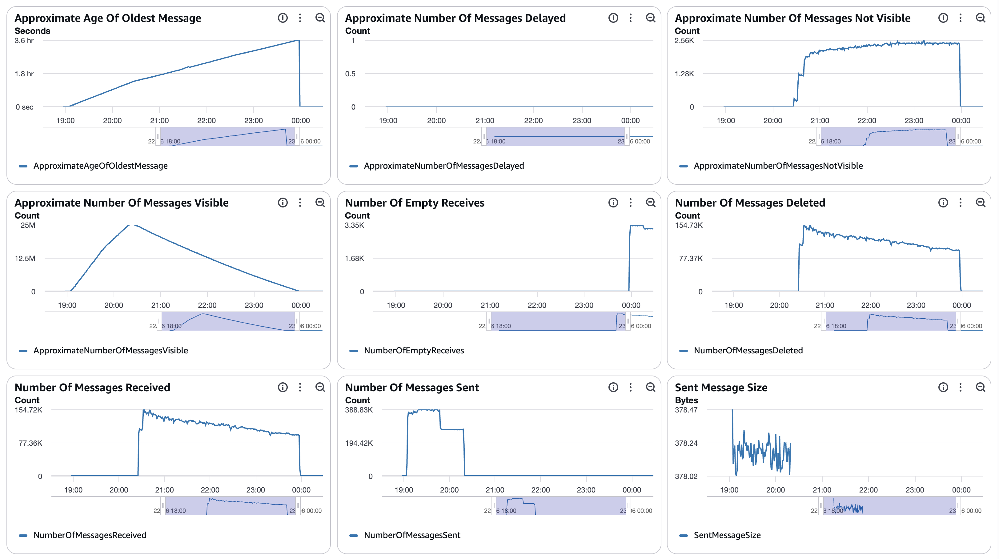
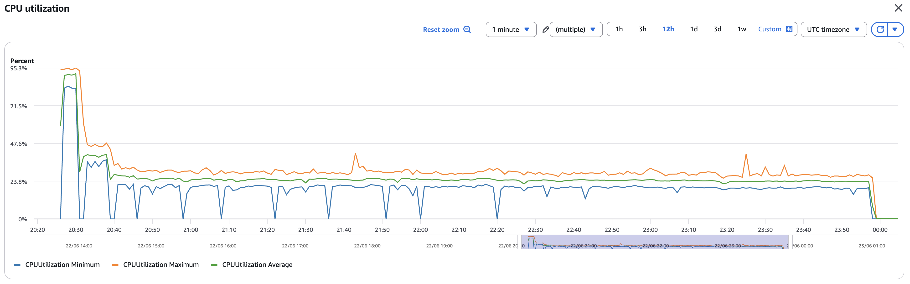
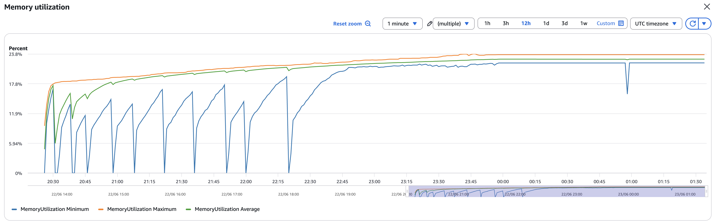
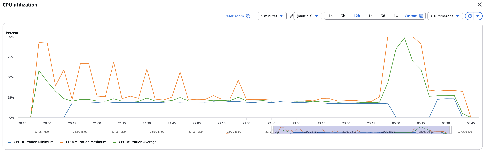
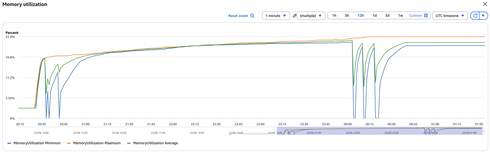
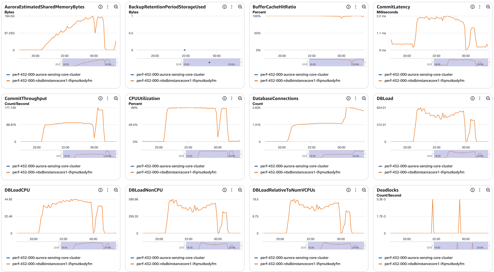
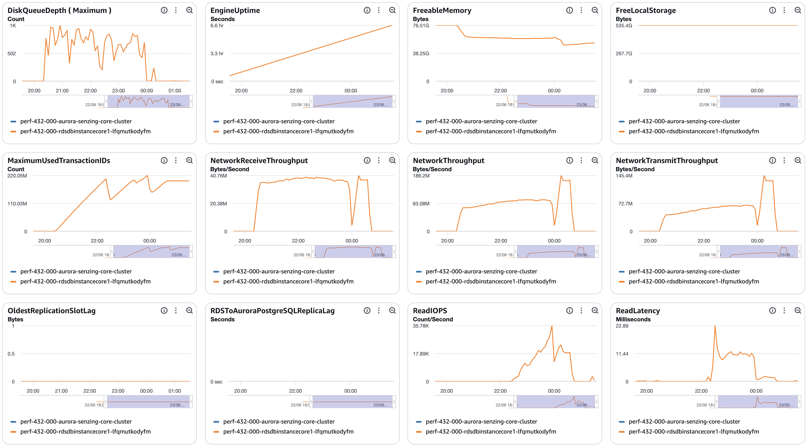
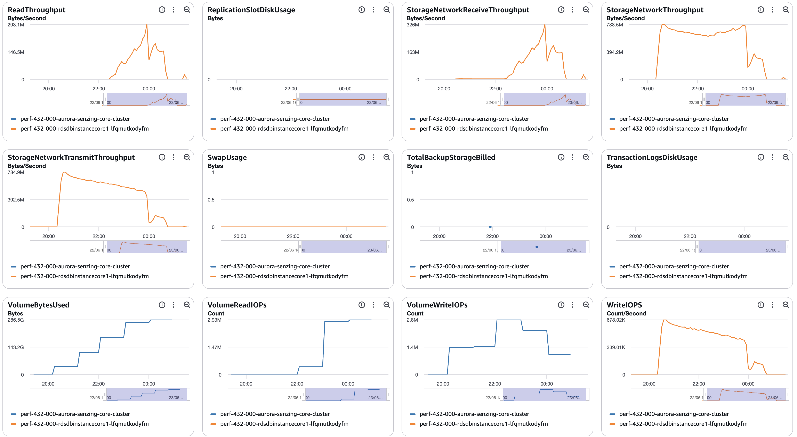
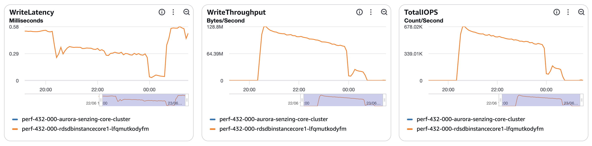

# senzing-test-results-20260622-25M-provisioned-r6i-8xlarge-single-senzing-4.3.2

## Contents

1. [Overview](#overview)
1. [Caveats](#caveats)
1. [Results](#results)
    1. [Observations](#observations)
    1. [Final metrics](#final-metrics)
        1. [SQS](#sqs)
        1. [EFS](#efs)
        1. [ECS](#ecs)
        1. [RDS](#rds)
        1. [Logs](#logs)

## Overview

1. Performed: Jun 22, 2026
2. Senzing version: 4.3.2.26162
3. Instructions:
   [aws-cloudformation-performance-testing](https://github.com/senzing-garage/aws-cloudformation-performance-testing)
    1. [cloudformationAuroraProvisionedSingleDB.yaml](./cloudformationAuroraProvisionedSingleDB.yaml)
4. Changes:
    1. Pre-load input queue by setting loader DesiredCount and MinCapacity to 0
    1. Postgres 17.5
    1. Using X86_64 (AMD64) as `CpuArchitecture` for consumer, redoer, and sshd
    1. enabled `ENTITY_LOCK_MODE: ADVISORY` (`"ER": {"ENTITY_LOCK_MODE": "ADVISORY"}`)
    1. no Aurora read-offload (single `CONNECTION`, no `READ_ONLY_CONNECTION`)

## System

1. Database
    1. Aurora PosgreSQL Provisioned
    1. Single database
    1. Class: db.r6i.8xlarge
    1. IO Opt (StorageType: aurora-iopt1)
    1. sychronous commit, NOT turned off
    1. Auto scaling of loaders turned from 30% to 25% CPU
    1. Updated DB parameter group to enable some tracking:
    ```
    RdsDbParameterGroup:
    Properties:
      Description: !Sub '${AWS::StackName}-rds-db-parameter-group-description'
      Family: aurora-postgresql17
      Parameters:
        shared_preload_libraries: 'pg_stat_statements'
        track_io_timing: 1
        enable_seqscan: 0
        # pglogical.synchronous_commit: 0
    ```

## Results

### Observations

1. Inserts per second (Peak/Average/Time computed from [dsrc_record.csv](data/dsrc_record.csv); verify against the erpm query):
    1. Peak: 2579/second
    1. Average over entire run: 1965/second
    1. Time to load 25M: 3.53 hours
    1. Records in dead-letter queue: 0
    1. Volume read IOPS Writer:        2,141,584
    1. Volume read IOPS Reader:         n/a
    1. Volume write IOPS:            118,455,414
    1. See [dsrc_record.csv](data/dsrc_record.csv)

1. Max tasks:

    - Max Consumer tasks: 61
    - Max Redoer tasks: 61

### Final metrics

#### SQS

##### SQS Metrics input queue



##### SQS Metrics output queue

N/A.  Ran without `withinfo` enabled.


#### ECS

##### Sz SQS Consumer CPU Utilization



##### Sz SQS Consumer Memory Utilization



##### Sz Simple Redoer CPU Utilization



##### Sz Simple Redoer Memory Utilization



#### RDS

##### Database Metrics CORE/LIBFEAT/RES final






##### Database IO / transaction deltas

Captured with the snapshot/diff harness (see
[performance-test runbook](../../docs/performance-test-runbook.md) §4 and
[`scripts/aurora-pg/`](../../scripts/aurora-pg/)).

> **Measurement window:** baseline taken **before** the load (20:25) and final
> **after** it (01:28) — these deltas cover the **entire 25M load**
> (`dsrc_record` insert delta = 25,000,000). `wal_bytes` is blank because Aurora
> doesn't support `pg_stat_wal` (use `VolumeWriteIOPs` for write volume). The
> `snap_*` rows in the per-table deltas are the harness's own snapshot tables —
> negligible. Full output: [final-deltas.txt](data/final-deltas.txt).

```
=================== RUN WINDOW ===================
          baseline_at          |          final_at           |     elapsed
-------------------------------+-----------------------------+-----------------
 2026-06-22 20:25:13.864186+00 | 2026-06-23 01:28:10.5274+00 | 05:02:56.663214

=================== FACT REPORT HEADLINE (eviction-immune) ===================
 logical_block_reads | physical_block_reads | wal_bytes | xact_commit | tup_inserted | tup_updated | tup_deleted
---------------------+----------------------+-----------+-------------+--------------+-------------+-------------
         36862262021 |            128745182 |           |  1517723654 |   1515272443 |   239740659 |    54020450

=================== ALL SCALAR DELTAS ===================
        metric        |     delta
----------------------+----------------
 db.blk_read_time_ms  | 1255815741.403
 db.blks_hit          |    36733516839
 db.blks_read         |      128745182
 db.blk_write_time_ms |    3607352.570
 db.deadlocks         |              2
 db.temp_bytes        |              0
 db.temp_files        |              0
 db.tup_deleted       |       54020450
 db.tup_fetched       |    10185934865
 db.tup_inserted      |     1515272443
 db.tup_returned      |    10598566424
 db.tup_updated       |      239740659
 db.xact_commit       |     1517723654
 db.xact_rollback     |              2

=========== PER-STATEMENT DELTAS (top 25 by exec-time; EVICTION-LOSSY, top-N only) ===========
  calls   |   rows    | total_ms  | blks_read | blks_written | blks_dirtied | wal_bytes |                                      query
----------+-----------+-----------+-----------+--------------+--------------+-----------+----------------------------------------------------------------------------------
 30979979 | 371759633 | 475139630 |   1341102 |      6282599 |            0 |         0 | INSERT INTO RES_FEAT_EKEY(RES_ENT_ID,LIB_FEAT_ID,FTYPE_ID,UTYPE_CODE,SUPPRESSED,
 18882939 | 264361146 | 435884117 |     27680 |      9958669 |            0 |         0 | INSERT INTO LIB_FEAT(LIB_FEAT_ID,FTYPE_ID,FEAT_HASH,FEAT_DESC,FELEM_VALUES,ANONY
 20066693 | 153413361 | 252091536 |   8129127 |            0 |            0 |         0 | SELECT LIB_FEAT_ID,FEAT_DESC,FTYPE_ID,ANONYMIZED,FEAT_HASH,VERSION,FELEM_VALUES
 16406921 |  84142281 | 129815972 |   9683993 |            0 |            0 |         0 | SELECT LIB_FEAT_ID,UTYPE_CODE,RES_ENT_ID,OBS_ENT_CNT FROM RES_FEAT_EKEY WHERE LI
 31291877 |  31291877 | 126571319 |    248408 |       589828 |            0 |         0 | UPDATE OBS_ENT SET LAST_TOUCH_DT=$1,LOCKING_ID=$2 WHERE OBS_ENT_ID IN ($3) AND L
 14291356 | 324650076 | 126186001 |  14370714 |            0 |            0 |         0 | SELECT LIB_FEAT_ID,FEAT_DESC,FTYPE_ID,ANONYMIZED,FEAT_HASH,VERSION,FELEM_VALUES
  5696319 | 248931737 | 123707895 |  17126012 |            0 |            0 |         0 | SELECT LIB_FEAT_ID,FEAT_DESC,FTYPE_ID,ANONYMIZED,FEAT_HASH,VERSION,FELEM_VALUES
 25728090 |  25728090 | 111189796 |    187911 |       585676 |            0 |         0 | UPDATE OBS_ENT SET FEATURES=$1 WHERE OBS_ENT_ID=$2
 43038004 |  43037960 | 106764426 |   6731005 |            0 |            0 |         0 | SELECT         $2 FROM RES_ENT_OKEY B JOIN OBS_ENT C ON C.OBS_ENT_ID=B.OBS_ENT_I
 15713030 |  55640590 | 105778028 |   7344644 |            0 |            0 |         0 | SELECT LIB_FEAT_ID,UTYPE_CODE,RES_ENT_ID,OBS_ENT_CNT FROM RES_FEAT_EKEY WHERE LI
 25000000 |  25000000 |  94817545 |     69965 |      1772104 |            0 |         0 | INSERT INTO DSRC_RECORD(DSRC_ID,RECORD_ID,ENT_SRC_KEY,JSON_DATA,CONFIG_ID,FIRST_
 25000180 |  24999937 |  84625169 |     56351 |       623615 |            0 |         0 | INSERT INTO OBS_ENT(OBS_ENT_ID,DSRC_ID,ENT_SRC_KEY,LAST_TOUCH_DT,LOCKING_ID,LOCK
 21536312 |  21536311 |  64132200 |      9934 |       209065 |            0 |         0 | INSERT INTO RES_ENT(RES_ENT_ID,LAST_TOUCH_DT,LOCKING_ID,ENT_STATE) VALUES ($1,$2
 24999937 |  24999937 |  63809692 |     21445 |       444077 |            0 |         0 | INSERT INTO RES_ENT_OKEY(OBS_ENT_ID,RES_ENT_ID,ERRULE_ID,MATCH_KEY) VALUES ($1,$
 14577959 | 180420902 |  60835921 |   5281694 |            0 |            0 |         0 | SELECT LIB_FEAT_ID,FEAT_DESC,FTYPE_ID,ANONYMIZED,FEAT_HASH,VERSION,FELEM_VALUES
 32380071 |  32380071 |  57818852 |      4988 |        75432 |            0 |         0 | UPDATE RES_ENT SET LAST_TOUCH_DT=$1,LOCKING_ID=$2 WHERE RES_ENT_ID IN ($3) AND L
  1286653 | 105231365 |  48755434 |   9407605 |            0 |            0 |         0 | SELECT LIB_FEAT_ID,FEAT_DESC,FTYPE_ID,ANONYMIZED,FEAT_HASH,VERSION,FELEM_VALUES
  1315960 |  14105118 |  48169558 |    795890 |            0 |            0 |         0 | SELECT LIB_FEAT_ID,FEAT_DESC,FTYPE_ID,ANONYMIZED,FEAT_HASH,VERSION,FELEM_VALUES
  1861734 |  46543249 |  42604121 |      8600 |       425233 |            0 |         0 | INSERT INTO RES_FEAT_STAT(LIB_FEAT_ID,FTYPE_ID,NUM_RES_ENT,NUM_RES_ENT_OOM) VALU
  1891938 |  24595194 |  40757989 |      3119 |       903607 |            0 |         0 | INSERT INTO LIB_FEAT(LIB_FEAT_ID,FTYPE_ID,FEAT_HASH,FEAT_DESC,FELEM_VALUES,ANONY
  2070922 |  35205626 |  37323595 |      8495 |       365345 |            0 |         0 | INSERT INTO RES_FEAT_STAT(LIB_FEAT_ID,FTYPE_ID,NUM_RES_ENT,NUM_RES_ENT_OOM) VALU
  2060476 |  32967581 |  36255680 |      8323 |       344562 |            0 |         0 | INSERT INTO RES_FEAT_STAT(LIB_FEAT_ID,FTYPE_ID,NUM_RES_ENT,NUM_RES_ENT_OOM) VALU
  1765494 |  21185928 |  35551275 |      2729 |       809054 |            0 |         0 | INSERT INTO LIB_FEAT(LIB_FEAT_ID,FTYPE_ID,FEAT_HASH,FEAT_DESC,FELEM_VALUES,ANONY
  3605819 |  15330307 |  35454079 |    967951 |            0 |            0 |         0 | SELECT LIB_FEAT_ID,FEAT_DESC,FTYPE_ID,ANONYMIZED,FEAT_HASH,VERSION,FELEM_VALUES
  2090899 |  31363453 |  35266792 |      8751 |       341907 |            0 |         0 | INSERT INTO RES_FEAT_STAT(LIB_FEAT_ID,FTYPE_ID,NUM_RES_ENT,NUM_RES_ENT_OOM) VALU

=================== PER-TABLE DELTAS (tables touched by the run) ===================
    relname     |    ins    |   upd    |   del    | hot_upd  | seq_scan |  idx_scan  | heap_read |  heap_hit  | idx_read
----------------+-----------+----------+----------+----------+----------+------------+-----------+------------+----------
 res_feat_ekey  | 515451829 | 32075948 | 10960135 |  8699538 |        0 |  837261885 |  14926279 | 1756686443 | 18284189
 res_feat_stat  | 413444947 | 63180954 |        2 | 46473341 |        0 | 1127471250 |   3262024 | 1890494935 |  2020299
 lib_feat       | 413444970 |      575 |        6 |      446 |     2624 | 1500253222 |  52959071 | 1409741456 |  9929849
 obs_ent        |  24999937 | 63311960 |        0 | 52261451 |        0 |  268280911 |   6629565 |  580097620 |   503573
 res_ent        |  21536311 | 57756888 |   427526 | 55486276 |        0 |  256942958 |     21439 |  418590193 |        9
 res_rel_ekey   |  46707513 |        0 | 24199831 |        0 |        0 |  127918037 |    362792 |  245414731 |    33919
 res_relate     |  23353754 | 13286725 | 12099910 |  6158857 |        0 |   67929798 |  11294232 |  268274892 |    86002
 dsrc_record    |  25000000 |  6291928 |        0 |  3403732 |        0 |  121105435 |   6727905 |  262845883 |    95264
 res_ent_okey   |  24999937 |  3821165 |        0 |  2486359 |        0 |  256367002 |     38911 |  437270103 |   506868
 sys_eval_queue |   6327769 |        0 |  6327769 |        0 |        0 |   26794793 |   1053053 |  170818376 |     8585
 sys_sequence   |         0 |     5140 |        0 |     5140 |        0 |      10718 |        22 |      22106 |        9
 snap_statement |        53 |        0 |        0 |        0 |        0 |          0 |         0 |         64 |        0
 sys_codes_used |        22 |        0 |        0 |        0 |        0 |      54654 |         1 |      54590 |        3
 snap_table     |        19 |        0 |        0 |        0 |        0 |          0 |         0 |         23 |        0
 snap_scalar    |        14 |        0 |        0 |        0 |        1 |          0 |         0 |         19 |        0
```

1. [pg_stat_io.csv](data/pg_stat_io.csv)
1. [pg_stat_statements.csv](data/pg_stat_statements.csv)

##### DSRC_RECORD

1. [dsrc_record.csv](data/dsrc_record.csv)

##### Match keys

1. [match_key_ent.csv](data/match_key_ent.csv)
1. [match_key_rel.csv](data/match_key_rel.csv)

#### Logs

```
              at               | dsrc_record | obs_ent  | res_ent  | res_ent_okey | sys_eval_queue | res_ent_active | res_relate
-------------------------------+-------------+----------+----------+--------------+----------------+----------------+------------
 2026-06-23 01:28:24.214492+00 |    25000000 | 24999937 | 21108785 |     24999937 |              0 |            105 |   11253844
(1 row)

Time: 44179.980 ms (00:44.180)
       load_start        |  duration   |  total   |          erpm           |       avg_erps
-------------------------+-------------+----------+-------------------------+-----------------------
 2026-06-22 20:26:10.692 | 03:32:00.26 | 25000000 | 117922.1179441300728315 | 1965.3686324021678805
(1 row)

```

#### Errors

```
==============================================
Term                       |  instance count |
==============================================
(SENZ0086)                 |       0       |
(error|except)             |       8       |
(UNHANDLED DATABASE ERROR) |       0       |
(CORRUPTION_FOUND)         |       2       |
(RetryTimeout)             |       0       |
(FAILED)                   |       0       |
(INFINITE)                 |       0       |
(MISSING_RES_ENT_AND_OKEY) |       0       |
(still)                    |       0       |
(stolen)                   |       0       |
(cancel)                   |       0       |
(another command is already in progress) | 0 |
==============================================


2 errors (other errors are expected):

2026-06-22 23:38:45.118 [szstatic:c07227ab9ef2dcb5] ERR: PQresultStatus returned [(7:0:ERROR:  deadlock detected; DETAIL:  Process 5251 waits for ShareLock on transaction 323983747; blocked by process 6836.; Process 6836 waits for ShareLock on transaction 323984466; blocked by process 5251.; HINT:  See server log for query details.; CONTEXT:  while updating tuple (2757744,111) in relation "res_feat_ekey"; ;Process 5251 waits for ShareLock on transaction 323983747; blocked by process 6836.; Process 6836 waits for ShareLock on transaction 323984466; blocked by process 5251.40P01)] executing: UPDATE RES_FEAT_EKEY AS T SET SUPPRESSED=C.SUPPRESSED,USED_FROM_DT=C.USED_FROM_DT,USED_THRU_DT=C.USED_THRU_DT,OBS_ENT_CNT=C.OBS_ENT_CNT FROM (VALUES (CAST ($1 AS BIGINT),CAST ($2 AS BIGINT),$3,$4,CAST ($5 AS TIMESTAMP),CAST ($6 AS TIMESTAMP),CAST ($7 AS BIGINT)),(CAST ($8 AS BIGINT),CAST ($9 AS BIGINT),$10,$11,CAST ($12 AS TIMESTAMP),CAST ($13 AS TIMESTAMP),CAST ($14 AS BIGINT)),(CAST ($15 AS BIGINT),CAST ($16 AS BIGINT),$17,$18,CAST ($19 AS TIMESTAMP),CAST ($20 AS TIMESTAMP),CAST ($21 AS BIGINT)),(CAST ($22 AS BIGINT),CAST ($23 AS BIGINT),$24,$25,CAST ($26 AS TIMESTAMP),CAST ($27 AS TIMESTAMP),CAST ($28 AS BIGINT)),(CAST ($29 AS BIGINT),CAST ($30 AS BIGINT),$31,$32,CAST ($33 AS TIMESTAMP),CAST ($34 AS TIMESTAMP),CAST ($35 AS BIGINT)),(CAST ($36 AS BIGINT),CAST ($37 AS BIGINT),$38,$39,CAST ($40 AS TIMESTAMP),CAST ($41 AS TIMESTAMP),CAST ($42 AS BIGINT)),(CAST ($43 AS BIGINT),CAST ($44 AS BIGINT),$45,$46,CAST ($47 AS TIMESTAMP),CAST ($48 AS TIMESTAMP),CAST ($49 AS BIGINT))) AS C(RES_ENT_ID,LIB_FEAT_ID,UTYPE_CODE,SUPPRESSED,USED_FROM_DT,USED_THRU_DT,OBS_ENT_CNT) WHERE C.RES_ENT_ID=T.RES_ENT_ID AND C.LIB_FEAT_ID=T.LIB_FEAT_ID AND C.UTYPE_CODE=T.UTYPE_CODE
```

## Methods

Full step-by-step process — connect, watch progress, capture IO/transaction
metrics, validate, export CSVs, and scan logs — is in the
[performance-test runbook](../../docs/performance-test-runbook.md). Reusable SQL
helpers live in [`scripts/aurora-pg/`](../../scripts/aurora-pg/):

- `progress.sql` — row counts + throughput (erpm) during the load
- `00-setup.sql` / `10-baseline.sql` / `20-final.sql` — IO/transaction delta capture
- `validate.sql` — post-load integrity checks (expect zero rows)
- `exports.sql` — writes `dsrc_record.csv`, `match_key_*.csv`, `pg_stat_*.csv` to `/tmp`
