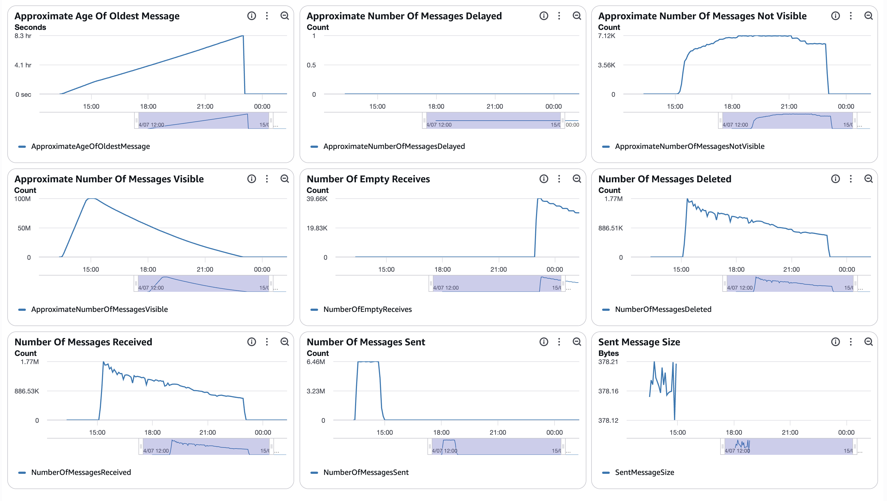
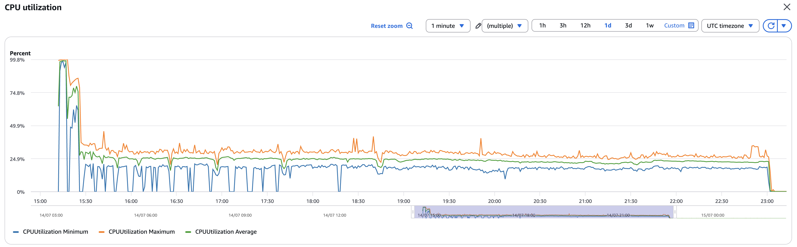
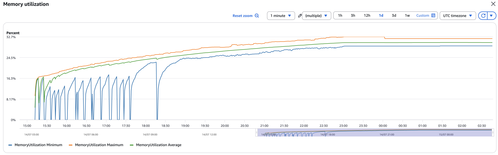
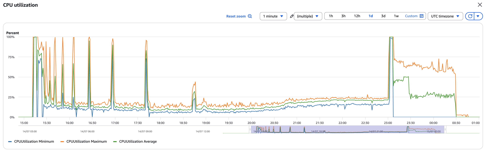
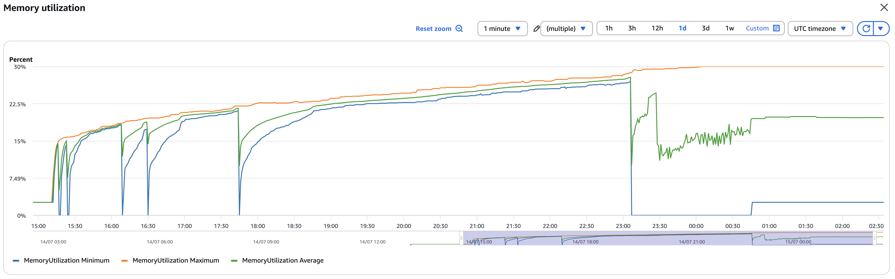
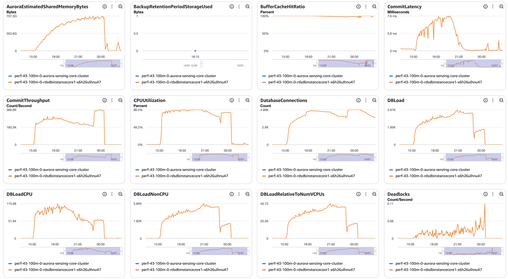
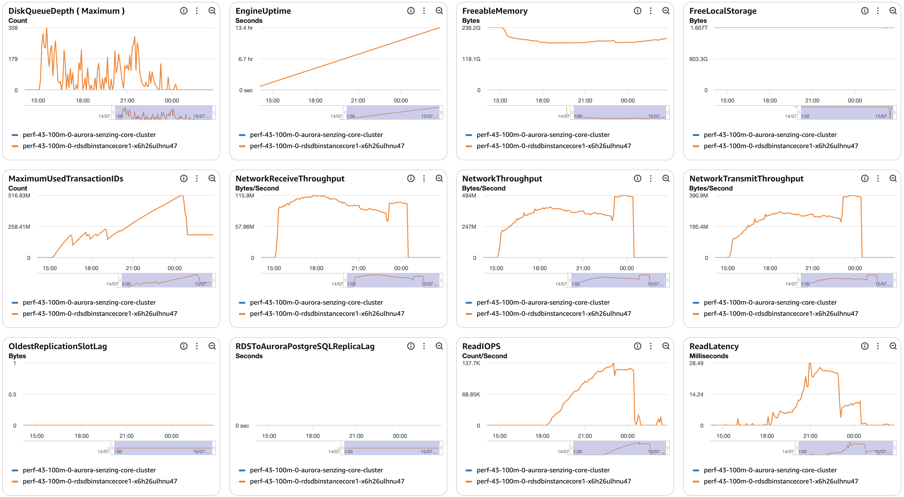
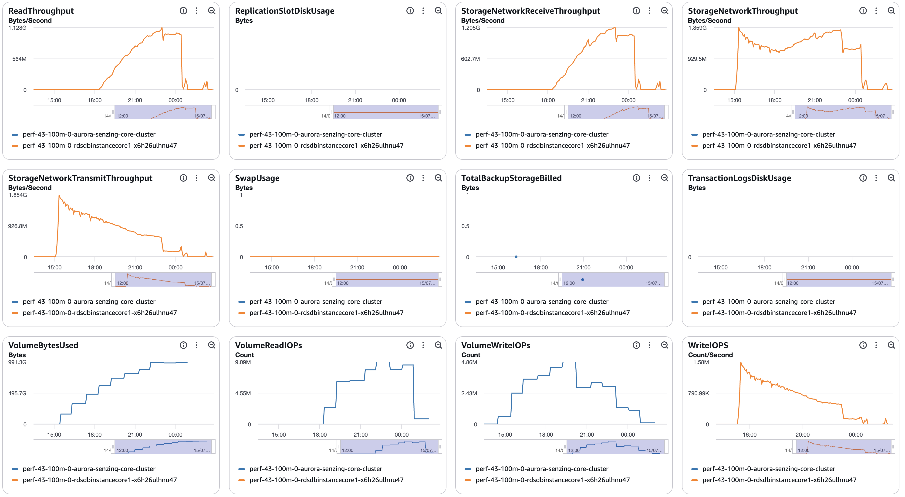
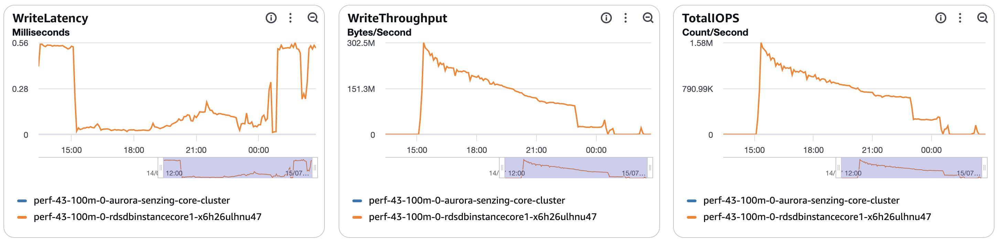

# senzing-test-results-20260714-100M-provisioned-r6i-24xlarge-single-senzing-4.4.0

## Contents

1. [Overview](#overview)
1. [Caveats](#caveats)
1. [Results](#results)
    1. [Observations](#observations)
    1. [Final metrics](#final-metrics)
        1. [SQS](#sqs)
        1. [EFS](#efs)
        1. [ECS](#ecs)
        1. [RDS](#rds)
        1. [Logs](#logs)

## Overview

1. Performed: Jul 14, 2026
2. Senzing version: 4.4.0.26167 (build 2026_06_16; from `:staging`)
   > ⚠️ **CONFIG-FLAWED (connection exhaustion) — EXCLUDED from the headline 4.3-vs-4.4 A/B.**
   > Kept as a failure-mode reference. The clean 4.4 arm is the re-run in
   > `20260716-100M-provisioned-r6i-24xlarge-single-senzing-4.4.0/`.
3. Instructions:
   [aws-cloudformation-performance-testing](https://github.com/senzing-garage/aws-cloudformation-performance-testing)
    1. [cloudformationAuroraProvisionedSingleDB.yaml](./cloudformationAuroraProvisionedSingleDB.yaml)
4. Changes:
    1. Pre-load input queue by setting loader DesiredCount and MinCapacity to 0
    1. Postgres 17.5
    1. Using X86_64 (AMD64) as `CpuArchitecture` for consumer, redoer, and sshd
    1. `RecordMax` = 100M
    1. DB instance class bumped to `db.r6i.24xlarge` (template edit — not a CFT parameter)
    1. enabled `ENTITY_LOCK_MODE: ADVISORY` (`"ER": {"ENTITY_LOCK_MODE": "ADVISORY"}`)
    1. no Aurora read-offload (single `CONNECTION`, no `READ_ONLY_CONNECTION`)

## System

1. Database
    1. Aurora PosgreSQL Provisioned
    1. Single database
    1. Class: db.r6i.24xlarge
    1. IO Opt (StorageType: aurora-iopt1)
    1. sychronous commit, NOT turned off
    1. Auto scaling of loaders turned from 30% to 25% CPU
    1. Updated DB parameter group to enable some tracking:
    ```
    RdsDbParameterGroup:
    Properties:
      Description: !Sub '${AWS::StackName}-rds-db-parameter-group-description'
      Family: aurora-postgresql17
      Parameters:
        shared_preload_libraries: 'pg_stat_statements'
        track_io_timing: 1
        enable_seqscan: 0
        # pglogical.synchronous_commit: 0
    ```

## Results

### Observations

1. Inserts per second (Peak/Average/Time computed from [dsrc_record.csv](data/dsrc_record.csv); verify against the erpm query):
    1. Peak: 6111/second (366,687 in the 2026-07-14 15:22 minute; from dsrc_record.csv)
    1. Average over entire run: 3528/second (erpm 211,680; from final-capture.txt)
    1. Time to load 100M: 7.87 hours (07:52:24; 2026-07-14 15:12:13 → 23:04:37)
    1. Records in dead-letter queue: 0
    1. Volume read IOPS Writer:       33,226,016
    1. Volume read IOPS Reader:      n/a
    1. Volume write IOPS:            421,607,292
    1. See [dsrc_record.csv](data/dsrc_record.csv)

1. Max tasks:

    - Max Consumer tasks: 177
    - Max Redoer tasks: 150

1. ⚠️ Anomaly — **anti-wraparound autovacuum storm during the run.** By ~84% loaded
   (≈6 hrs in) all autovacuum workers were busy, several `VACUUM ... (to prevent
   wraparound)` on the big feature tables (`res_feat_ekey`, `lib_feat`,
   `dsrc_record`). Expected for a 100M load (heavy XID burn crosses
   `autovacuum_freeze_max_age`); not a wraparound emergency, but it competed with
   the loaders for I/O (throughput tapered from ~4,900/s early to ~3,900/s avg) and
   its vacuum I/O is **included in the `20-final.sql` deltas** below. Baseline was
   taken mid-load at **~18%** (≈18.0M of 100M; `dsrc_record` ins delta = 82,013,540),
   so the deltas cover the back **~82%** of the run, not the whole thing.

1. ⚠️ Anomaly — **26 records observed but never resolved.** `validate.sql` query 1
   returned **26 rows** (expected 0): 26 `DSRC_RECORD`s reached `OBS_ENT` but have
   no `RES_ENT_OKEY`. The eval queue drained to empty with 0 active backends, so
   these are **final state** (won't self-heal) — `RES_ENT_OKEY` ends up 26 short of
   the 100M `OBS_ENT`. Query 2 (dangling keys) was clean (0 rows). Confirmed by the
   final counts: `res_ent_okey` = 99,998,901 = `obs_ent` (99,998,927) − 26.
   ⚠️ **CORRECTION (per the 20260715 re-run): these were NOT caused by connection
   exhaustion.** The clean re-run — `max_connections: 10000`, refusal churn gone
   (rollbacks 99,183→698, `res_ent_active` 28,550→457) — **still left 40 records
   unresolved.** So the unresolved-records anomaly is a **separate 4.4 and/or
   advisory-lock behavior, independent of connections** (the 4.3.3 run is the decisive
   test). Connection exhaustion WAS real on *this* run and it inflated `res_ent_active`
   to 28,550 and drove ~25–30k rollbacks — but it did **not** cause the 26 unresolved.
   The 26 slipped through **silently** (`MISSING_RES_ENT_AND_OKEY` logged 0); log scan
   otherwise clean (0 `CORRUPTION_FOUND`, 0 advisory-lock deadlocks, 0 `FAILED`; 688
   row-lock deadlocks, 2 `RetryTimeout`). **This run is config-flawed (connection
   exhaustion) — EXCLUDED from the headline A/B; the clean 4.4 arm is the 20260715
   re-run.** Affected `record_id`/`obs_ent_id` in [Logs](#logs).

1. 🚨 Anomaly (ROOT CAUSE) — **DB connection-pool exhaustion.** ~153,930 error-log
   lines (the bulk of the "150k errors") are all one thing: `FATAL: remaining
   connection slots are reserved for roles with the SUPERUSER attribute` (≈25–30k
   refused connections). `max_connections` is **unset → Aurora default ~5,000** on
   the 24xlarge, but Redoer + Consumer each autoscale to `MaxCapacity: 200` tasks ×
   `SENZING_THREADS_PER_PROCESS: 20` connections. **Actual peak fleet = 177 consumer
   + 150 redoer = 327 tasks × 20 = 6,540 connections**, well over the ~5,000 limit.
   The DB refused the overflow (`senzing` is `rds_superuser`, not a true superuser,
   so it gets no reserved slot). **Fix:**
   set `max_connections` = **10,000** in the **DB (instance)** param group (8,000 was
   too tight — == worst-case demand; `superuser_reserved_connections` is not settable
   on Aurora). The 20260715 re-run used 10,000 and confirmed the fix (rollbacks
   99,183→698, res_ent_active 28,550→457, peak ~6,440 conns < 10k). Harness config
   bug, latent at 25M/8xlarge, that bit at 100M/24xlarge.

### Final metrics

#### SQS

##### SQS Metrics input queue



##### SQS Metrics output queue

N/A.  Ran without `withinfo` enabled.

#### ECS

##### Sz SQS Consumer CPU Utilization



##### Sz SQS Consumer Memory Utilization



##### Sz Simple Redoer CPU Utilization



##### Sz Simple Redoer Memory Utilization



#### RDS

##### Database Metrics CORE/LIBFEAT/RES final






##### Database IO / transaction deltas

Captured with the snapshot/diff harness (see
[performance-test runbook](../../docs/performance-test-runbook.md) §4 and
[`scripts/aurora-pg/`](../../scripts/aurora-pg/)). Full output:
[final-deltas.txt](data/final-deltas.txt).

> **Window = back ~82% of the load** (baseline taken mid-load at ~18%). Cache hit
> ~99% (`blks_hit` 191.1B vs `blks_read` 1.99B). **665 deadlocks / 99,183
> rollbacks** — regular row-lock contention (0 advisory-lock deadlocks) plus the
> connection-refusal churn. Includes the anti-wraparound autovacuum I/O.
> `wal_bytes` blank on Aurora → use CloudWatch **`WriteIOPS` (Sum)** for write volume.

```
=================== RUN WINDOW (baseline mid-load ~18%; covers back ~82%) ===================
          baseline_at          |           final_at            |     elapsed
-------------------------------+-------------------------------+-----------------
 2026-07-14 16:13:09.965206+00 | 2026-07-15 02:06:34.276458+00 | 09:53:24.311252

=================== FACT REPORT HEADLINE (eviction-immune) ===================
 logical_block_reads | physical_block_reads | wal_bytes | xact_commit | tup_inserted | tup_updated | tup_deleted
---------------------+----------------------+-----------+-------------+--------------+-------------+-------------
        193066988625 |           1985716264 |           |  7775776576 |   4126178051 |   990066333 |   241361832

=================== ALL SCALAR DELTAS ===================
        metric        |      delta
----------------------+-----------------
 db.blk_read_time_ms  | 36882434200.072
 db.blks_hit          |    191081272361
 db.blks_read         |      1985716264
 db.blk_write_time_ms |    11243981.707
 db.deadlocks         |             665
 db.temp_bytes        |         3514856
 db.temp_files        |               1
 db.tup_deleted       |       241361832
 db.tup_fetched       |    100221170613
 db.tup_inserted      |      4126178051
 db.tup_returned      |    105752504293
 db.tup_updated       |       990066333
 db.xact_commit       |      7775776576
 db.xact_rollback     |           99183

=========== PER-STATEMENT DELTAS (top 25 by exec-time; EVICTION-LOSSY, top-N only) ===========
   calls   |    rows    |  total_ms  | blks_read | blks_written | blks_dirtied | wal_bytes | query
-----------+------------+------------+-----------+--------------+--------------+-----------+---------------------------------------
  44749654 | 4017361339 | 8170341149 | 435616883 |            0 |            0 |         0 | SELECT LIB_FEAT_ID,FEAT_DESC,FTYPE_ID,ANONYMIZED,...
  65700255 |  841046157 | 5438518666 | 196161455 |            0 |            0 |         0 | SELECT LIB_FEAT_ID,FEAT_DESC,FTYPE_ID,ANONYMIZED,...
  42745189 | 1988824705 | 3694771012 | 182545469 |            0 |            0 |         0 | SELECT LIB_FEAT_ID,FEAT_DESC,FTYPE_ID,ANONYMIZED,...
  85097898 | 1017306285 | 2743438147 |  15096400 |     16446821 |            0 |         0 | INSERT INTO RES_FEAT_EKEY(...)
  37856029 |  529984406 | 2371312911 |    527277 |     18476042 |            0 |         0 | INSERT INTO LIB_FEAT(...)
 309668678 |  309615159 | 2126971478 | 102004697 |            0 |            0 |         0 | SELECT $2 FROM RES_ENT_OKEY B JOIN OBS_ENT C ...
  72442448 | 1638668123 | 2055885732 | 109690235 |            0 |            0 |         0 | SELECT LIB_FEAT_ID,FEAT_DESC,FTYPE_ID,ANONYMIZED,...
  57693204 |  559880819 | 1724358214 |  81444845 |            0 |            0 |         0 | SELECT LIB_FEAT_ID,UTYPE_CODE,RES_ENT_ID,... FROM RES_FEAT_EKEY
  59976584 |  406755453 | 1640227682 |  73655219 |            0 |            0 |         0 | SELECT LIB_FEAT_ID,UTYPE_CODE,RES_ENT_ID,... FROM RES_FEAT_EKEY
  86568177 |   86568177 | 1386151880 |   2522298 |      3857902 |            0 |         0 | UPDATE OBS_ENT SET FEATURES=$1 WHERE OBS_ENT_ID=$2
  26347305 |  394176803 | 1366333791 |  73314538 |            0 |            0 |         0 | SELECT LIB_FEAT_ID,UTYPE_CODE,RES_ENT_ID,... FROM RES_FEAT_EKEY
  82010957 |   82010957 |  970609117 |   6132286 |      5761626 |            0 |         0 | INSERT INTO DSRC_RECORD(...)
  33332655 |   62814221 |  942704748 |  54562346 |            0 |            0 |         0 | SELECT C.DSRC_ID,D.RECORD_ID FROM RES_ENT_OKEY B JOIN OBS_ENT C ...
  82013425 |   82010176 |  912276634 |    728300 |      1647102 |            0 |         0 | INSERT INTO OBS_ENT(...)
  82162957 | 1007199645 |  884997403 |  46625523 |            0 |            0 |         0 | SELECT LIB_FEAT_ID,FEAT_DESC,FTYPE_ID,ANONYMIZED,...
  11974371 |   78729124 |  646592457 |  22822776 |            0 |            0 |         0 | SELECT LIB_FEAT_ID,FEAT_DESC,FTYPE_ID,ANONYMIZED,...
   4291859 |   83227399 |  585581657 |  20987997 |            0 |            0 |         0 | SELECT LIB_FEAT_ID,FEAT_DESC,FTYPE_ID,ANONYMIZED,...
  20871185 | 8620484408 |  585315571 |  34578561 |            0 |            0 |         0 | SELECT RES_ENT_ID,LIB_FEAT_ID,... FROM RES_FEAT_EKEY
   4319066 |   92581178 |  537374437 |  27615782 |            0 |            0 |         0 | SELECT LIB_FEAT_ID,UTYPE_CODE,RES_ENT_ID,... FROM RES_FEAT_EKEY
 114551913 |   32541739 |  491826713 |  22882059 |            0 |            0 |         0 | SELECT OBS_ENT_ID FROM OBS_ENT WHERE ENT_SRC_KEY=$1 AND DSRC_ID=$2
   8266707 | 6473901278 |  488573516 |  27744745 |            0 |            0 |         0 | SELECT RES_ENT_ID,LIB_FEAT_ID,... FROM RES_FEAT_EKEY
  37125302 |  125839314 |  383107684 |  19564258 |            0 |            0 |         0 | SELECT RES_REL_ID,MIN_RES_ENT_ID,MAX_RES_ENT_ID,...
   6343487 |   82465331 |  373511998 |     95956 |      2964999 |            0 |         0 | INSERT INTO LIB_FEAT(...)
   6452350 |   77428200 |  363598127 |     93131 |      2835757 |            0 |         0 | INSERT INTO LIB_FEAT(...)
 201975291 | 9064879166 |  353325171 |  10283345 |            0 |            0 |         0 | SELECT LIB_FEAT_ID,NUM_RES_ENT,NUM_RES_ENT_OOM,...

=================== PER-TABLE DELTAS (tables touched by the run) ===================
    relname     |    ins     |    upd    |   del    |  hot_upd  | seq_scan |  idx_scan  | heap_read |  heap_hit   | idx_read
----------------+------------+-----------+----------+-----------+----------+------------+-----------+-------------+-----------
 res_feat_ekey  | 1475911035 | 350675084 | 87726264 | 202279250 |        0 | 4136859478 | 227087191 |  8595614454 | 245731681
 res_feat_stat  | 1067531849 | 273500819 |        7 | 195594739 |        0 | 9425607448 |  19464846 | 13700171063 |  11487307
 lib_feat       | 1067524562 |      2358 |       63 |      1756 |    35209 | 7625545313 | 788794259 |  6911888027 | 260661195
 obs_ent        |   82012717 | 123269796 |        0 |  88821269 |        0 | 1301426770 | 110309081 |  3252576374 |  25859942
 res_rel_ekey   |  122485185 |         0 | 74375332 |         0 |        0 |  532104512 |   4484472 |  1143583412 |   4204606
 res_relate     |   61242577 |  78435813 | 37188008 |  49726519 |        0 |  470833036 | 126116383 |  1202773534 |   1483399
 res_ent        |   49560360 |  95377616 |  4294002 |  85025880 |        2 | 1702535616 |    136376 |  1884417083 |      2281
 res_ent_okey   |   86413487 |  36239467 |  4398752 |  30675102 |        0 | 1663011705 |    391703 |  4399796550 |   6719023
 dsrc_record    |   82013540 |  32540895 |        0 |  17800575 |        2 |  783422487 | 103870356 |  2651916324 |  16368961
 sys_eval_queue |   31471288 |         0 | 33377505 |         0 |        0 |  156248999 |  25314636 |  1027251266 |   7217810
 sys_sequence   |          0 |     19515 |        0 |     19479 |        0 |      45720 |       136 |      181347 |        15
```

1. [pg_stat_io.csv](data/pg_stat_io.csv)
1. [pg_stat_statements.csv](data/pg_stat_statements.csv)

##### DSRC_RECORD

1. [dsrc_record.csv](data/dsrc_record.csv)

##### Match keys

1. [match_key_ent.csv](data/match_key_ent.csv)
1. [match_key_rel.csv](data/match_key_rel.csv)

#### Logs

Final counts + throughput (from [final-capture.txt](data/final-capture.txt)):

```
 relname        |  exact_rows  | note
----------------+--------------+-------------------------------------------
 dsrc_record    | 100,000,000  | = target
 obs_ent        |  99,998,927  |
 res_ent_okey   |  99,998,901  | obs_ent − 26  (the 26 unresolved records)
 res_ent        |  61,123,342  | resolved entities
 res_relate     |  33,838,539  | relationships
 sys_eval_queue |           0  | drained
 res_ent_active |      28,550  | ent_state≠0  (vs 162 in the clean 4.1 100M run)

 load 2026-07-14 15:12:13 → 23:04:37  |  07:52:24  |  erpm 211,680  |  avg 3,528/s
```

`validate.sql` — query 2 (dangling keys) clean; **query 1 returned 26 rows**
(`DSRC_RECORD` → `OBS_ENT` present, `RES_ENT_OKEY` missing). See the "26 records
observed but never resolved" anomaly in [Observations](#observations).

```
-- validate.sql query 1: DSRC_RECORDs observed but NOT resolved (expected 0)
 record_id | obs_ent_id | res_ent_id
-----------+------------+------------
 447702950 |  103514545 |
 405514220 |   92971504 |
 568258243 |   58668245 |
 568258238 |  103502047 |
 568298870 |   65061268 |
 592722529 |   19261643 |
 598953208 |   76623054 |
 519660895 |   91059471 |
 604388299 |   94682420 |
 568298874 |   66977759 |
 550140195 |   71925836 |
 483578320 |   81697236 |
 520309908 |   64702533 |
 483578323 |   53341312 |
 507695948 |   96321686 |
 526131001 |   29852410 |
 580241863 |   97342582 |
 592444261 |   12902662 |
 514352728 |   55923338 |
 496192339 |   57818822 |
 550151689 |   71132819 |
 496192336 |   83810863 |
 526084375 |   51687860 |
 520130667 |   42845612 |
 429182414 |   81795267 |
 368677108 |   74734747 |
(26 rows)

-- validate.sql query 2: RES_ENT_OKEY with no backing DSRC_RECORD (expected 0)
(0 rows)
```

#### Errors

```
==============================================
Term                       |  instance count |
==============================================
(error|except)             |   ~154,620  *   |
(UNHANDLED DATABASE ERROR) |   ~25-30k   *   |
(connection slots reserved)|   ~25-30k   *   |  <- ROOT CAUSE: max_connections exhausted
(deadlock detected)        |      688        |  regular row-lock (NOT advisory)
(advisory lock)            |        0        |
(CORRUPTION_FOUND)         |        0        |
(FAILED)                   |        0        |
(MISSING_RES_ENT_AND_OKEY) |        0        |  (the 26 unresolved slipped through silently)
(RetryTimeout)             |        2        |
(SENZ0086)                 |   not counted   |
(INFINITE)                 |   not counted   |
(still / stolen / cancel)  |   not counted   |
(another command is already in progress) | not counted |
==============================================

* The (error|except) count is dominated by connection-pool exhaustion —
  "FATAL: remaining connection slots are reserved for roles with the SUPERUSER
  attribute" (~25-30k refused connections × ~6 log lines each = ~153,930 lines).
  NOT 150k distinct failures. See the connection-exhaustion anomaly in Observations.
```

## Methods

Full step-by-step process — connect, watch progress, capture IO/transaction
metrics, validate, export CSVs, and scan logs — is in the
[performance-test runbook](../../docs/performance-test-runbook.md). Reusable SQL
helpers live in [`scripts/aurora-pg/`](../../scripts/aurora-pg/):

- `progress.sql` — row counts + throughput (erpm) during the load
- `00-setup.sql` / `10-baseline.sql` / `20-final.sql` — IO/transaction delta capture
- `validate.sql` — post-load integrity checks (expect zero rows)
- `exports.sql` — writes `dsrc_record.csv`, `match_key_*.csv`, `pg_stat_*.csv` to `/tmp`
