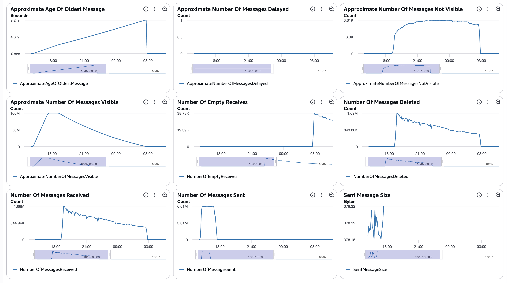
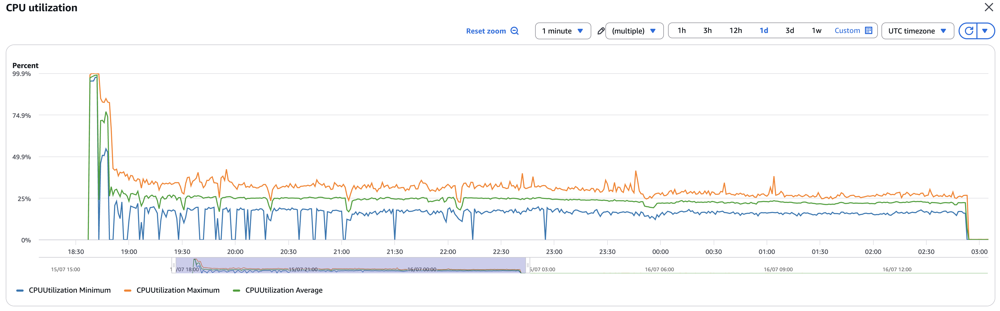
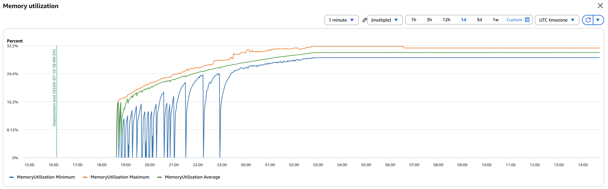
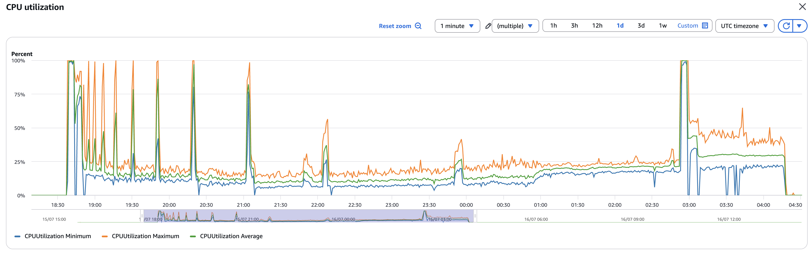
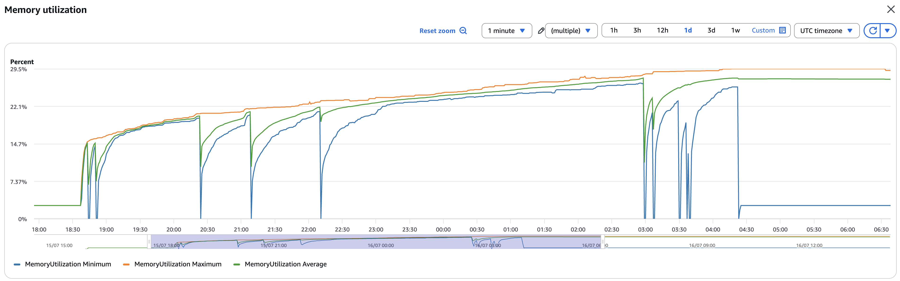
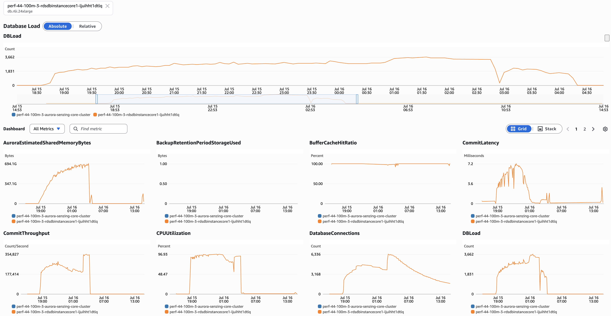
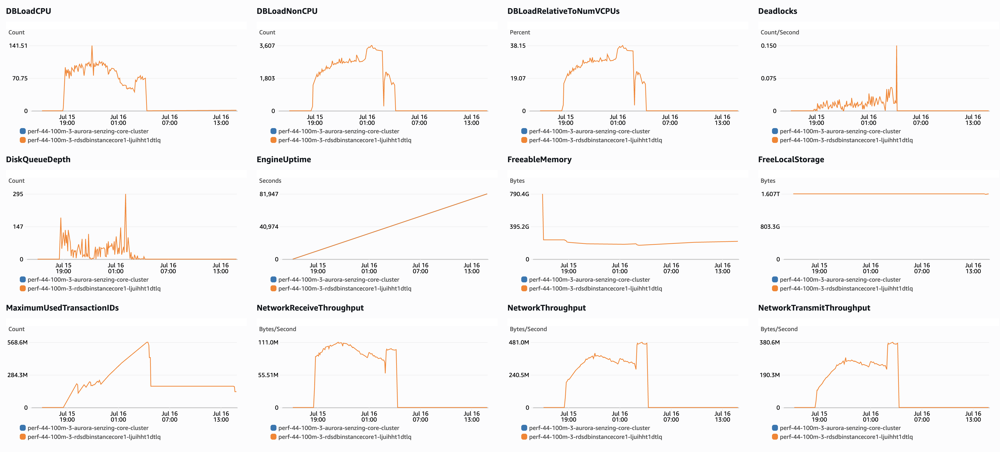
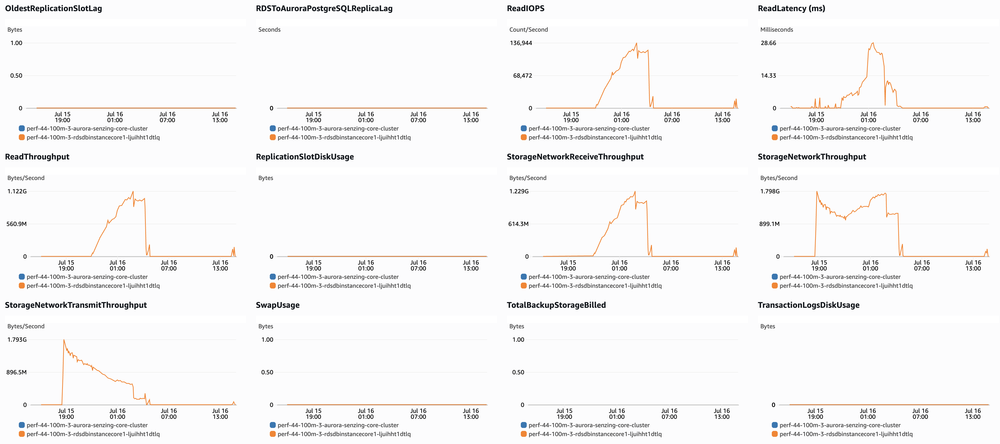
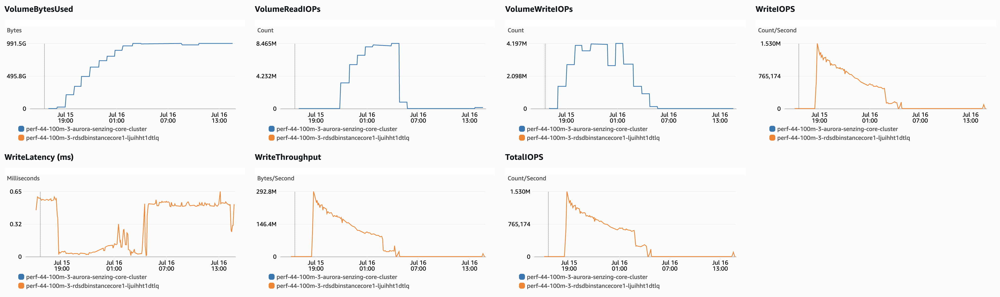

# senzing-test-results-20260715-100M-provisioned-r6i-24xlarge-single-senzing-4.4.0

## Contents

1. [Overview](#overview)
1. [Caveats](#caveats)
1. [Results](#results)
    1. [Observations](#observations)
    1. [Final metrics](#final-metrics)
        1. [SQS](#sqs)
        1. [EFS](#efs)
        1. [ECS](#ecs)
        1. [RDS](#rds)
        1. [Logs](#logs)

## Overview

1. Performed: Jul 15, 2026 (4.4 runs first — the `:4.3.3` image wasn't tagged in ECR; devops pipeline issue)
2. Senzing version: **4.4.0.26167** — RE-RUN of the connection-flawed 20260714 run under corrected config. Pulled via `:staging`; build **confirmed** via `szBuildVersion.json` (BUILD_NUMBER 2026_06_16__17_52). Consumer image digest: `sha256:7c1672a05f5008b13942a25c895ff4694bf77158d42742337fe21b2e1e3bcc90` (redoer digest TBD)
3. Instructions:
   [aws-cloudformation-performance-testing](https://github.com/senzing-garage/aws-cloudformation-performance-testing)
    1. [cloudformationAuroraProvisionedSingleDB.yaml](./cloudformationAuroraProvisionedSingleDB.yaml)
4. Changes:
    1. Pre-load input queue by setting loader DesiredCount and MinCapacity to 0
    1. Postgres 17.5
    1. Using X86_64 (AMD64) as `CpuArchitecture` for consumer, redoer, and sshd
    1. `RecordMax` = 100M
    1. DB instance class bumped to `db.r6i.24xlarge` (template edit — not a CFT parameter)
    1. enabled `ENTITY_LOCK_MODE: ADVISORY` (`"ER": {"ENTITY_LOCK_MODE": "ADVISORY"}`)
    1. no Aurora read-offload (single `CONNECTION`, no `READ_ONLY_CONNECTION`)
    1. RE-RUN of the connection-exhausted 20260714 4.4.0.26167 run, under the corrected DB config
    1. Senzing images from `:staging` — the immutable `:4.4.0.26167` tag was NOT published (same devops pipeline issue that blocked `:4.3.3`). ✅ confirmed `:staging` == build 4.4.0.26167 at launch; consumer image digest recorded in the version line above
    1. `max_connections: 10000` in the DB parameter group (fixes the connection-exhaustion; 8000 was too tight — == worst-case demand, no headroom). NB: `superuser_reserved_connections` is not settable in an Aurora DB param group (CREATE fails) — default reserve is fine given the 10000 ceiling

## System

1. Database
    1. Aurora PosgreSQL Provisioned
    1. Single database
    1. Class: db.r6i.24xlarge
    1. IO Opt (StorageType: aurora-iopt1)
    1. sychronous commit, NOT turned off
    1. Auto scaling of loaders turned from 30% to 25% CPU
    1. Updated DB parameter group to enable some tracking:
    ```
    RdsDbParameterGroup:
    Properties:
      Description: !Sub '${AWS::StackName}-rds-db-parameter-group-description'
      Family: aurora-postgresql17
      Parameters:
        shared_preload_libraries: 'pg_stat_statements'
        track_io_timing: 1
        enable_seqscan: 0
        # pglogical.synchronous_commit: 0
    ```

## Results

### Observations

1. Inserts per second (Peak/Average/Time computed from [dsrc_record.csv](data/dsrc_record.csv); verify against the erpm query):
    1. Peak: 6074/second (364,439 in the 2026-07-15 18:44 minute; from dsrc_record.csv)
    1. Average over entire run: 3365/second (erpm 201,912; from final-capture.txt)
    1. Time to load 100M: 8.25 hours (08:15:15; 2026-07-15 18:37:48 → 02:53:04)
    1. Records in dead-letter queue: 0
    1. Volume read IOPS Writer:       33,226,016
    1. Volume read IOPS Reader:      n/a
    1. Volume write IOPS:            419,688,438
    1. See [dsrc_record.csv](data/dsrc_record.csv)

1. Max tasks:

    - Max Consumer tasks: 165
    - Max Redoer tasks: 157

1. ✅ **Connection fix validated** (`max_connections: 10000`). vs the connection-flawed
   20260714 run: `xact_rollback` **99,183 → 698**, `res_ent_active` (ent_state≠0)
   **28,550 → 457**, peak fleet **322 tasks (~6,440 conns) < 10,000**. The ~25–30k
   `connection slots reserved` refusal churn is gone. Baseline taken **pre-load**
   (18:30, ~7 min before the load) → the deltas below cover the **full 100M run**.

1. ⚠️ **Anomaly PERSISTS — 40 records observed but never resolved.** `res_ent_okey`
   = 99,998,887 = `obs_ent` (99,998,927) **− 40**. The flawed run had 26; the clean
   4.1 100M run had **0**. Since it survived with connections fixed, **this is NOT a
   connection-exhaustion artifact** — it's a separate 4.4 and/or advisory-lock
   behavior. **Decisive test: the 4.3.3 run** — if 4.3.3 also leaves records
   unresolved → advisory/general; if clean → 4.4-specific. `res_ent_active` (457) is
   also above the 4.1 clean baseline (162) — consistent with the resolution-side
   contention in the next bullet.

1. 🚨 **Log scan surfaced advisory-lock contention + resolution instability the
   flawed run's connection FATALs had masked.** With connections fixed, full
   concurrency exposed **617 advisory-lock deadlocks/timeouts** (`canceling statement
   due to lock timeout … SELECT pg_advisory_lock($1)`, `55P03`; = the `db.deadlocks`
   delta — these are **advisory** (`ENTITY_LOCK_MODE=ADVISORY`) locks, **not**
   row-lock), **104 `CORRUPTION_FOUND`** (flawed run: 0; 25M advisory: 1–2), and
   **22 `POTENTIAL INFINITE RESOLUTION LOOP`** (`UNRESOLVE MOVEMENT COUNT OF 20
   EXCEEDED`). `UNHANDLED DATABASE ERROR` = 0; total `error|except` fell 150k→635.
   **ROOT CAUSE (CloudWatch, confirmed):** the unresolved records log
   `OKEY ORPHAN PREVENTED … its add to resEntID=… was dropped (target destroyed) …
   self-heals via redo. See FAQ oent-swap-okey-split-commit-regression` — a **named
   4.4 regression** in the oent-swap / OKEY-split commit path. Under concurrency the
   target entity is destroyed between the OKEY remove and add, the add drops, and the
   redo-based self-heal **fails to converge** (these 40 end with no `RES_ENT_OKEY`,
   `sys_eval_queue` empty). Advisory-lock contention is the *trigger* that makes the
   races frequent, not the defect. 7 of the 40 carry a direct `obsEntID` OKEY-ORPHAN
   line; the rest are entangled as source/target entities or a related path (classify
   via the broad log query). **Escalate the FAQ name to Senzing engineering** (see
   [`senzing-eng-escalation.md`](senzing-eng-escalation.md)). The 4.3.3 run (also
   advisory) tests advisory-mode vs 4.4-version. Detail in [Errors](#errors).

### Final metrics

#### SQS

##### SQS Metrics input queue



##### SQS Metrics output queue

N/A.  Ran without `withinfo` enabled.


#### ECS

##### Sz SQS Consumer CPU Utilization



##### Sz SQS Consumer Memory Utilization



##### Sz Simple Redoer CPU Utilization



##### Sz Simple Redoer Memory Utilization



#### RDS

##### Database Metrics CORE/LIBFEAT/RES final






##### Database IO / transaction deltas

Captured with the snapshot/diff harness (see
[performance-test runbook](../../docs/performance-test-runbook.md) §4 and
[`scripts/aurora-pg/`](../../scripts/aurora-pg/)).

> **Full 100M run** (baseline taken pre-load; `dsrc_record` ins delta = 100,000,000).
> Cache hit ~99.1% (`blks_hit` 214.0B vs `blks_read` 1.96B). **617 deadlocks /
> 698 rollbacks** — vs the flawed run's 665 / **99,183** (the connection-refusal
> churn is gone). `wal_bytes` blank on Aurora → `WriteIOPS` (Sum). Full output:
> [final-deltas.txt](data/final-deltas.txt).

```
=================== RUN WINDOW (baseline pre-load — covers the full 100M) ===================
          baseline_at          |           final_at            |     elapsed
-------------------------------+-------------------------------+-----------------
 2026-07-15 18:30:11.307468+00 | 2026-07-16 14:26:51.392757+00 | 19:56:40.085289

=================== FACT REPORT HEADLINE (eviction-immune) ===================
 logical_block_reads | physical_block_reads | wal_bytes | xact_commit | tup_inserted | tup_updated | tup_deleted
---------------------+----------------------+-----------+-------------+--------------+-------------+-------------
        215974310690 |           1962639079 |           |  8551607255 |   5223383827 |  1081170246 |   256916642

=================== ALL SCALAR DELTAS ===================
        metric        |      delta
----------------------+-----------------
 db.blk_read_time_ms  | 34958229959.148
 db.blks_hit          |    214011671611
 db.blks_read         |      1962639079
 db.blk_write_time_ms |    15658931.444
 db.deadlocks         |             617
 db.temp_bytes        |         7451646
 db.temp_files        |               2
 db.tup_deleted       |       256916642
 db.tup_fetched       |    105274385017
 db.tup_inserted      |      5223383827
 db.tup_returned      |    109849604116
 db.tup_updated       |      1081170246
 db.xact_commit       |      8551607255
 db.xact_rollback     |             698

=========== PER-STATEMENT DELTAS (top 25 by exec-time; EVICTION-LOSSY, top-N only) ===========
   calls   |    rows    |  total_ms  | blks_read | blks_written | wal_bytes | query
-----------+------------+------------+-----------+--------------+-----------+---------------------------------------
  45105293 | 4045141000 | 7740716139 | 427151008 |            0 |         0 | SELECT LIB_FEAT_ID,FEAT_DESC,... (feature lookup)
  80113166 |  940985696 | 5090485959 | 198000691 |            0 |         0 | SELECT LIB_FEAT_ID,FEAT_DESC,...
 107978863 | 1291849846 | 3645890812 |  15212139 |     21358521 |         0 | INSERT INTO RES_FEAT_EKEY(...)
  45072878 | 2089938018 | 3515844433 | 179758310 |            0 |         0 | SELECT LIB_FEAT_ID,FEAT_DESC,...
  52145398 |  730035572 | 3431734640 |    542342 |     26092386 |         0 | INSERT INTO LIB_FEAT(...)
 333222604 |  333169215 | 2042919694 | 103116101 |            0 |         0 | SELECT $2 FROM RES_ENT_OKEY B JOIN OBS_ENT C ...
  78774263 | 1781953679 | 1994719400 | 108113254 |            0 |         0 | SELECT LIB_FEAT_ID,FEAT_DESC,...
  68121907 |  607285249 | 1657502911 |  81442149 |            0 |         0 | SELECT ... FROM RES_FEAT_EKEY WHERE LI...
  70139324 |  435734852 | 1570251386 |  73722125 |            0 |         0 | SELECT ... FROM RES_FEAT_EKEY WHERE LI...
 104683413 |  104683413 | 1473129800 |   2622607 |      4462412 |         0 | UPDATE OBS_ENT SET FEATURES=$1 WHERE OBS_ENT_ID=$2
  27424827 |  404391764 | 1324257839 |  72880150 |            0 |         0 | SELECT ... FROM RES_FEAT_EKEY WHERE LI...
 100000000 |  100000000 | 1120114188 |   5855590 |      7032394 |         0 | INSERT INTO DSRC_RECORD(...)
  99999883 |   99998927 | 1001071027 |    784415 |      2211952 |         0 | INSERT INTO OBS_ENT(...)
  35397179 |   65171699 |  956517761 |  55432830 |            0 |         0 | SELECT C.DSRC_ID,D.RECORD_ID FROM RES_ENT_OKEY B ...
  89570888 | 1098342902 |  854345963 |  45842074 |            0 |         0 | SELECT LIB_FEAT_ID,FEAT_DESC,...
  35743602 |   35412617 |  628538657 |  15852960 |            0 |         0 | DELETE FROM SYS_EVAL_QUEUE WHERE MSG_ID IN (...)
  14600809 |   89072221 |  608976153 |  23026654 |            0 |         0 | SELECT LIB_FEAT_ID,FEAT_DESC,...
  21313193 | 8744455346 |  574615855 |  33472197 |            0 |         0 | SELECT RES_ENT_ID,LIB_FEAT_ID,... FROM RES_FEAT_EKEY
   5231566 |   92212239 |  554927945 |  21192008 |            0 |         0 | SELECT LIB_FEAT_ID,FEAT_DESC,...
   4323093 |   92473193 |  520468016 |  27362461 |            0 |         0 | SELECT ... FROM RES_FEAT_EKEY WHERE LI...
   7654972 |   99514636 |  498609471 |     98773 |      3554094 |         0 | INSERT INTO LIB_FEAT(...)
   8305418 | 6486385028 |  479227633 |  26967349 |            0 |         0 | SELECT RES_ENT_ID,LIB_FEAT_ID,... FROM RES_FEAT_EKEY
   7666752 |   92001024 |  479158380 |     96398 |      3376470 |         0 | INSERT INTO LIB_FEAT(...)
 134618241 |   34619312 |  471551088 |  22741945 |            0 |         0 | SELECT OBS_ENT_ID FROM OBS_ENT WHERE ENT_SRC_KEY=$1 AND DSRC_ID=$2
   7258847 |   79847317 |  433511613 |     89795 |      3028471 |         0 | INSERT INTO LIB_FEAT(...)

=================== PER-TABLE DELTAS (tables touched by the run) ===================
    relname     |    ins     |    upd    |   del    |  hot_upd  | seq_scan |  idx_scan   | heap_read |  heap_hit   | idx_read
----------------+------------+-----------+----------+-----------+----------+-------------+-----------+-------------+-----------
 res_feat_ekey  | 1852417337 | 367296813 | 95003449 | 223513424 |        0 |  4679561050 | 225822593 |  9621601883 | 242137425
 res_feat_stat  | 1373205573 | 315391719 |       12 | 236687625 |        0 | 10078928683 |  18680776 | 14379283326 |  10828677
 lib_feat       | 1373205889 |      3196 |       99 |      2310 |     7287 |  8620527912 | 779815596 |  7927258446 | 260515410
 obs_ent        |   99998927 | 143889286 |        0 | 104326053 |        0 |  1431581737 | 109239813 |  3468792244 |  25609672
 res_rel_ekey   |  145795507 |         0 | 78114260 |         0 |        0 |   591244991 |   3959247 |  1221702983 |   4061200
 res_relate     |   72897751 |  81064916 | 39057495 |  51070114 |        0 |   498352308 | 121607409 |  1271265406 |   1444353
 res_ent        |   65714513 | 101588360 |  4592121 |  96684887 |        0 |  1832294525 |    116927 |  1996312572 |      2567
 res_ent_okey   |  104730016 |  37289904 |  4731117 |  32051386 |        0 |  1799548558 |    361398 |  4606209686 |   6517012
 dsrc_record    |  100000000 |  34618101 |        0 |  18836285 |        0 |   843003171 | 100744055 |  2699267532 |  15624234
 sys_eval_queue |   35412620 |         0 | 35412617 |         0 |        0 |   168464580 |  29070238 |  2134534067 |   6465349
```

1. [pg_stat_io.csv](data/pg_stat_io.csv)
1. [pg_stat_statements.csv](data/pg_stat_statements.csv)

##### DSRC_RECORD

1. [dsrc_record.csv](data/dsrc_record.csv)

##### Match keys

1. [match_key_ent.csv](data/match_key_ent.csv)
1. [match_key_rel.csv](data/match_key_rel.csv)

#### Logs

Final counts + throughput (from [final-capture.txt](data/final-capture.txt)):

```
 relname        |  exact_rows  | note
----------------+--------------+-------------------------------------------
 dsrc_record    | 100,000,000  | = target
 obs_ent        |  99,998,927  |
 res_ent_okey   |  99,998,887  | obs_ent − 40  ⚠️ 40 unresolved (flawed run: −26; clean 4.1: 0)
 res_ent        |  61,122,392  | resolved entities
 res_relate     |  33,840,260  | relationships
 sys_eval_queue |           0  | drained
 res_ent_active |         457  | ent_state≠0  (flawed run: 28,550; clean 4.1: 162)

 load 2026-07-15 18:37:48 → 2026-07-16 02:53:04  |  08:15:15  |  erpm 201,912  |  avg 3,365/s
```

`validate.sql` query 1 (observed-but-unresolved) returned the **40** rows below —
every one has **`res_ent_id` NULL** (reached `OBS_ENT`, never got a `RES_ENT` /
`RES_ENT_OKEY`). Query 2 (dangling keys) expected 0.

```
 record_id | obs_ent_id | res_ent_id
-----------+------------+------------
 568258243 |   60117436 |
 580241863 |   97729754 |
 592487654 |   79747322 |
 520130667 |   38268728 |
 556372645 |   84502166 |
 507650993 |   41076893 |
 490057240 |   51018134 |
 507650994 |   32187715 |
 586948697 |   93316516 |
 568258238 |   92364105 |
 586948703 |   70025591 |
 483578323 |   60448956 |
 550140195 |   72867390 |
 520309908 |   52459400 |
 405514220 |   92988409 |
 544453025 |  100842057 |
 483578320 |  101605291 |
 429182414 |   97821075 |
 586258794 |   92153396 |
 507695948 |  100513093 |
 574650613 |   54434516 |
 568298870 |   62666046 |
 543803520 |   77293682 |
 526131001 |   27162105 |
 507650991 |   66736818 |
 568298874 |   73383261 |
 502137050 |  101346345 |
 495886296 |   92289621 |
 598304638 |   52434440 |
 592509679 |   39636022 |
 368677108 |   68784892 |
 496192339 |   50949050 |
 604308731 |   31780752 |
 496192336 |   83228978 |
 580241867 |  103702154 |
 586948698 |   43966566 |
 459997731 |   39813403 |
 507650995 |   37694182 |
 586258798 |   49601388 |
 586948701 |   24900385 |
(40 rows)
```

See [Errors](#errors) — root cause is the `oent-swap-okey-split-commit-regression`
(OKEY add dropped when the target entity is destroyed mid-swap; redo self-heal did
not converge). Forensics in
[`scripts/aurora-pg/unresolved-forensics.sql`](../../scripts/aurora-pg/unresolved-forensics.sql).

#### Errors

```
==============================================
Term                       |  instance count |
==============================================
(SENZ0086)                 |         0       |
(error|except)             |       635       |
(ExclusiveLock on advisory lock)|  617       |
(UNHANDLED DATABASE ERROR) |         0       |
(CORRUPTION_FOUND)         |       104       |
(RetryTimeout)             |         2       |
(FAILED)                   |         1       |
(INFINITE)                 |        22       |
(MISSING_RES_ENT_AND_OKEY) |         0       |
(still)                    |         0       |
(stolen)                   |         0       |
(cancel)                   |         5       |
(another command is already in progress) | 0 |
==============================================

Representative lines:
  ExclusiveLock on advisory lock (617 of the 635 error|except lines):
    ERR: PQresultStatus [(7:0:ERROR: canceling statement due to lock timeout; ;55P03)]
         executing: SELECT pg_advisory_lock($1)
  INFINITE (22):
    ERR: DETECTED POTENTIAL INFINITE RESOLUTION LOOP: UNRESOLVE MOVEMENT COUNT OF 20 EXCEEDED
```

**Interpretation:**

- ✅ **Connection fix confirmed at the log level.** `UNHANDLED DATABASE ERROR` = 0
  and total `error|except` fell from ~150k (flawed run) to **635**. The
  `connection slots reserved` refusals are gone.
- ⚠️ **617 of the 635 are advisory-lock contention** — `canceling statement due to
  lock timeout … SELECT pg_advisory_lock($1)` (SQLSTATE `55P03`). This equals the
  `db.deadlocks` delta (617), and it is the **`ENTITY_LOCK_MODE=ADVISORY`** lock,
  **not** a row-lock. The connection fix removed the connection ceiling, so full
  concurrency now collides on per-entity advisory locks.
- 🚨 **104 `CORRUPTION_FOUND`** (flawed run: 0; 25M advisory runs: 1–2) **and 22
  `POTENTIAL INFINITE RESOLUTION LOOP`** (`UNRESOLVE MOVEMENT COUNT OF 20 EXCEEDED`).
  These resolution-instability signals were **masked** on the flawed run by the
  connection FATALs; note they do **not** contain the words error/except, so they
  are *additional* to the 635.
- 🔴 **ROOT CAUSE — `oent-swap-okey-split-commit-regression` (named Senzing FAQ).**
  CloudWatch shows the unresolved records log `OKEY ORPHAN PREVENTED: obsEntID=X
  OKEY-remove from live resEntID=Y SUPPRESSED — its add to resEntID=Z was dropped
  (target destroyed) … self-heals via redo`. The OKEY move (remove-from-source +
  add-to-target) is non-atomic; under concurrency the target entity is destroyed
  before the add commits, so the add drops. The mitigation keeps the OKEY on source
  and relies on redo — which did **not** converge here (no `RES_ENT_OKEY`,
  `sys_eval_queue` empty). This is the real defect; the 617 advisory-lock timeouts
  are the concurrency *trigger* and the 22 INFINITE loops are records oscillating in
  the swap/redo cycle. **Coverage: only 10 of 40 appear in the logs** — 7 as the
  direct `obsEntID` OKEY-ORPHAN victim (`27162105`, `39813403`, `79747322`,
  `83228978`, `92153396`, `93316516`, `97821075`), 3 as swap collateral (`24900385`
  source; `49601388`, `70025591` destroyed targets). The other **30 have no log line
  at all** (silent drops), and **0 of the 40** appear in any `CORRUPTION_FOUND` /
  `INFINITE` line. So the regression explains the logged minority; the majority
  dropped silently — likely resolve aborts on advisory-lock timeouts before any OKEY
  swap. **Escalation write-up: [`senzing-eng-escalation.md`](senzing-eng-escalation.md).**
  The 4.3.3 run (also advisory) is the decisive test of advisory-mode-vs-4.4.

## Methods

Full step-by-step process — connect, watch progress, capture IO/transaction
metrics, validate, export CSVs, and scan logs — is in the
[performance-test runbook](../../docs/performance-test-runbook.md). Reusable SQL
helpers live in [`scripts/aurora-pg/`](../../scripts/aurora-pg/):

- `progress.sql` — row counts + throughput (erpm) during the load
- `00-setup.sql` / `10-baseline.sql` / `20-final.sql` — IO/transaction delta capture
- `validate.sql` — post-load integrity checks (expect zero rows)
- `exports.sql` — writes `dsrc_record.csv`, `match_key_*.csv`, `pg_stat_*.csv` to `/tmp`
