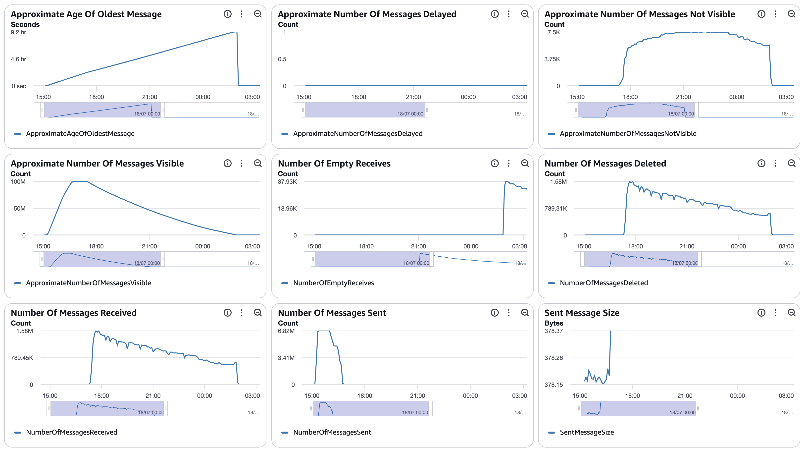
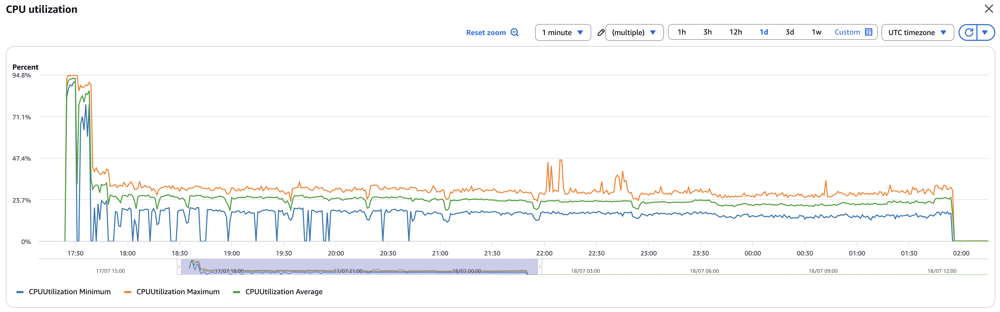
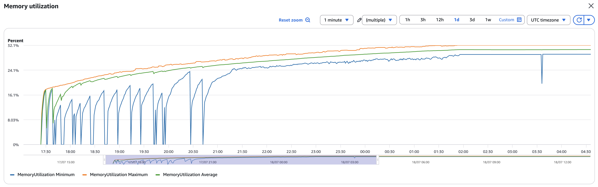
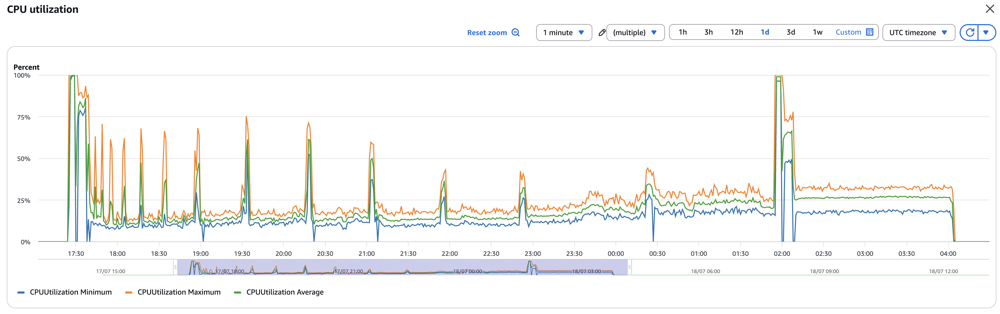
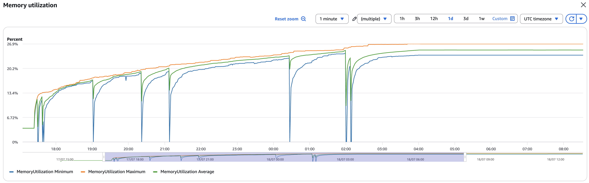
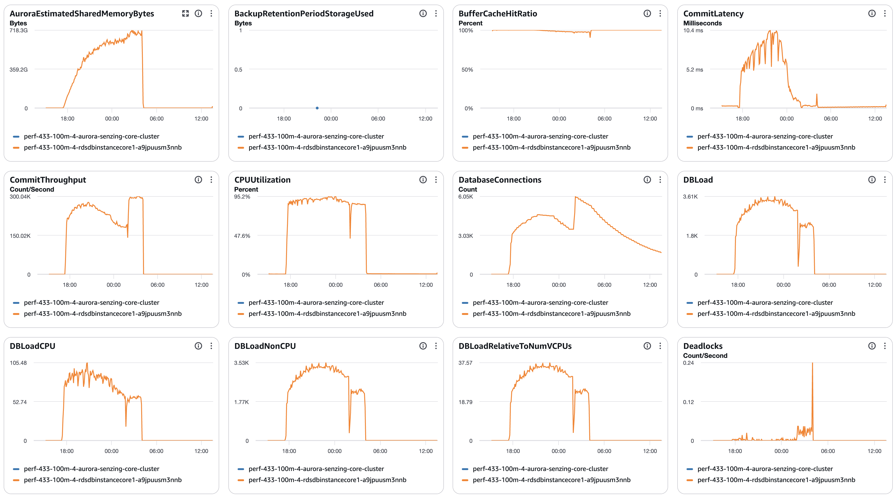
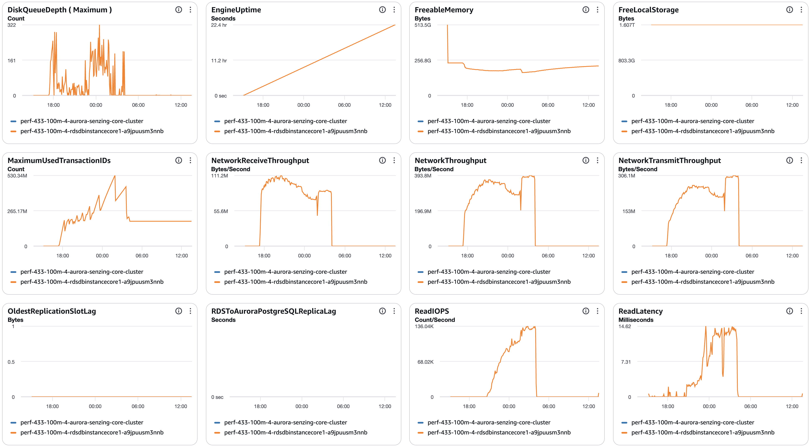
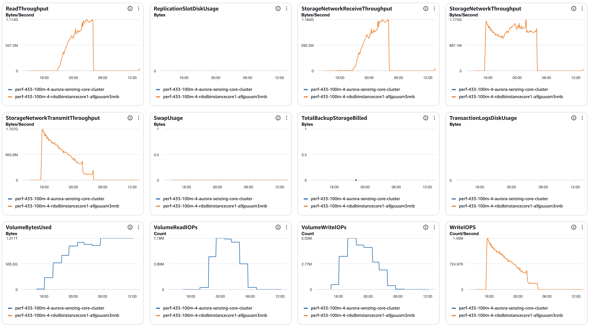
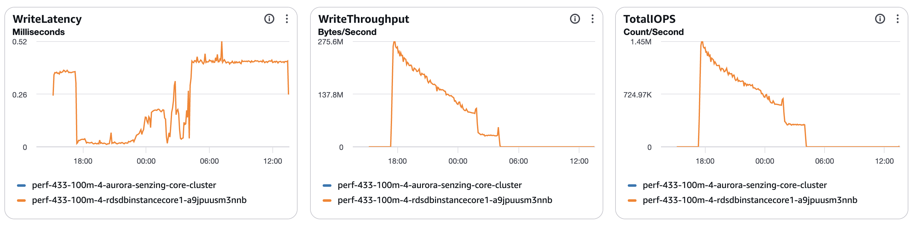

# senzing-test-results-20260716-100M-provisioned-r6i-24xlarge-single-senzing-4.3.3

> # ⚠️ INVALID RUN — HYBRID IMAGES, CONCLUSIONS VOID
> Verified 2026-07-20: the `:4.3.3` images were **mislabeled**. This run actually used a
> **genuine 4.3.3.26191 consumer** with a **4.4.0.26196 redoer** (the `:4.3.3` redoer tag
> contained a 4.4 build) — a hybrid, not 4.3.3. So the advisory-lock errors / cascade /
> stranded-lock "findings" below almost certainly came from the 4.4 redoer and/or a
> lock-protocol mismatch between the two components — **not** from Senzing 4.3.3.
> **Do not use any A/B conclusion from this run.** A genuine 4.3.3 run is pending a
> corrected `:4.3.3` image push from devops. (Root cause: release pipeline mislabeled the
> redoer tag; verify `szBuildVersion.json` for every service before future runs — see
> runbook §1.5.)

## Contents

1. [Overview](#overview)
1. [Caveats](#caveats)
1. [Results](#results)
    1. [Observations](#observations)
    1. [Final metrics](#final-metrics)
        1. [SQS](#sqs)
        1. [EFS](#efs)
        1. [ECS](#ecs)
        1. [RDS](#rds)
        1. [Logs](#logs)

## Overview

1. Performed: Jul 16, 2026
2. Senzing version: 4.3.3 (verify `:4.3.3` image tag exists + deployed build)
3. Instructions:
   [aws-cloudformation-performance-testing](https://github.com/senzing-garage/aws-cloudformation-performance-testing)
    1. [cloudformationAuroraProvisionedSingleDB.yaml](./cloudformationAuroraProvisionedSingleDB.yaml)
4. Changes:
    1. Pre-load input queue by setting loader DesiredCount and MinCapacity to 0
    1. Postgres 17.5
    1. Using X86_64 (AMD64) as `CpuArchitecture` for consumer, redoer, and sshd
    1. `RecordMax` = 100M
    1. DB instance class bumped to `db.r6i.24xlarge` (template edit — not a CFT parameter)
    1. `ENTITY_LOCK_MODE: ADVISORY` was **set in the config but IGNORED** — 4.3.3 does
       **not** support the advisory-lock feature (confirmed by engine dev), so this run
       used 4.3.3's **default** locking mode. (NB: 4.3.3 still uses the PostgreSQL
       `pg_advisory_lock()` *primitive* by default — that's a different thing from the
       Senzing `ENTITY_LOCK_MODE` feature, and is why the logs still show advisory-lock
       deadlocks.) **This makes the 4.4-vs-4.3.3 comparison confounded** (version *and*
       lock mode differ), not a clean advisory-vs-advisory A/B.
    1. no Aurora read-offload (single `CONNECTION`, no `READ_ONLY_CONNECTION`)
    1. Senzing images pinned to `:4.3.3` tag (redoer, sqs-consumer, sdk-tools, sshd) — not `:staging`
    1. `max_connections: 10000` in the DB parameter group (fixes the 100M connection-exhaustion seen on the 4.4 run; 8000 was too tight). NB: `superuser_reserved_connections` isn't settable on Aurora — default reserve is fine given the 10000 ceiling
    1. Removed the `AcceptEula` / `SecurityResponsibility` launch prompts (leftover customer-sample ceremony; **inert** — not passed to any container/software, so the A/B vs the flawed 4.4 run is unaffected)
    1. Launched in **us-west-2** (not us-east-2 like the 4.4 run) because us-east-2 had no `db.r6i.24xlarge` capacity in the writer AZ. No template edit needed (the CFT has no hardcoded region/AZ — AZs derive dynamically). Same-AZ colocation of writer + consumer + redoer is preserved. Region does **not** affect the regression A/B (the OKEY-orphan / silent-drop / advisory-lock behavior is a software concurrency issue); throughput is expected within run-to-run noise of us-east-2 (same `r6i` hardware, same IO-optimized Aurora), noted here only for the record

## System

1. Database
    1. Aurora PosgreSQL Provisioned
    1. Single database
    1. Class: db.r6i.24xlarge
    1. IO Opt (StorageType: aurora-iopt1)
    1. sychronous commit, NOT turned off
    1. Auto scaling of loaders turned from 30% to 25% CPU
    1. Updated DB parameter group to enable some tracking:
    ```
    RdsDbParameterGroup:
    Properties:
      Description: !Sub '${AWS::StackName}-rds-db-parameter-group-description'
      Family: aurora-postgresql17
      Parameters:
        shared_preload_libraries: 'pg_stat_statements'
        track_io_timing: 1
        enable_seqscan: 0
        # pglogical.synchronous_commit: 0
    ```

## Results

### Observations

1. Inserts per second (Peak/Average/Time computed from [dsrc_record.csv](data/dsrc_record.csv); verify against the erpm query):
    1. Peak: 5,613/second (peak minute 336,755/min)
    1. Average over entire run: 3,255/second (erpm 195,741; final-capture avg 3,262/s)
    1. Time to load 100M: 8.51 hours (17:24:36 → 01:55:29 UTC)
    1. Records in dead-letter queue: 0
    1. Volume read IOPS Writer:      39,627,193
    1. Volume read IOPS Reader:      n/a
    1. Volume write IOPS:            467,163,158
    1. See [dsrc_record.csv](data/dsrc_record.csv)

1. Max tasks:

    - Max Consumer tasks: 187
    - Max Redoer tasks: 138

### Findings (A/B vs the 20260715 4.4 run)

> ⚠️ **This run is NOT clean.** It completed (100M loaded, `sys_eval_queue` drained
> to 0), but it hit a massive aborted-transaction cascade that the 4.4 run did not.
> The comparison below changes the 4.4 story — see the Errors section for detail.
>
> **Confounded comparison:** 4.3.3 **ignored** `ENTITY_LOCK_MODE=ADVISORY` and ran in
> **default** mode (see Overview), whereas 4.4 ran with the advisory feature active. So
> version *and* lock mode differ — this is not a clean advisory-vs-advisory A/B. "Advisory
> lock" below refers to the PostgreSQL `pg_advisory_lock()` primitive (used by default in
> both), not the Senzing `ENTITY_LOCK_MODE` feature (4.4 only).

1. **Throughput ≈ parity.** Peak 5,613/s, avg 3,255/s, 8.51 h load — vs 4.4's
   6,074 / 3,365 / 8.25 h. 4.4 is marginally faster (~3–8 %), within run-to-run
   noise. The advisory-lock contention did **not** cost 4.3.3 meaningful throughput.

1. ⚠️ **4.3.3 (default mode) ALSO leaves records unresolved.** `res_ent_okey` =
   `obs_ent` − **12** (99,998,915 = 99,998,927 − 12). The 4.4 run had −40; the older
   **4.1 non-advisory** run had **0**. Record loss occurs in **4.4-advisory (40) AND
   4.3.3-default (12)** — so it is **not exclusive to the advisory feature**, and
   (because the runs are confounded) we **cannot** conclude advisory mode is or isn't
   the cause from this pair alone. (4.4 lost more: 40 vs 12.)
   `res_ent_active` (ent_state≠0) = **34,623** — far above 4.4-clean's 457 and 4.1's
   162, consistent with resolution repeatedly interrupted mid-flight by the cascade.
   **Parity forensics done (see Logs): the 12 are a DIFFERENT mechanism than 4.4's 40
   — stranded entity locks (`locking_id≠0`) from the aborted-transaction cascade, NOT
   OKEY orphans (0 `OKEY ORPHAN PREVENTED`, confirmed). 4 of the 12 are the same input
   records that also failed in 4.4 → hot-entity `pg_advisory_lock` contention,
   version-independent trigger, version-specific consequence.**

1. 🚨 **A 4.3.3-only aborted-transaction cascade (absent in 4.4).** `xact_rollback` =
   **2,085,437** vs 4.4-clean's **698** — a ~3,000× jump. Driven by connections left
   in aborted-transaction state (`PQTRANS_INERROR`) after "a prior error was swallowed
   upstream": 2.18M `current transaction is aborted` (25P02), 2.08M `prepared statement
   already exists`, 106,605 `UNHANDLED DATABASE ERROR`, 155,848 refused statements
   (`Connection found in aborted-transaction state` = the `FAILED` count). Root trigger
   = advisory-lock **deadlock** (40P01 on `SELECT pg_advisory_lock`) plus a failing
   `DELETE FROM RES_FEAT_EKEY`. **The 4.3.3 client does not reset a connection after an
   advisory-lock error — it poisons the connection and cascades.** This is a distinct
   4.3.3 error-handling behavior, not seen in 4.4.

1. **The two builds fail *differently* under the same `pg_advisory_lock` contention:**
   - **4.4 (advisory feature) fails silently** — clean logs (0 `UNHANDLED DATABASE
     ERROR`), but the `oent-swap-okey-split-commit-regression` drops 40 records with no
     DLQ, no redo, no per-record log.
   - **4.3.3 (default mode) fails loudly** — millions of cascade errors and 2.08M
     rollbacks, but only 12 unresolved.

   **Neither is clean.** Record loss is not new in 4.4 (4.3.3-default has it too), but
   4.4's failure mode is loud-and-messy → **silent-and-invisible**, plus 4.4 adds the
   OKEY-split-commit path (which needs the advisory feature). Whether the advisory
   *feature* itself is the culprit in 4.4 can't be settled here — run 4.4 in default
   mode to isolate it.

1. **Shared, version-independent signals** (both use the `pg_advisory_lock` primitive):
   advisory-lock contention 588 (4.4: 617), `INFINITE` loops **22 (identical to 4.4)**,
   `CORRUPTION_FOUND` 127 (4.4: 104).

> **Caveat on the error counts:** `error|except` = 4.7M is **not** directly comparable
> to 4.4's 635 — the 4.4 scan filtered out the `current transaction is aborted` (25P02)
> cascade (2.18M lines here), this scan did not. The apples-to-apples comparisons are
> `UNHANDLED DATABASE ERROR` (106,605 vs 0), `FAILED` (155,848 vs 1), and
> `xact_rollback` (2.08M vs 698) — all catastrophically higher on 4.3.3.

### Final metrics

#### SQS

##### SQS Metrics input queue


##### SQS Metrics output queue

N/A.  Ran without `withinfo` enabled.



#### ECS

##### Sz SQS Consumer CPU Utilization



##### Sz SQS Consumer Memory Utilization



##### Sz Simple Redoer CPU Utilization



##### Sz Simple Redoer Memory Utilization



#### RDS

##### Database Metrics CORE/LIBFEAT/RES final






##### Database IO / transaction deltas

Captured with the snapshot/diff harness (see
[performance-test runbook](../../docs/performance-test-runbook.md) §4 and
[`scripts/aurora-pg/`](../../scripts/aurora-pg/)).

```
=================== RUN WINDOW ===================
          baseline_at          |           final_at            |     elapsed
-------------------------------+-------------------------------+-----------------
 2026-07-17 17:22:42.564959+00 | 2026-07-18 13:32:21.075658+00 | 20:09:38.510699
(baseline taken PRE-load → covers the full run incl. the ~11.5h redo tail)

=================== FACT REPORT HEADLINE (eviction-immune) ===================
 logical_block_reads | physical_block_reads | wal_bytes | xact_commit | tup_inserted | tup_updated | tup_deleted
---------------------+----------------------+-----------+-------------+--------------+-------------+-------------
        224470528651 |           2395994691 |           |  9282482641 |   5314202629 |  1526681184 |   307066715
(wal_bytes blank on Aurora — use VolumeWriteIOPs)

=================== ALL SCALAR DELTAS ===================
        metric        |      delta
----------------------+-----------------
 db.blk_read_time_ms  | 29411033715.554
 db.blks_hit          |    222074533960
 db.blks_read         |      2395994691
 db.blk_write_time_ms |    15335704.725
 db.deadlocks         |             326
 db.temp_bytes        |         5733482
 db.temp_files        |               2
 db.tup_deleted       |       307066715
 db.tup_fetched       |    105978282577
 db.tup_inserted      |      5314202629
 db.tup_returned      |    110783660510
 db.tup_updated       |      1526681184
 db.xact_commit       |      9282482641
 db.xact_rollback     |         2085437     ← vs 698 on the 4.4 run (the cascade)

=================== PER-TABLE DELTAS (tables touched by the run) ===================
    relname     |    ins     |    upd    |    del    |  hot_upd  | seq_scan |  idx_scan   | heap_read |  heap_hit   | idx_read
----------------+------------+-----------+-----------+-----------+----------+-------------+-----------+-------------+-----------
 res_feat_ekey  | 1912018521 | 379226336 | 147953840 | 181615866 |        0 |  4763331548 | 246071418 | 10792815101 | 278928468
 res_feat_stat  | 1389900401 | 362066315 |        22 | 265633121 |        0 | 10244748605 |  27857914 | 15001719093 |  22015961
 lib_feat       | 1389901624 |      2081 |        51 |      1606 |     7139 |  8963206350 | 877902944 |  8169969246 | 413226318
 obs_ent        |   99998927 | 295894850 |         0 | 229412159 |        0 |  1562788814 | 136244377 |  4494265866 |  29326919
 res_ent        |   65972931 | 280654865 |   4852622 | 269474193 |        0 |  1788975760 |    163703 |  2450621306 |      5197
 res_relate     |   74172611 | 129223971 |  40122321 |  75155425 |        0 |   543209106 | 156511061 |  1702146067 |   3298837
 res_rel_ekey   |  148345274 |         0 |  80244660 |         0 |        0 |   584744711 |   5793572 |  1241221469 |   6205225
 res_ent_okey   |  100262985 |  46817670 |    264070 |  33150189 |        0 |  1759631360 |    464122 |  4966170289 |   9724054
 dsrc_record    |  100000000 |  32764411 |         0 |  17789719 |        0 |   816837013 | 104658843 |  2238406187 |  22138875
 sys_eval_queue |   33622131 |         0 |  33622131 |         0 |        0 |   165545151 |  46743465 |  2128678005 |   8699591
```

1. [pg_stat_io.csv](data/pg_stat_io.csv)
1. [pg_stat_statements.csv](data/pg_stat_statements.csv)

##### DSRC_RECORD

1. [dsrc_record.csv](data/dsrc_record.csv)

##### Match keys

1. [match_key_ent.csv](data/match_key_ent.csv)
1. [match_key_rel.csv](data/match_key_rel.csv)

#### Logs

Final counts + throughput (from [final-capture.txt](data/final-capture.txt)):

```
 relname        |  exact_rows  | note
----------------+--------------+-------------------------------------------
 dsrc_record    | 100,000,000  | = target
 obs_ent        |  99,998,927  |
 res_ent_okey   |  99,998,915  | obs_ent − 12  ⚠️ 12 unresolved (4.4: −40; clean 4.1: 0)
 res_ent        |  61,120,309  | resolved entities
 res_relate     |  34,050,267  | relationships
 sys_eval_queue |           0  | drained
 res_ent_active |      34,623  | ent_state≠0  (4.4 clean: 457; clean 4.1: 162)

 load 2026-07-17 17:24:36 → 2026-07-18 01:55:29  |  08:30:52  |  erpm 195,741  |  avg 3,262/s
```

`validate.sql` query 1 (observed-but-unresolved) returned the **12** below; query 2
(dangling keys) returned **0**. Records flagged `← 4.4` also failed to resolve in the
4.4 run (same input record, different run):

```
 record_id | obs_ent_id | res_ent_id
-----------+------------+------------
 544049784 |   42859976 |
 544049782 |   76743556 |
 562372144 |   11587340 |
 562372148 |   85904229 |
 556511710 |   30512105 |
 520309908 |   60470612 |   ← 4.4
 562372143 |    2674075 |
 568258238 |   63330627 |   ← 4.4
 562372147 |   40831489 |
 562372142 |   32214006 |
 495886296 |   82776331 |   ← 4.4
 568258243 |   38342371 |   ← 4.4
(12 rows) — query 2 (dangling keys): 0 rows

unresolved-forensics.sql (all 12): features=t, has_res_ent_okey=f,
  locking_id ∈ {1,2,4}  ← STRANDED LOCK (4.4's 40 were all 0),
  last_touch_dt=0, none in sys_eval_queue (no redo pending).
```

**Forensic conclusion — a DIFFERENT mechanism than 4.4:**

- **`locking_id ≠ 0` on all 12** (4.4's 40 were all `= 0`) → a **stranded entity
  lock**: resolution acquired the lock, started, and never released it. That is the
  fingerprint of the aborted-transaction cascade — `SELECT pg_advisory_unlock($1)` was
  among the statements failing on poisoned connections, so the resolve died mid-flight
  leaving the lock set, no `res_ent_okey`, and nothing re-queued. (Explains the
  elevated `res_ent_active` = 34,623.)
- **0 `OKEY ORPHAN PREVENTED`** in CloudWatch (full 7-day window, all log groups) →
  4.3.3 does **not** hit `oent-swap-okey-split-commit-regression` (the 4.4 defect).
- **4 of the 12 are the same *input records* that also failed in 4.4**
  (`568258243`, `568258238`, `520309908`, `495886296`), the rest cluster into
  near-consecutive `record_id` runs (`562372142–148`, `544049782/784`) → specific
  hot / duplicate-heavy entities lose the advisory-lock fight **regardless of version**.
  Advisory-lock contention is the shared trigger; the *consequence* is version-specific
  (**4.4 → silent OKEY orphan; 4.3.3 → stranded-lock cascade**).
- `last_touch_dt` is 0 for all 12 (4.3.3 doesn't populate it here) → time-clustering
  N/A; the DB-state fingerprint above carries the analysis.

#### Errors

```

==============================================
Term                       |  instance count |
==============================================
(SENZ0086)                 |         0       |
(error|except)             | 4,746,616       |
(ExclusiveLock on advisory lock)|  588       |
(UNHANDLED DATABASE ERROR) |   106,605       |
(CORRUPTION_FOUND)         |       127       |
(RetryTimeout)             |         0       |
(FAILED)                   |   155,848       |
(INFINITE)                 |        22       |
(OKEY ORPHAN PREVENTED)    |         0       |
(MISSING_RES_ENT_AND_OKEY) |         0       |
(still)                    |         0       |
(stolen)                   |         1       |
(cancel)                   |         5       |
(another command is already in progress) | 0 |
==============================================

Errors:

2,185,189 - /current transaction is aborted, commands ignored until end of transaction block/
2026-07-18 04:03:56.446 [szstatic:7fa37d7fa6c0] ERR: PQresultStatus returned [(7:0:ERROR:  current transaction is aborted, commands ignored until end of transaction block; ;25P02)] executing: DELETE FROM RES_FEAT_EKEY WHERE RES_ENT_ID=$1 AND ((LIB_FEAT_ID=$2 AND UTYPE_CODE=$3))

652 - /deadlock detected/
2026-07-18 04:03:56.405 [szstatic:7fc16a7fc6c0] ERR: PQresultStatus returned [(7:0:ERROR:  deadlock detected; DETAIL:  Process 87641 waits for ExclusiveLock on advisory lock [16412,766509056,15363122,1]; blocked by process 19677.; Process 19677 waits for ExclusiveLock on advisory lock [16412,766509056,18933544,1]; blocked by process 87641.; HINT:  See server log for query details.; ;Process 87641 waits for ExclusiveLock on advisory lock [16412,766509056,15363122,1]; blocked by process 19677.; Process 19677 waits for ExclusiveLock on advisory lock [16412,766509056,18933544,1]; blocked by process 87641.40P01)] executing: SELECT pg_advisory_lock($1)

2,085,101 - /already exists/
2026-07-18 04:03:56 UTC:10.0.11.200(44826):senzing@G2:[8046]:ERROR:  prepared statement "3370244013423045232" already exists

319,815 - /Statement issued on a connection already in an aborted-transaction state/
2026-07-18 04:03:56.464 [sql:7fa37d7fa6c0] CRIT: Exception: Statement issued on a connection already in an aborted-transaction state (PQTRANS_INERROR); a prior error was swallowed upstream
SQL Error: Statement issued on a connection already in an aborted-transaction state (PQTRANS_INERROR); a prior error was swallowed upstream | Statement: Statement: query = SELECT pg_advisory_unlock($1)
UNHANDLED DATABASE ERROR: ((-1:Statement issued on a connection already in an aborted-transaction state (PQTRANS_INERROR); a prior error was swallowed upstream))

155,848 - /Connection found in aborted-transaction state/
2026-07-18 04:03:54.735 [szstatic:7fa37d7fa6c0] ERR: Connection found in aborted-transaction state (PQTRANS_INERROR) at statement entry — a prior statement failed and its error was swallowed upstream; refusing to execute to avoid splitting an atomic transaction
```

**Interpretation — a 4.3.3 connection-recovery cascade (distinct from 4.4).** The
counts trace to one mechanism: after an **advisory-lock deadlock** (40P01 on
`SELECT pg_advisory_lock`) or a failing `DELETE FROM RES_FEAT_EKEY`, the client's
error is *"swallowed upstream"* and the PG connection is left in aborted-transaction
state (`PQTRANS_INERROR`) instead of being rolled back/reset. Every later statement on
that poisoned connection then fails:

- `current transaction is aborted` (25P02) — **2,185,189** (downstream noise; this is
  what the 4.4 scan filtered out, so `error|except` totals are **not** comparable)
- `prepared statement "…" already exists` — **2,085,101** (re-preparing on a
  not-reset connection) ≈ the **2,085,437** `xact_rollback` delta
- `Statement issued on … aborted-transaction state` — 319,815 → `UNHANDLED DATABASE
  ERROR` 106,605
- `Connection found in aborted-transaction state … refusing to execute` — **155,848**
  = the `FAILED` count (client self-protecting)

**Root cause (proposed): the 4.3.3 client does not reset a connection after an
advisory-lock error**, poisoning it for the rest of its life. 4.4 does not exhibit this
(`UNHANDLED DATABASE ERROR` = 0, `xact_rollback` = 698). So under identical
`pg_advisory_lock` contention, **4.3.3 (default mode) fails loudly (cascade, 2M
rollbacks, 12 unresolved) while 4.4 (advisory feature) fails silently (0 unhandled, 40
records dropped with no trace).** Different bugs. Report the 4.3.3 cascade to the engine
team alongside the 4.4 `oent-swap-okey-split-commit-regression`.

##### A/B parity with the 4.4 run

Reproduce the **same** unresolved-record forensics as the
[20260715 4.4 run](../20260715-100M-provisioned-r6i-24xlarge-single-senzing-4.4.0/findings-100m-4.4-vs-4.3.3.md)
so the comparison is apples-to-apples. After the drain gate:

1. `validate.sql` query 1 → the observed-but-unresolved `obs_ent_id`s (4.4 had 40;
   clean 4.1 had 0). Record the count (`res_ent_okey` = `obs_ent` − N).
2. Put those ids in [`scripts/aurora-pg/unresolved-forensics.sql`](../../scripts/aurora-pg/unresolved-forensics.sql)
   and run it (features / locking_id / has_res_ent_okey / last_touch clustering /
   still-queued).
3. In CloudWatch Logs Insights (full run window, **consumer + redoer** log groups) export:
   - every `OKEY ORPHAN PREVENTED` line, and
   - a bare-id scan of all non-OKEY messages for those ids.
4. Classify with [`scripts/aurora-pg/classify-unresolved.py`](../../scripts/aurora-pg/classify-unresolved.py)
   (replace its id list) and record the split: OKEY-victim / collateral / silent /
   corruption / infinite.

**A/B answer (this run):** 4.3.3 does **not** hit `oent-swap-okey-split-commit-regression`
(0 `OKEY ORPHAN PREVENTED`, confirmed) — that defect needs the 4.4 advisory-mode code
path, which 4.3.3 lacks. But 4.3.3-default is **not** clean either: it loses 12 records
via a different bug (stranded-lock cascade). Because 4.3.3 ran default mode (not
advisory), this pair can't isolate advisory-vs-version — the **decisive next test is a
4.4 run in DEFAULT mode** at 100M (clean → advisory drives 4.4's 40; still ~40 → version
regression).

## Methods

Full step-by-step process — connect, watch progress, capture IO/transaction
metrics, validate, export CSVs, and scan logs — is in the
[performance-test runbook](../../docs/performance-test-runbook.md). Reusable SQL
helpers live in [`scripts/aurora-pg/`](../../scripts/aurora-pg/):

- `progress.sql` — row counts + throughput (erpm) during the load
- `00-setup.sql` / `10-baseline.sql` / `20-final.sql` — IO/transaction delta capture
- `validate.sql` — post-load integrity checks (expect zero rows)
- `exports.sql` — writes `dsrc_record.csv`, `match_key_*.csv`, `pg_stat_*.csv` to `/tmp`
