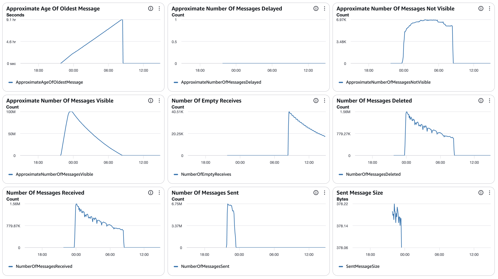
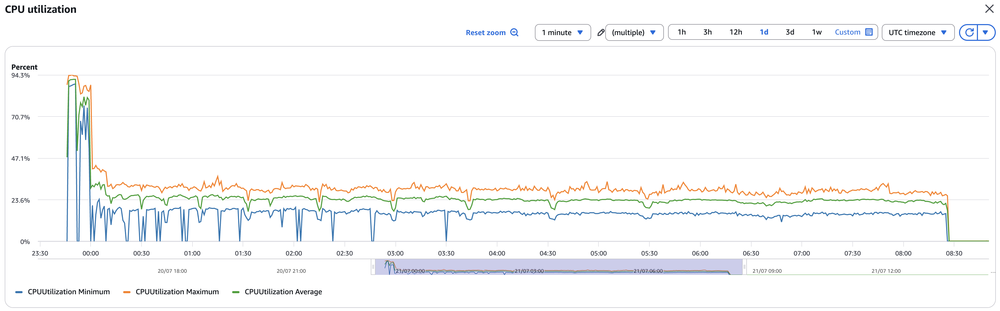
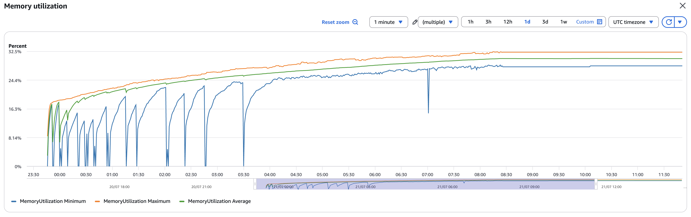
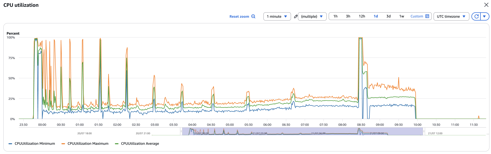
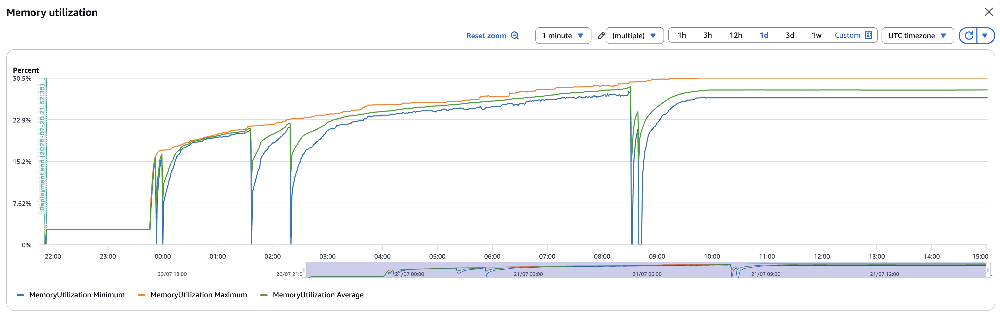
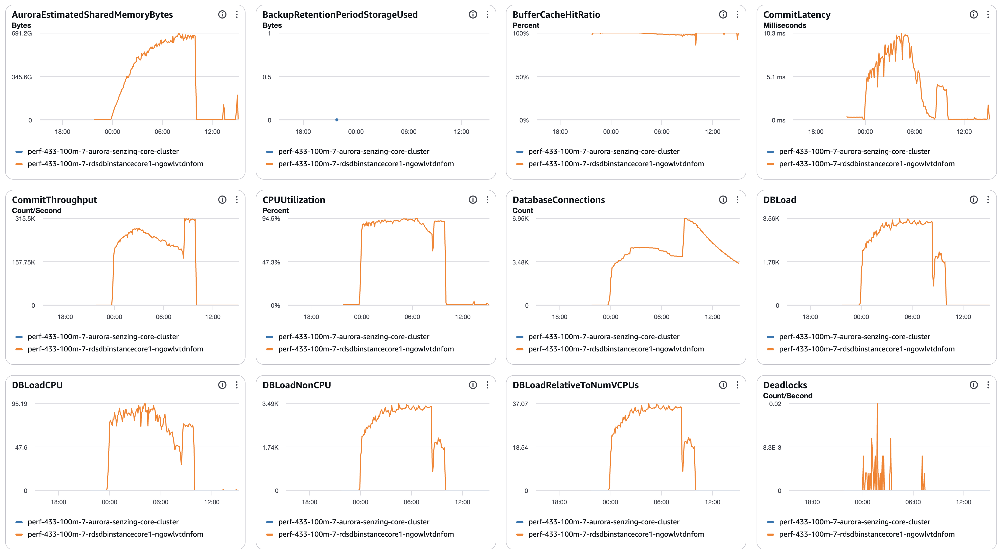
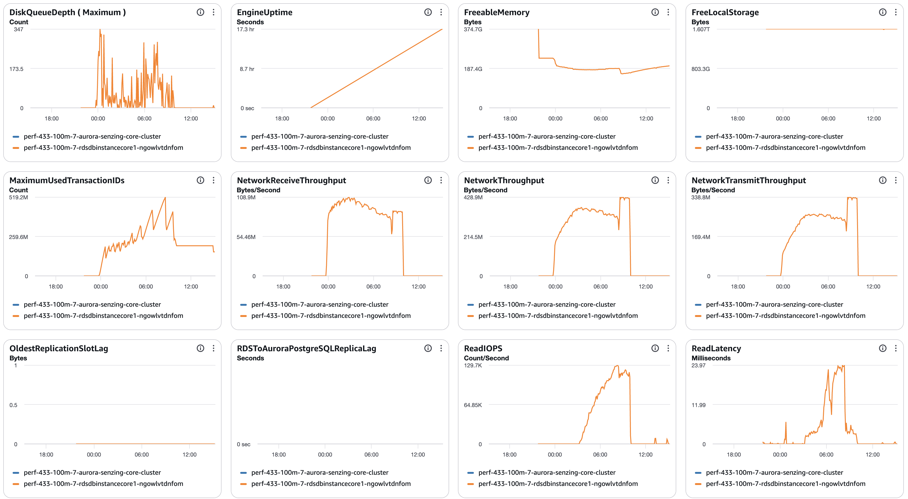
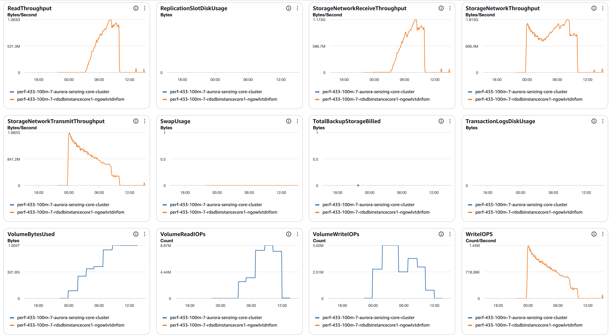
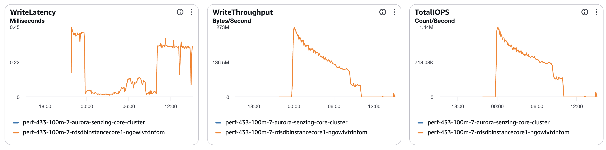

# senzing-test-results-20260720-100M-provisioned-r6i-24xlarge-single-senzing-4.3.3

> ✅ **GENUINE 4.3.3 run — images verified pre-launch (runbook §1.5).** Unlike the
> earlier hybrid attempts (which paired a 4.3.3 consumer with a mislabeled 4.4.0.26196
> redoer — see [20260716](../20260716-100M-provisioned-r6i-24xlarge-single-senzing-4.3.3/README.md)),
> devops re-pushed `:4.3.3` and **both consumer AND redoer were confirmed `4.3.3.x`
> before this run.** Both `:4.3.3` digests changed vs the hybrid run (redoer
> `7f06ffac…`→`2fc81963…`; consumer `58845e82…`→`1d716c84…`), i.e. the whole set was
> re-pushed. **Verified builds + digests (both = genuine 4.3.3.26191; digests are from
> the RUNNING tasks):**
> - consumer: **4.3.3.26191** (BUILD_NUMBER 2026_07_10__01_27) / digest `sha256:1d716c84008d7add7099b7066074318c56aea0927d22346036ad4f5db5441918`
> - redoer:   **4.3.3.26191** (BUILD_NUMBER 2026_07_10__01_27) / digest `sha256:2fc819633e86b1ce185fdf01c13fa7e0ce047db733fe60c64cf535020a65e01a`
> - ✅ digests confirmed against the running tasks — this run provably ran genuine 4.3.3.26191.
>
> **Loaded: 100,000,000 (full).** `dsrc_record` = exactly 100M confirmed post-load. The
> ~99,995,786 seen during queue-fill was an approximate SQS `ApproximateNumberOfMessages`
> reading (it undercounts) — **no real shortfall.** Denominator for the unresolved math
> (`obs_ent − res_ent_okey`) is 100M.

> **This run: 4.3.3 with advisory lock mode OFF** — `EnableEntityLockModeAdvisory=false`,
> so the JSON has **no** `"ER":{"ENTITY_LOCK_MODE":"ADVISORY"}` block at all.
>
> **Primary question (per engine dev):** the [20260716 run](../20260716-100M-provisioned-r6i-24xlarge-single-senzing-4.3.3/README.md)
> had the ER block *present but supposedly ignored*, yet the logs were full of
> `pg_advisory_lock` deadlocks + a 2M-rollback cascade + 12 unresolved records. Does
> removing the ER block entirely make those **advisory-lock errors disappear**?
> - **Errors GONE** → the "ignored" config was NOT inert — its mere presence tripped an
>   advisory code path (and may have caused the cascade + lost records). Significant.
> - **Errors STILL present** → `pg_advisory_lock` is 4.3.3's *default* locking primitive,
>   the ER block truly was inert (naming-collision), and the cascade is default behavior.
>
> ⚠️ This means our current docs' "naming-collision / default primitive" explanation is a
> **hypothesis this run will confirm or refute** — not settled fact. Compare the
> `ExclusiveLock on advisory lock` / `pg_advisory_lock` counts, the cascade
> (`xact_rollback`, `UNHANDLED DATABASE ERROR`, `FAILED`), and the unresolved count
> directly against 20260716.

## Contents

1. [Overview](#overview)
1. [Caveats](#caveats)
1. [Results](#results)
    1. [Observations](#observations)
    1. [Final metrics](#final-metrics)
        1. [SQS](#sqs)
        1. [EFS](#efs)
        1. [ECS](#ecs)
        1. [RDS](#rds)
        1. [Logs](#logs)

## Overview

1. Performed: Jul 20, 2026 (rename dir to the actual run date if it differs)
2. Senzing version: 4.3.3 (`:4.3.3` image tag; verify deployed build)
3. Instructions:
   [aws-cloudformation-performance-testing](https://github.com/senzing-garage/aws-cloudformation-performance-testing)
    1. [cloudformationAuroraProvisionedSingleDB.yaml](./cloudformationAuroraProvisionedSingleDB.yaml)
4. Changes:
    1. Pre-load input queue by setting loader DesiredCount and MinCapacity to 0
    1. Postgres 17.5
    1. Using X86_64 (AMD64) as `CpuArchitecture` for consumer, redoer, and sshd
    1. `RecordMax` = 100M
    1. DB instance class bumped to `db.r6i.24xlarge` (template edit — not a CFT parameter)
    1. **`EnableEntityLockModeAdvisory` = `false`** — advisory lock mode **OFF**. This is
       the deliberate difference vs the 20260716 run. (4.3.3 ignores the advisory feature
       regardless, so effective mode = default either way; here it is explicitly off.)
       NB: 4.3.3 still uses the PostgreSQL `pg_advisory_lock()` *primitive* by default —
       expect advisory-lock deadlocks in the logs; that is separate from the Senzing
       `ENTITY_LOCK_MODE` feature.
    1. no Aurora read-offload (single `CONNECTION`, no `READ_ONLY_CONNECTION`)
    1. Senzing images pinned to `:4.3.3` tag (redoer, sqs-consumer, sdk-tools, sshd) — not `:staging`
    1. `max_connections: 10000` in the DB parameter group
    1. `AcceptEula` / `SecurityResponsibility` launch prompts removed (inert)
    1. Region: fill in at run time (us-east-2 if 24xlarge capacity is available; else
       us-west-2 as on 20260716 — record which)

## System

1. Database
    1. Aurora PosgreSQL Provisioned
    1. Single database
    1. Class: db.r6i.24xlarge
    1. IO Opt (StorageType: aurora-iopt1)
    1. sychronous commit, NOT turned off
    1. Auto scaling of loaders turned from 30% to 25% CPU
    1. Updated DB parameter group to enable some tracking:
    ```
    RdsDbParameterGroup:
    Properties:
      Description: !Sub '${AWS::StackName}-rds-db-parameter-group-description'
      Family: aurora-postgresql17
      Parameters:
        shared_preload_libraries: 'pg_stat_statements'
        track_io_timing: 1
        enable_seqscan: 0
        # pglogical.synchronous_commit: 0
    ```

## Results

### Observations

1. **Loaded: 100,000,000 (full)** — `dsrc_record` = exactly 100M confirmed post-load.
   (The ~99,995,786 seen during queue-fill was an approximate SQS reading; no shortfall.)
1. Inserts per second (Peak/Average/Time computed from [dsrc_record.csv](data/dsrc_record.csv); verify against the erpm query):
    1. Peak: 5,518/second (peak minute 331,080/min)
    1. Average over entire run: 3,199/second (erpm 192,207; final-capture avg 3,203/s)
    1. Time to load 100M: 8.68 hours (23:46:22 → 08:26:38 UTC)
    1. Records in dead-letter queue: 0
    1. Volume read IOPS Writer:       34,413,817
    1. Volume read IOPS Reader:           n/a
    1. Volume write IOPS:            478,419,741
    1. See [dsrc_record.csv](data/dsrc_record.csv)

1. Max tasks:

    - Max Consumer tasks: 172
    - Max Redoer tasks: 174

### Findings (vs 20260716 4.3.3 set-but-ignored, and vs 4.4)

> ✅ **First trustworthy 4.3.3 run — and it is CLEAN on data completeness.**
> Provably genuine 4.3.3.26191 (both consumer + redoer, running-task digests verified).

1. **Zero records lost.** `res_ent_okey` = **99,998,927** = `obs_ent` (99,998,927) → **0
   unresolved** (`validate.sql` q1 = 0 rows, q2 = 0 rows). vs the 4.4.0.26167 run's 40 and
   the 20260716 hybrid's 12. `res_ent_active` = **337** (lowest of all runs: 4.4-clean 457,
   hybrid 34,623) — fully settled. **This is the headline: genuine 4.3.3 does not lose
   records at 100M.**

1. 🔑 **Advisory-lock errors are GONE — they were the 4.4 redoer.** `ExclusiveLock on
   advisory lock` = **0** (hybrid: 588), `db.deadlocks` = **34** (hybrid 326, 4.4 617).
   So the advisory-lock deadlocks in the 20260716 hybrid came from the mislabeled
   **4.4.0.26196 redoer**, not from 4.3.3. **This REFUTES the earlier "naming-collision /
   4.3.3 uses pg_advisory_lock by default" hypothesis** — genuine all-4.3.3 produces no
   advisory-lock deadlocks.

1. **The connection-recovery weakness exists in 4.3.3 too — but ~11–130× smaller and
   harmless here.** `xact_rollback` = **184,354** (hybrid 2,085,437; 4.4-clean 698),
   `UNHANDLED DATABASE ERROR` = **8,006** (hybrid 106,605), `FAILED` = **12,009** (hybrid
   155,848). Same `PQTRANS_INERROR` / "prior error swallowed upstream" pattern (16,012
   lines) as the hybrid cascade, but far rarer because its trigger (deadlocks) is far
   rarer (34 vs 617), and — critically — **it cost 0 records** (the system recovered).
   `CORRUPTION_FOUND` 26 (hybrid 127), `INFINITE` 10 (hybrid 22), `OKEY ORPHAN PREVENTED`
   **0** (no advisory code path in 4.3.3).

1. **Throughput ≈ parity:** peak 5,518/s, avg 3,199/s, 8.68 h load — vs 4.4.0.26167's
   6,074 / 3,365 / 8.25 h and the hybrid's 5,613 / 3,255 / 8.51 h. All within run-to-run noise.

**Bottom line (advisory OFF, genuine 4.3.3):** no advisory-lock deadlocks, no record loss.
The record loss + advisory errors + million-row cascade seen in the "4.3.3" 20260716 run
were artifacts of the **hybrid** (4.4.0.26196 redoer), not Senzing 4.3.3.

<!-- Caveats: this run is advisory-OFF genuine 4.3.3. It is NOT a clean advisory A/B vs
     the 4.4 runs (build + lock-mode both differ). The residual 8k UNHANDLED / 184k
     rollback are worth a mention to the engine team as a low-rate connection-recovery
     weakness present in 4.3.3, though it lost no data here. -->


### Final metrics

#### SQS

##### SQS Metrics input queue



##### SQS Metrics output queue

N/A.  Ran without `withinfo` enabled.


#### ECS

##### Sz SQS Consumer CPU Utilization



##### Sz SQS Consumer Memory Utilization



##### Sz Simple Redoer CPU Utilization



##### Sz Simple Redoer Memory Utilization



#### RDS

##### Database Metrics CORE/LIBFEAT/RES final






##### Database IO / transaction deltas

Captured with the snapshot/diff harness (see
[performance-test runbook](../../docs/performance-test-runbook.md) §4 and
[`scripts/aurora-pg/`](../../scripts/aurora-pg/)).

```
=================== RUN WINDOW ===================
          baseline_at          |           final_at            |     elapsed
-------------------------------+-------------------------------+-----------------
 2026-07-20 23:44:10.417931+00 | 2026-07-21 13:16:59.242113+00 | 13:32:48.824182
(baseline PRE-load → covers the full run incl. redo tail; wal_bytes blank on Aurora)

=================== FACT REPORT HEADLINE (eviction-immune) ===================
 logical_block_reads | physical_block_reads | xact_commit | tup_inserted | tup_updated | tup_deleted
---------------------+----------------------+-------------+--------------+-------------+-------------
        219315548325 |           2064685179 |  9056810511 |   5372991363 |  1501010873 |   400005890

=================== SCALAR DELTAS (key) ===================
 db.deadlocks     |         34        ← vs 617 (4.4.0.26167) / 326 (hybrid)
 db.xact_commit   | 9,056,810,511
 db.xact_rollback |    184,354        ← vs 698 (4.4-clean) / 2,085,437 (hybrid cascade)
 db.tup_inserted  | 5,372,991,363
 db.tup_updated   | 1,501,010,873
 db.tup_deleted   |   400,005,890

=================== PER-TABLE DELTAS ===================
    relname     |    ins     |    upd    |    del    |  hot_upd  |  idx_scan   | heap_read
----------------+------------+-----------+-----------+-----------+-------------+-----------
 res_feat_ekey  | 1880050761 | 387094461 | 120410959 | 177299844 |  4660060700 | 197306719
 res_feat_stat  | 1375001986 | 332463544 |        10 | 235335864 | 10170080229 |  17124520
 lib_feat       | 1375002201 |      2061 |        48 |      1640 |  8662568350 | 804828812
 res_ent        |   65812791 | 320417399 |   4694825 | 307697814 |  1790312096 |    109671
 res_rel_ekey   |  227293198 |         0 | 159142867 |         0 |   704816755 |   4838013
 obs_ent        |   99998927 | 275513260 |         0 | 215480619 |  1481400755 | 124501871
 res_relate     |  113646538 | 102175100 |  79571372 |  50940101 |   462322117 | 139684556
 res_ent_okey   |   99998927 |  47914724 |         0 |  33624578 |  1666077322 |    381824
 dsrc_record    |  100000000 |  35399514 |         0 |  16487809 |   757664351 | 107475501
 sys_eval_queue |   36178825 |         0 |  36178825 |         0 |   170132171 |  27908270
```

1. [pg_stat_io.csv](data/pg_stat_io.csv)
1. [pg_stat_statements.csv](data/pg_stat_statements.csv)

##### DSRC_RECORD

1. [dsrc_record.csv](data/dsrc_record.csv)

##### Match keys

1. [match_key_ent.csv](data/match_key_ent.csv)
1. [match_key_rel.csv](data/match_key_rel.csv)

#### Logs

Final counts + throughput (from final-capture.txt):

```
 relname        |  exact_rows  | note
----------------+--------------+-------------------------------------------
 dsrc_record    | 100,000,000  | = target (full)
 obs_ent        |  99,998,927  |
 res_ent_okey   |  99,998,927  | = obs_ent  ✅ 0 unresolved (4.4: −40; hybrid: −12)
 res_ent        |  61,117,966  | resolved entities
 res_relate     |  34,075,133  | relationships
 sys_eval_queue |           0  | drained
 res_ent_active |         337  | ent_state≠0  (4.4-clean: 457; hybrid: 34,623)

 load 2026-07-20 23:46:22 → 2026-07-21 08:26:38  |  08:40:16  |  erpm 192,207  |  avg 3,203/s

 validate.sql q1 (observed-but-unresolved): 0 rows
 validate.sql q2 (dangling keys):           0 rows
```

**No unresolved records** → the `unresolved-forensics.sql` / OKEY-orphan classification
that the 4.4 and hybrid runs needed is **N/A here** — there is nothing to forensic. Clean.

#### Errors

```

==============================================
Term                       |  instance count |
==============================================
(SENZ0086)                 |         0       |
(error|except)             |    40,061       |
(ExclusiveLock on advisory lock)|    0       |
(UNHANDLED DATABASE ERROR) |     8,006       |
(CORRUPTION_FOUND)         |        26       |
(RetryTimeout)             |         0       |
(FAILED)                   |    12,009       |
(INFINITE)                 |        10       |
(OKEY ORPHAN PREVENTED)    |         0       |
(MISSING_RES_ENT_AND_OKEY) |         0       |
(still)                    |         0       |
(stolen)                   |         0       |
(cancel)                   |         0       |
(another command is already in progress) | 0 |
==============================================

40,061 - error|except:

16,012 - Statement issued on a connection already:
SQL Error: Statement issued on a connection already in an aborted-transaction state (PQTRANS_INERROR); a prior error was swallowed upstream | Statement: Statement: query = UPDATE OBS_ENT SET LAST_TOUCH_DT=$1,LOCKING_ID=$2 WHERE OBS_ENT_ID IN ($3) AND LAST_TOUCH_DT=$4
2026-07-21 08:26:17.978 [sql:f2bdba04327e2ad] CRIT: Exception: Statement issued on a connection already in an aborted-transaction state (PQTRANS_INERROR); a prior error was swallowed upstream

3,997 - current transaction is aborted:
2026-07-21 08:25:41.849 [szstatic:e128e6c16e145e35] ERR: PQresultStatus returned [(7:0:ERROR:  current transaction is aborted, commands ignored until end of transaction block; ;25P02)] executing: INSERT INTO RES_FEAT_EKEY(RES_ENT_ID,LIB_FEAT_ID,FTYPE_ID,UTYPE_CODE,SUPPRESSED,USED_FROM_DT,USED_THRU_DT,OBS_ENT_CNT) VALUES ($1,$2,$3,$4,$5,$6,$7,$8),($9,$10,$11,$12,$13,$14,$15,$16),($17,$18,$19,$20,$21,$22,$23,$24),($25,$26,$27,$28,$29,$30,$31,$32),($33,$34,$35,$36,$37,$38,$39,$40),($41,$42,$43,$44,$45,$46,$47,$48),($49,$50,$51,$52,$53,$54,$55,$56),($57,$58,$59,$60,$61,$62,$63,$64),($65,$66,$67,$68,$69,$70,$71,$72),($73,$74,$75,$76,$77,$78,$79,$80),($81,$82,$83,$84,$85,$86,$87,$88),($89,$90,$91,$92,$93,$94,$95,$96) ON CONFLICT DO NOTHING

34 - deadlock detected:
2026-07-21 01:31:20.597 [szstatic:a5a3b43fbd2ce889] ERR: PQresultStatus returned [(7:0:ERROR:  deadlock detected; DETAIL:  Process 12457 waits for ShareLock on transaction 395912183; blocked by process 9215.; Process 9215 waits for ShareLock on transaction 395953330; blocked by process 12457.; HINT:  See server log for query details.; CONTEXT:  while inserting index tuple (305702,76) in relation "res_feat_ekey"; ;Process 12457 waits for ShareLock on transaction 395912183; blocked by process 9215.; Process 9215 waits for ShareLock on transaction 395953330; blocked by process 12457.40P01)] executing: INSERT INTO RES_FEAT_EKEY(RES_ENT_ID,LIB_FEAT_ID,FTYPE_ID,UTYPE_CODE,SUPPRESSED,USED_FROM_DT,USED_THRU_DT,OBS_ENT_CNT) VALUES ($1,$2,$3,$4,$5,$6,$7,$8),($9,$10,$11,$12,$13,$14,$15,$16),($17,$18,$19,$20,$21,$22,$23,$24),($25,$26,$27,$28,$29,$30,$31,$32),($33,$34,$35,$36,$37,$38,$39,$40),($41,$42,$43,$44,$45,$46,$47,$48),($49,$50,$51,$52,$53,$54,$55,$56),($57,$58,$59,$60,$61,$62,$63,$64),($65,$66,$67,$68,$69,$70,$71,$72),($73,$74,$75,$76,$77,$78,$79,$80) ON CONFLICT DO NOTHING

8,006 - UNHANDLED DATABASE ERROR:
UNHANDLED DATABASE ERROR: ((-1:Statement issued on a connection already in an aborted-transaction state (PQTRANS_INERROR); a prior error was swallowed upstream))

12,009 - FAILED:
2026-07-21 07:45:49.383 [szstatic:f2bdba04327e2ad] ERR: Connection found in aborted-transaction state (PQTRANS_INERROR) at statement entry — a prior statement failed and its error was swallowed upstream; refusing to execute to avoid splitting an atomic transaction

10 - INFINITE:
2026-07-21 07:55:40.883 [szstatic:3891eec25a7ef64] ERR: DETECTED POTENTIAL INFINITE RESOLUTION LOOP: UNRESOLVE MOVEMENT COUNT OF 20 EXCEEDED

```

> **The comparison — this run vs 20260716.** NB the dominant variable turned out to be
> the **image**, not the ER config: 20260716 was a HYBRID (4.4.0.26196 redoer); this run
> is genuine all-4.3.3.26191. So the collapse below is attributable to the redoer, not
> the "ER block present vs absent."
> | signal | 20260716 (HYBRID, 4.4 redoer) | this run (genuine 4.3.3) | verdict |
> |---|---|---|---|
> | `ExclusiveLock on advisory lock` | 588 | **0** | advisory errors were the 4.4 redoer |
> | `pg_advisory_lock` deadlocks | present | **0 (none)** | 4.3.3 doesn't use/deadlock on it |
> | `xact_rollback` | 2,085,437 | **184,354** | cascade ~11× smaller |
> | `UNHANDLED DATABASE ERROR` | 106,605 | **8,006** | ~13× smaller |
> | `FAILED` | 155,848 | **12,009** | ~13× smaller |
> | unresolved (`obs_ent − res_ent_okey`) | 12 | **0** | genuine 4.3.3 loses nothing |
> | `OKEY ORPHAN PREVENTED` | 0 | **0** | (no 4.4 advisory path in 4.3.3) |
>
> Verified via a targeted CloudWatch query on `/senzing/perf-prov/perf-<stack>` (us-region
> of the run), validated with a control term (non-zero) before trusting the zeros.

## Methods

Full step-by-step process is in the
[performance-test runbook](../../docs/performance-test-runbook.md). Reusable SQL
helpers live in [`scripts/aurora-pg/`](../../scripts/aurora-pg/).
