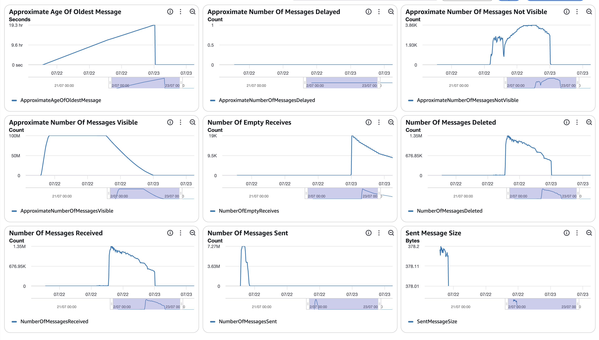
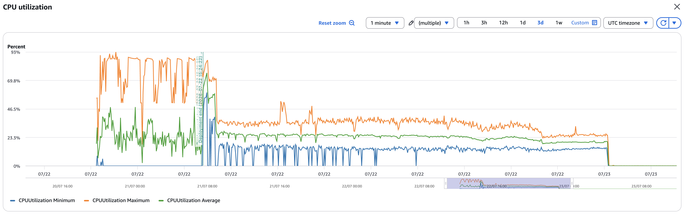
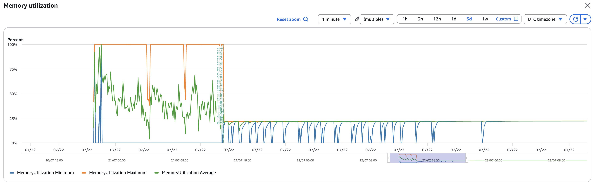
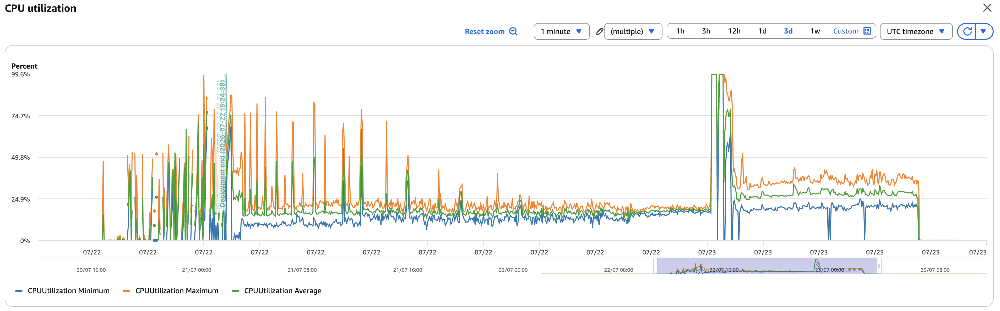
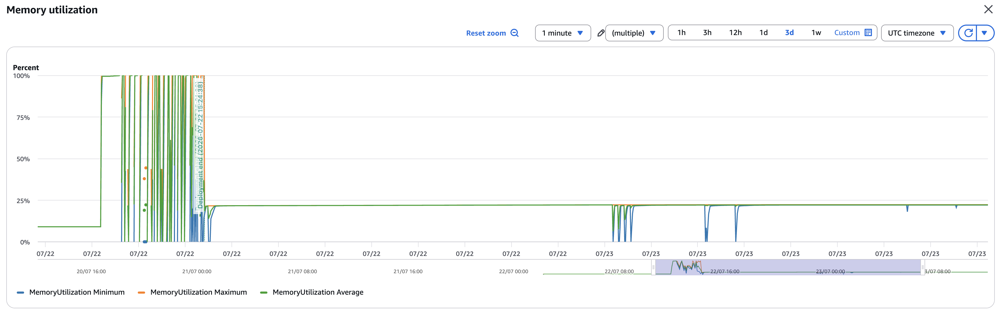
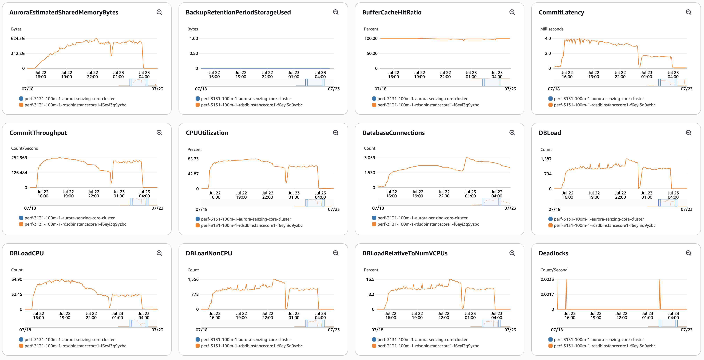
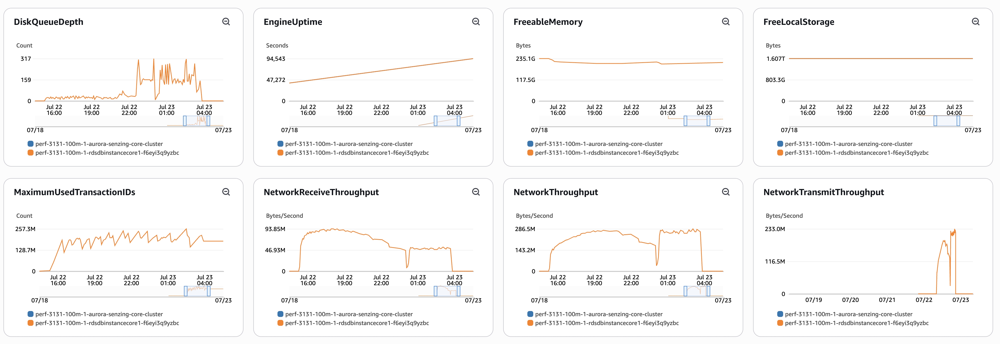
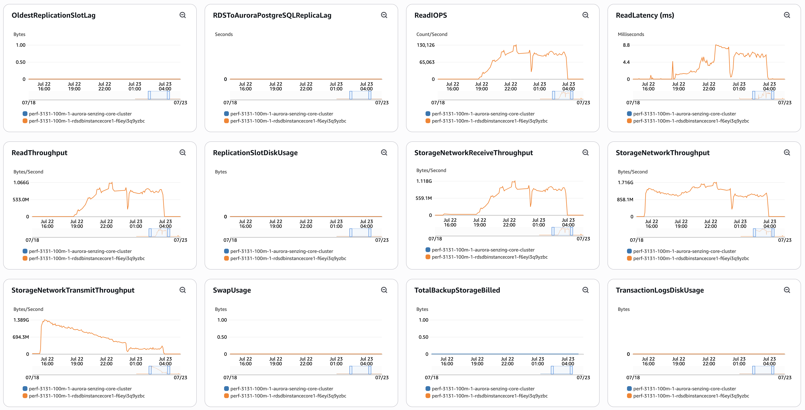
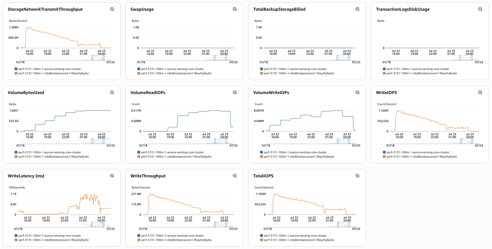

# senzing-test-results-20260722-100M-provisioned-r6i-24xlarge-single-senzing-3.13.1

> # 🛑 BLOCKED — two defective Senzing-published artifacts (not our template/config)
> Found at launch 2026-07-21. Our prep (3.x retrofit, version-matched images, mainline
> kept 4.x) is correct; the run can't complete because:
> 1. **Redoer image is broken.** `sz_simple_redoer:3.13.1` ENTRYPOINT is
>    `/app/sz_simple_redoer.py` (no wrapper, no runtime download), and the shipped
>    `/app/senzing_governor.py` **literally contains `404: Not Found`** — baked at BUILD
>    time from a dead governor URL. `import_module("senzing_governor")` → `SyntaxError`
>    → redoer can't start. **NOT template-fixable** → devops must rebuild/republish the
>    image with a valid governor. (Workaround: task-def `EntryPoint`/`Command` override to
>    write a governor before exec — but a wrong/no-op governor changes throttling and
>    makes results non-comparable; don't use it for the real run.)
> 2. **Producer source `.gz` truncated** → `EOFError` → short queue (94.05M/100M). Test
>    with `aws s3 cp s3://<src>.gz - | gzip -t`; re-upload if truncated. Recurs across
>    runs (92M/99.99M/94M) → input-data pipeline reliability issue.
> → Both go to devops/boss. Prep below stands for when the image + source are fixed.

> **This run: Senzing 3.13.1, 100M.** A 3.x baseline. `ENTITY_LOCK_MODE=ADVISORY` does
> not exist in 3.x, so `EnableEntityLockModeAdvisory=false` (advisory N/A).
>
> ✅ **Images verified pre-launch (runbook §1.5) — genuine 3.13.1.** NB two 3.x-vs-4.x
> differences found: 3.x lives in the **non-`-v4`** repos, and the version file is
> `/opt/senzing/g2/g2BuildVersion.json` (4.x uses `/opt/senzing/er/szBuildVersion.json`).
> - consumer: `public.ecr.aws/senzing/sz_sqs_consumer:3.13.1` → **3.13.1.25323** (BUILD 2025_11_19__18_32, DATA_VERSION 5.0.0) — build verified pre-launch via g2BuildVersion.json (running-task digest not separately recorded)
> - redoer:   `public.ecr.aws/senzing/sz_simple_redoer:3.13.1` → **3.13.1.25323** — build verified pre-launch (running-task digest not separately recorded)
> - sdk-tools: `public.ecr.aws/senzing/senzingapi-tools:3.13.1` → **3.13.1.25323** ✅
> - sshd:      `public.ecr.aws/senzing/sshd:3.13.1` → **3.13.1.25323** ✅
> - All four template images pinned to genuine 3.13.1.25323 (cfn-lint clean).
> - ⚠️ confirm these equal the **running** task digests (`describe-tasks`) once the stack is up.
>
> 📤 **Which template to upload:** for THIS 3.13.1 run, use **this dir's copy**
> ([`./cloudformationAuroraProvisionedSingleDB.yaml`](./cloudformationAuroraProvisionedSingleDB.yaml)
> — the 3.x-retrofitted one). The repo **root** `cloudformationAuroraProvisionedSingleDB.yaml`
> is the **4.x mainline** (kept intact); it is NOT for 3.x.
>
> ✅ **Template RETROFITTED for 3.x (2026-07-21)** — the 4.x init/config wiring was
> replaced with the proven 3.x wiring from the 20241120 3.12.3 reference run
> (`results/20241120-25M-v1-2-192-single-senzing-3.12.3/cloudformation.yaml`). Three
> changes (cfn-lint clean, no `/opt/senzing/er/` paths remain):
> - engine-config `RESOURCEPATH`: `/opt/senzing/er/resources` → `/opt/senzing/g2/resources` (×2)
> - `G2ConfigTool` cmd: `/opt/senzing/er/bin/sz_configtool` → `/opt/senzing/g2/python/G2ConfigTool.py`
> - `InitPostgresql`: `docker.io/senzing/init-database:latest` → `docker.io/senzing/init-postgresql:1.1.20`
>   — **verified genuine 3.13.1.25323** (same build as the engine images), so it creates
>   the correct 3.13.1 `g2` schema. (`SUBCOMMAND: mandatory`, unchanged — same in both.)
> `CONFIGPATH` / `SUPPORTPATH` were already identical; the 4 Senzing images already
> match the 3.x (non-`-v4`) repos.
>
> ✅ init image resolved: `init-postgresql:1.1.20` verified = **3.13.1.25323** (matches the
> engine images) — creates the correct 3.13.1 schema.
> ⚠️ Still worth doing at launch: **verify the schema after init, before loading** —
> connect via psql once the stack is up, confirm the Senzing mandatory tables exist /
> it's a 3.x (`g2`) schema. Cheap confirmation before burning 8h on the load. Also
> confirm the running-task image digests match the verified tags.

## Contents

1. [Overview](#overview)
1. [Caveats](#caveats)
1. [Results](#results)
    1. [Observations](#observations)
    1. [Final metrics](#final-metrics)
        1. [SQS](#sqs)
        1. [EFS](#efs)
        1. [ECS](#ecs)
        1. [RDS](#rds)
        1. [Logs](#logs)

## Overview

1. Performed: Jul 22–23, 2026 (baseline 07-22 13:05 UTC → capture 07-23 13:04 UTC; dir dated by start)
2. Senzing version: **3.13.1.25323** (BUILD 2025_11_19, DATA_VERSION 5.0.0) — verified via g2BuildVersion.json (see banner)
3. Instructions:
   [aws-cloudformation-performance-testing](https://github.com/senzing-garage/aws-cloudformation-performance-testing)
    1. [cloudformationAuroraProvisionedSingleDB.yaml](./cloudformationAuroraProvisionedSingleDB.yaml)
4. Changes:
    1. Pre-load input queue by setting loader DesiredCount and MinCapacity to 0
    1. Postgres 17.5
    1. Using X86_64 (AMD64) as `CpuArchitecture` for consumer, redoer, and sshd
    1. `RecordMax` = 100M
    1. DB instance class bumped to `db.r6i.24xlarge` (template edit — not a CFT parameter)
    1. **`EnableEntityLockModeAdvisory` = `false`** — advisory N/A (3.x has no
       `ENTITY_LOCK_MODE` feature)
    1. no Aurora read-offload (single `CONNECTION`, no `READ_ONLY_CONNECTION`)
    1. Senzing images pinned to `:3.13.1` on the correct **3.x (non-`-v4`) repos** —
       `sz_sqs_consumer`, `sz_simple_redoer`, `senzingapi-tools`, `sshd` (all verified
       3.13.1.25323) — not `:staging`, not the `-v4` repos
    1. `max_connections: 10000` in the DB parameter group
    1. `AcceptEula` / `SecurityResponsibility` launch prompts removed (inert)
    1. Region: **us-west-2** (cluster `perf-3131-100m-1-aurora-senzing-core-cluster`)
    1. **Consumer + redoer task size: 4 vCPU / 30 GB** (was 4.x-tuned to 2 vCPU / 4 GB —
       the 3.x `g2` engine OOM-kills at 4 GB; 30 GB matches the proven 3.12.x runs). NB
       Fargate forces ≥4 vCPU to allow 30 GB.
    1. ⚠️ **Task-count differs from the 4.x runs — expected, note for throughput
       comparison.** Because 3.x tasks are **4 vCPU** (vs the 4.x runs' 2 vCPU) and the
       loader autoscaling target is unchanged (~25% CPU), 3.x saturates at roughly **half**
       the task count: historically **~50–70 consumers at 100M** (3.8.0 ≈ 69, 3.9.1 ≈ 53)
       vs the 4.x runs' **~165** (4.4.0.26167) / **~172** (4.3.3.26191). So 3.13.1's
       throughput is **not task-size-matched** to the 4.x runs — fine for the
       correctness/unresolved comparison, but flag it when comparing records/sec.

## System

1. Database
    1. Aurora PosgreSQL Provisioned
    1. Single database
    1. Class: db.r6i.24xlarge
    1. IO Opt (StorageType: aurora-iopt1)
    1. sychronous commit, NOT turned off
    1. Auto scaling of loaders turned from 30% to 25% CPU
    1. Updated DB parameter group to enable some tracking:
    ```
    RdsDbParameterGroup:
    Properties:
      Description: !Sub '${AWS::StackName}-rds-db-parameter-group-description'
      Family: aurora-postgresql17
      Parameters:
        shared_preload_libraries: 'pg_stat_statements'
        track_io_timing: 1
        enable_seqscan: 0
        # pglogical.synchronous_commit: 0
    ```

## Results

### Observations

1. Inserts per second (Peak/Average/Time computed from [dsrc_record.csv](data/dsrc_record.csv); verify against the erpm query):
    1. Peak: 4,639/second (peak minute 278,336/min)
    1. Average over entire run: 2,529/second (over 659 loading minutes)
    1. Time to load 100M: 10.98 hours
    1. Records in dead-letter queue: 0
    1. Volume read IOPS Writer:      45,951,166   (ReadIOPS, writer instance, Sum over run)
    1. Volume read IOPS Reader:      n/a
    1. Volume write IOPS:            411,894,337  (WriteIOPS, writer instance, Sum over run)
    1. See [dsrc_record.csv](data/dsrc_record.csv)

1. Max tasks:

    - Max Consumer tasks: 96
    - Max Redoer tasks: 66

### Findings (3.13.1 baseline; compare to genuine 4.3.3.26191 and 4.4.0.26167)

> ✅ **Genuine 3.13.1 is the CLEANEST run of the three — but the slowest.**

1. **Zero records lost.** `res_ent_okey` = **99,998,927** = `obs_ent` → **0 unresolved**
   (`validate.sql` q1 & q2 both 0 rows). Matches genuine 4.3.3.26191 (0); unlike
   4.4.0.26167 (−40, silent OKEY orphan).

1. **Cleanest error/txn profile of all three.** `db.deadlocks` = **3**, `db.xact_rollback`
   = **241**, `UNHANDLED DATABASE ERROR` = **1**, `FAILED` = **5**, `ExclusiveLock on
   advisory lock` = **0**, `OKEY ORPHAN PREVENTED` = **0**, `INFINITE` = **0**. Notably it
   did **not** show the 4.3.3 connection-recovery cascade (4.3.3 had xact_rollback 184,354
   / UNHANDLED 8,006 / FAILED 12,009). The bulk of `error|except` (1,811) is `RetryTimeout`
   (1,764) — benign transient retries.

1. **Slower than 4.x (expected for the 3.x engine).** Peak 4,639/s, avg 2,529/s, load
   **10.98 h** — vs 4.3.3.26191 (5,518 / 3,199 / 8.68 h) and 4.4.0.26167 (6,074 / 3,365 /
   8.25 h). ~25–30 % lower avg throughput, ~27 % longer load. (Also a long redo tail:
   full baseline→capture window was ~24 h.)

1. **IOPS in-band, no anomaly.** ReadIOPS **45.95M** / WriteIOPS **411.9M** (Sum over the
   run, writer instance) — essentially 3.9.1's 100M numbers (47M / 413M) and alongside
   4.x (33–39M / 420–475M). *(The ~968M "read≈write" seen mid-capture was the wrong metric
   — cluster-storage `VolumeReadIOPs`/`VolumeWriteIOPs` — not the per-instance
   `ReadIOPS`/`WriteIOPS` the whole table uses. No vacuum-thrash / read regression.)*

1. **Advisory N/A** (3.x has no `ENTITY_LOCK_MODE`). **Task-count differs**: 4 vCPU/30 GB
   tasks → **96 consumers / 66 redoers** (vs 4.x's ~165–172 at 2 vCPU) — see the Changes
   note; throughput isn't task-size-matched to the 4.x runs.

**Bottom line:** 3.13.1 at 100M is **rock-solid on correctness** (0 unresolved, near-zero
errors) but **~25–30 % slower** than the 4.x builds. The 4.x runs are faster, but 4.4
silently drops records (OKEY-split); 3.13.1 drops none.

### Final metrics

#### SQS

##### SQS Metrics input queue



##### SQS Metrics output queue

N/A.  Ran without `withinfo` enabled.

#### ECS

##### Sz SQS Consumer CPU Utilization



##### Sz SQS Consumer Memory Utilization



##### Sz Simple Redoer CPU Utilization



##### Sz Simple Redoer Memory Utilization



#### RDS

##### Database Metrics CORE/LIBFEAT/RES final






##### Database IO / transaction deltas

Captured with the snapshot/diff harness (see
[performance-test runbook](../../docs/performance-test-runbook.md) §4 and
[`scripts/aurora-pg/`](../../scripts/aurora-pg/)).

```
=================== RUN WINDOW ===================
          baseline_at          |           final_at            |     elapsed
-------------------------------+-------------------------------+-----------------
 2026-07-22 13:05:45.346556+00 | 2026-07-23 13:04:09.486497+00 | 23:58:24.139941
(baseline PRE-load → full run incl. the long redo tail; wal_bytes blank on Aurora)

=================== FACT REPORT HEADLINE (eviction-immune) ===================
 logical_block_reads | physical_block_reads | xact_commit | tup_inserted | tup_updated | tup_deleted
---------------------+----------------------+-------------+--------------+-------------+-------------
        205775085384 |           2751896555 |  9283474331 |   4861018384 |  1057723536 |   422062645

=================== SCALAR DELTAS (key) ===================
 db.deadlocks     |          3        ← vs 617 (4.4.0.26167); cleanest of all runs
 db.xact_commit   | 9,283,474,331
 db.xact_rollback |        241        ← vs 698 (4.4) / 184,354 (4.3.3 cascade); cleanest
 db.blks_read     | 2,751,896,555     (physical); blks_hit 203,023,188,829
 db.tup_inserted  | 4,861,018,384
 db.tup_updated   | 1,057,723,536
 db.tup_deleted   |   422,062,645

=================== PER-TABLE DELTAS ===================
    relname     |    ins     |    upd    |    del    |  hot_upd  |  idx_scan  | heap_read
----------------+------------+-----------+-----------+-----------+------------+-----------
 res_feat_ekey  | 1652206558 |  31512063 |  92630198 |  15822706 | 5955693767 | 185620517
 res_feat_stat  | 1186968016 | 313861479 |         1 | 222469139 | 6483177202 | 138677688
 lib_feat       | 1186968446 |       852 |         3 |       658 | 7312359791 | 847368027
 res_rel_ekey   |  291684383 |         0 | 195412365 |         0 |  792840097 |  14667662
 res_relate     |  145842164 | 130371513 |  97706156 | 113394869 |  549253673 |  20003595
 obs_ent        |   99998927 | 272154148 |         0 | 217437916 | 1725939298 | 166372746
 res_ent        |   64314320 | 216892945 |   3277555 | 206245789 | 1619704648 |     56661
 res_ent_okey   |   99998927 |  59662321 |         0 |  43485942 | 1872557345 |    468433
 dsrc_record    |  100000000 |  33026138 |         0 |  19514581 |  885187673 | 151532960
 sys_eval_queue |   33025389 |         0 |  33025384 |         0 |  149260941 |  22195842
```

1. [pg_stat_io.csv](data/pg_stat_io.csv)
1. [pg_stat_statements.csv](data/pg_stat_statements.csv)

##### DSRC_RECORD

1. [dsrc_record.csv](data/dsrc_record.csv)

##### Match keys

1. [match_key_ent.csv](data/match_key_ent.csv)
1. [match_key_rel.csv](data/match_key_rel.csv)

#### Logs

Final counts + throughput (from final-capture.txt):

```
 relname        |  exact_rows  | note
----------------+--------------+-------------------------------------------
 dsrc_record    | 100,000,000  | = target
 obs_ent        |  99,998,927  |
 res_ent_okey   |  99,998,927  | = obs_ent  ✅ 0 unresolved (4.4: −40; 4.3.3: 0)
 res_ent        |  61,036,765  | resolved entities
 res_relate     |  48,136,004  | relationships
 sys_eval_queue |           0  | drained
 res_ent_active |     n/a       | final-capture res_ent_active query errored on 3.x
                               | (ent_state predicate); integrity confirmed via the 0
                               | unresolved above + validate 0/0

 validate.sql q1 (observed-but-unresolved): 0 rows
 validate.sql q2 (dangling keys):           0 rows
```

#### Errors

```

==============================================
Term                       |  instance count |
==============================================
(SENZ0086)                 |         0       |
(error|except)             |     1,811       |
(ExclusiveLock on advisory lock)|    0       |
(UNHANDLED DATABASE ERROR) |         1       |
(CORRUPTION_FOUND)         |         8       |
(RetryTimeout)             |     1,764       |
(FAILED)                   |         5       |
(INFINITE)                 |         0       |
(OKEY ORPHAN PREVENTED)    |         0       |
(MISSING_RES_ENT_AND_OKEY) |         0       |
(still)                    |        12       |
(stolen)                   |         3       |
(cancel)                   |         0       |
(another command is already in progress) | 0 |
==============================================

```

**Interpretation:** cleanest error profile of the three runs. `error|except` = 1,811, of
which **1,764 are `RetryTimeout`** (benign transient retries) — leaving only **1
`UNHANDLED DATABASE ERROR`, 5 `FAILED`, 8 `CORRUPTION_FOUND`, 0 `INFINITE`**. Crucially
**0 `ExclusiveLock on advisory lock`** and **0 `OKEY ORPHAN PREVENTED`** — 3.x has no
advisory path, so neither the 4.4 OKEY-split defect nor advisory-lock contention appears.
No connection-recovery cascade (unlike genuine 4.3.3's PQTRANS_INERROR pattern). Matches
the DB deltas: 3 deadlocks, 241 rollbacks, 0 unresolved records.

## Methods

Full step-by-step process is in the
[performance-test runbook](../../docs/performance-test-runbook.md) (note **§1.5 image
verification** — do it before loading). Reusable SQL helpers live in
[`scripts/aurora-pg/`](../../scripts/aurora-pg/).
