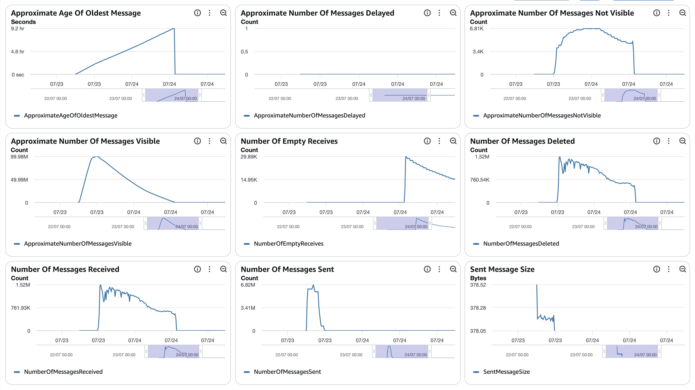
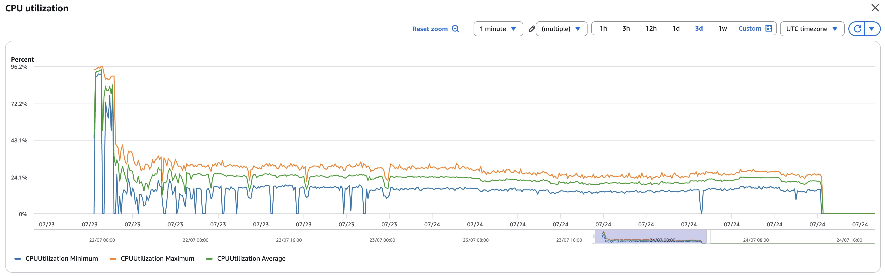
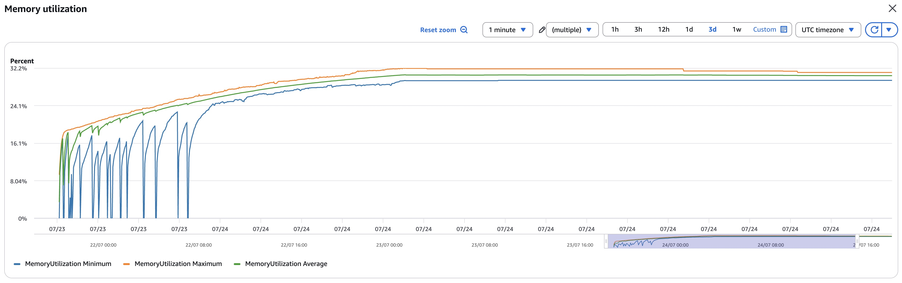
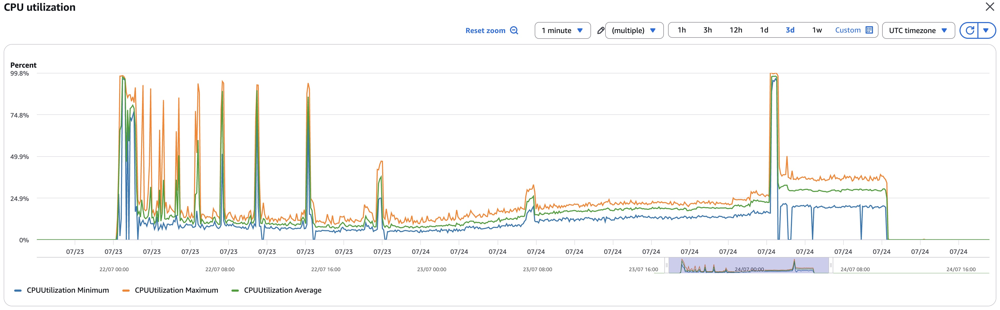
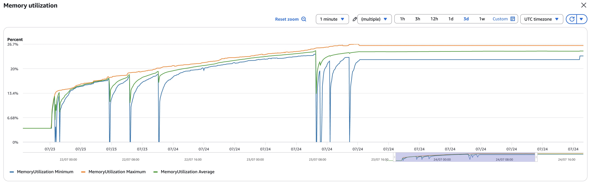
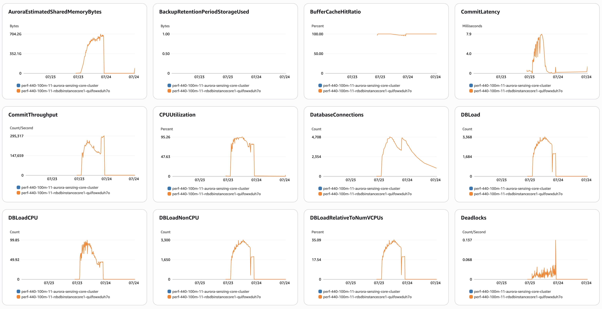
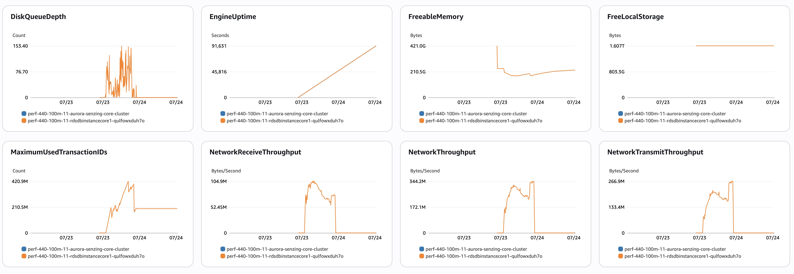
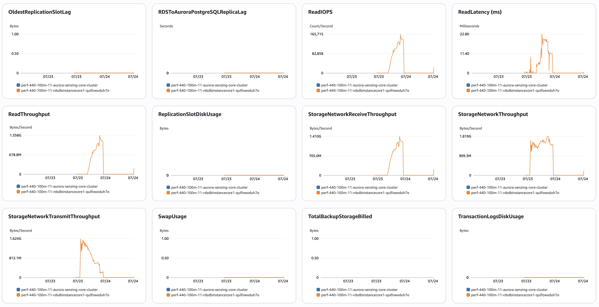
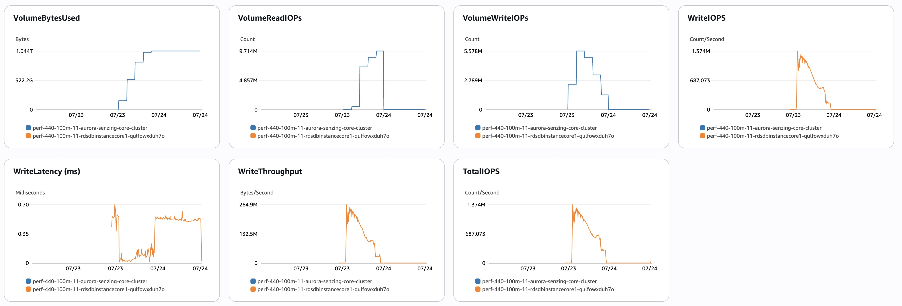

# senzing-test-results-20260723-100M-provisioned-r6i-24xlarge-single-senzing-4.4.0.26204

> **This run: Senzing 4.4.0.26204 (latest), 100M, advisory lock mode ON, + the new
> RES_ENT.FEATURES feature.** Two things differ vs the 20260715 4.4.0.26167 run
> (advisory ON, no FEATURES): (a) newer 4.4.0.26204 build, (b) `RES_ENT.FEATURES` column added
> pre-load. Question: does the FEATURES feature / newer build change the OKEY-split
> silent-orphan behavior (4.4.0.26167 lost **40** records) and/or throughput?

> 🧪 **REQUIRED PRE-LOAD STEP — add the RES_ENT.FEATURES column.** After the Senzing
> schema is initialized (RES_ENT exists) and **before starting the consumers**, run:
> ```bash
> $PG -f /tmp/4.4-add-res-ent-features.sql     # ALTER TABLE RES_ENT ADD COLUMN IF NOT EXISTS FEATURES TEXT;
> ```
> ([`scripts/aurora-pg/4.4-add-res-ent-features.sql`](../../scripts/aurora-pg/4.4-add-res-ent-features.sql))
> Records resolved before the column exists won't carry FEATURES — so this must happen
> **before any loading.** Suggested order: stack up → verify schema (RES_ENT present) →
> **run this ALTER** → `00-setup` → `10-baseline` → start consumers.

> ✅ **IMAGES VERIFIED — genuine 4.4.0.26204 (self-built, IMMUTABLE tag).** Devops added a
> GitHub Action so we build our own version and push it to ECR under a chosen immutable tag
> — no more `:staging` drift or mislabel risk (the root cause of every prior image mishap).
> All four `-v4` (4.x) images at `:4.4.0-26204` report BUILD_VERSION **4.4.0.26204** (BUILD
> 2026_07_23__14_03), verified via `/opt/senzing/er/szBuildVersion.json`:
> - consumer: `sz_sqs_consumer-v4:4.4.0-26204` → **4.4.0.26204** / digest `sha256:____` (was local; grab via `docker manifest inspect`)
> - redoer:   `sz_simple_redoer-v4:4.4.0-26204` → **4.4.0.26204** / digest `sha256:a2559966ac17a7cbaf1650f44b8b228dc86bb938ab572c602732109fc31c30da`
> - sdk-tools: `senzingsdk-tools:4.4.0-26204` → **4.4.0.26204** / digest `sha256:f4eaefb839ebcc145f45428299675306f632039587bd3d6b2b3e9addd42f8f79`
> - sshd:      `sshd:4.4.0-26204` → **4.4.0.26204** / digest `sha256:333bcdb7eb8b7f8b40e1930b9c1e6a1833a71cb0cf8f5db2c293cc91f1479607`
> Template pinned to `:4.4.0-26204` (immutable — can't drift). Confirm the **running-task**
> digests match these once the stack is up (§1.5).

## Contents

1. [Overview](#overview)
1. [Caveats](#caveats)
1. [Results](#results)
    1. [Observations](#observations)
    1. [Final metrics](#final-metrics)
        1. [SQS](#sqs)
        1. [EFS](#efs)
        1. [ECS](#ecs)
        1. [RDS](#rds)
        1. [Logs](#logs)

## Overview

1. Performed: Jul 23–24, 2026 (baseline 07-23 19:14 UTC → capture 07-24 19:20 UTC; load 07-23 20:03 → 07-24 04:33)
2. Senzing version: **4.4.0.26204** (self-built, verified via g2/szBuildVersion.json; immutable tag `:4.4.0-26204`)
3. Instructions:
   [aws-cloudformation-performance-testing](https://github.com/senzing-garage/aws-cloudformation-performance-testing)
    1. [cloudformationAuroraProvisionedSingleDB.yaml](./cloudformationAuroraProvisionedSingleDB.yaml)
4. Changes:
    1. Pre-load input queue by setting loader DesiredCount and MinCapacity to 0
    1. Postgres 17.5
    1. Using X86_64 (AMD64) as `CpuArchitecture` for consumer, redoer, and sshd
    1. `RecordMax` = 100M
    1. DB instance class bumped to `db.r6i.24xlarge` (template edit — not a CFT parameter)
    1. **`EnableEntityLockModeAdvisory` = `true`** — advisory lock mode ON (adds
       `"ER": {"ENTITY_LOCK_MODE": "ADVISORY"}`), same as the 20260715 4.4 run
    1. **NEW: `ALTER TABLE RES_ENT ADD COLUMN FEATURES TEXT` run pre-load** (see banner) —
       enables the 4.4 features-on-RES_ENT capability
    1. no Aurora read-offload (single `CONNECTION`, no `READ_ONLY_CONNECTION`)
    1. Senzing images = **`:4.4.0-26204`** (immutable, self-built) on the `-v4` (4.x) repos —
       all four verified 4.4.0.26204; not `:staging`, not `:4.3.3`, not the non-`-v4` 3.x repos
    1. `max_connections: 10000` in the DB parameter group
    1. Consumer + redoer task size **2 vCPU / 4 GB** (4.x-appropriate; 4.x engine is
       memory-light — do NOT use the 3.x 30 GB sizing). Expect ~165 consumers at peak
       (2 vCPU tasks), like the prior 4.x runs.
    1. `AcceptEula` / `SecurityResponsibility` launch prompts removed (inert)
    1. Region: fill in at run time (us-east-2 if 24xlarge capacity; else us-west-2)

## System

1. Database
    1. Aurora PosgreSQL Provisioned
    1. Single database
    1. Class: db.r6i.24xlarge
    1. IO Opt (StorageType: aurora-iopt1)
    1. sychronous commit, NOT turned off
    1. Auto scaling of loaders turned from 30% to 25% CPU
    1. Updated DB parameter group to enable some tracking:
    ```
    RdsDbParameterGroup:
    Properties:
      Description: !Sub '${AWS::StackName}-rds-db-parameter-group-description'
      Family: aurora-postgresql17
      Parameters:
        shared_preload_libraries: 'pg_stat_statements'
        track_io_timing: 1
        enable_seqscan: 0
        # pglogical.synchronous_commit: 0
    ```

## Results

### Observations

1. Inserts per second (Peak/Average/Time computed from [dsrc_record.csv](data/dsrc_record.csv); verify against the erpm query):
    1. Peak: 5,814/second
    1. Average over entire run: 3,262/second (erpm 195,951; final-capture avg 3,266/s)
    1. Time to load 100M: 8.52 hours
    1. Records in dead-letter queue: 0
    1. Volume read IOPS Writer:       40,413,738   (ReadIOPS, writer instance, Sum — NOT VolumeReadIOPs)
    1. Volume read IOPS Reader:      n/a
    1. Volume write IOPS:            446,299,279   (WriteIOPS, writer instance, Sum)
    1. See [dsrc_record.csv](data/dsrc_record.csv)

1. Max tasks:

    - Max Consumer tasks: 169
    - Max Redoer tasks: 106

### Findings (4.4.0.26204 + FEATURES vs 20260715 4.4.0.26167)

> ⚠️ **FEATURES did NOT fix the OKEY-split silent-orphan regression** — it persists in
> the latest 4.4 build, essentially unchanged.

1. **30 records unresolved** — `res_ent_okey` = 99,998,897 = `obs_ent` (99,998,927) − **30**.
   vs 4.4.0.26167's **40**. Same defect, slightly fewer. Genuine 4.3.3.26191 and 3.13.1
   had **0**. So the newer build + the RES_ENT.FEATURES column did **not** resolve it.

1. 🔑 **OKEY-ORPHAN correlation (answers "do the 9 logged entries match the orphans?").**
   The `oent-swap-okey-split-commit-regression` fired **9** times. Cross-referenced against
   the 30 unresolved:
   - **4 of the 9 are directly unresolved** (obsEntID = an unresolved obs_ent_id, self-loop
     "target destroyed", redo self-heal **did not converge**): **30713079, 70558554,
     78090853, 105301184**.
   - **3 OKEY-orphan entities self-healed** (NOT unresolved — redo *did* converge): the
     interlinked swap cluster **25959634 / 70538971 / 76509533**.
   - **26 of the 30 unresolved have NO log at all** — silent drops.
   → Same **logged-minority / silent-majority** shape as 4.4.0.26167 (there: 10 logged /
     30 silent). The OKEY-split path is the mechanism for the logged ones; the silent
     majority abort earlier (advisory-lock timeouts before the OKEY swap).

1. **Same hot input records recur across builds.** Several unresolved `record_id`s here
   (562372142–148, 568258238/243, 496192336/339, 483578320/323) were also unresolved in
   prior 4.4/hybrid runs → specific hot / duplicate-heavy entities lose the advisory-lock
   fight regardless of version.

1. **Engine-dev record-level query — NOT exact duplicates; hot multi-record entities.**
   The engine team's record-level orphan query (`DSRC_RECORD → OBS_ENT → RES_ENT_OKEY`,
   `WHERE reo.RES_ENT_ID IS NULL`) returned **exactly the same 30** (30 rows, 30 distinct
   `obs_ent_id`, **0 null `obs_ent_id`** — every orphan *was* observed, just never got a
   RES_ENT_OKEY). **1:1 record↔obs_ent ⇒ no `ent_src_key` exact-duplicates** among the
   orphans (rules out the "same record loaded twice" theory). BUT **16 of the 30
   `record_id`s cluster consecutively** — `562372142,143,144,147,148` (×5),
   `550250960,961,962` (×3), plus pairs `483578320/323`, `496192336/339`, `568258238/243`,
   `586500813/818`. Consecutive record_ids = multiple records of the **same real-world
   entity**, so the orphans concentrate on a handful of **hot, merge-heavy entities**
   (resolution-level duplication, not exact dupes) — exactly what stresses the OKEY
   split/swap. **Reproduction candidate for engine dev: the `562372142–148` cluster** (one
   hot entity, 5 records, all orphaned, recurring across every 4.4 build) — re-drive
   through `addRecord` on a quiet system to trigger the OKEY-split live. Full 30-record
   list in Logs below.

1. **Throughput ≈ 4.4.0.26167 (FEATURES didn't cost meaningfully).** Peak 5,814/s, avg
   3,262/s, load 8.52 h — vs 26167's 6,074 / 3,365 / 8.25 h. Within run-to-run noise.
   (Slightly higher IOPS, plausibly the extra RES_ENT.FEATURES writes.)

1. **Error profile ≈ 4.4.0.26167** (advisory contention, no cascade): `db.deadlocks` 729
   (26167: 617), `xact_rollback` 978 (698), `ExclusiveLock on advisory lock` 1,290,
   `CORRUPTION_FOUND` 143 (104), `INFINITE` 14 (22), `UNHANDLED DATABASE ERROR` 0, `FAILED` 0.

1. **FEATURES populated ✅** — final `res_ent where features is not null` = **61,120,255**
   of **61,120,258** res_ent (3 short — 99.99999%). So the RES_ENT.FEATURES feature worked
   as intended: essentially every resolved entity carries FEATURES.

**Bottom line:** 4.4.0.26204 + FEATURES behaves like 4.4.0.26167 — the OKEY-split
regression is still there (30 vs 40 silent orphans, same mechanism), throughput and errors
are ~unchanged. FEATURES is populated and costs no meaningful throughput, but it does not
address the unresolved-records defect. **Escalate: the regression persists in the latest
4.4.** (The clean comparators remain genuine 4.3.3.26191 / 3.13.1, both 0 unresolved.)

### Final metrics

#### SQS

##### SQS Metrics input queue



##### SQS Metrics output queue

N/A.  Ran without `withinfo` enabled.

#### ECS

##### Sz SQS Consumer CPU Utilization



##### Sz SQS Consumer Memory Utilization



##### Sz Simple Redoer CPU Utilization



##### Sz Simple Redoer Memory Utilization



#### RDS

##### Database Metrics CORE/LIBFEAT/RES final






##### Database IO / transaction deltas

Captured with the snapshot/diff harness (see
[performance-test runbook](../../docs/performance-test-runbook.md) §4 and
[`scripts/aurora-pg/`](../../scripts/aurora-pg/)).

```
=================== RUN WINDOW ===================
         baseline_at          |           final_at            |        elapsed
------------------------------+-------------------------------+-----------------------
 2026-07-23 19:14:28.33179+00 | 2026-07-24 19:20:23.928207+00 | 1 day 00:05:55.596417
(baseline PRE-load → full run incl. redo tail; wal_bytes blank on Aurora)

=================== FACT REPORT HEADLINE (eviction-immune) ===================
 logical_block_reads | physical_block_reads | xact_commit | tup_inserted | tup_updated | tup_deleted
---------------------+----------------------+-------------+--------------+-------------+-------------
        199696273321 |           2431449930 |  7643455695 |   5230003450 |  1512979914 |   259473316

=================== SCALAR DELTAS (key) ===================
 db.deadlocks     |        729        ← advisory-lock deadlocks (26167: 617)
 db.xact_commit   | 7,643,455,695
 db.xact_rollback |        978        ← (26167: 698); no cascade
 db.blks_read     | 2,431,449,930     (physical); blks_hit 197,264,823,391
 db.tup_inserted  | 5,230,003,450
 db.tup_updated   | 1,512,979,914
 db.tup_deleted   |   259,473,316

=================== PER-TABLE DELTAS ===================
    relname     |    ins     |    upd    |   del    |  hot_upd  |  idx_scan  | heap_read
----------------+------------+-----------+----------+-----------+------------+-----------
 res_feat_ekey  | 1856765451 | 367834571 | 96892105 | 213845275 | 3151641909 | 333139642
 res_feat_stat  | 1373817361 | 311401150 |       24 | 238160709 | 6126637622 |  96935111
 lib_feat       | 1373848309 |      4150 |       83 |      3015 | 8738265501 | 787136724
 res_ent        |   65782086 | 405701593 |  4661828 | 265414282 | 3742536043 | 112484265
 obs_ent        |   99998927 | 274386492 |        0 | 215915474 | 1631103439 | 117170405
 res_relate     |   73117717 |  81464565 | 39160155 |  52275566 |  500375228 | 130386241
 res_ent_okey   |  104796993 |  37321964 |  4797993 |  32422852 | 1844517381 |    311322
 dsrc_record    |  100000000 |  34835859 |        0 |  18339318 |  846334463 | 104781615
 sys_eval_queue |   35632816 |         0 | 35632788 |         0 |  168952451 |  24972667
```

1. [pg_stat_io.csv](data/pg_stat_io.csv)
1. [pg_stat_statements.csv](data/pg_stat_statements.csv)

##### DSRC_RECORD

1. [dsrc_record.csv](data/dsrc_record.csv)

##### Match keys

1. [match_key_ent.csv](data/match_key_ent.csv)
1. [match_key_rel.csv](data/match_key_rel.csv)

#### Logs

Final counts + throughput (from final-capture.txt):

```
 relname        |  exact_rows  | note
----------------+--------------+-------------------------------------------
 dsrc_record    | 100,000,000  | = target
 obs_ent        |  99,998,927  |
 res_ent_okey   |  99,998,897  | obs_ent − 30  ⚠️ 30 unresolved (26167: −40; 4.3.3/3.13.1: 0)
 res_ent        |  61,120,258  | resolved entities
 res_relate     |  33,957,524  | relationships
 sys_eval_queue |           0  | drained
 res_ent_active |         329  | ent_state≠0

 load 2026-07-23 20:03:22 → 2026-07-24 04:33:42  |  08:30:19  |  erpm 195,951  |  avg 3,266/s
```

`validate.sql` q1 (observed-but-unresolved) = **30 rows**; q2 (dangling) = **0 rows**.
The **4** rows marked `← OKEY` are the ones with a matching `OKEY ORPHAN PREVENTED` log
(redo self-heal did not converge); the other 26 are silent. See Findings for the full
correlation.

```
 record_id | obs_ent_id | note
-----------+------------+------
 550657007 |   30713079 | ← OKEY
 496192336 |   70558554 | ← OKEY
 460069378 |  105301184 | ← OKEY
 423902938 |   78090853 | ← OKEY
 495730250 |   52702695 |
 574010097 |   61336134 |
 387577758 |   68006357 |
 562372148 |   63564192 |
 568258243 |   52293916 |
 531895342 |   86108145 |
 562372147 |   43319557 |
 550250962 |   38573892 |
 507695948 |   78871392 |
 580241863 |   98749073 |
 562372142 |   14733586 |
 496192339 |   54528088 |
 562372143 |   10500240 |
 483578320 |   83452060 |
 568258238 |   99309067 |
 586500813 |   71517783 |
 586661724 |   87444315 |
 550250960 |   27171799 |
 489436685 |   68737019 |
 417306800 |   99257737 |
 483578323 |   59904181 |
 550250961 |   41243561 |
 453826536 |   47949505 |
 586500818 |   40283221 |
 465645357 |   62366457 |
 562372144 |   16352329 |
(30 rows)
```

**FEATURES:** populated ✅ — final `select count(*) from res_ent where features is not null`
= **61,120,255** of res_ent 61,120,258 (3 short; ~100%). The feature worked as intended.

#### Errors

```

==============================================
Term                       |  instance count |
==============================================
(SENZ0086)                 |         0       |
(error|except)             |     1,481       |
(ExclusiveLock on advisory lock)|1,290       |
(UNHANDLED DATABASE ERROR) |         0       |
(CORRUPTION_FOUND)         |       143       |
(RetryTimeout)             |         0       |
(FAILED)                   |         0       |
(INFINITE)                 |        14       |
(OKEY ORPHAN PREVENTED)    |         9       |
(MISSING_RES_ENT_AND_OKEY) |         0       |
(still)                    |         0       |
(stolen)                   |         3       |
(cancel)                   |        12       | included in error
(another command is already in progress) | 0 |
==============================================

error|except:
2026-07-24 06:05:47.786 [szstatic:7ffa52ffd6c0] ERR: PQresultStatus returned [(7:0:ERROR:  canceling statement due to lock timeout; ;55P03)] executing: SELECT pg_advisory_lock($1)
2026-07-24 06:05:47 UTC:10.0.11.39(37640):senzing@G2:[30864]:ERROR:  canceling statement due to lock timeout

ExclusiveLock on advisory lock:
2026-07-24 06:04:37.672 [szstatic:7f72017fa6c0] ERR: PQresultStatus returned [(7:0:ERROR:  deadlock detected; DETAIL:  Process 31330 waits for ExclusiveLock on advisory lock [16412,766509056,44626360,1]; blocked by process 31724.; Process 31724 waits for ExclusiveLock on advisory lock [16412,766509056,2758902,1]; blocked by process 31330.; HINT:  See server log for query details.; ;Process 31330 waits for ExclusiveLock on advisory lock [16412,766509056,44626360,1]; blocked by process 31724.; Process 31724 waits for ExclusiveLock on advisory lock [16412,766509056,2758902,1]; blocked by process 31330.40P01)] executing: SELECT pg_advisory_lock($1)
2026-07-24 06:04:37 UTC:10.0.9.122(53922):senzing@G2:[31330]:DETAIL:  Process 31330 waits for ExclusiveLock on advisory lock [16412,766509056,44626360,1]; blocked by process 31724.
	Process 31724 waits for ExclusiveLock on advisory lock [16412,766509056,2758902,1]; blocked by process 31330.
	Process 31330: SELECT pg_advisory_lock($1)
	Process 31724: SELECT pg_advisory_lock($1)

deadlock detected:
2026-07-24 06:04:37 UTC:10.0.8.224(47924):senzing@G2:[26179]:ERROR:  deadlock detected

INFINITE:
2026-07-24 04:58:17.085 [szstatic:7f511e7fc6c0] ERR: DETECTED POTENTIAL INFINITE RESOLUTION LOOP: UNRESOLVE MOVEMENT COUNT OF 20 EXCEEDED

OKEY ORPHAN PREVENTED:
2026-07-24 04:00:22.163 [szstatic:7f8121ffb6c0] ERR: OKEY ORPHAN PREVENTED: obsEntID=105301184 OKEY-remove from live resEntID=105301184 SUPPRESSED — its add to resEntID=105301184 was dropped (target destroyed); kept on source to avoid a dropped record (placement self-heals via redo). See FAQ oent-swap-okey-split-commit-regression.
2026-07-24 02:14:57.630 [szstatic:7f8346ffd6c0] ERR: OKEY ORPHAN PREVENTED: obsEntID=78090853 OKEY-remove from live resEntID=78090853 SUPPRESSED — its add to resEntID=78090853 was dropped (target destroyed); kept on source to avoid a dropped record (placement self-heals via redo). See FAQ oent-swap-okey-split-commit-regression.
2026-07-24 02:03:20.710 [szstatic:7fd3067fc6c0] ERR: OKEY ORPHAN PREVENTED: obsEntID=76509533 OKEY-remove from live resEntID=70538971 SUPPRESSED — its add to resEntID=25959634 was dropped (target destroyed); kept on source to avoid a dropped record (placement self-heals via redo). See FAQ oent-swap-okey-split-commit-regression.
2026-07-24 02:03:20.710 [szstatic:7fd3067fc6c0] ERR: OKEY ORPHAN PREVENTED: obsEntID=70538971 OKEY-remove from live resEntID=70538971 SUPPRESSED — its add to resEntID=25959634 was dropped (target destroyed); kept on source to avoid a dropped record (placement self-heals via redo). See FAQ oent-swap-okey-split-commit-regression.
2026-07-24 02:03:20.710 [szstatic:7fd3067fc6c0] ERR: OKEY ORPHAN PREVENTED: obsEntID=70538971 OKEY-remove from live resEntID=25959634 SUPPRESSED — its add to resEntID=25959634 was dropped (target destroyed); kept on source to avoid a dropped record (placement self-heals via redo). See FAQ oent-swap-okey-split-commit-regression.
2026-07-24 02:03:20.710 [szstatic:7fd3067fc6c0] ERR: OKEY ORPHAN PREVENTED: obsEntID=25959634 OKEY-remove from live resEntID=25959634 SUPPRESSED — its add to resEntID=25959634 was dropped (target destroyed); kept on source to avoid a dropped record (placement self-heals via redo). See FAQ oent-swap-okey-split-commit-regression.
2026-07-24 02:03:20.710 [szstatic:7fd3067fc6c0] ERR: OKEY ORPHAN PREVENTED: obsEntID=76509533 OKEY-remove from live resEntID=25959634 SUPPRESSED — its add to resEntID=25959634 was dropped (target destroyed); kept on source to avoid a dropped record (placement self-heals via redo). See FAQ oent-swap-okey-split-commit-regression.
2026-07-24 01:01:40.838 [szstatic:7f401b7fe6c0] ERR: OKEY ORPHAN PREVENTED: obsEntID=70558554 OKEY-remove from live resEntID=70558554 SUPPRESSED — its add to resEntID=70558554 was dropped (target destroyed); kept on source to avoid a dropped record (placement self-heals via redo). See FAQ oent-swap-okey-split-commit-regression.
2026-07-23 21:53:11.965 [szstatic:7fcea1efb6c0] ERR: OKEY ORPHAN PREVENTED: obsEntID=30713079 OKEY-remove from live resEntID=30713079 SUPPRESSED — its add to resEntID=30713079 was dropped (target destroyed); kept on source to avoid a dropped record (placement self-heals via redo). See FAQ oent-swap-okey-split-commit-regression.


```

**Interpretation (Errors):** the bulk of `error|except` (1,290 of 1,481) is
`ExclusiveLock on advisory lock` — advisory-lock deadlocks/timeouts (`55P03`/`40P01` on
`SELECT pg_advisory_lock`), matching `db.deadlocks` 729. Clean otherwise: 0 `UNHANDLED
DATABASE ERROR`, 0 `FAILED` (no connection-recovery cascade). `CORRUPTION_FOUND` 143,
`INFINITE` 14, `OKEY ORPHAN PREVENTED` 9 (see Findings — 4 correlate to unresolved
records). Profile ≈ the 4.4.0.26167 run: advisory-lock contention + the OKEY-split
regression, no cascade.

## Methods

Full step-by-step process is in the
[performance-test runbook](../../docs/performance-test-runbook.md) (note **§1.5 image
verification** before loading, and the **RES_ENT.FEATURES ALTER** in the banner — run it
after schema init, before loaders). Reusable SQL helpers live in
[`scripts/aurora-pg/`](../../scripts/aurora-pg/).
