# senzing-test-results-20260826-1M-provisioned-r6i-8xlarge-single-senzing-4.4.0.26232-embeddings

> **First full-dataset EMBEDDING perf run** — OpenSanctions embedded-feature data
> (`dataset_full.fixed.jsonl`, re-hosted from the `.tar.gz` as plain JSONL:
> **1,001,435 records**, 20.23 GB). This is the BASELINE embedding run
> (`EnableEntityLockModeAdvisory=false`), so a later advisory run can be compared to it.
>
> **Engine-team findings** (lock contention + `varchar(255)` overflow + missing SQS permission)
> are documented with verbatim log evidence in an internal engine-findings doc (kept out of this
> public repo — it contains OpenSanctions record content — and sent to the engine team directly).

## Contents
1. Overview
2. Caveats
3. Results (Observations / Findings / Final metrics)
4. Methods

## Overview
1. **Performed:** 2026-08-26. Baseline captured 17:58:40 UTC; consumers started 17:59:31 UTC;
   `dsrc_record` insert window 17:59–18:19 UTC (~20 min); SQS input drained ~18:53 UTC;
   redo/re-eval drained ~20:13 UTC; capture 20:17–20:18 UTC. Full baseline→final window **02:19:07**.
2. **Senzing version:** 4.4.0-26232 (self-built immutable tag; verified via `szBuildVersion.json` + task `imageDigest`):
   consumer `sz_sqs_consumer-v4:4.4.0-26232`, redoer `sz_simple_redoer-v4:4.4.0-26232`,
   tools `senzingsdk-tools:4.4.0-26232`; producer `stream-producer:1.8.7`.
3. **Instructions:** repo root README + `docs/performance-test-runbook.md`; exact CFT copy in this dir (`cloudformationAuroraProvisionedSingleDB-embeddings.yaml`)
4. **Changes from default (embedding run):**
   - Embedding CFT variant: pgvector extension + `NAME_EMBEDDING` / `BIZNAME_EMBEDDING` / `SEMANTIC_VALUE`
     tables (`LABEL TEXT`, `EMBEDDING VECTOR(512)`, HNSW OFF for fast load)
   - Config: load-only embedding features (behavior FF, candidates No, `NULL_COMP`) + `EMBEDDED_SEARCH`
     search profile; data sources incl. OPEN_SANCTIONS
   - Producer: `SENZING_SUBCOMMAND=json-to-sqs` (non-batched); **`InputUrl` = presigned https URL** to
     `s3://embedded-feature-data/dataset_full.fixed.jsonl` (the `s3://` scheme uses a whole-file reader that
     OOMs on 20 GB; the `https` scheme streams line-by-line — see Methods)
   - `EnableEntityLockModeAdvisory=false` (baseline)
   - DB instance class: **db.r6i.8xlarge** (1.0M records ≤ 25M → 25M-baseline class)
   - `RecordMax=25M` (cap; dataset is 1,001,435 records)
   - Region us-east-2; data bucket `embedded-feature-data` (us-east-1, same account)

## System
- Aurora PostgreSQL **17.5**, Provisioned, single DB, **db.r6i.8xlarge**, IO-optimized (`aurora-iopt1`)
- Autoscale: target 25% CPU, Min 0 / Max 200; consumers started manually (desired 8) AFTER the queue was fully loaded
- DB parameter groups: `shared_preload_libraries=pg_stat_statements`, `track_io_timing=1`, `enable_seqscan=0`, `max_connections=10000`, `work_mem=4096kB`

## Caveats
- **Oversized records:** 5,690 records exceeded SQS's 256 KB per-message limit and were skipped by the producer
  (never queued; e.g. one record was 991 KB over). Loaded count is computed over what actually reached the DB.
  These are the largest/most-aliased entities; the non-embedding baseline datasets have no such records, so
  excluding them keeps this run comparable.
- Record accounting: 1,001,435 total − 5,690 oversized = **995,745 queued**. `dsrc_record` = **995,744**
  (1 record crashed pre-insert on a `varchar(255)` overflow, Finding 2).
  `res_ent_okey` = 995,738 (the 6 lock-contention records inserted but never resolved → OKEY-orphans, Finding 1).
- Throughput/time computed over the actual loaded records, not the nominal dataset size.

## Results
### Observations
Inserts per second (from `data/dsrc_record.csv`; cross-checked vs the erpm query):
- **Peak:** **2,077** /second (124,602 inserts in the 18:11 bucket)
- **Average over entire run:** **790** /second (mean ipm/60; erpm **49,765.6**/min → 829.4/s; final-capture avg **829.4**/s)
- **Time to load 995,744 (`dsrc_record` insert window):** **~20 min (0.33 h)**. NB: record *insertion* was fast;
  entity-resolution + redo/re-eval was the long tail — SQS drained ~18:53 and redo finished ~20:13 (full window 02:19).
- **Records in dead-letter queue:** **7** (6 lock-contention `SzRetryTimeoutExceeded` + 1 `varchar(255)` overflow; see Findings)
- **Records loaded (`dsrc_record`):** **995,744** (of 1,001,435 total; 5,690 oversized-skipped + 1 varchar-poison not inserted)
- **Total read IOPS (writer):** **0.7** (≈0; sum of per-minute `ReadIOPS` across the run — the standard basis).
  This is real, not a glitch: the 1M working set fit entirely in the 256 GB buffer cache, so effectively **no storage
  reads** — DB-side confirms **151 physical block reads total vs 2.34B cache hits**. (The 25M runs show ~1–2M read
  IOPS because that DB is ~25× larger and spills the cache.)
- **Total write IOPS (writer):** **7,224,994** (sum of per-minute `WriteIOPS` across the run — same basis as the
  historical 25M runs) ≈ **7.3 write-IOPS/record** vs ~4.6/record for the 25M non-embedding runs → embeddings
  **~1.6× more write I/O per record**. Instance rate peaked ~594,697/s (1-min) during the 20-min insert;
  the run was **write-I/O-bound**. Raw series: `data/rds_metrics.csv`.
- **Max Consumer tasks:** **48**  **Max Redoer tasks:** **39** (autoscaled from 8)

Entity resolution outcome (`data/final-capture.txt`, `data/match_key_*.csv`):
- `obs_ent`=995,744; `res_ent`=**984,625** resolved entities (995,744 records → ~11,119 merges, ~1.1% match rate);
  `res_relate`=791,679 relationships; `sys_eval_queue`=0 (drained)
- **Embeddings contribute to resolution:** of 10,985 non-singleton matches, **3,074 (28%) involved `SEMANTIC_VALUE`**
  (embedding feature) — e.g. `+NAME+SEMANTIC_VALUE` (2,152), `+NAME+ADDRESS+SEMANTIC_VALUE` (573)
- Embedding vector storage: `name_embedding`=**657,236** rows; `semantic_value`=**107,698** rows;
  `bizname_embedding`=0 (no BIZNAME_EMBEDDINGS in this data)

### Findings
Summary (full verbatim-log detail is in the internal engine-findings doc — not committed; it contains OpenSanctions record content):
1. **Lock contention on shared super-entities** (`SzRetryTimeoutExceeded`, SENZ0010, 300 s window): 7 records timed
   out in a 54 s burst at peak concurrency, blocking on a few large shared super-entities (one recurring in 4/7
   locklists; one record needed 11 entities locked at once). 6 → DLQ (= the 6 OKEY-orphans), 1 recovered. Also **257 PostgreSQL deadlocks** during the
   run. Engine-side / expected under concurrency; the advisory=true run is the planned comparison.
2. **`varchar(255)` overflow → consumer crash** (`SzDatabaseError 1015`, SQLSTATE 22001): a 274-char `REL_POINTER_ROLE`
   (OpenSanctions relationship-rationale sentence) overflowed a core Senzing `character varying(255)` column; the
   consumer *crashed* ("Shutting down"), the record redelivered and crashed 5 tasks before DLQ. Distinct from the
   pgvector `LABEL→TEXT` fix. Real-world text exceeds Senzing varchar widths. Flag to engine.
3. **Consumer role missing `sqs:ChangeMessageVisibility`** (fixed in CFTs 2026-08-26): consumers crashed with
   AccessDenied when extending visibility on long/contended records (2 crashes during the contention burst) —
   compounded Finding 1.
- Top write hot-spots (`data/final-deltas.txt`): `UPDATE RES_ENT SET ENT_STATE` (1.46M calls, 229,746 s),
  `UPDATE RES_FEAT_STAT` (5.18M calls, 102,854 s), `INSERT DSRC_RECORD` (995,745 calls, 31,232 s). ~104M rows
  inserted, 67.8M commits.

### Final metrics
#### SQS  `<input/output/DLQ metric images>`

##### SQS Metrics input queue

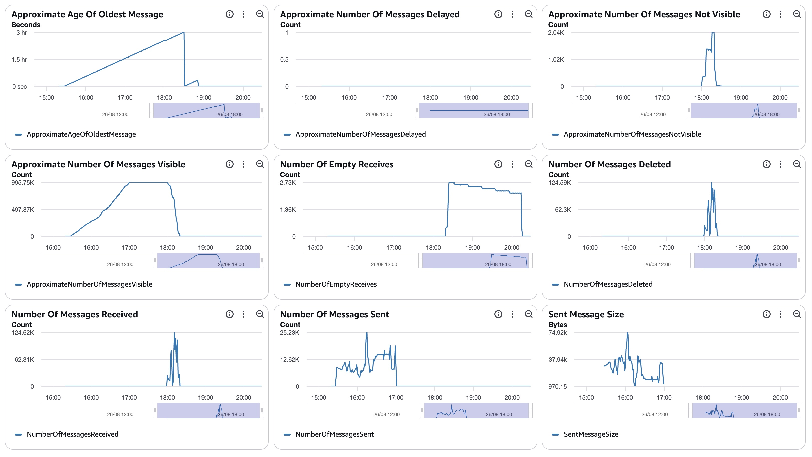

##### SQS Metrics output queue

N/A.  Ran without `withinfo` enabled.

#### ECS  `<consumer + redoer CPU/memory images>` (max consumer 48, redoer 39)

##### Sz SQS Consumer CPU Utilization

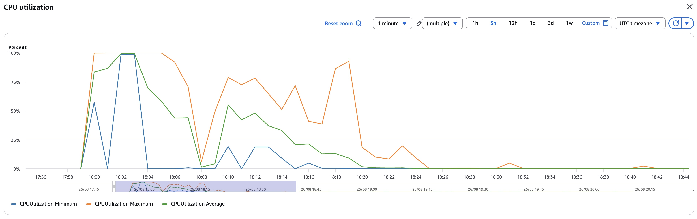

##### Sz SQS Consumer Memory Utilization

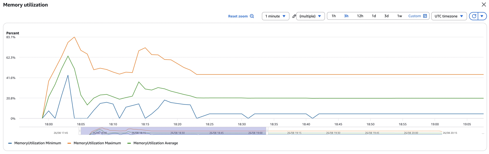

##### Sz Simple Redoer CPU Utilization

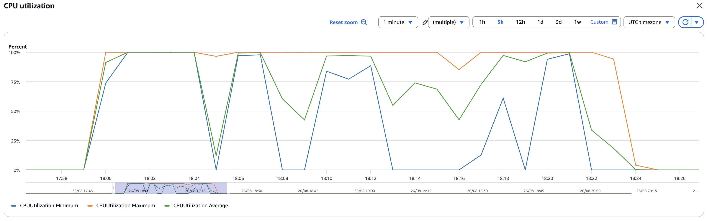

##### Sz Simple Redoer Memory Utilization

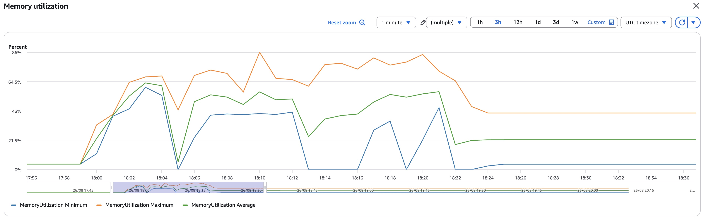

#### RDS  writer read IOPS **0.7** (fully cached) / write IOPS **7,224,994** (summed per-minute basis); DB IO/transaction deltas in `data/final-deltas.txt`
  (blks_hit 2.34B / blks_read 151; blk_write_time 105,277 s; deadlocks 257); per-statement/table deltas + `data/pg_stat_*.csv`; timeseries `data/rds_metrics.csv`

##### Database Metrics CORE/LIBFEAT/RES final

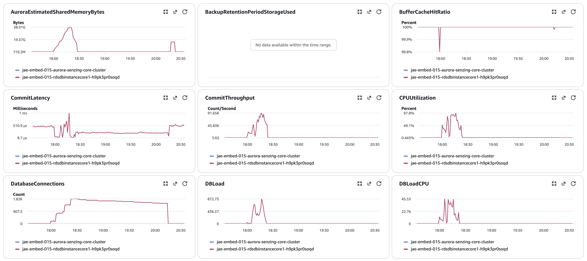
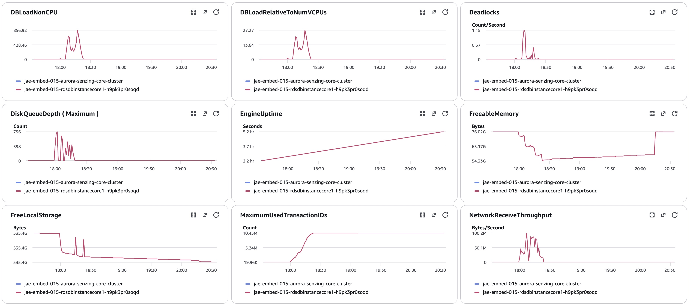
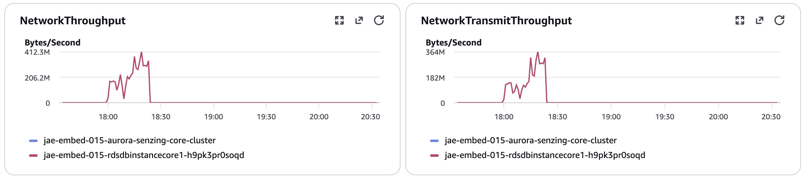
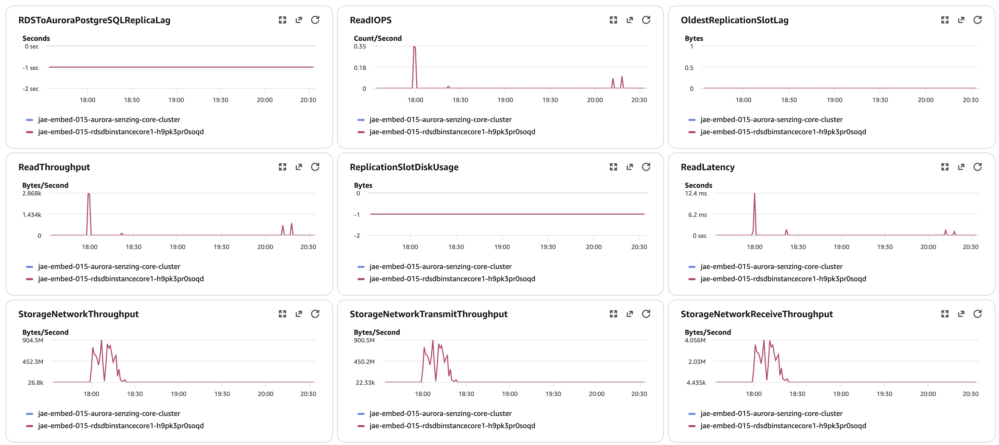
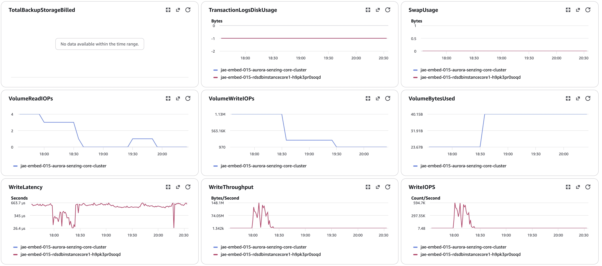
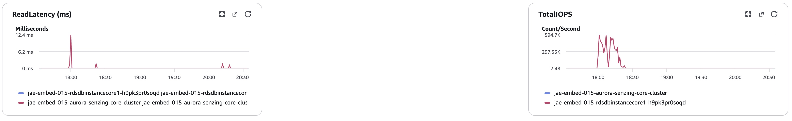
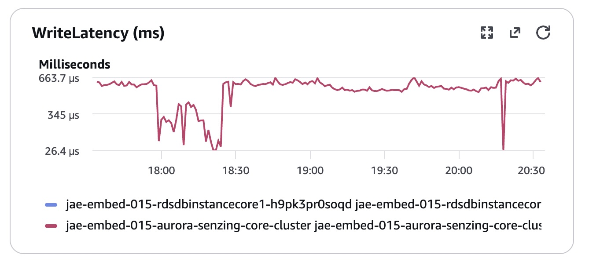

**Timeseries CSVs** (pulled from CloudWatch, UTC-normalized): `data/rds_metrics.csv` (WriteIOPS/ReadIOPS/CPU/
connections/latency/throughput/freeable-mem), `data/sqs_metrics.csv` (input/output/DLQ visible+sent+deleted),
`data/ecs_metrics.csv` (consumer/redoer CPU + memory). Throughput: `data/dsrc_record.csv`.

#### Logs `data/final-capture.txt` (counts above); no `SzBadInputError`; 15 `SzDatabaseError` lines = 5 varchar crashes ×3
#### Errors `<CloudWatch Logs-Insights term counts + samples; engine logs use ERR: prefix>` — see the internal engine-findings doc

## Methods
Per `docs/performance-test-runbook.md` and `scripts/aurora-pg/`:
`00-setup.sql` (once) → `10-baseline.sql` (immediately before starting consumers) → `progress-live.sql` (loop; NOT
`progress.sql` on this large DB) → `drain-check.sql` (gate: all 4 conditions) → `20-final.sql` → `validate.sql` →
`exports.sql` → `final-capture.sql` (as the Senzing table owner).
Producer note (this run): the `s3://` JSON reader loads the whole file into memory and OOMs on the 20 GB dataset; the
`https` reader streams line-by-line. Because the bucket is private, `InputUrl` was set to a **presigned https URL** of
the plain `.jsonl` (kept `json-to-sqs`), which streams in bounded memory. Producer oversized-skip count (5,690) captured
from the `job/producer` log ("Exceeds queue message size limit") = denominator adjustment.
