# senzing-test-results-20260827-1M-provisioned-r6i-8xlarge-single-senzing-4.4.0.26232-embeddings-advisory

> **ADVISORY-lock A/B run** — same 1M OpenSanctions embedded-feature dataset as the
> 20260826 baseline, with the only change **`EnableEntityLockModeAdvisory=true`**
> (engine config `"ER": {"ENTITY_LOCK_MODE": "ADVISORY"}`). Compare directly to
> `results/20260826-1M-...-embeddings/` (baseline, advisory=false).
>
> This run also includes the `sqs:ChangeMessageVisibility` consumer-policy fix (PR #140).
> Engine-team findings (if any) with OpenSanctions record content are kept out of this
> public repo and sent to the team directly.

## Contents
1. Overview
2. Caveats
3. Results (Observations / A-B comparison / Final metrics)
4. Methods

## Overview
1. **Performed:** 2026-08-27. CREATE_COMPLETE 13:34:24 UTC; `dsrc_record` insert window `<from dsrc_record.csv>`;
   consumers started 15:50:07 UTC; input drained ~16:44 UTC; redo drained ~17:4x UTC; drain-check 17:42 UTC.
2. **Senzing version:** 4.4.0-26232 (verified via task `imageDigest`): consumer `sz_sqs_consumer-v4:4.4.0-26232`,
   redoer `sz_simple_redoer-v4:4.4.0-26232`, tools `senzingsdk-tools:4.4.0-26232`; producer `stream-producer:1.8.7`.
3. **Instructions:** repo root README + `docs/performance-test-runbook.md`; exact CFT copy in this dir.
4. **Changes from the 20260826 baseline:** **`EnableEntityLockModeAdvisory=true`** (the only intended change).
   Verified active: consumer `SENZING_ENGINE_CONFIGURATION_JSON` contains `"ER": {"ENTITY_LOCK_MODE": "ADVISORY"}`.
   Everything else identical (same dataset via presigned https, `db.r6i.8xlarge`, `json-to-sqs`, HNSW off, NULL_COMP).

## System
- Aurora PostgreSQL **17.5**, Provisioned, single DB, **db.r6i.8xlarge**, IO-optimized (`aurora-iopt1`)
- Autoscale: target 25% CPU, Min 0 / Max 200; consumers started manually (desired 8) after full queue load
- DB params: `shared_preload_libraries=pg_stat_statements`, `track_io_timing=1`, `enable_seqscan=0`, `max_connections=10000`, `work_mem=4096kB`

## Caveats
- **Oversized records:** 5,690 records >256 KB skipped by the producer (never queued) — identical to the baseline (same dataset).
- Record accounting: 1,001,435 total − 5,690 oversized = 995,745 queued. `dsrc_record` = 995,744 (1 record crashed
  pre-insert on a `varchar(255)` overflow — the same engine-side poison as the baseline; unaffected by advisory).
- Throughput/time computed over actual loaded records.

## Results
### Observations
Inserts per second (from `data/dsrc_record.csv`; cross-checked vs the erpm query):
- **Peak:** **2,252** /second (135,099 inserts in the 16:00 bucket)
- **Average over entire run:** **873** /second (mean ipm/60; erpm **54,893**/min → 915/s; final-capture avg **914.9**/s)
- **Time to load 995,744 (`dsrc_record` insert window):** **~18 min** (15:50–16:08 UTC; engine duration 00:18:08)
- **Records in dead-letter queue:** **1** (just the varchar poison; the 6 baseline contention timeouts are GONE — see A/B)
- **Records loaded (`dsrc_record`):** **995,744**
- **Total read IOPS (writer):** **0.6** (~0; fully cached — 199 physical block reads vs 2.26B cache hits)
- **Total write IOPS (writer):** **7,198,962** (≈ baseline 7,224,994 — the deadlock churn does *not* inflate net I/O; aborted writes roll back)
- **Max Consumer tasks:** **59**  **Max Redoer tasks:** **43** (baseline: 48 / 39)

Entity resolution outcome (`data/final-capture.txt`):
- `obs_ent`=**995,744**; `res_ent`=**984,626**; **`res_ent_okey`=995,744** (baseline 995,738 → **advisory recovered all 6 OKEY-orphans**);
  `res_relate`=787,468; `sys_eval_queue`=0
- Embedding vector storage: `name_embedding`=**657,246**; `semantic_value`=**107,713**; `bizname_embedding`=0
- SEMANTIC_VALUE-assisted matches: **3,088** of **11,002** (baseline 3,074 / 10,985) — ~28%, consistent

### A/B comparison vs 20260826 baseline (advisory=false)
| Metric | Baseline (015, advisory=false) | **This run (016, advisory=true)** |
|---|---|---|
| DLQ | 7 (6 contention + 1 varchar) | **1 (varchar only)** |
| `SzRetryTimeoutExceeded` (contention→DLQ) | 7 | **0** |
| Deadlocks | ~257 | **1,238** (~5×) |
| `dsrc_record` dead tuples (post-run) | 508 | **55,592** (MVCC bloat from aborted txns) |
| eval-queue `cum_ins` (re-eval events) | 319,556 | **294,660** |
| Consumer AccessDenied crashes (CMV) | 2 | **0** (CMV fix in #140) |
| Peak consumer / redoer tasks | 48 / 39 | 59 / 43 |
| Input-queue drain time | ~54 min | ~31 min |
| Peak throughput | 2,077 /s | **2,252 /s (+8%)** |
| Avg throughput | 790 /s (erpm 829) | **873 /s (erpm 915, +10%)** |
| Time to load (insert) | ~20 min | **~18 min** |

**Headline:** advisory lock mode **eliminated all 6 super-entity contention timeouts** (`SzRetryTimeoutExceeded` 7→0)
and **recovered the 6 OKEY-orphans** (`res_ent_okey` 995,738→995,744) — those records now resolve instead of
dead-lettering. Surprisingly this came with **~10% HIGHER throughput**, not a cost (avg 790→873/s, erpm 829→915/s,
peak 2,077→2,252/s): the deadlock-retries (PG abort-and-retry, ~5× more) resolve far faster than 015's 300 s
contention timeouts, and less lock-blocking let the autoscaler push higher (59/43 vs 48/39 tasks). The only real cost
is internal MVCC churn (dead tuples 508→55,592), which PG absorbs without inflating net I/O (write IOPS ≈ unchanged).

### Final metrics
#### SQS  `<input/output/DLQ metric images>`

##### SQS Metrics input queue

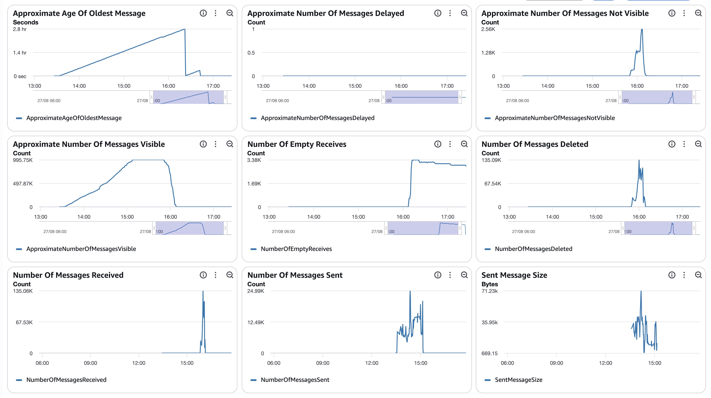

##### SQS Metrics output queue

N/A.  Ran without `withinfo` enabled.

#### ECS  `<consumer + redoer CPU/memory images>` (max consumer 59, redoer 43)

##### Sz SQS Consumer CPU Utilization

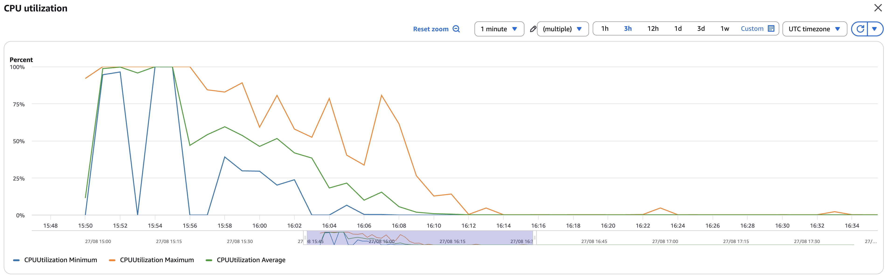

##### Sz SQS Consumer Memory Utilization

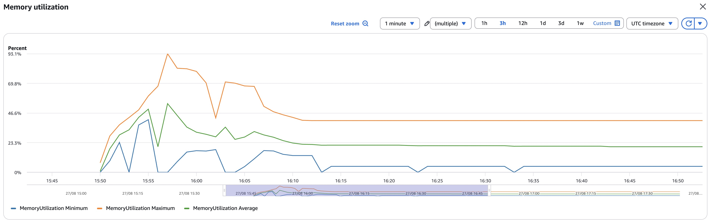

##### Sz Simple Redoer CPU Utilization

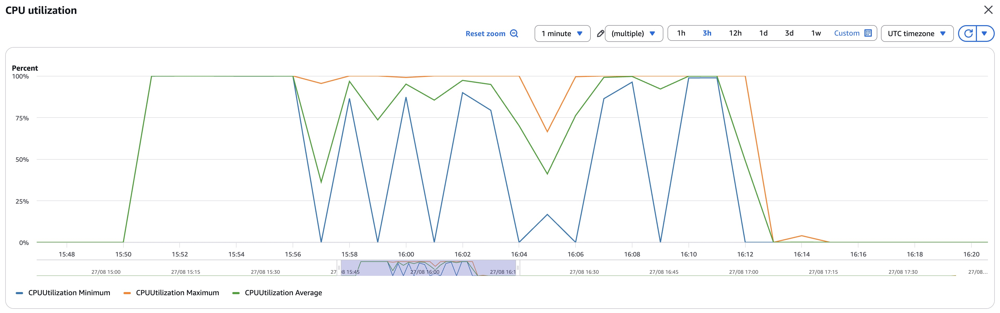

##### Sz Simple Redoer Memory Utilization

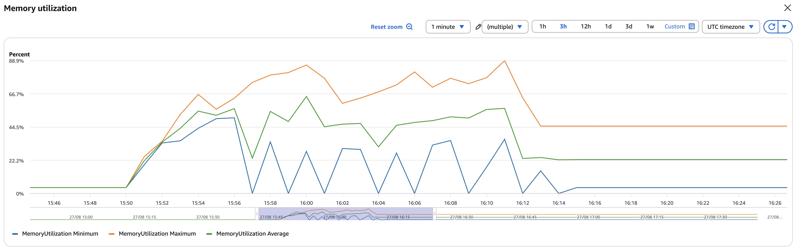

#### RDS  writer read IOPS **0.6** (fully cached) / write IOPS **7,198,962** (Σ per-minute basis); DB IO/transaction deltas in `data/final-deltas.txt`
  (deadlocks 1,238); per-statement/table deltas + `data/pg_stat_*.csv`; timeseries `data/rds_metrics.csv`

##### Database Metrics CORE/LIBFEAT/RES final

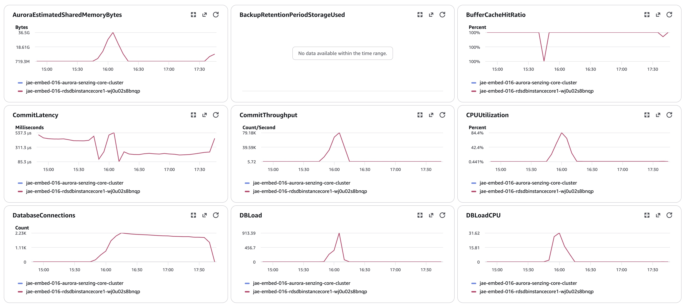
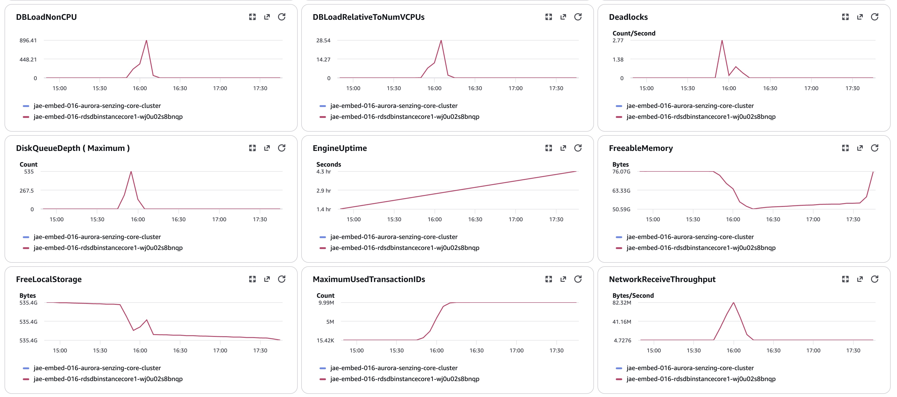
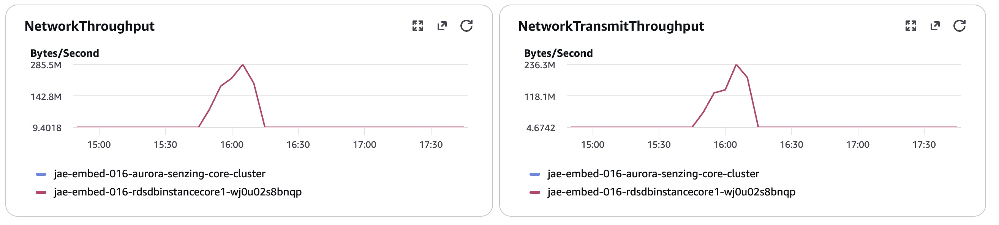
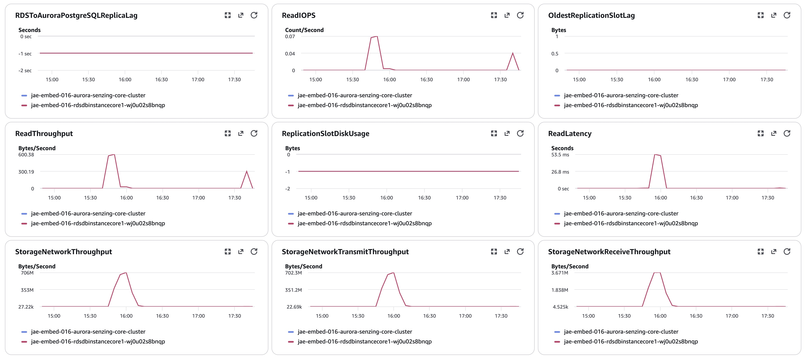
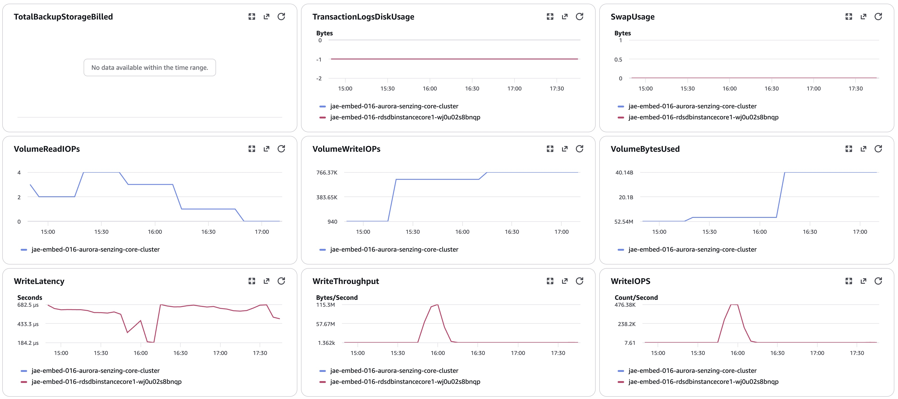
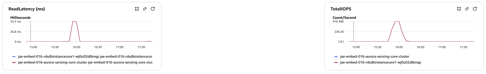
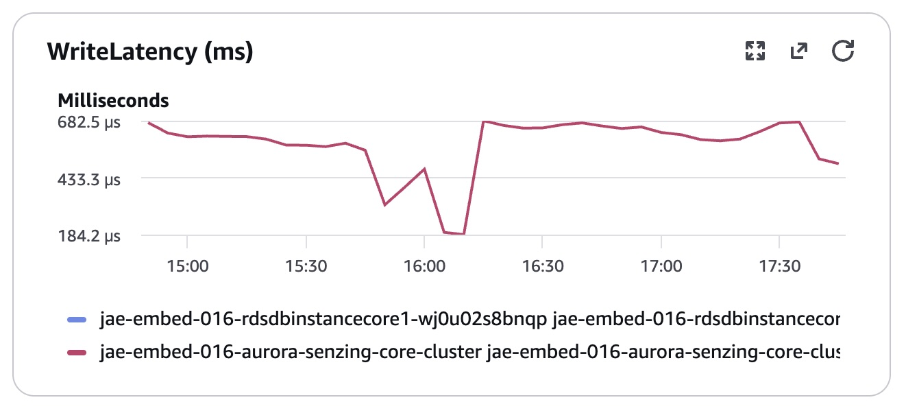

#### Logs `data/final-capture.txt`; no `SzBadInputError`; `SzRetryTimeoutExceeded`=0; 1 varchar poison (5 crashes, DLQ'd)

## Methods
Per `docs/performance-test-runbook.md` and `scripts/aurora-pg/`:
`00-setup.sql` (once) → `10-baseline.sql` (before consumers) → `progress-live.sql` (loop) → `drain-check.sql` (4-gate) →
`20-final.sql` → `validate.sql` → `exports.sql` → `final-capture.sql` (as table owner).
Producer used a presigned https URL of the plain `.jsonl` (s3:// reader OOMs on 20 GB; https streams). IOPS = sum of
per-minute Read/WriteIOPS datapoints (no ×60), matching the historical table basis.
