# senzing-test-results-20260828-1M-provisioned-r6i-8xlarge-single-senzing-4.4.0.26232-embeddings-loadonly-hnsw

> **LOAD-ONLY + HNSW-ON embedding run** — the realistic embedding load benchmark: the HNSW indexes are
> built **before** the load, so each `add_record` pays the HNSW graph-maintenance cost (production systems
> load into an already-indexed table, not an empty one). Same 1M OpenSanctions dataset + `db.r6i.8xlarge`.
> `EnableEntityLockModeAdvisory=false`. Load-only config (built-in `SEMANTIC_VALUE` → candidates:No + NULL_COMP).
>
> **Primary comparison:** vs `20260828-…-embeddings-loadonly` (017 — same config but **HNSW OFF**) — this
> isolates the **HNSW-maintenance cost during load**. **NB: not throughput-comparable to the HNSW-off runs
> (015/016/017), which loaded into empty/unindexed tables.**

## Contents
1. Overview
2. Caveats
3. Results (Observations / comparison / Final metrics)
4. Methods

## Overview
1. **Performed:** 2026-08-28→29. CREATE_COMPLETE 21:40:36 UTC; `dsrc_record` insert window 23:15–23:34 UTC;
   consumers started 23:15:11 UTC; input drained ~00:08 (08-29); drain-check + capture ~00:46 (08-29).
2. **Senzing version:** 4.4.0-26232 (verified via task imageDigest): consumer `sz_sqs_consumer-v4:4.4.0-26232`,
   redoer `sz_simple_redoer-v4`, tools `senzingsdk-tools`; producer `stream-producer:1.8.7`.
3. **Instructions:** repo root README + `docs/performance-test-runbook.md`; exact CFT copy in this dir.
4. **Changes from 017 (load-only, HNSW off):** **HNSW indexes built before the load** — `NAME_EMBEDDING` /
   `BIZNAME_EMBEDDING` / `SEMANTIC_VALUE` each get `USING hnsw (embedding vector_cosine_ops) WITH (m=16,
   ef_construction=100)` in `InitPgvector`, so embedding inserts pay HNSW graph maintenance. Verified at deploy:
   InitPgvector echoed "HNSW indexes built" / "setup complete", exit 0, no errors. Everything else identical.

## System
- Aurora PostgreSQL **17.5**, Provisioned, single DB, **db.r6i.8xlarge**, IO-optimized (`aurora-iopt1`)
- Autoscale: target 25% CPU, Min 0 / Max 200; consumers started manually (desired 8) after full queue load
- DB params: `shared_preload_libraries=pg_stat_statements`, `track_io_timing=1`, `enable_seqscan=0`, `max_connections=10000`, `work_mem=4096kB`

## Caveats
- **Oversized records:** ~5,690 records >256 KB skipped by the producer (same dataset).
- `varchar(255)` overflow poison (1 record) likely recurs (engine-side) → expect DLQ ≥ 1.
- Throughput/time computed over actual loaded records. **HNSW-on → not comparable to the HNSW-off runs' rates.**

## Results
### Observations
Inserts per second (from `data/dsrc_record.csv`; cross-checked vs the erpm query):
- **Peak:** **2,051** /second
- **Average over entire run:** **830** /second (mean ipm/60; erpm **51,900**/min → 865.0/s; final-capture avg **865.0**/s) — only **~10% below 017's 922/s (HNSW-off)**
  - **⚠️ This UNDERSTATES the HNSW cost.** `dsrc_record` commits *early* in `add_record`, **before** the HNSW vector
    insert, so the dsrc_record throughput metric misses most of the HNSW cost. The direct proof: the
    `INSERT INTO NAME_EMBEDDING` statement (same 657,027 inserts both runs) took **86,571,400 ms here vs 017's
    1,443,268 ms — ~60× slower per vector** (HNSW graph maintenance). The real HNSW cost lands in per-record
    `add_record` time and the **8× contention** (below), not the dsrc_record rate. **Takeaway: dsrc_record throughput
    is the wrong metric for HNSW-on load** — use `add_record` completion rate (SQS drain) or the vector-insert timing.
- **Time to load 995,744 (`dsrc_record` insert window):** **~20 min** (23:15–23:34 UTC; engine duration 00:19:11)
- **Records in dead-letter queue:** **34** — 33 lock-contention `SzRetryTimeoutExceeded` + 1 `varchar(255)` poison (vs 017's 5)
- **Records loaded (`dsrc_record`):** **995,744**
- **Total read IOPS (writer):** **0.9** (~0 storage reads — cached; but DB `blks_hit` **4.7B** vs 017's 2.22B ≈ 2× logical reads from HNSW graph traversal on each insert)
- **Total write IOPS (writer):** **7,505,447** (~+5% vs 017's 7,175,401 — the HNSW graph writes)
- **Max Consumer tasks:** **48**  **Max Redoer tasks:** **32**

Resolution outcome (`data/final-capture.txt`):
- `obs_ent`=**995,744**; `res_ent`=**987,091**; `res_ent_okey`=**995,711**; `res_relate`=780,748; `sys_eval_queue`=0
- **⚠️ OKEY-orphans: 33** (`res_ent_okey` 995,711 vs `dsrc_record` 995,744) — the 33 `SzRetryTimeoutExceeded`
  contention records that inserted `obs_ent` but never resolved. **8× 017's 4** — HNSW lengthens each `add_record`
  transaction, so entity locks are held longer and the super-entity contention explodes (advisory=false). These would
  resolve under advisory (cf. 016) or single-threaded reload. Record IDs in run notes (kept out of this public repo).
- Embedding vector storage: `name_embedding`≈657,159; `semantic_value`≈107,706; `bizname_embedding`=0 (final-deltas
  INSERT counts, slightly retry-inflated; the HNSW index sizes above — 1711 MB / 280 MB — confirm population)
- **HNSW indexes — verified built, valid, and populated** (via `pg_indexes` + `pg_index`): `name_embedding_hnsw`
  **1711 MB** (657K vectors), `semantic_value_hnsw` **280 MB** (107K), `bizname_embedding_hnsw` 16 kB (empty, 0 rows);
  all `valid=t ready=t`, `USING hnsw (embedding vector_cosine_ops) WITH (m=16, ef_construction=100)`. A ~1.7 GB graph
  built + maintained through the load — so this run genuinely paid the HNSW graph-maintenance cost (the driver of the
  33-record contention below).
- SEMANTIC_VALUE-assisted matches: **0** (of 8,615 non-singleton) — confirms load-only (embeddings stored, not matched)

### Comparison — the HNSW cost (fill after run)
| Metric | 017 load-only, HNSW **off** | **019 load-only, HNSW ON (this run)** |
|---|---|---|
| Peak /s | 2093 | **2051** |
| Avg /s | 922 (erps 951) | **830 (erps 865)** — ~10% lower |
| Time to load (insert) | ~18 min | **~20 min** |
| Total write IOPS | 7,175,401 | **7,505,447** (+5%) |
| DLQ | 5 | **34** (33 contention + 1 varchar) |
| **OKEY-orphans** | 4 | **33** (8×) |
| Deadlocks | 175 | **409** |
| Max loader / redoer | 70 / 40 | **48 / 32** |

The delta (019 − 017) = the cost of maintaining the HNSW index during load. Context: 015 scoring-on avg 790/s;
25M non-embedding avg 2012/s.

### Final metrics
#### SQS
##### SQS Metrics input queue
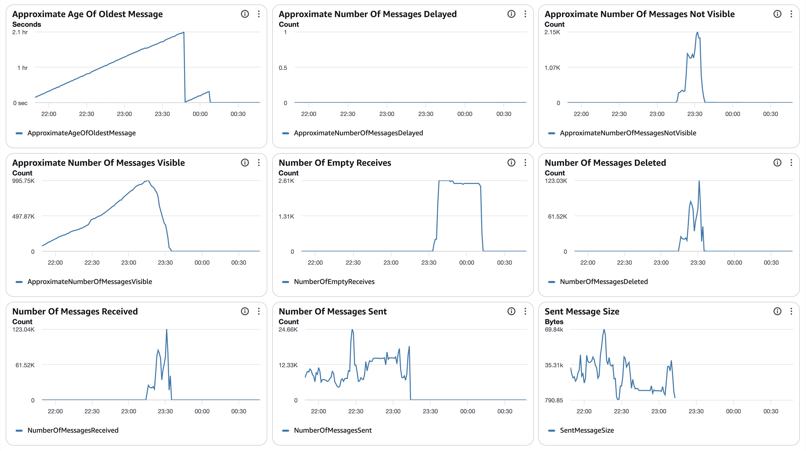
##### SQS Metrics output queue
N/A.  Ran without `withinfo` enabled.

#### ECS
##### Sz SQS Consumer CPU Utilization
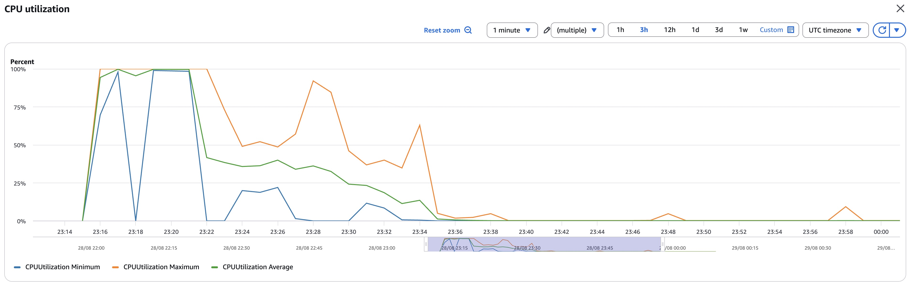
##### Sz SQS Consumer Memory Utilization
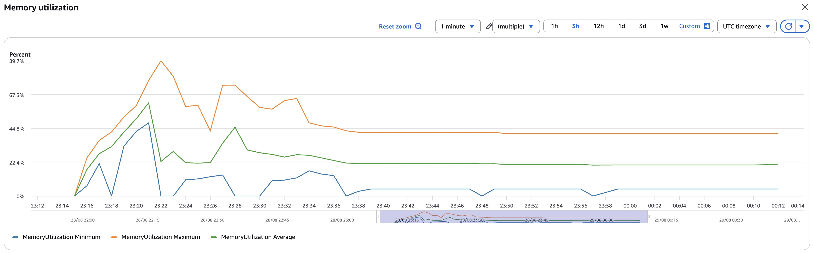
##### Sz Simple Redoer CPU Utilization
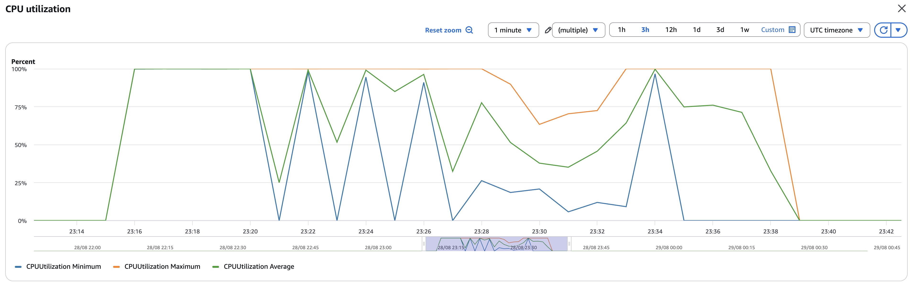
##### Sz Simple Redoer Memory Utilization
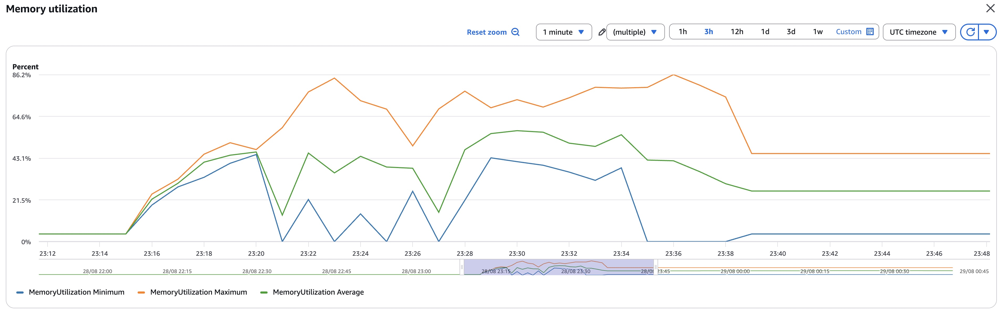

#### RDS  writer read IOPS **0.9** (fully cached) / write IOPS **7,505,447** (Σ per-minute basis); DB IO/transaction deltas in `data/final-deltas.txt`
  (blks_hit 4.7B / blks_read 130; deadlocks **409**); per-statement/table deltas + `data/pg_stat_*.csv`; timeseries `data/rds_metrics.csv`
##### Database Metrics CORE/LIBFEAT/RES final
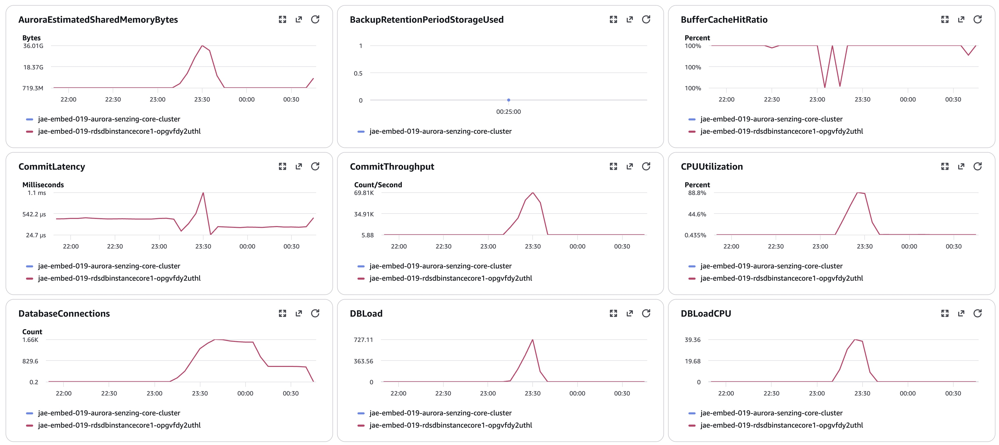
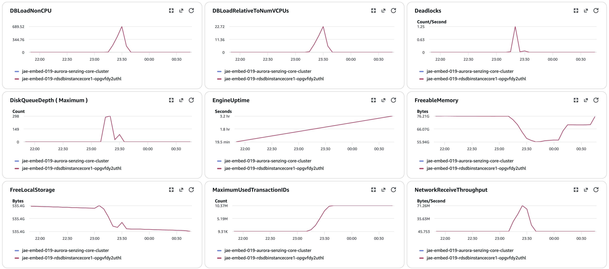
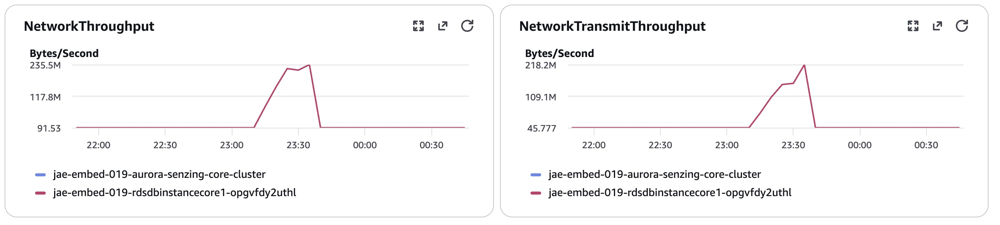
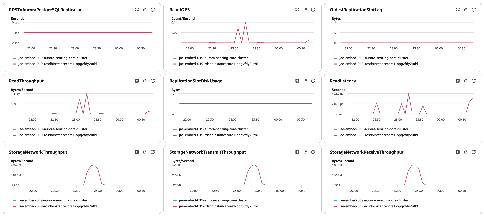
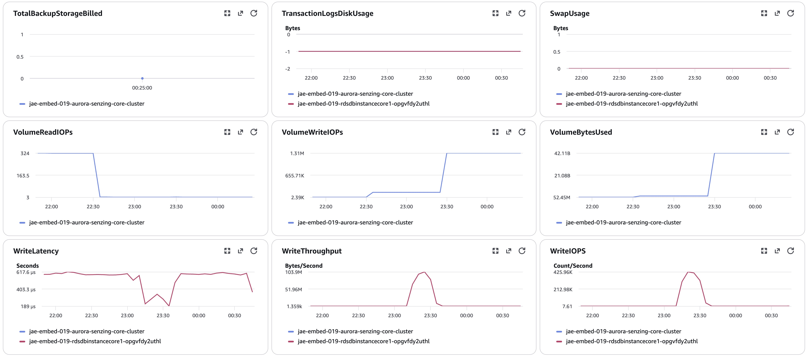
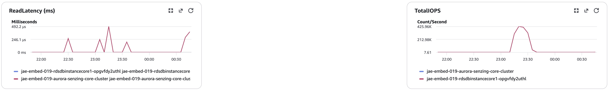
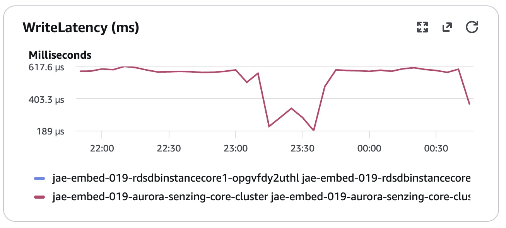

#### Logs `data/final-capture.txt`
#### Errors  `SzRetryTimeoutExceeded` = **33** (the DLQ contention records); `value too long` = 1 varchar poison; `deadlock` = **409**; `abandoned its work` = 750. Only Senzing error code in the run = `SENZ1015` (varchar). No `SzBadInputError`, no infinite loops. (engine logs use `ERR:` prefix)

## Methods
Per `docs/performance-test-runbook.md` and `scripts/aurora-pg/`:
`00-setup.sql` (once) → `10-baseline.sql` (before consumers) → `progress-live.sql` (loop) → `drain-check.sql` (4-gate) →
`20-final.sql` → `validate.sql` → `exports.sql` → `final-capture.sql` (as table owner).
Producer: presigned https URL of the plain `.jsonl`. IOPS = sum of per-minute Read/WriteIOPS (no ×60). Pre-load §1.5
verified: images 4.4.0-26232, config-content (SEMANTIC_VALUE candidates:No + NULL_COMP), **and HNSW indexes built**
(InitPgvector "HNSW indexes built" echo + exit 0). Confirm indexes on the DB: `SELECT indexname FROM pg_indexes WHERE
tablename IN ('name_embedding','bizname_embedding','semantic_value');` → expect `*_hnsw` + `*_pkey`.
