# senzing-test-results-20260828-1M-provisioned-r6i-8xlarge-single-senzing-4.4.0.26232-embeddings-loadonly

> **LOAD-ONLY embedding run** (redo with the improved config). Same 1M OpenSanctions
> embedded-feature dataset + same `db.r6i.8xlarge` as the 20260826/20260827 runs, but with
> **scoring + candidate-list building turned OFF for the built-in `SEMANTIC_VALUE` feature**
> (FTYPE 99) — so embeddings are *stored* but no longer drive candidate-gen or scoring.
> `EnableEntityLockModeAdvisory=false` (load-only baseline).
>
> Compare to: (a) `20260827-…-embeddings-advisory` + `20260826-…-embeddings` (the "scoring-on"
> embedding runs), and (b) the 25M non-embedding baseline (now a fairer comparison — both pure load).
> Dates are TBD until the run; rename dir if it doesn't run on 20260828.

## Contents
1. Overview
2. Caveats
3. Results (Observations / comparison / Final metrics)
4. Methods

## Overview
1. **Performed:** `<DATE; baseline→capture UTC window; load window>`
2. **Senzing version:** 4.4.0-26232 (verify via szBuildVersion.json + task imageDigest): consumer
   `sz_sqs_consumer-v4:4.4.0-26232`, redoer `sz_simple_redoer-v4`, tools `senzingsdk-tools`; producer `stream-producer:1.8.7`.
3. **Instructions:** repo root README + `docs/performance-test-runbook.md`; exact CFT copy in this dir.
4. **Changes from the 20260826/27 embedding runs — LOAD-ONLY config (Jae's improved CFT):**
   - Built-in `SEMANTIC_VALUE` (FTYPE 99) reconfigured to load-only: `setFeature candidates: No` +
     `deleteComparisonCall` / `addComparisonCall NULL_COMP` (was `SEMANTIC_SIMILARITY_COMP`). Embeddings stored,
     not used for candidate-gen or scoring. (015/016 left this built-in feature scoring — this fixes that.)
   - `EnableEntityLockModeAdvisory=false` (load-only baseline; advisory variant is the sibling dir)
   - Otherwise identical: same 1M `dataset_full` (presigned https), `db.r6i.8xlarge`, `json-to-sqs`, HNSW off, CMV fix.

## System
- Aurora PostgreSQL **17.5**, Provisioned, single DB, **db.r6i.8xlarge**, IO-optimized (`aurora-iopt1`)
- Autoscale: target 25% CPU, Min 0 / Max 200; consumers started manually (desired 8) after full queue load
- DB params: `shared_preload_libraries=pg_stat_statements`, `track_io_timing=1`, `enable_seqscan=0`, `max_connections=10000`, `work_mem=4096kB`

## Caveats
- **Oversized records:** ~5,690 records >256 KB skipped by the producer (never queued) — same dataset as prior runs.
- The `varchar(255)` overflow poison (1 record) likely recurs (engine-side, unaffected by config) → expect DLQ ≥ 1.
- Throughput/time computed over actual loaded records.

## Results
### Observations
Inserts per second (from `data/dsrc_record.csv`; cross-checked vs the erpm query):
- **Peak:** **2,093** /second (125,589 inserts in the 13:36 bucket)
- **Average over entire run:** **922** /second (mean ipm/60; erpm **57,092**/min → 951.5/s; final-capture avg **951.5**/s) — **+17% vs 015's 790/s**
- **Time to load 995,744 (`dsrc_record` insert window):** **~18 min** (13:27–13:44 UTC; engine duration 00:17:26). Input SQS drained in ~18 min — ~3× faster than 015.
- **Records in dead-letter queue:** **5** — 4 lock-contention `SzRetryTimeoutExceeded` (name/address super-entities) + 1 `varchar(255)` poison
- **Records loaded (`dsrc_record`):** **995,744**
- **Total read IOPS (writer):** **1.4** (~0; fully cached — 144 physical block reads vs 2.22B cache hits)
- **Total write IOPS (writer):** **7,175,401** (≈ 015's 7,224,994 — embeddings are still *stored*, just not matched)
- **Max Consumer tasks:** **70**  **Max Redoer tasks:** **40**

Resolution outcome (`data/final-capture.txt`):
- `obs_ent`=**995,744**; `res_ent`=**987,119** (fewer merges than 015's 984,625 — no embedding-driven matches);
  `res_ent_okey`=**995,740**; `res_relate`=777,143; `sys_eval_queue`=0
- Embedding vector storage (verified via live `count(*)`): `name_embedding`=**657,027**; `semantic_value`=**107,672**;
  `bizname_embedding`=0 — real 512-dim non-null vectors; **no HNSW index** (btree PK on `lib_feat_id` only, per the
  fast-load config). NB the final-deltas per-table INSERT counts are slightly higher (657,240 / 107,706) — inflated by
  rolled-back retry re-inserts from the abandon-and-requeue churn; `count(*)` is the true stored count.
- **SEMANTIC_VALUE-assisted matches: 0** (of 8,612 non-singleton matches) — confirms load-only: embeddings stored, **not matched** (015 had 3,074).
- **⚠️ OKEY-orphans: 4** — `res_ent_okey` 995,740 vs `dsrc_record` 995,744. These 4 records inserted their observed
  entity (`obs_ent`) but never resolved (`res_ent` NULL); they are exactly the **4 name/address super-entity records
  that hit `SzRetryTimeoutExceeded`** (contention, advisory=false) and dead-lettered. They would resolve under advisory
  lock mode (cf. 016 → 0 orphans) or a single-threaded reload. Record IDs are in the run notes (kept out of this public
  repo — OS content). Plus the 1 varchar poison crashed pre-insert (not an orphan; just absent).

### Comparison (fill after run)
| Metric | 25M non-embed (4.4.0.26167) | scoring-on embed (015 baseline) | **load-only (this run)** |
|---|---|---|---|
| Peak /s | 2600 | 2077 | **2093** |
| Avg /s | 2012 | 790 | **922** (erps 951) |
| DLQ | 0 | 7 | **5** (4 contention + 1 varchar) |
| SEMANTIC_VALUE matches | n/a | 3,074 | **0** |
| Deadlocks | n/a | 257 | **175** |
| OKEY-orphans | 0 | 6 | **4** |
| Max loader / redoer | 61 / 59 | 48 / 39 | **70 / 40** |

Expected story: load-only should be **faster than 015's 790/s** (no per-record semantic candidate-gen + scoring) and
land **closer to the 25M non-embedding rate** — the fair "embedding storage load" benchmark.

### Final metrics
#### SQS
##### SQS Metrics input queue
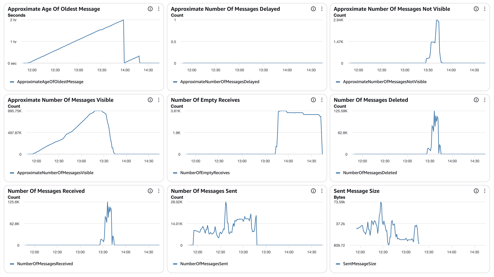
##### SQS Metrics output queue
N/A.  Ran without `withinfo` enabled.

#### ECS
##### Sz SQS Consumer CPU Utilization
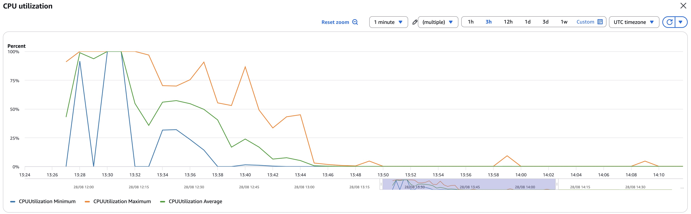
##### Sz SQS Consumer Memory Utilization
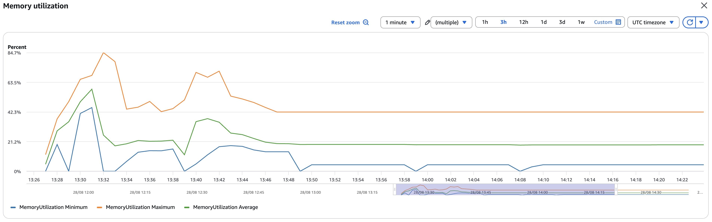
##### Sz Simple Redoer CPU Utilization
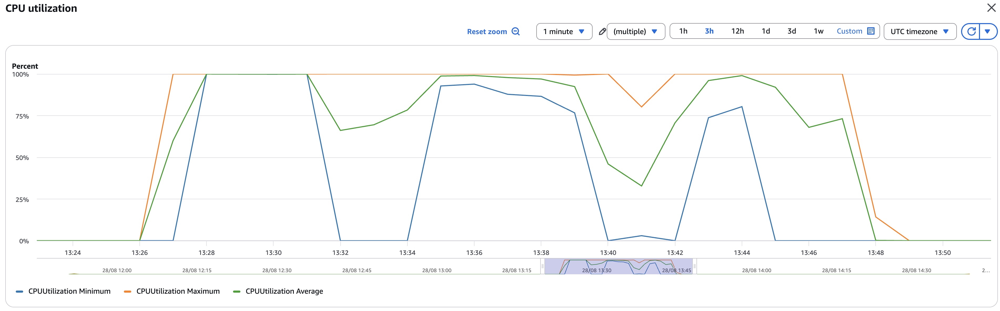
##### Sz Simple Redoer Memory Utilization
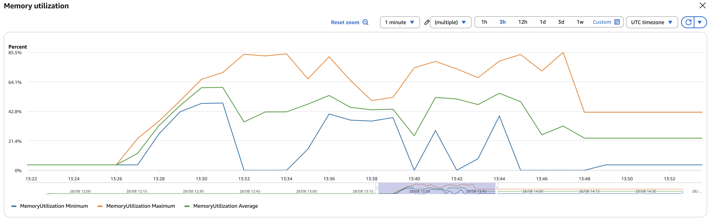

#### RDS  writer read IOPS **1.4** (fully cached) / write IOPS **7,175,401** (Σ per-minute basis); DB IO/transaction deltas in `data/final-deltas.txt`
  (blks_hit 2.22B / blks_read 144; deadlocks 175); per-statement/table deltas + `data/pg_stat_*.csv`; timeseries `data/rds_metrics.csv`
##### Database Metrics CORE/LIBFEAT/RES final
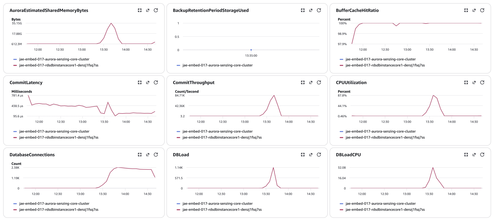
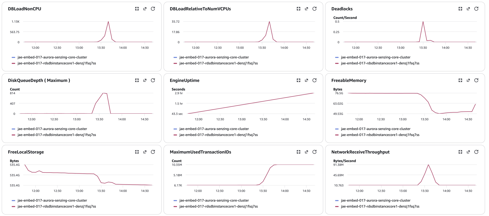
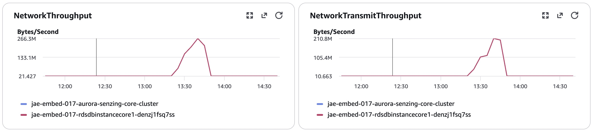
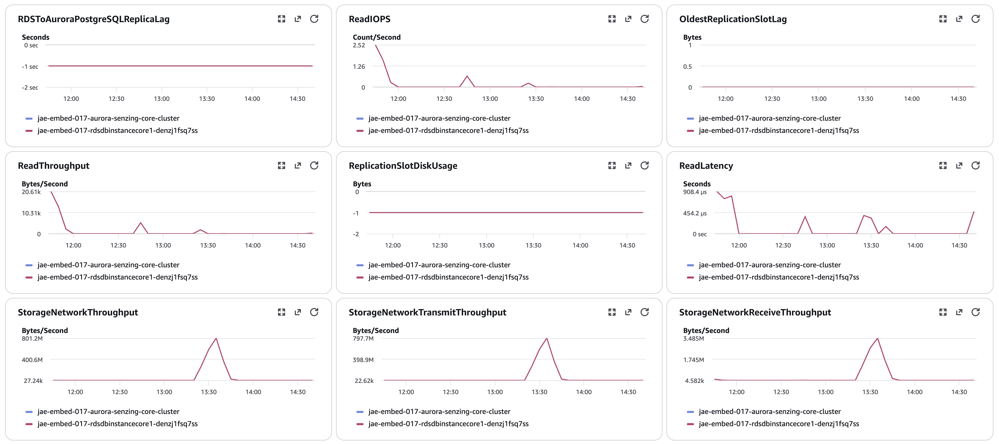
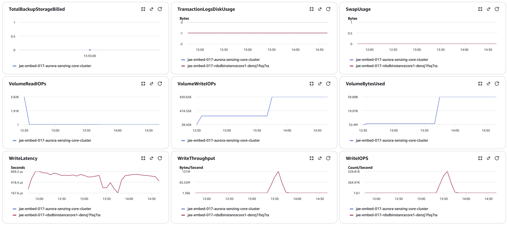
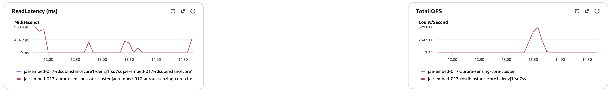
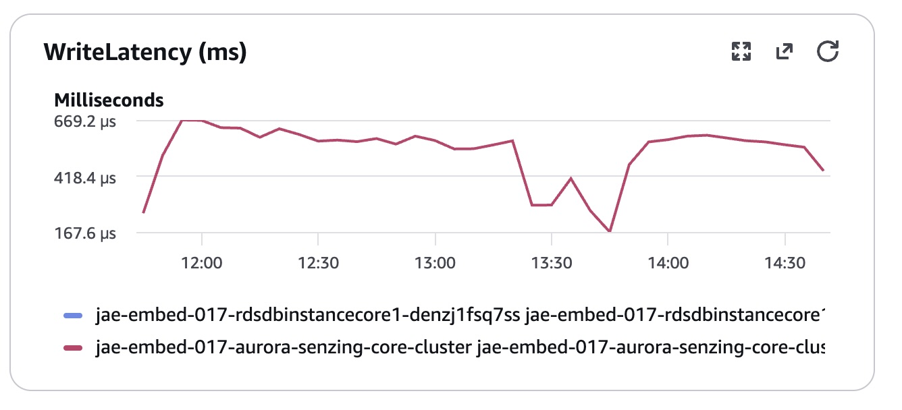

#### Logs `data/final-capture.txt`
#### Errors `<CloudWatch Logs-Insights term counts; engine logs use ERR: prefix>`

## Methods
Per `docs/performance-test-runbook.md` and `scripts/aurora-pg/`:
`00-setup.sql` (once) → `10-baseline.sql` (before consumers) → `progress-live.sql` (loop) → `drain-check.sql` (4-gate) →
`20-final.sql` → `validate.sql` → `exports.sql` → `final-capture.sql` (as table owner).
Producer: presigned https URL of the plain `.jsonl` (s3:// reader OOMs on 20 GB; https streams). IOPS = sum of
per-minute Read/WriteIOPS (no ×60). **Pre-load §1.5 (this run adds a config-CONTENT check):** verify images are
4.4.0-26232 AND that `SEMANTIC_VALUE` is `candidates: No` + `NULL_COMP` in the applied config (not just that
g2configtool exited 0) — this is the check that would have caught the 015/016 scoring-on config.
