# senzing-test-results-20260928-25M-provisioned-r6i-8xlarge-single-senzing-4.5.0.26268

> **Senzing 4.5.0.26268, 25M, advisory lock ON.** Standard 25M run, same config as the latest 25M
> baselines (`20260619` 4.4.0.26167 advisory, `20260622` 4.3.2 advisory) for a clean version comparison.
>
> 🎯 **PRIMARY GOAL — OKEY-orphan regression check.** 4.5 is expected to carry fixes for the
> `oent-swap-okey-split-commit` regression (4.4 lost records "observed but never resolved", not
> dead-lettered, with no recovery path). This run must show **zero orphans** — see the Orphan checks section.
>
> ⚠️ **What a 25M run can and can't prove:** the orphan regression never manifested at 25M (both 25M
> baselines = **0 orphans**); it appeared at **100M** (4.4.0.26167 = **40**, 4.4.0.26204 = **30**). So this
> run is a **regression smoke-test** (must stay at 0) and a perf comparison — it **cannot confirm the 100M-scale
> fix**. Confirming the fix needs a 100M run compared against `20260715` / `20260723`.
>
> 📋 **RESULT: 1 orphan (baselines 0), but loud rather than silent.** The new 4.5 guard `OKEY FLUSH ASSERTION FAILED`
> caught the OKEY-split condition on one obs_ent. It retried 178× without converging, timed out (SENZ0010), and sent the record
> to the DLQ, leaving `obs_ent` committed with no `RES_ENT_OKEY`. Detection works; recovery doesn't. Also
> CORRUPTION_FOUND 5 (`RES_ENT_OKEY_NOT_FOUND`, all auto-repaired; baselines 1 / 2). Throughput is on par: avg 1994/s, 3.48 h
> (4.4: 2042/s, 3.38 h). Details under **Orphan checks → Verdict**.

## Contents
1. Overview
2. Orphan checks (primary)
3. Caveats
4. Results (Observations / comparison / Final metrics)
5. Methods

## Overview
1. **Performed:** 2026-09-28. Stack `perf-25m-450-26268` create 19:10 → CREATE_COMPLETE 19:24 UTC. Queue loaded (25,000,000 msgs, producers exited) ~20:43; baseline ~20:40; consumers → 8 at 20:44 UTC. `dsrc_record` insert window 20:44 → 00:12 UTC (209 min buckets); input queue
   empty ~00:17; redo phase to ~01:20; drain-check 4 gates passed 01:20:47; `20-final` 01:21:06; `final-capture` 01:25 UTC.
2. **Senzing version:** **4.5.0.26268** (build `2026_09_25__22_33`), self-built immutable tag `:4.5.0-26268`.
   **§1.5 verified pre-deploy** (`szBuildVersion.json` read from each image):
   | Image | Digest |
   |---|---|
   | `sz_sqs_consumer-v4:4.5.0-26268` | `sha256:542363ad46cdaf913357b95a609d09cdd1fbece7c8a9243edf70afc1194fe3e0` |
   | `sz_simple_redoer-v4:4.5.0-26268` | `sha256:7775af8a706355f79e37a9e11c97f9a9cfb6462228fe3ccc43ba53871cf8c244` |
   | `senzingsdk-tools:4.5.0-26268` | `sha256:6fbb39016266bd6805123b41d41d56267dbaae11fcd0b7dc8b1b852ff68f39b3` |
   | `sshd:4.5.0-26268` | `sha256:ae46cf8ecae43bc4cc52d32423a693ffb74a91d13822dc64ef2dbcc5b6a34e0d` |

   **Deploy-time check (19:26 UTC):** running redoer + sshd task `imageDigest`s match the above; consumer task def
   = `sz_sqs_consumer-v4:4.5.0-26268`, X86_64, 2048/4096, `ENTITY_LOCK_MODE: ADVISORY` on consumer + redoer. Consumer
   running-task digest: all 8 = `542363ad…` ✅ (20:45 UTC). DB instance `db.r6i.8xlarge`, PG 17.5.
3. **Instructions:** repo root README + `docs/performance-test-runbook.md`; exact CFT copy in this dir.
4. **Changes from the 25M baselines:**
   1. Senzing images 4.4.0 → **4.5.0.26268** (the only intended variable).
   2. `init-database` pinned **by digest** (`sha256:a68062d23dc9…`; was mutable `:latest`). It bundles **4.4.1.26255**,
      but its schema SQL is **byte-identical** to 4.5.0.26268 and its default config differs only in the
      `CONFIG_BASE_VERSION` stamp (all 29 functional config tables identical) — verified 2026-09-28.
   3. `RES_ENT.FEATURES` **not** added (not native in the 4.5 schema; the 4.4 experiment didn't fix orphans; the
      25M baselines didn't have it, so omitting keeps the comparison clean).
   4. Otherwise identical: `ENTITY_LOCK_MODE: ADVISORY`, no read-only connection, consumers pre-loaded
      (DesiredCount/MinCapacity 0), X86_64, 2 vCPU / 4 GB consumer + redoer tasks, 25% CPU autoscale target,
      `max_connections` 10000, PG 17.5, synchronous commit NOT off.

## System
- Aurora PostgreSQL **17.5**, Provisioned, single DB, **db.r6i.8xlarge**, IO-optimized (`aurora-iopt1`)
- Autoscale: target 25% CPU, Min 0 / Max 200; consumers started manually (desired 8) after full queue load
- DB params: `shared_preload_libraries=pg_stat_statements`, `track_io_timing=1`, `enable_seqscan=0`, `max_connections=10000`, `work_mem=4096kB`
- Data: `test-dataset-100m.json.gz` (public), capped at `RecordMax=25M`

## Orphan checks (primary)
All must be clean for the "no regression" verdict:

| Check | How | Pass criterion | 25M baselines | This run |
|---|---|---|---|---|
| Unresolved records | `validate.sql` q1 | **0 rows** | 0 (0619; 0622 reconciled exactly) | ❌ **1 row**: `580095239` / obs_ent `26600025` / no res_ent |
| Dangling OKEY keys | `validate.sql` q2 | **0 rows** | 0 (0619) | ✅ 0 rows |
| Exact reconciliation | `final-capture`: `res_ent_okey` vs `obs_ent` | **equal** | 24,999,937 = 24,999,937 (both) | ❌ 24,999,936 vs 24,999,937 (−1) |
| OKEY-split log signature (4.4) | CloudWatch `"OKEY ORPHAN PREVENTED"` | 0 (or all self-healed) | — | ✅ 0 |
| **New 4.5 guard** | CloudWatch `"OKEY FLUSH ASSERTION FAILED"` | 0, or all converge | n/a (new in 4.5) | ⚠️ **178 hits, 1 obs_ent (`26600025`), never converged** |
| Corruption | CloudWatch `CORRUPTION_FOUND` | ≤ baseline | 1 / 2 (0619 / 0622) | ⚠️ 5, all `RES_ENT_OKEY_NOT_FOUND`, 5 distinct entities, all auto-repaired (1 load / 4 redo phase) |
| Resolution loops | CloudWatch `POTENTIAL INFINITE RESOLUTION LOOP` | 0 | 0 | ✅ 0 |
| Dead-lettered | SQS DLQ | ≤ baseline | 0 / 0 | ❌ 1 (the same record) |
| Residual active entities | `res_ent_active` | ~baseline | 97 / 105 | ✅ 57 |

### Verdict: one orphan, loud rather than silent

**Not a clean pass.** The 25M baselines had 0 unresolved records and this run has **1**. The failure *mode*, though, is the
opposite of the 4.4 regression:

| | 4.4 @100M (20260715 / 20260723) | **4.5.0.26268 @25M (this run)** |
|---|---|---|
| Orphans | 40 / 30 | 1 |
| Logged? | mostly **silent** (30/40, 26/30 had no log line) | **loud**: 178 × `ERR: OKEY FLUSH ASSERTION FAILED` + `SENZ0010` |
| Dead-lettered? | no (DLQ 0) | **yes** (DLQ 1), so it's visible and can be replayed |

**What happened (timeline, consumer task `304c0aea66b9`):**
1. 23:58:26 UTC: the first `OKEY FLUSH ASSERTION FAILED: obs-ent(s) [26600025] would commit with no RES_ENT_OKEY row.
   Rolling back and retrying the operation.` Nothing else was logged on that stream just before it.
2. 23:58:26 → 00:03:25: the guard fired **178 times** (a retry about every 1.7 s), always the same single obs_ent. The condition
   never cleared on retry.
3. 00:03:25: `SzRetryTimeoutExceededError (10): SENZ0010|Retry timeout exceeded resolved entity locklist [] (WORK_RETRY_TIMEOUT=300s)`.
4. 00:04:55: `Sending to deadletter: TEST : 580095239`.
5. Final state: `dsrc_record` = 1 and `obs_ent` = 1 (`26600025`), but `res_ent_okey` = **0**. The redoer did not repair it (`sys_eval_queue` drained to 0).

No other obs_ent hit the guard anywhere in the run (1 distinct id), so we have no case of the guard catching one
and a retry then succeeding.

**Findings for the engine team:**
- ✅ The 4.5 guard **detects** the OKEY-split condition and turns a silent orphan into a logged error plus a DLQ entry.
- ❌ **Retrying never converges:** the same condition held for 178 retries, so a deterministic state is being retried
  as if it were transient.
- ❌ **Rollback doesn't unwind it:** after giving up, `obs_ent` 26600025 (and its `dsrc_record`) remain committed with no
  `RES_ENT_OKEY`. The orphan the guard was meant to prevent still exists in the DB.
- ⚠️ The SENZ0010 message says `resolved entity locklist []`. The underlying cause was the OKEY assertion, not a lock wait,
  so the error is misleading.
- Not tested: whether replaying the DLQ message or `reevaluateRecord TEST 580095239` heals the orphan. Not yet run as of this
  commit; the captured data above is from before any repair attempt.

If **any** unresolved rows appear: run `unresolved-forensics.sql` and `classify-unresolved.py`, and correlate the
`record_id`s with CloudWatch `OKEY ORPHAN PREVENTED` events (the 20260723 method). Keep OpenSanctions/test-record
content out of this public README — IDs go in run notes / a local `FINDINGS-engine.md` (gitignored).

## Caveats
- **1 record dead-lettered** (baselines: 0). `TEST` record `580095239` failed with
  `SzRetryTimeoutExceededError (10): SENZ0010|Retry timeout exceeded resolved entity locklist [] (WORK_RETRY_TIMEOUT=300s)`
  at 00:03:25 UTC and was sent to the DLQ at 00:04:55, near the end of the input drain (~2.4K in flight, 61 consumers).
  The **empty locklist** is notable, since the timeout wasn't on any named entity lock. The root cause is the
  new 4.5 OKEY-flush guard, which never converged, and the record **was** partially committed (orphan). See **Verdict** under Orphan checks.
- **CORRUPTION_FOUND = 5** (baselines 1 / 2). Each is a redoer workload-stats `repairDiagnosis` entry, `RES_ENT_OKEY_NOT_FOUND`,
  on 5 distinct `resEntID`s (12217670, 26325331, 7784730, 19039450, 15148134) and 5 different redoer tasks. 1 happened during the load (23:01)
  and 4 during the redo phase (00:46–01:01). All were repaired automatically. This is the resolved-entity-side counterpart of the OKEY problem, so
  it's worth mentioning to the engine team alongside the orphan.
- Input queue drained ~00:17 UTC. The redo phase then scaled the redoer up to **47** (baselines 59 / 61), and
  `sys_eval_queue` processed 6,174,098 rows and drained to 0 by 01:20. Consumers were still scaled at 54–61 (idle) when the
  final capture ran, which is normal scale-in lag.
- Deadlocks: `db.deadlocks` **106** (4.4 baseline 109, 4.3.2 baseline 2); 106 `deadlock detected` log lines; 0 advisory-lock
  timeouts (55P03); 0 `UNHANDLED`; 294 `ERR:` lines total (178 are the OKEY-flush guard).

## Results
### Observations
Inserts per second (from `data/dsrc_record.csv`; cross-checked vs the erpm query):
- **Peak:** 2573/second
- **Average over entire run:** 1994/second (final-capture erpm 120,522 → 2009/s over 20:44:52 → 00:12:18)
- **Time to load 25M:** 3.48 hours (209 minute buckets; final-capture duration 03:27:26)
- **Records in dead-letter queue:** 1 (`TEST 580095239`, see Verdict)
- **Total read IOPS (writer):** 2,833,836
- **Total write IOPS (writer):** 113,925,340
- **Max Consumer tasks:** 61  **Max Redoer tasks:** 47 (autoscaling max desired)

### Comparison vs the 25M baselines (same config, advisory ON, no RO conn)
| Metric | 4.3.2.26162 (20260622) | 4.4.0.26167 (20260619) | **4.5.0.26268 (this run)** |
|---|---|---|---|
| Peak /s | 2579 | 2594 | **2573** |
| Avg /s | 1965 | 2042 | **1994** |
| Time to load 25M | 3.53 h | 3.38 h | **3.48 h** |
| DLQ | 0 | 0 | **1** |
| Unresolved (orphans) | 0 | 0 | **1** |
| Total read IOPS | 2,141,584 | 1,987,682 | **2,833,836** |
| Total write IOPS | 118,455,414 | 110,278,324 | **113,925,340** |
| Max loader / redoer | 61 / 61 | 61 / 59 | **61 / 47** |
| CORRUPTION_FOUND | 2 | 1 | **5** |
| db.deadlocks | 2 | 109 | **106** |

### Final metrics
#### SQS
##### SQS Metrics input queue
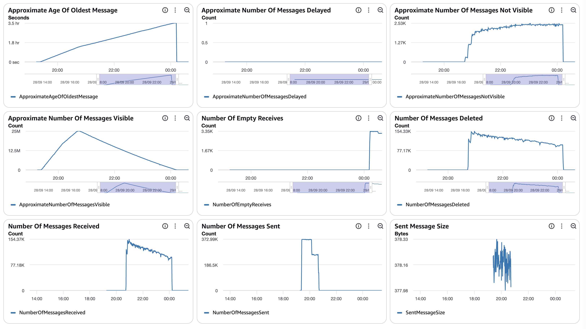
##### SQS Metrics output queue
N/A.  Ran without `withinfo` enabled.

#### ECS
##### Sz SQS Consumer CPU Utilization
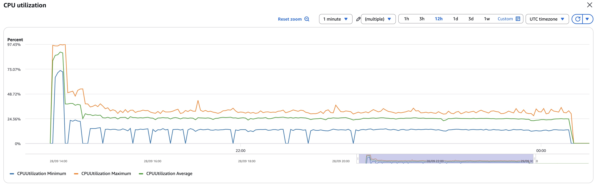
##### Sz SQS Consumer Memory Utilization
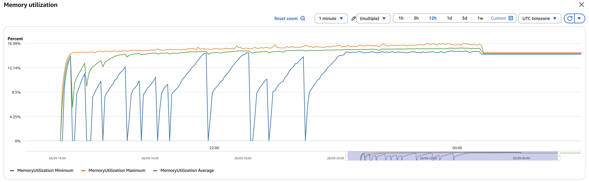
##### Sz Simple Redoer CPU Utilization
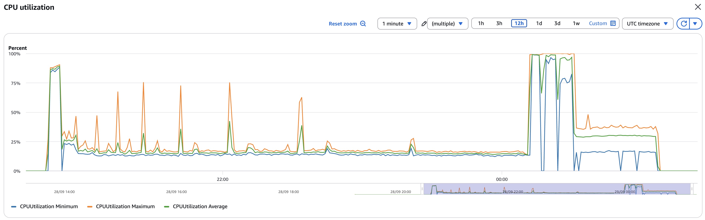
##### Sz Simple Redoer Memory Utilization
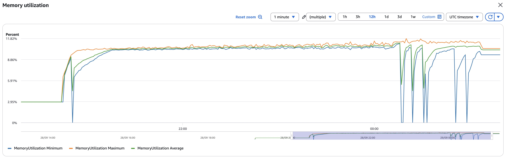

#### RDS  writer read IOPS 2,833,836 / write IOPS 113,925,340 (Σ per-minute `ReadIOPS`/`WriteIOPS` Sum, 20:43 → 01:22 UTC); DB IO/transaction deltas in `data/final-deltas.txt`
  (deadlocks 106, rollbacks 284); per-statement/table deltas + `data/pg_stat_*.csv`; timeseries `data/rds_metrics.csv`
##### Database Metrics CORE/LIBFEAT/RES final
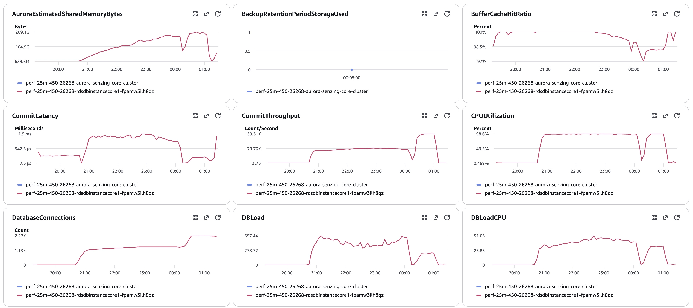
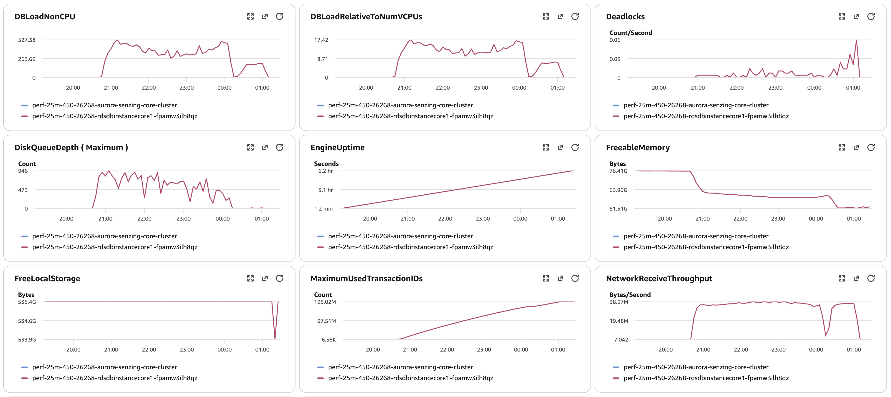
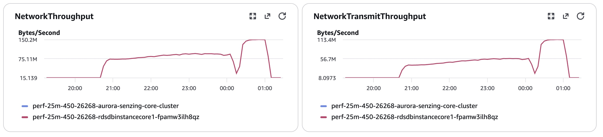
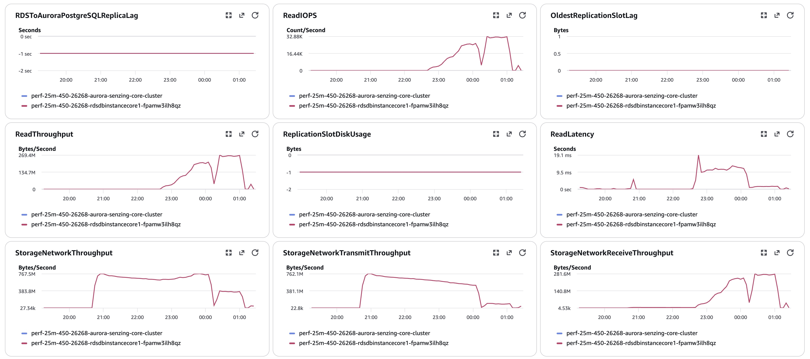
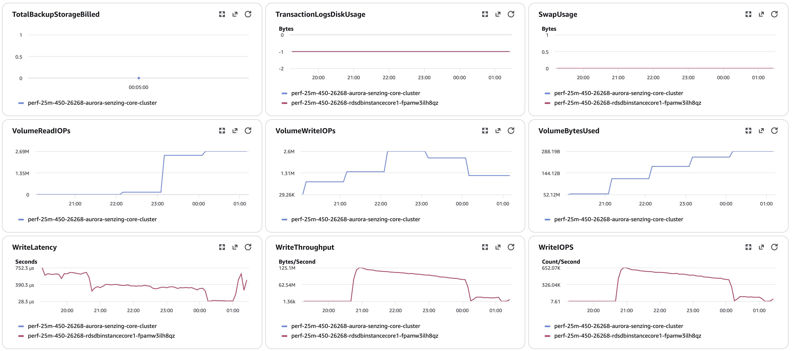
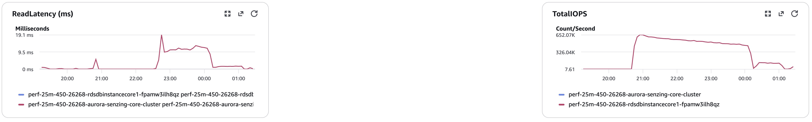
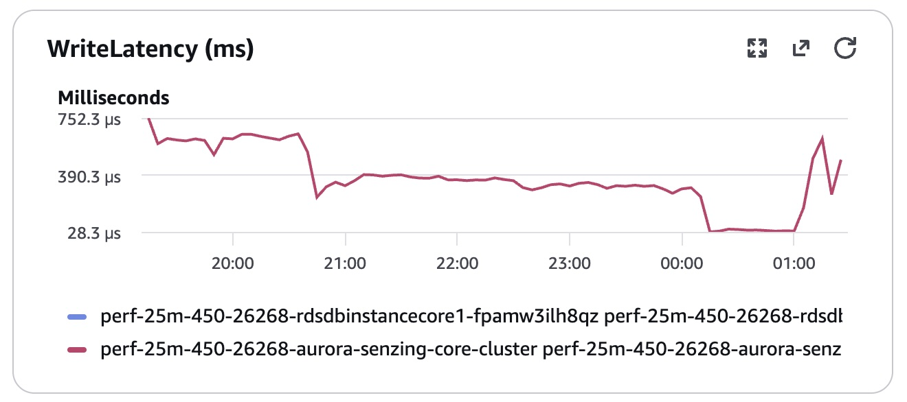

#### Logs `data/final-capture.txt`
#### Errors
CloudWatch Logs Insights over `/senzing/perf-prov/perf-25m-450-26268`, 20:40 → 01:25 UTC:
```
==============================================
Term                          |  instance count |
==============================================
(OKEY FLUSH ASSERTION FAILED) |       178       |  (new 4.5 guard; all obs_ent 26600025)
(SENZ0010 RetryTimeout)       |         1       |  (same record → DLQ)
(OKEY ORPHAN PREVENTED)       |         0       |
(MISSING_RES_ENT_AND_OKEY)    |         0       |
(CORRUPTION_FOUND)            |         5       |  (all RES_ENT_OKEY_NOT_FOUND, auto-repaired)
(INFINITE)                    |         0       |
(55P03 lock timeout)          |         0       |
(deadlock detected)           |       106       |
(UNHANDLED)                   |         0       |
(ERR: total)                  |       294       |
==============================================
```

## Methods
Per `docs/performance-test-runbook.md` and `scripts/aurora-pg/`:
`00-setup.sql` (once) → `10-baseline.sql` (immediately before consumers) → `progress-live.sql` (loop) →
`drain-check.sql` (4-gate) → `20-final.sql` → **`validate.sql` (orphan checks q1/q2)** → `exports.sql` →
`final-capture.sql` (as the table owner). scp target for this run:
`RUN=results/20260928-25M-provisioned-r6i-8xlarge-single-senzing-4.5.0.26268/data`.
IOPS = sum of per-minute Read/WriteIOPS datapoints (no ×60), the historical table basis.
