# senzing-test-results-20260929-100M-provisioned-r6i-24xlarge-single-senzing-4.5.0.26268

> **Senzing 4.5.0.26268, 100M, advisory lock ON.** This is the 100M follow-up to the 20260928 25M run. Same build and config
> as the 4.4 100M runs (`20260715` 4.4.0.26167, `20260723` 4.4.0.26204), so the only intended variable is the engine version.
>
> 🎯 **PRIMARY GOAL: does 4.5 fix the 100M OKEY-orphan regression?** 4.4 lost **40** / **30** records at 100M, mostly
> silently (not dead-lettered, no log line). At 25M, 4.5's new guard `OKEY FLUSH ASSERTION FAILED` turned the one orphan
> into a loud one (logged + DLQ), but it never converged and the orphan remained. This run measures that behavior at the
> scale where the regression actually occurs.
>
> 📋 **RESULT: 17 orphans (4.4: 40 / 30), all 17 caught by the new guard and dead-lettered, 0 silent (4.4: 30 / 26 silent).**
> The 4.5 guard `OKEY FLUSH ASSERTION FAILED` fired on 18 obs_ents (13,126 hits). **1** recovered on retry; **17** retried
> for the full 300 s, then hit SENZ0010 and went to the DLQ, leaving `obs_ent` committed with no `RES_ENT_OKEY`. The silent regression is gone and every
> orphan is now visible and replayable, but the guard's retry almost never repairs anything. ⚠️ Only **97.6M** records were loaded (a producer hung; see Caveats).
>
> 🔬 **The stack is kept overnight for a next-morning orphan deep dive.** The DB is snapshotted after capture and before any repair attempt,
> so the orphan state can be restored.

## Contents
1. Overview
2. Orphan checks (primary)
3. Deep-dive plan
4. Caveats
5. Results (Observations / comparison / Final metrics)
6. Methods

## Overview
1. **Performed:** 2026-09-29. Stack `perf-100m-450-26268` create 17:59 → CREATE_COMPLETE 18:12 UTC (10 producer tasks, ~11.9K msgs/s). `00-setup` ~18:20; `10-baseline` ~18:28; **consumers → 8 at 18:29 UTC with the queue
   still filling** (18.7M queued, producers running; same approach as 20260723). Insert window 18:29:39 → 01:48:44 UTC
   (07:19:06); input empty ~02:03; redo phase to ~04:30; drain-check passed 14:37; `20-final` 14:38; snapshot
   `perf-100m-450-26268-orphans-pristine` 14:49; `final-capture` 14:53 UTC on 09-30.
2. **Senzing version:** **4.5.0.26268** (build `2026_09_25__22_33`), the same images as 20260928. Tags re-verified 2026-09-29
   17:58 UTC and unchanged:
   | Image | Digest |
   |---|---|
   | `sz_sqs_consumer-v4:4.5.0-26268` | `sha256:542363ad46cdaf913357b95a609d09cdd1fbece7c8a9243edf70afc1194fe3e0` |
   | `sz_simple_redoer-v4:4.5.0-26268` | `sha256:7775af8a706355f79e37a9e11c97f9a9cfb6462228fe3ccc43ba53871cf8c244` |
   | `senzingsdk-tools:4.5.0-26268` | `sha256:6fbb39016266bd6805123b41d41d56267dbaae11fcd0b7dc8b1b852ff68f39b3` |
   | `sshd:4.5.0-26268` | `sha256:ae46cf8ecae43bc4cc52d32423a693ffb74a91d13822dc64ef2dbcc5b6a34e0d` |
   | `init-database` (pinned) | `sha256:a68062d23dc958eba404a3fbba3a5800e2770f6e9bbed2ad94413c54da7635af` |

   **Deploy-time check (18:13 UTC):** running redoer and sshd `imageDigest`s match; consumer and redoer task defs =
   `4.5.0-26268`, X86_64, 2048/4096, `ENTITY_LOCK_MODE: ADVISORY`; DB `db.r6i.24xlarge` PG 17.5. Consumer running digest: all 8 = `542363ad…` ✅ (18:30 UTC)
3. **Instructions:** repo root README + `docs/performance-test-runbook.md`; exact CFT copy in this dir (identical to
   `main` @ `a4a0470`).
4. **Changes from the 4.4 100M runs:**
   1. Senzing images 4.4.0 → **4.5.0.26268** (the only intended variable).
   2. `init-database` pinned by digest (see 20260928 for the schema/config equivalence check).
   3. No `RES_ENT.FEATURES` column (same as 20260715; 20260723 had it).
   4. Otherwise identical: `ENTITY_LOCK_MODE: ADVISORY`, no read-only connection, `max_connections` 10000,
      `work_mem` 4096 kB, X86_64, 2 vCPU / 4 GB consumer and redoer tasks (20 threads), autoscale Min 0/1 to Max 200, PG 17.5.

## System
- Aurora PostgreSQL **17.5**, Provisioned, single DB, **db.r6i.24xlarge**, IO-optimized (`aurora-iopt1`), us-east-2
- Autoscale: consumers 25% CPU target, Min 0 / Max 200 (started manually at desired 8); redoer 30% CPU, Min 1 / Max 200
- DB params: `shared_preload_libraries=pg_stat_statements`, `track_io_timing=1`, `enable_seqscan=0`, `max_connections=10000`, `work_mem=4096kB`
- Data: `test-dataset-100m.json.gz` (public), `RecordMax=100M`

## Orphan checks (primary)
| Check | How | Pass criterion | 4.4.0.26167 (0715) | 4.4.0.26204 (0723) | 4.3.3 no-adv (0720) | **This run** |
|---|---|---|---|---|---|---|
| Unresolved records | `validate.sql` q1 | **0 rows** | 40 | 30 | 0 | ❌ **17** |
| Dangling OKEY keys | `validate.sql` q2 | 0 rows | 0 | 0 | 0 | ✅ 0 |
| Reconciliation | `final-capture`: `obs_ent` − `res_ent_okey` | 0 | 40 | 30 | 0 | 17 (97,625,190 − 97,625,173) |
| DLQ | SQS | 0 | 0 | 0 | 0 | 17 (= the 17 orphans) |
| New 4.5 guard | `OKEY FLUSH ASSERTION FAILED` (hits / distinct obs_ent) | all converge | n/a | n/a | n/a | ⚠️ 13,126 / 18; **1 converged, 17 did not** |
| Guard → timeout | `SENZ0010` | 0 | — | — | — | 17 (the same 17 records) |
| 4.4 signature | `OKEY ORPHAN PREVENTED` | 0 | present | present | — | ✅ 0 |
| Corruption | `CORRUPTION_FOUND` | ≤ baseline | 104 | 143 | 26 | ⚠️ 172 lines / 182 entries (179 `RES_ENT_OKEY_NOT_FOUND`, 3 `RES_ENT_NOT_FOUND`; 165 entities; auto-repaired) |
| Resolution loops | `POTENTIAL INFINITE RESOLUTION LOOP` | ≤ baseline | 22 | 14 | 10 | ✅ 10 |
| Advisory lock timeouts | `55P03` | — | 617 | — | 0 | ✅ 0 |
| `db.deadlocks` | `final-deltas.txt` | — | 617 | 729 | 34 | 621 (xact_rollback 13,901) |
| Residual active entities | `res_ent_active` | ~baseline | 457 | 329 | 337 | ✅ 262 |

**Orphan classification.** Each unresolved `obs_ent_id` goes into one of these buckets:
| Bucket | Meaning | Count |
|---|---|---|
| Guard-caught → DLQ | hit `OKEY FLUSH ASSERTION FAILED`, then SENZ0010, then dead-lettered (the 25M pattern) | **17** |
| Guard-caught, no DLQ | guard hit but the record was ACK'd | 0 |
| 4.4 path | `OKEY ORPHAN PREVENTED` victim or collateral | 0 |
| Other logged | appears only in CORRUPTION_FOUND / INFINITE / other ERR lines | 0 |
| **Silent** | no log line at all (the 4.4 majority) | **0** |

Guard hits that **did** converge (guard fired, obs_ent ended resolved): **1**, `98511411` (128 hits over 20 s, 00:48:04 → 00:48:24).

**Guard episodes (one per obs_ent, each on a single consumer stream):**
| obs_ent_id | hits | window (UTC) | outcome |
|---|---|---|---|
| 43941309 | 374 | 09-29 20:55:20 → 21:00:19 | orphan |
| 32683731 | 331 | 20:56:12 → 21:01:11 | orphan |
| 49700916 | 228 | 21:05:00 → 21:09:59 | orphan |
| 63658802 | 341 | 22:24:36 → 22:29:35 | orphan |
| 65167600 | 295 | 22:38:59 → 22:43:55 | orphan |
| 68932502 | 284 | 22:48:38 → 22:53:38 | orphan |
| 69623324 | 275 | 22:49:48 → 22:54:47 | orphan |
| 82502528 | 243 | 23:02:56 → 23:07:54 | orphan |
| 75782375 | 567 | 23:51:53 → 23:56:51 | orphan |
| 86507744 | 603 | 23:54:52 → 23:59:50 | orphan |
| 98108857 | 879 | 09-30 00:43:26 → 00:48:21 | orphan |
| 100204658 | 1352 | 00:46:41 → 00:51:38 | orphan |
| 98511411 | 128 | 00:48:04 → 00:48:24 | **converged** |
| 98236077 | 1641 | 01:11:57 → 01:16:56 | orphan |
| 100247130 | 1638 | 01:29:41 → 01:34:38 | orphan |
| 96469831 | 1256 | 01:32:32 → 01:37:28 | orphan |
| 94779725 | 760 | 01:34:13 → 01:39:09 | orphan |
| 88490872 | 1931 | 01:41:46 → 01:46:44 | orphan |

**Observations:**
- **Onset depends on scale:** there were no guard hits until 20:55 UTC (~2.5 h / ~35M records in); episodes get more frequent as the entity graph
  grows. That fits the 25M run seeing exactly one.
- **Every non-converging episode lasts exactly 300 s** (`WORK_RETRY_TIMEOUT`) on one consumer. The single converging case cleared in 20 s,
  so if it's going to clear, it clears quickly. After that, the retry window is wasted.
- **Retries speed up during the run** (~1.2/s early → ~6.4/s late; hits per episode 228 → 1,931). The retry loop spins without backoff, and each
  retry gets cheaper as DB load falls. That's wasted work, and it holds a consumer thread for 5 min per episode.
- Orphan `obs_ent_id`s cluster in the upper id range (late in the load), consistent with the onset pattern.

## Deep-dive plan (next morning, stack kept)
1. After `final-capture`, take a **manual Aurora cluster snapshot** (`perf-100m-450-26268-orphans-pristine`) **before** any
   repair attempt, so the orphan state can be restored.
2. Run `unresolved-forensics.sql` for every orphan (features populated? `locking_id`? `last_touch_dt` spread?).
3. Classify against CloudWatch using the buckets above (guard hits, SENZ0010, DLQ record IDs, `OKEY ORPHAN PREVENTED`, and
   `classify-unresolved.py` for the 4.4-style swap graph).
4. **Repair tests** on a subset, re-running `validate.sql` after each:
   a) `reevaluateRecord` on a guard-caught orphan; b) replay its DLQ message; c) `reevaluateRecord` on a silent orphan.
   Does anything heal, or are the orphans permanent?
5. Hot-record overlap: do the orphan `record_id`s recur from 20260715 / 20260723 (the "same hot records across builds" finding)?
6. Keep record content out of this public README: IDs only, with anything from OpenSanctions or test-record content going in a gitignored
   `FINDINGS-engine.md`.

## Caveats
- ⚠️ **Only 97,626,220 of 100M records reached SQS. This is a 97.6M run.** One of the 10 stream-producer tasks
  (`5f9bc263dfed`, file lines 40M–50M) hit `EOFError: Compressed file ended before the end-of-stream marker was reached`
  at 2026-09-29 19:19:52 UTC. The S3 gzip stream was truncated, and the reader thread died at file line 47,626,325. The task then
  **hung in RUNNING state** (a rate-0 `Monitor` line every minute for 19 h) instead of exiting or retrying, so nothing flagged it.
  2,373,676 records (lines ~47.63M–50M) were never enqueued. The task was stopped manually at 14:38 UTC on 09-30, before capture.
  - Missed because consumers were started at 18:29 with the queue still filling (18.7M queued). A full pre-load would have
    shown the queue stuck at ~97.6M with one producer still "running". **Lesson: pre-load fully and verify
    queue == RecordMax and all producers exited before starting consumers.**
  - Not topped up: re-sending 2.37M records into a quiet, post-redo DB would change the contention profile and confound the
    orphan and throughput comparison. Throughput is reported over 97.63M; the orphan comparison vs 4.4's 40 / 30 carries a 2.4% footnote.
  - Reconciliation: SQS `NumberOfMessagesSent` (input) = **97,626,220** = `dsrc_record` exactly, so **nothing was lost after SQS**. (DLQ
    records are included in `dsrc_record`.) The producers' own `output_counter_total` sums to 97,626,307, so there's an 87-record
    producer-side discrepancy: either the counter over-reports or failed batch entries were dropped. That's a stream-producer issue, not an engine one.
- Drain check at 14:37 UTC on 09-30: `sys_eval_queue_has_rows = f`, 0 live tuples, 0 active backends. `est_net_depth` = 10,399 is a
  counter artifact: `n_tup_ins` counts inserts from rolled-back transactions (13,126 guard "Rolling back and retrying" events), and
  those have no matching deletes.
- The watcher lost AWS credentials 05:50–14:21 UTC (the SSO session expired). All log counters had been flat since ~04:34 UTC, so no data
  was missed.

## Results
### Observations
Inserts per second (from `data/dsrc_record.csv`; cross-checked vs the erpm query):
- **Peak:** 6037/second
- **Average over entire run:** 3715/second (final-capture erpm 222,336 → 3706/s)
- **Time to load 97.6M:** 7.30 hours (438 minute buckets; final-capture duration 07:19:06). ⚠️ Not 100M; see Caveats
- **Records in dead-letter queue:** 17 (all orphans; see Orphan checks)
- **Total read IOPS (writer):** `38,293,933` (ReadIOPS, writer instance, Sum of per-minute datapoints)
- **Total write IOPS (writer):** `431,127,842` (WriteIOPS, writer instance, Sum)
- **Max Consumer tasks:** 188  **Max Redoer tasks:** 116 (autoscaling max desired)

### Comparison vs the 100M baselines
| Metric | 4.4.0.26167 (20260715) | 4.4.0.26204 (20260723) | 4.3.3 no-adv (20260720) | **4.5.0.26268 (this run)** |
|---|---|---|---|---|
| Peak /s | 6074 | 5814 | 5518 | **6037** |
| Avg /s | 3365 | 3262 | 3199 | **3715** |
| Time to load | 8.25 h | 8.52 h | 8.68 h | **7.30 h (97.6M)** |
| DLQ | 0 | 0 | 0 | **17** |
| Unresolved (orphans) | 40 | 30 | 0 | **17** |
| Total read IOPS | 33,226,016 | 40,413,738 | 34,413,817 | **38,293,933** |
| Total write IOPS | 419,688,438 | 446,299,279 | 478,419,741 | **431,127,842** |
| Max loader / redoer | 165 / 157 | 169 / 106 | 172 / 174 | **188 / 116** |
| Notes | advisory ON | advisory ON + FEATURES col | advisory OFF | advisory ON; 97.6M; consumers started mid-fill |

The average is ~10% higher than 4.4, but it isn't strictly like-for-like: 2.4% fewer records, and consumers started while the queue was
still filling. Treat throughput as on par or better, not as a measured +10%.

### Final metrics
#### SQS
##### SQS Metrics input queue
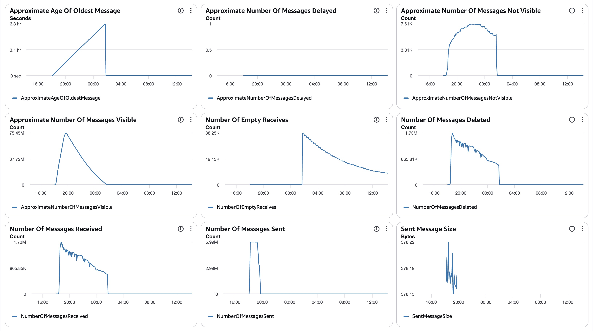
##### SQS Metrics output queue
N/A.  Ran without `withinfo` enabled.

#### ECS
##### Sz SQS Consumer CPU Utilization
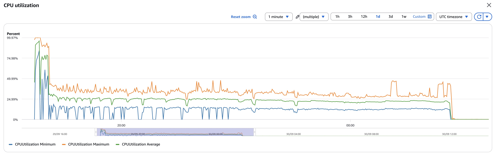
##### Sz SQS Consumer Memory Utilization
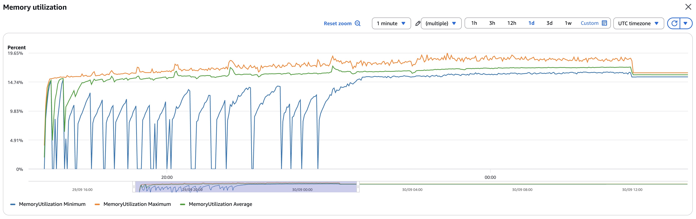
##### Sz Simple Redoer CPU Utilization
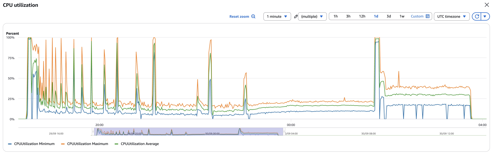
##### Sz Simple Redoer Memory Utilization
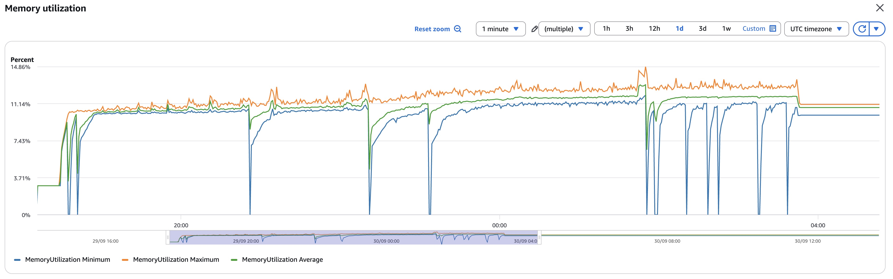

#### RDS  writer read IOPS 38,293,933 / write IOPS 431,127,842; DB IO/transaction deltas in `data/final-deltas.txt` (deadlocks 621, rollbacks 13,901)
Writer CPU ~90–95% through the load (single-writer bound); DB connections peaked ~5.3K (limit 10K).
##### Database Metrics CORE/LIBFEAT/RES final
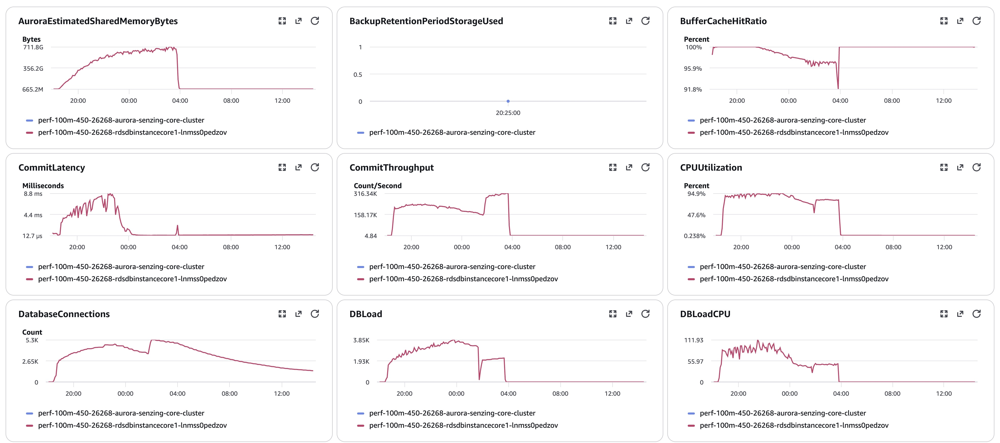
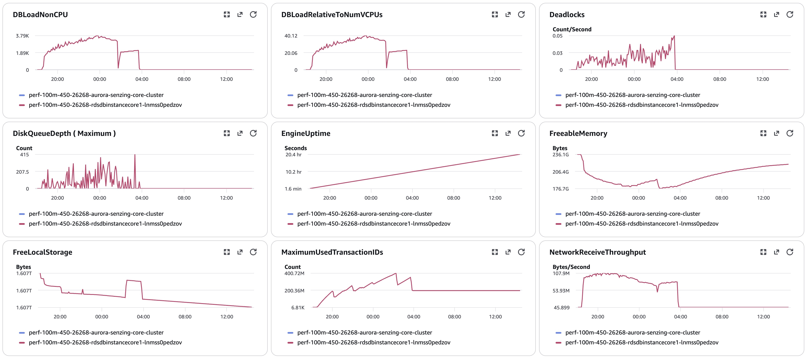
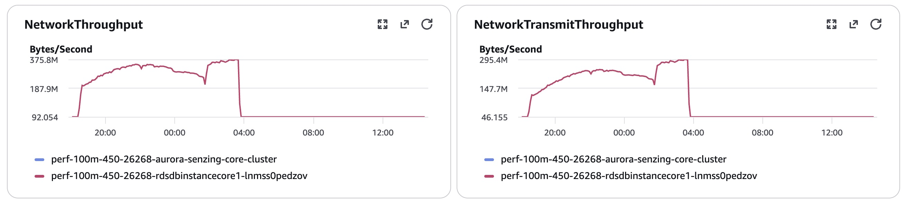
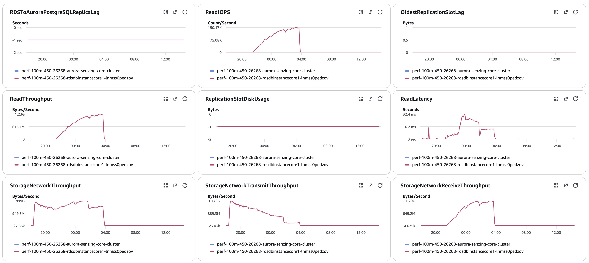
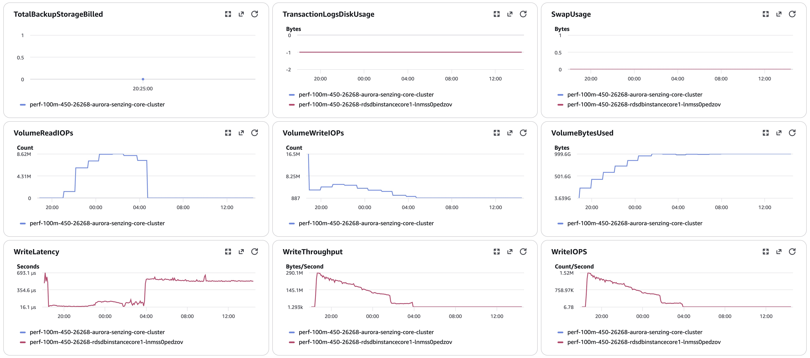
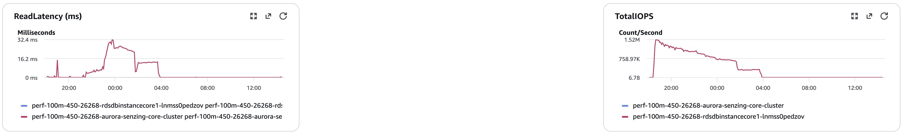
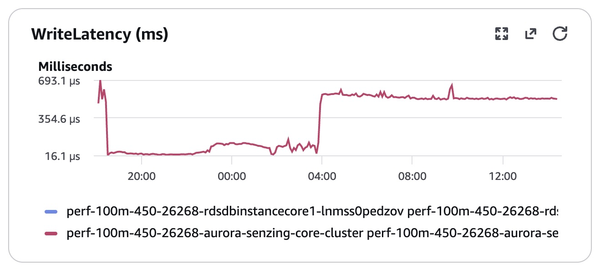

#### Logs `data/final-capture.txt`
#### Errors
CloudWatch Logs Insights over `/senzing/perf-prov/perf-100m-450-26268`, 18:25 09-29 → 14:36 09-30 UTC:
```
==============================================
Term                          |  instance count |
==============================================
(OKEY FLUSH ASSERTION FAILED) |     13,126      |  18 obs_ents; 17 orphans + 1 converged
(SENZ0010 RetryTimeout)       |         17      |  the same 17 records → DLQ
(OKEY ORPHAN PREVENTED)       |          0      |
(CORRUPTION_FOUND)            |        172      |  182 entries: 179 RES_ENT_OKEY_NOT_FOUND, 3 RES_ENT_NOT_FOUND
(INFINITE)                    |         10      |
(55P03 lock timeout)          |          0      |
(deadlock detected)           |        621      |
==============================================
```

## Methods
Per `docs/performance-test-runbook.md` and `scripts/aurora-pg/`:
`00-setup.sql` (once) → `10-baseline.sql` (immediately before consumers) → `progress-live.sql` (loop) →
`drain-check.sql` (4-gate) → `20-final.sql` → **`validate.sql` (orphan checks q1/q2)** → `exports.sql` →
`final-capture.sql` (as the table owner) → **manual cluster snapshot** → forensics / repair tests.
scp target: `RUN=results/20260929-100M-provisioned-r6i-24xlarge-single-senzing-4.5.0.26268/data`.
IOPS = sum of per-minute `ReadIOPS`/`WriteIOPS` (writer instance, statistic Sum, period 60) over baseline → final.
