# senzing-test-results-20261005-100M-provisioned-r6i-24xlarge-single-senzing-4.5.0.26275

> **Senzing 4.5.0.26275, 100M, advisory lock ON.** Same config as the 20260929 4.5.0.26268 run, so the only intended
> variable is the engine build.
>
> 🎯 **PRIMARY GOAL: validate the [GDEV-4734](https://senzing.atlassian.net/browse/GDEV-4734) fix at scale.** On 26268, 17 records
> orphaned (13 of them the deterministic "ambiguous bridge" OKEY drop). Jae's flush-time heal was merged to `SenzingV4` on
> 2026-10-01 20:54 UTC (PR #2135). This build is stamped `2026_10_02__23_42`, so it very likely includes the fix (not verifiable
> from the image). **Expected: 0 orphans, and no `OKEY FLUSH ASSERTION FAILED` → `SENZ0010` livelocks.**
>
> 🧹 **Clean perf test too:** a full pre-load (queue == 100M and all producers exited before consumers start), with a producer
> watchdog that restarts a stalled producer from just before its last sent line. (On 09-29 a producer hung on a truncated
> S3 gzip stream and 2.37M records were never sent.)
>
> 📋 **RESULT: 0 orphans at 100M. The GDEV-4734 fix holds.** `validate.sql` q1 and q2 both return 0 rows, and `obs_ent` = `res_ent_okey` =
> 99,998,927 with `dsrc_record` = 100,000,000. There were **0** guard livelocks (26268: 13,126 hits), **0** `SENZ0010` and **0** DLQ.
> The fix fired as designed: **18 × `AMBIGUOUS-BRIDGE ORPHAN HEALED … (GDEV-4734)`** plus **6 × `RES_ENT_OKEY ORPHAN REPAIRED`** (the #2087
> destroyed-target arm). The DB confirms all 24 now have an OKEY. **6 of the 18 bridge heals are records that orphaned on 26268**, including Jae's
> reproduced `568258238`: the same records reached the same failure point in a fresh load and were healed.
> One `ABANDONING a redo` (entity `42343700`, left `ENT_STATE = 1`, record still resolved) is the new redo safety valve. Throughput is on par
> with 4.4 (avg 3,327/s, 8.35 h). `CORRUPTION_FOUND` (203), loops (28) and deadlocks (830) are above 26268; see Caveats.

## Contents
1. Overview
2. Orphan checks (primary) + what the fix did
3. Producer watchdog log
4. Caveats
5. Results (Observations / comparison / Final metrics)
6. Methods

## Overview
1. **Performed:** 2026-10-05. First create (18:35:44 UTC) **rolled back**: no `db.r6i.24xlarge` capacity in us-east-2
   (`ServiceLimitExceeded`). Retried 18:49:12 → DB in us-east-2a, producers launched 19:01:53, CREATE_COMPLETE 19:03:04 UTC. **Full pre-load:** all 10 producers exited cleanly by 20:34:27, with no
   watchdog restarts; SQS `NumberOfMessagesSent` = **100,000,000** exactly. `10-baseline` ~20:36; consumers → 8 at 20:37:16 UTC.
   Insert window 20:37:49 → 05:04:35 UTC (08:26:46); input empty 05:11; redo phase quiet ~06:45; consumers and redoers scaled to 0 at 14:37;
   drain-check 14:23; `20-final` 14:24; `final-capture` 14:40 UTC on 10-06. The stack is kept up for Jae.
2. **Senzing version:** **4.5.0.26275** (build `2026_10_02__23_42`). Note that the tags use a dot (`:4.5.0.26275`), unlike the
   hyphenated `:4.5.0-26268`. Verified 2026-10-05 from `szBuildVersion.json` in each image:
   | Image | Digest |
   |---|---|
   | `sz_sqs_consumer-v4:4.5.0.26275` | `sha256:5d1dab3a6e81b85088b9748191caa420b941d0cfdcfcf8efc68738df33eaaeb0` |
   | `sz_simple_redoer-v4:4.5.0.26275` | `sha256:8be7c82c821d1fe7cf85ea43db2b1374420ea5144a6925bbac9c17be31df7b22` |
   | `senzingsdk-tools:4.5.0.26275` | `sha256:4c5394e6e4addd15a3a7f6c4cf0ef38a3225d47fdd1b9b0e921752d20e7272c4` |
   | `sshd:4.5.0.26275` | `sha256:8128eaf7e3f581384ebeb83a2ac1c444a0f72f2269cfe1443e84a58a81a88c95` |
   | `init-database` (pinned) | `sha256:a68062d23dc958eba404a3fbba3a5800e2770f6e9bbed2ad94413c54da7635af` (bundles 4.4.1.26255; schema byte-identical to 26275, config differs only in `CONFIG_BASE_VERSION`; re-verified 2026-10-05) |

   **Deploy-time check (19:03 UTC):** running redoer and sshd `imageDigest`s match the above; consumer and redoer task defs =
   `4.5.0.26275`, X86_64, 2048/4096, `ENTITY_LOCK_MODE: ADVISORY`; DB `db.r6i.24xlarge`. Consumer running digest: all 8 = `5d1dab3a…` ✅ (20:37 UTC)
3. **Instructions:** repo root README + `docs/performance-test-runbook.md`; exact CFT copy in this dir.
4. **Changes from 20260929 (4.5.0.26268):** engine images only. The load procedure changed too: full pre-load plus the producer watchdog.

## System
- Aurora PostgreSQL **17.5**, Provisioned, single DB, **db.r6i.24xlarge**, IO-optimized (`aurora-iopt1`), us-east-2
- `ENTITY_LOCK_MODE: ADVISORY`, no read-only connection, `max_connections` 10000, `work_mem` 4096 kB, X86_64, 2 vCPU / 4 GB consumer
  and redoer tasks (20 threads), autoscale: consumers 25% CPU Min 0 / Max 200; redoer 30% CPU Min 1 / Max 200
- Data: `test-dataset-100m.json.gz` (public), `RecordMax=100M`, 10 producer tasks × 10M

## Orphan checks (primary)
| Check | How | 4.5.0.26268 (20260929) | **This run** |
|---|---|---|---|
| Unresolved records | `validate.sql` q1 | 17 (13 deterministic) | ✅ **0** |
| Dangling OKEY keys | `validate.sql` q2 | 0 | ✅ 0 |
| Reconciliation | `obs_ent` − `res_ent_okey` | 17 | ✅ 0 (99,998,927 = 99,998,927) |
| DLQ | SQS | 17 | ✅ 0 |
| Guard | `OKEY FLUSH ASSERTION FAILED` (hits / distinct obs_ent) | 13,126 / 18 | ✅ 0 |
| Guard → timeout | `SENZ0010` | 17 | ✅ 0 |
| Fix heals | `AMBIGUOUS-BRIDGE ORPHAN HEALED` / `RES_ENT_OKEY ORPHAN REPAIRED` | n/a | **18 / 6** (24 distinct obs_ents, all with an OKEY now) |
| Redo safety valve | `ABANDONING a redo` | n/a | ⚠️ 1 (entity `42343700`) |
| `CORRUPTION_FOUND` | CloudWatch | 172 | ⚠️ 203 lines / 208 entries (203 `RES_ENT_OKEY_NOT_FOUND`, 5 `RES_ENT_NOT_FOUND`; 180 entities; auto-repaired) |
| Resolution loops | `INFINITE RESOLUTION LOOP` | 10 | ⚠️ 28 |
| `db.deadlocks` | `final-deltas.txt` | 621 | ⚠️ 830 (xact_rollback 997) |
| `res_ent_active` | `final-capture` | 262 | 311 |

### What the fix did (CloudWatch + [`data/healed-check.sql`](data/healed-check.sql) → [`data/healed-check.txt`](data/healed-check.txt))
| Log line | Count | First → last (UTC) | DB check (10-06) |
|---|---|---|---|
| `AMBIGUOUS-BRIDGE ORPHAN HEALED … Creating its membership at RES_ENT [x] (GDEV-4734)` | 18 obs_ents | 10-05 22:18 → 10-06 04:29 | 18/18 have an OKEY; 14 in the logged entity, 4 in a different one now (consistent with later merges, not verified) |
| `RES_ENT_OKEY ORPHAN REPAIRED … Re-homed onto RES_ENT [x] (the target itself, resurrected)` | 6 obs_ents | 22:13 → 03:26 | 6/6 have an OKEY in the logged entity |
| `ABANDONING a redo for RES_ENT [42343700] after 6 reevaluation attempts (limit 5) … ENT_STATE is left at 1` | 1 | 06:18 (redo phase) | entity 42343700: `ent_state` 1, 1 record (562444063), which has its OKEY |

**Repeat offenders:** 6 of the 18 bridge heals are records that orphaned on 26268: `453174730`, `495855280`, `507695948`, `544184792`,
`567971778` and `568258238`. Four of them (`453174730`, `495855280`, `507695948`, `568258238`) are in GDEV-4734's deterministic 13, and
`568258238` was one Jae reproduced single-threaded. The other 9 of the 13 didn't reach the bridge condition this run, which depends on load order.

## Producer watchdog log
**No restarts needed.** All 10 producers ran 19:01:53 → 20:34:27 UTC at ~1,860–2,300 records/s each (~22K/s total). Skipping ahead to a
slice took ≤5 min even for 90M–100M, and every producer read its full 10,000,000. The last to finish was the 50M–60M slice (slowest at ~1,860/s).
SQS `NumberOfMessagesSent` (input) = **100,000,000**. The producers' own final `output_counter_total` sums to 99,999,991, because the last
Monitor line comes before the final batch flush, so it's a counter lag and not a loss. Same story as the 87-record mismatch on 09-29.

The watchdog (`watch_producers.py`) found that while a producer skips to its `RECORD_MIN`, its Monitor line stays at MIN with `sent = 0`,
which looks idle. That phase now gets a 45-min stall limit instead of 10 min, so a skipping producer isn't falsely restarted.

## Caveats
- **First create rolled back** on a `db.r6i.24xlarge` capacity shortage in us-east-2. The retry 13 min later succeeded in the same region
  (us-east-2a), so the region and config match 26268.
- **`CORRUPTION_FOUND`, loops and deadlocks are up** against 26268: 203 vs 172 (all auto-repaired; mostly `RES_ENT_OKEY_NOT_FOUND`),
  28 vs 10 and 830 vs 621. 26268 loaded only 97.6M, which explains part of it but not all. Worth a look by the engine team: are the
  heals or the new redo valve related to the extra `RES_ENT_OKEY_NOT_FOUND` repairs?
- **The abandoned redo:** `42343700` stays `ENT_STATE = 1`, by design ("heals on next touch"), and counts in `res_ent_active` (311 vs 262).
- **4 of the 18 healed obs_ents sit in a different entity** than the one logged at heal time (43333459, 73712562, 87131833, 91428708).
  That's presumably later merges; it wasn't traced.
- The `healed-check.sql` first run printed a harmless psql `\echo` error (an apostrophe); the queries ran. It's fixed in the committed copy.

## Results
### Observations
Inserts per second (from `data/dsrc_record.csv`; cross-checked against the erpm query):
- **Peak:** 6109/second
- **Average over entire run:** 3327/second (final-capture erpm 197,333 → 3289/s)
- **Time to load 100M:** 8.35 hours (501 minute buckets; final-capture duration 08:26:46)
- **Records in dead-letter queue:** 0
- **Total read IOPS (writer):** `40,000,015` (ReadIOPS, writer instance, Sum of per-minute datapoints)
- **Total write IOPS (writer):** `443,294,484` (WriteIOPS, writer instance, Sum)
- **Max Consumer tasks:** 175  **Max Redoer tasks:** 122 (autoscaling max desired)

### Comparison vs the 100M runs
| Metric | 4.4.0.26167 (20260715) | 4.4.0.26204 (20260723) | 4.5.0.26268 (20260929, 97.6M) | **4.5.0.26275 (this run)** |
|---|---|---|---|---|
| Peak /s | 6074 | 5814 | 6037 | **6109** |
| Avg /s | 3365 | 3262 | 3715 | **3327** |
| Time to load | 8.25 h | 8.52 h | 7.30 h (97.6M) | **8.35 h** |
| DLQ | 0 | 0 | 17 | **0** |
| Unresolved (orphans) | 40 | 30 | 17 | **0** |
| Total read IOPS | 33,226,016 | 40,413,738 | 38,293,933 | **40,000,015** |
| Total write IOPS | 419,688,438 | 446,299,279 | 431,127,842 | **443,294,484** |
| Max loader / redoer | 165 / 157 | 169 / 106 | 188 / 116 | **175 / 122** |

### Final metrics
#### SQS
##### SQS Metrics input queue
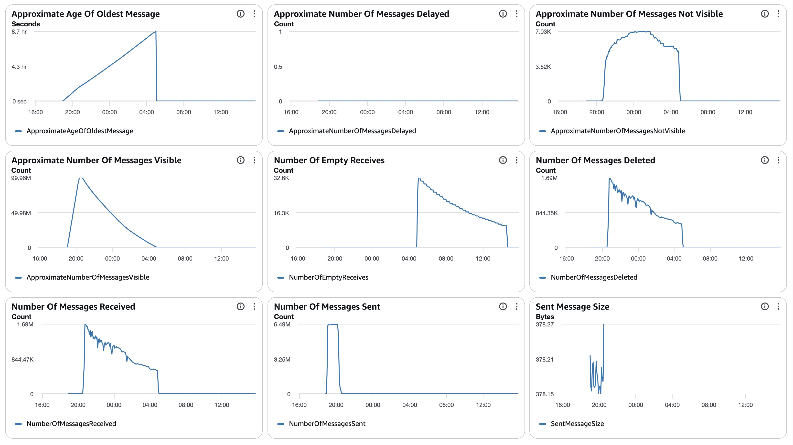
##### SQS Metrics output queue
N/A.  Ran without `withinfo` enabled.

#### ECS
##### Sz SQS Consumer CPU Utilization
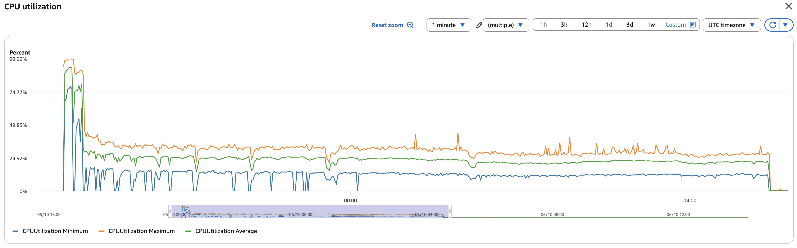
##### Sz SQS Consumer Memory Utilization
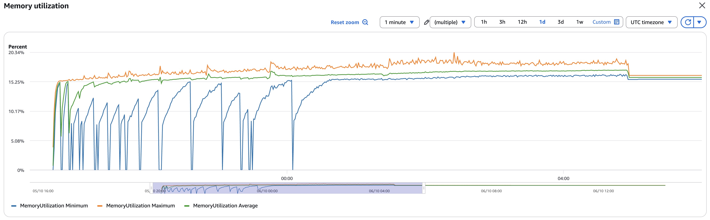
##### Sz Simple Redoer CPU Utilization
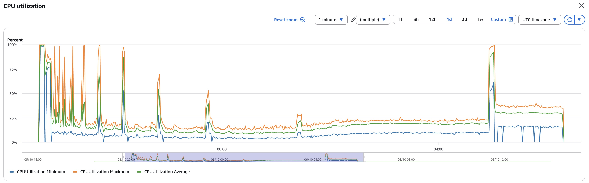
##### Sz Simple Redoer Memory Utilization
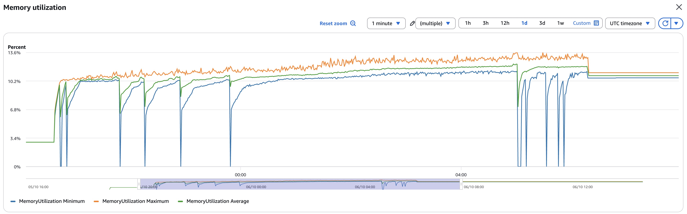

#### RDS  writer read IOPS 40,000,015 / write IOPS 443,294,484; DB IO/transaction deltas in `data/final-deltas.txt` (deadlocks 830, rollbacks 997)
##### Database Metrics CORE/LIBFEAT/RES final
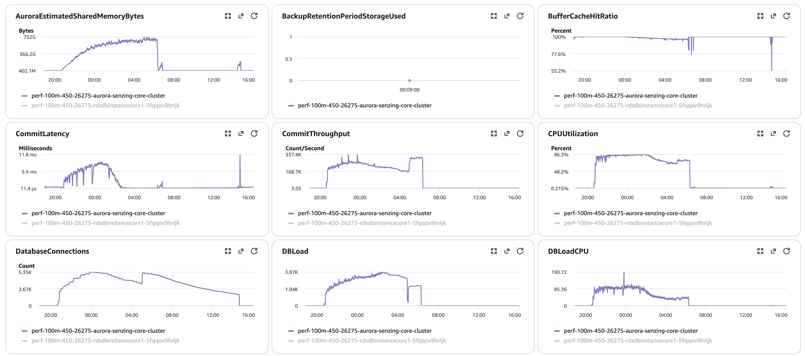
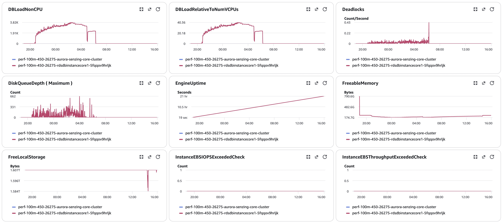
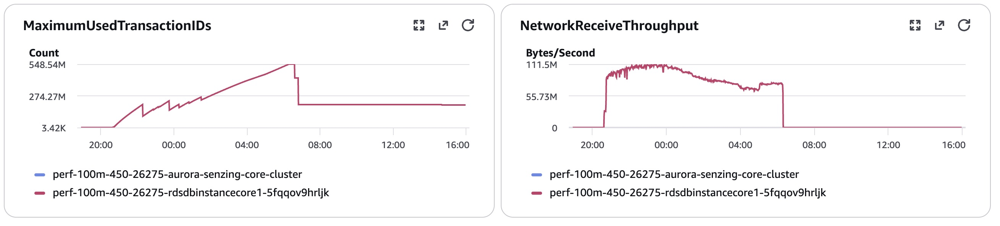
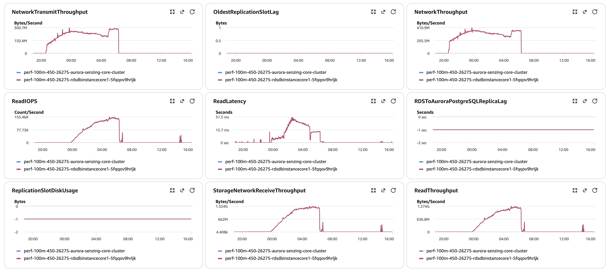
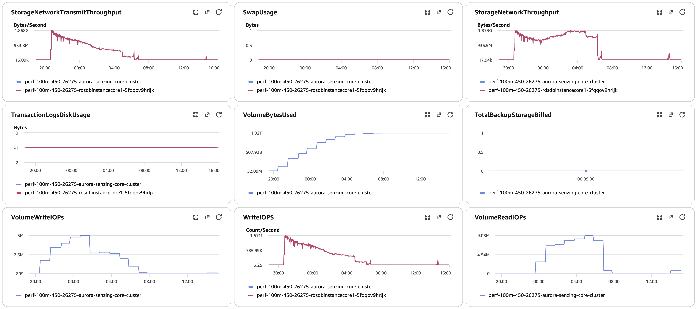
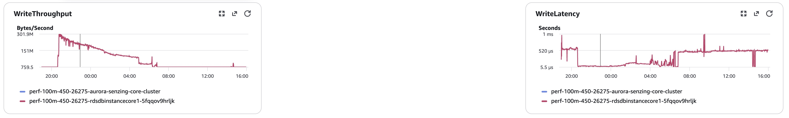
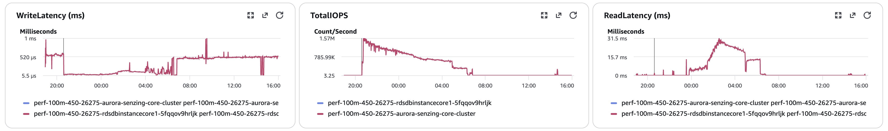

#### Logs `data/final-capture.txt`
#### Errors
CloudWatch Logs Insights over `/senzing/perf-prov/perf-100m-450-26275`, 10-05 20:30 → 10-06 15:00 UTC:
```
==================================================
Term                              | instance count |
==================================================
(OKEY FLUSH ASSERTION FAILED)     |        0       |
(SENZ0010)                        |        0       |
(Sending to deadletter)           |        0       |
(OKEY ORPHAN PREVENTED)           |        0       |
(SILENT OKEY ORPHAN)              |        0       |
(AMBIGUOUS-BRIDGE ORPHAN HEALED)  |       18       |  GDEV-4734 fix
(RES_ENT_OKEY ORPHAN REPAIRED)    |        6       |  #2087 destroyed-target arm
(ABANDONING a redo)               |        1       |  redo safety valve
(CORRUPTION_FOUND)                |      203       |  208 entries: 203 RES_ENT_OKEY_NOT_FOUND, 5 RES_ENT_NOT_FOUND
(INFINITE RESOLUTION LOOP)        |       28       |
(55P03 lock timeout)              |        0       |
(deadlock detected)               |      830       |
(ERR: total)                      |    1,566       |
==================================================
```

## Methods
Per `docs/performance-test-runbook.md` and `scripts/aurora-pg/`: `00-setup.sql` → (full pre-load, verified) → `10-baseline.sql` →
consumers → `progress-live.sql` → `drain-check.sql` → `20-final.sql` → **`validate.sql`** → `exports.sql` → `final-capture.sql` →
manual snapshot → orphan forensics if needed (`orphan-*-4.5.*`). IOPS = sum of per-minute `ReadIOPS`/`WriteIOPS` (writer, Sum, period 60).
